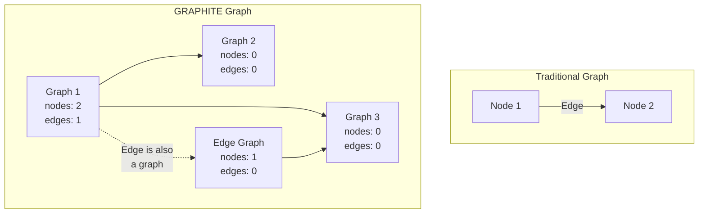
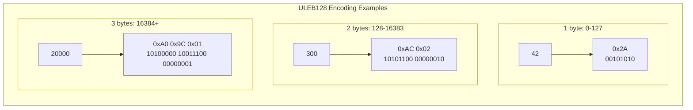
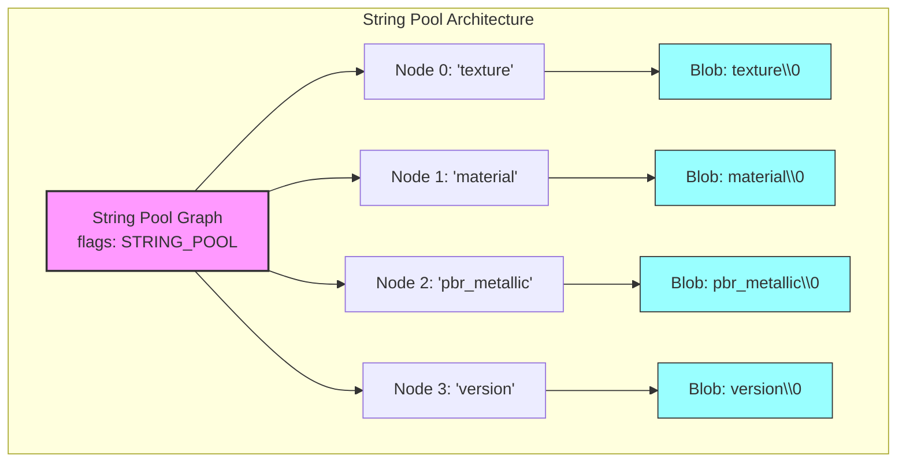
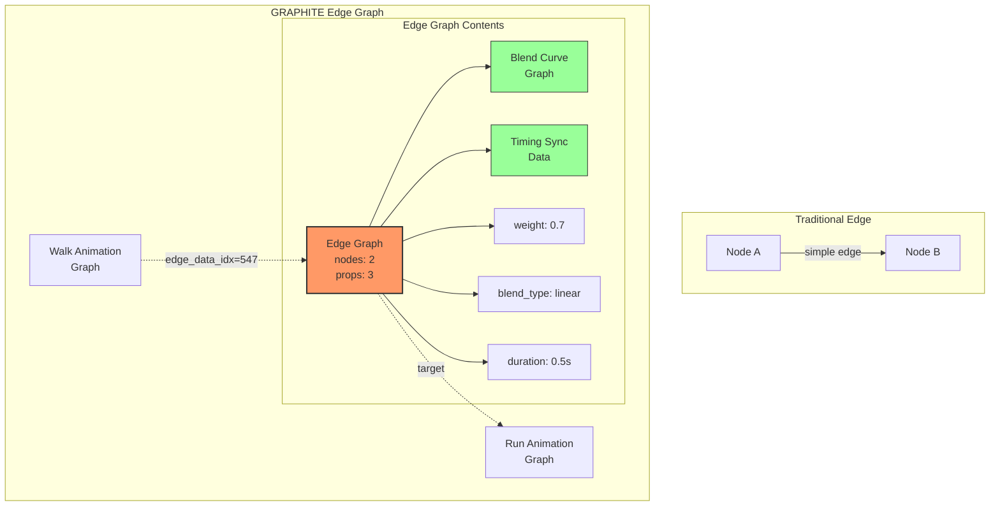
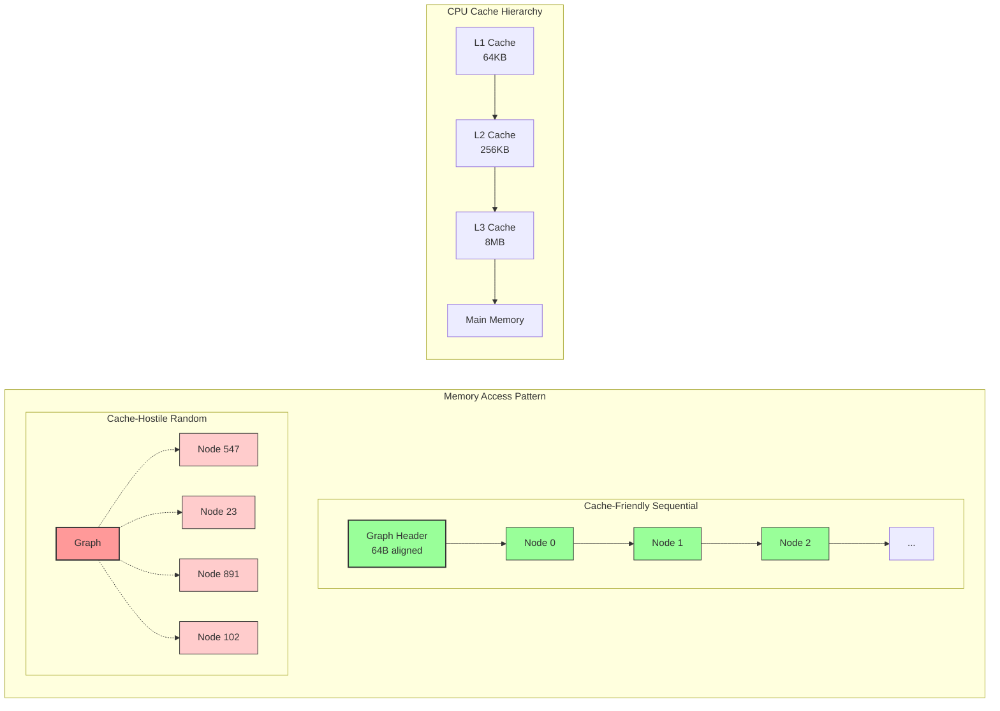
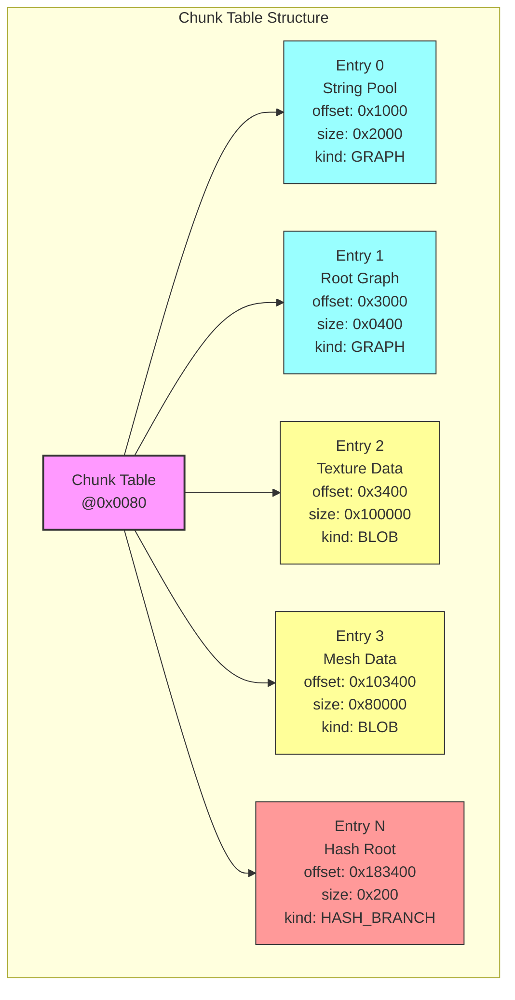
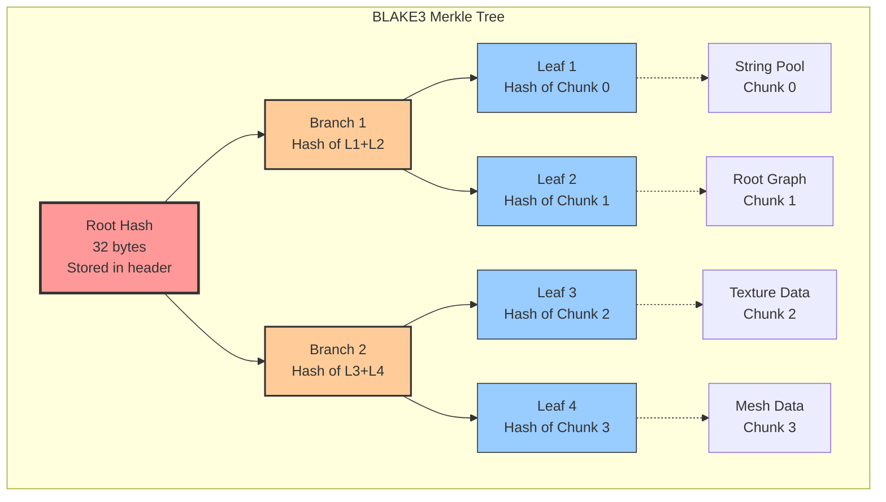
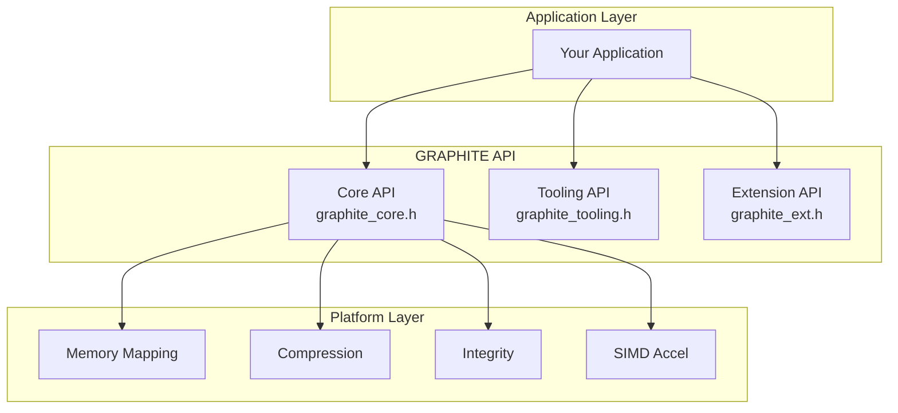
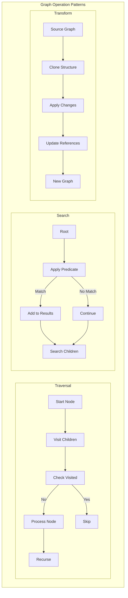

# Volume 1: Foundation & Core Systems
## Part 2: Data & Runtime

### Table of Contents
- [Chapter 4: Data Structures](#chapter-4-data-structures)
  - [The Graph Data Model](#the-graph-data-model)
  - [Core Structure Definitions](#core-structure-definitions)
  - [Memory Layout](#memory-layout)
  - [Special Graph Types](#special-graph-types)
  - [Edge Architecture](#edge-architecture)
  - [Property System](#property-system)
  - [Type System](#type-system)
- [Chapter 5: File Format Specification](#chapter-5-file-format-specification)
- [Chapter 6: Runtime API](#chapter-6-runtime-api)

### Overview
This part delves into the concrete implementation of GRAPHITE's graph-native architecture. We explore the data structures that make recursive graphs possible, the binary format that enables zero-copy performance, and the runtime API that brings it all together. Every byte and bit is carefully designed to balance expressiveness with production performance.

---

## Chapter 4: Data Structures

GRAPHITE's power emerges from a deceptively simple set of data structures that, through recursive composition, can represent any conceivable asset relationship. This chapter explores these fundamental building blocks and how they combine to create a universal asset representation.

### The Graph Data Model

At its core, GRAPHITE represents everything as a graph. But unlike traditional graph databases that distinguish between nodes, edges, and properties, GRAPHITE makes everything a graph:



This recursive approach means:
- **Nodes** are graphs (which may contain other graphs)
- **Edges** are graphs (which can have their own structure)
- **Properties** are stored in graphs (typically string pool references)
- **Data** is referenced by graphs (pointing to blob chunks)

### Core Structure Definitions

#### The Graph Header

Every graph in GRAPHITE begins with a 64-byte header, carefully aligned for optimal cache performance:

```c
typedef struct {
    uint32_t node_count;     // Number of child graphs
    uint32_t edge_count;     // Number of relationships
    uint32_t prop_count;     // Number of properties
    uint32_t flags;          // bit0=has_cycles, bit1=parallel_group, bit2=string_pool
    
    uint64_t node_table_ofs; // Offset to node index table
    uint64_t edge_table_ofs; // Offset to edge index table  
    uint64_t prop_table_ofs; // Offset to property table
    uint64_t reserved;       // Reserved for future use
} graphite_graph_hdr;
```

Key design decisions:
- **Fixed 64-byte size**: Exactly one cache line on modern CPUs
- **32-bit counts**: Support up to 4 billion nodes/edges per graph
- **64-bit offsets**: Allow graphs larger than 4GB
- **Flags field**: Enables special graph types and optimizations

#### Node Representation

Nodes in GRAPHITE are simply references to other graphs. The node table is an array of chunk indices:

```c
// Node table: Array of ULEB128-encoded chunk indices
// ULEB128 allows small indices to use fewer bytes
typedef struct {
    uint8_t* data;           // Pointer to ULEB128 stream
    size_t   size;           // Size in bytes
    uint32_t count;          // Number of nodes (from header)
} graphite_node_table;

// Decode a node reference
uint64_t graphite_decode_node(const graphite_node_table* table, uint32_t index) {
    uint8_t* ptr = table->data;
    // Skip to the nth ULEB128 value
    for (uint32_t i = 0; i < index; i++) {
        while (*ptr++ & 0x80) { /* skip continuation bytes */ }
    }
    // Decode ULEB128
    uint64_t result = 0;
    uint32_t shift = 0;
    uint8_t byte;
    do {
        byte = *ptr++;
        result |= (uint64_t)(byte & 0x7F) << shift;
        shift += 7;
    } while (byte & 0x80);
    return result;
}
```

This encoding is space-efficient:
- Small chunk indices (< 128) use only 1 byte
- Medium indices (< 16,384) use 2 bytes
- Only very large bundles need 3+ bytes per node



#### Edge Representation

Edges in GRAPHITE are first-class entities with their own structure:

```c
typedef struct {
    uint32_t from_node_idx;  // Source node index in this graph
    uint32_t to_node_idx;    // Target node index in this graph
    uint32_t edge_data_idx;  // Chunk index of edge graph (0 = no data)
    uint32_t reserved;       // Reserved for future use
} edge_descriptor;

// Edge table is simply an array of edge descriptors
typedef struct {
    edge_descriptor* edges;  // Array of edge descriptors
    uint32_t count;         // Number of edges
} graphite_edge_table;
```

The power comes from `edge_data_idx`:
- If 0, it's a simple connection with no additional data
- If non-zero, it points to another graph containing edge metadata
- That edge graph can have nodes, edges, and properties of its own

### Memory Layout

GRAPHITE's memory layout is designed for cache efficiency and zero-copy access:

```
┌─────────────────────────┐ ← 64-byte aligned
│   Graph Header (64B)    │   Cache line 1
├─────────────────────────┤
│   Node Table (var)      │   ULEB128 encoded indices
├─────────────────────────┤ ← 16-byte aligned
│   Edge Table (var)      │   Array of edge_descriptors
├─────────────────────────┤ ← 8-byte aligned
│   Property Table (var)  │   Key-value pairs
└─────────────────────────┘
```

#### Memory Layout Example

Consider a material graph with 3 textures and 2 shader parameters:

```c
// Memory layout visualization
0x0000: [Header: nodes=3, edges=0, props=2]  // 64 bytes
0x0040: [Node Table: 0x84, 0x85, 0x86]       // 3 bytes (ULEB128)
0x0043: [Padding: 13 bytes]                   // Align to 16
0x0050: [Edge Table: empty]                   // 0 bytes
0x0050: [Property Table:                      // 8 bytes
         key="shader" val="pbr_metallic"
         key="version" val="2.0"]
```

Total size: 64 + 3 + 13 + 0 + 8 = 88 bytes for the entire material graph structure.

### Special Graph Types

GRAPHITE defines several special graph types optimized for common patterns:

#### String Pool Graph

The string pool is a specialized graph for efficient string storage:



```c
// String pool graph has special flag set
#define GRAPHITE_FLAG_STRING_POOL (1 << 2)

typedef struct {
    graphite_graph_hdr header;  // flags has string_pool bit
    // node_count = number of strings
    // edge_count = 0 (no relationships)
    // Each node points to a blob chunk with UTF-8 data
} string_pool_graph;

// String access is direct
const char* graphite_get_string(graphite_bundle* bundle, uint32_t string_id) {
    const graphite_graph* pool = bundle->string_pool;
    uint64_t blob_idx = graphite_node_chunk_index(pool, string_id);
    graphite_blob blob = graphite_get_chunk_blob(bundle, blob_idx);
    return (const char*)blob.data;  // Null-terminated UTF-8
}
```

#### Asset Graph (Leaf)

Asset graphs are leaf nodes containing actual asset data:

```c
typedef struct {
    graphite_graph_hdr header;  // nodes=0, edges=0
    // Properties contain asset metadata:
    // - "data_blob_id": chunk index of asset data
    // - "mime_type": string ID for content type
    // - "size": uncompressed size
    // - "format": asset-specific format info
} asset_graph;

// Example: Texture asset
// Properties:
//   data_blob_id = "1247"
//   mime_type = "image/x-dds"
//   size = "4194304"
//   format = "BC7_UNORM"
//   width = "2048"
//   height = "2048"
//   mip_levels = "11"
```

#### Parallel Group Graph

Marks nodes that can be processed concurrently:

```c
#define GRAPHITE_FLAG_PARALLEL_GROUP (1 << 1)

// All child nodes can be processed in parallel
typedef struct {
    graphite_graph_hdr header;  // flags has parallel_group bit
    // Nodes represent independent work items
    // Runtime can distribute across threads
} parallel_group_graph;

// Runtime detection
if (graph->header.flags & GRAPHITE_FLAG_PARALLEL_GROUP) {
    dispatch_parallel_work(graph->nodes);
}
```

#### Transform Graph

Represents asset transformation pipelines:

```c
// Transform graphs have specific structure
typedef struct {
    graphite_graph_hdr header;
    // Nodes: [input_graph, output_graph, params_graph, pipeline_graph]
    // Edges: input->pipeline, params->pipeline, pipeline->output
} transform_graph;

// The pipeline_graph contains transformation steps
// Each step is itself a graph with:
// - Properties: operation type, parameters
// - Nodes: sub-transforms
// - Edges: data flow
```

### Edge Architecture

GRAPHITE's most innovative feature is that edges are themselves graphs. This enables incredibly rich relationships:



#### Simple Edges

Most edges need no additional data:

```c
// Simple dependency edge
edge_descriptor simple_edge = {
    .from_node_idx = 0,    // Material node
    .to_node_idx = 1,      // Texture node
    .edge_data_idx = 0,    // No edge data
    .reserved = 0
};
```

#### Rich Edges

Complex relationships use edge graphs:

```c
// Animation blend edge
edge_descriptor blend_edge = {
    .from_node_idx = 0,    // Walk animation
    .to_node_idx = 1,      // Run animation  
    .edge_data_idx = 547,  // Points to blend graph
    .reserved = 0
};

// The blend graph (chunk 547) contains:
// - Blend weight curve (itself a graph)
// - Timing synchronization data
// - Bone mask information
// - Transition conditions
```

#### Conditional Edges

Edges can encode complex logic:

```c
// LOD selection edge
typedef struct {
    graphite_graph_hdr header;
    // Properties:
    //   "condition" = "distance < 100.0"
    //   "priority" = "1"
    // Nodes: [condition_evaluator, metric_provider]
} lod_edge_graph;
```

### Property System

Properties in GRAPHITE are key-value pairs stored efficiently:

```c
// Property table format: alternating key/value string IDs
// [key0][val0][key1][val1]...[keyN][valN]

typedef struct {
    uint32_t* data;         // Array of string IDs (ULEB128 encoded)
    uint32_t count;         // Number of properties (not array size!)
} property_table;

// Property access
const char* graphite_property_get(
    const graphite_graph* graph,
    const char* key
) {
    graphite_bundle* bundle = graph->bundle;
    property_table* props = &graph->properties;
    
    // Linear search (properties are typically few)
    for (uint32_t i = 0; i < props->count; i++) {
        uint32_t key_id = decode_uleb128(props->data + i*2);
        const char* prop_key = graphite_get_string(bundle, key_id);
        
        if (strcmp(prop_key, key) == 0) {
            uint32_t val_id = decode_uleb128(props->data + i*2 + 1);
            return graphite_get_string(bundle, val_id);
        }
    }
    return NULL;  // Not found
}
```

#### Property Namespaces

GRAPHITE uses dot notation for property namespaces:

```c
// Core properties (no prefix)
"name"              // Human-readable name
"type"              // Graph type identifier
"version"           // Format version

// Asset properties (asset.*)
"asset.format"      // Asset-specific format
"asset.size"        // Uncompressed size
"asset.hash"        // Content hash

// Application properties (app.*)
"app.maya.node_id"  // Maya-specific data
"app.ue5.actor"     // Unreal Engine data

// Custom properties (x-*)
"x-studio.approved" // Studio-specific
"x-perf.priority"   // Performance hints
```

### Type System

While GRAPHITE is dynamically typed, it provides type hints through properties:

```c
// Type identification
typedef enum {
    GRAPHITE_TYPE_GENERIC = 0,
    GRAPHITE_TYPE_ASSET,
    GRAPHITE_TYPE_TRANSFORM,
    GRAPHITE_TYPE_MATERIAL,
    GRAPHITE_TYPE_TEXTURE,
    GRAPHITE_TYPE_MESH,
    GRAPHITE_TYPE_ANIMATION,
    GRAPHITE_TYPE_AUDIO,
    GRAPHITE_TYPE_SCRIPT,
    // ... extended types
} graphite_type_hint;

// Type detection
graphite_type_hint graphite_graph_type(const graphite_graph* graph) {
    const char* type_str = graphite_property_get(graph, "type");
    if (!type_str) return GRAPHITE_TYPE_GENERIC;
    
    // Match known types
    if (strcmp(type_str, "texture") == 0) return GRAPHITE_TYPE_TEXTURE;
    if (strcmp(type_str, "mesh") == 0) return GRAPHITE_TYPE_MESH;
    // ...
    
    return GRAPHITE_TYPE_GENERIC;
}
```

#### Type Validation

Runtime type checking ensures graph integrity:

```c
// Validate material graph structure
bool validate_material_graph(const graphite_graph* graph) {
    // Must have specific properties
    if (!graphite_property_get(graph, "shader")) return false;
    if (!graphite_property_get(graph, "version")) return false;
    
    // Check child nodes are textures
    for (uint32_t i = 0; i < graph->header.node_count; i++) {
        const graphite_graph* child = graphite_get_node(graph, i);
        graphite_type_hint type = graphite_graph_type(child);
        if (type != GRAPHITE_TYPE_TEXTURE && 
            type != GRAPHITE_TYPE_GENERIC) {
            return false;
        }
    }
    
    return true;
}
```

### Memory Optimization Techniques

GRAPHITE employs several techniques to minimize memory usage:

#### 1. ULEB128 Encoding

Variable-length encoding for indices saves significant space:

```c
// Encoding examples:
// 0-127:        1 byte  [0xxxxxxx]
// 128-16383:    2 bytes [1xxxxxxx 0xxxxxxx]
// 16384-2097151: 3 bytes [1xxxxxxx 1xxxxxxx 0xxxxxxx]

size_t encode_uleb128(uint64_t value, uint8_t* buffer) {
    size_t count = 0;
    do {
        uint8_t byte = value & 0x7F;
        value >>= 7;
        if (value != 0) {
            byte |= 0x80;  // Set continuation bit
        }
        buffer[count++] = byte;
    } while (value != 0);
    return count;
}
```

#### 2. String Deduplication

All identical strings share the same storage:

```c
// String pool builder deduplicates automatically
typedef struct {
    // Hash table for fast lookup
    string_hash_table* table;
    // Actual string storage
    dynamic_buffer* buffer;
    // String count
    uint32_t count;
} string_pool_builder;

uint32_t string_pool_add(string_pool_builder* builder, const char* str) {
    // Check if string already exists
    uint32_t existing_id = string_hash_lookup(builder->table, str);
    if (existing_id != INVALID_ID) {
        return existing_id;  // Reuse existing
    }
    
    // Add new string
    uint32_t id = builder->count++;
    size_t offset = buffer_append(builder->buffer, str, strlen(str) + 1);
    string_hash_insert(builder->table, str, id, offset);
    return id;
}
```

#### 3. Bit-Packed Flags

Boolean properties use single bits:

```c
// Instead of string properties for booleans
typedef struct {
    uint32_t flags;
    // bit 0: has_alpha
    // bit 1: is_srgb
    // bit 2: generate_mips
    // bit 3: is_cube_map
    // ...
} texture_flags;

// Access is efficient
bool has_alpha = (texture->flags & (1 << 0)) != 0;
```

### Advanced Data Structure Patterns

#### Graph Composition

Larger structures are built from smaller graphs:

```c
// Character graph composition
typedef struct {
    graphite_graph* root;        // Character root graph
    graphite_graph* mesh;        // Mesh sub-graph
    graphite_graph* skeleton;    // Skeleton sub-graph
    graphite_graph* materials;   // Materials collection
    graphite_graph* animations;  // Animation collection
    graphite_graph* physics;     // Physics properties
} character_graph_view;

// Build view from root graph
character_graph_view* build_character_view(graphite_graph* root) {
    character_graph_view* view = malloc(sizeof(character_graph_view));
    view->root = root;
    
    // Find named sub-graphs
    view->mesh = graphite_find_child_by_property(root, "name", "mesh");
    view->skeleton = graphite_find_child_by_property(root, "name", "skeleton");
    view->materials = graphite_find_child_by_property(root, "name", "materials");
    view->animations = graphite_find_child_by_property(root, "name", "animations");
    view->physics = graphite_find_child_by_property(root, "name", "physics");
    
    return view;
}
```

#### Dynamic Graph Building

Graphs can be constructed at runtime:

```c
// Build a scene graph dynamically
graphite_graph_builder* builder = graphite_builder_create();

// Create root scene node
uint32_t scene = graphite_builder_add_graph(builder);
graphite_builder_set_property(builder, scene, "type", "scene");
graphite_builder_set_property(builder, scene, "name", "Main Menu");

// Add camera
uint32_t camera = graphite_builder_add_graph(builder);
graphite_builder_set_property(builder, camera, "type", "camera");
graphite_builder_set_property(builder, camera, "fov", "60.0");
graphite_builder_add_edge(builder, scene, camera, NULL);

// Add lights
uint32_t sun = graphite_builder_add_graph(builder);
graphite_builder_set_property(builder, sun, "type", "light");
graphite_builder_set_property(builder, sun, "intensity", "1.0");
graphite_builder_add_edge(builder, scene, sun, NULL);

// Serialize to bundle
graphite_bundle* bundle = graphite_builder_build(builder);
```

### Performance Characteristics

Understanding the performance of these data structures is crucial:

#### Time Complexity

| Operation | Complexity | Notes |
|-----------|------------|-------|
| Get node by index | O(n) | ULEB128 scan required |
| Get edge by index | O(1) | Direct array access |
| Find property | O(p) | Linear search, p = property count |
| Add node (builder) | O(1) | Append to buffer |
| Add edge (builder) | O(1) | Append to array |
| Graph traversal | O(V + E) | Standard graph complexity |

#### Space Complexity

| Structure | Size | Notes |
|-----------|------|-------|
| Graph header | 64 bytes | Fixed size |
| Node reference | 1-5 bytes | ULEB128 encoded |
| Edge descriptor | 16 bytes | Fixed size |
| Property pair | 2-10 bytes | Two ULEB128 values |
| String | Length + 1 | Null-terminated UTF-8 |

#### Cache Behavior

GRAPHITE's layout is optimized for modern CPU caches:



```c
// Good: Sequential access pattern
for (uint32_t i = 0; i < graph->header.node_count; i++) {
    uint64_t chunk_idx = decode_node_index(graph, i);
    process_node(chunk_idx);
}

// Bad: Random access pattern
for (uint32_t i = 0; i < edge_count; i++) {
    edge_descriptor* edge = &edges[random() % edge_count];
    process_edge(edge);
}
```

### Real-World Example: Material Graph

Here's how a complete PBR material is represented:

```c
// Material graph structure
// Properties:
//   type = "material"
//   shader = "pbr_metallic_roughness"
//   two_sided = "false"
//
// Nodes:
//   [0] base_color_texture    (asset graph)
//   [1] metallic_texture      (asset graph)
//   [2] roughness_texture     (asset graph)
//   [3] normal_texture        (asset graph)
//   [4] occlusion_texture     (asset graph)
//   [5] emissive_texture      (asset graph)
//   [6] texture_coordinates   (transform graph)
//
// Edges:
//   6 -> 0  (texcoord -> base_color)
//   6 -> 1  (texcoord -> metallic)
//   6 -> 2  (texcoord -> roughness)
//   6 -> 3  (texcoord -> normal)
//   6 -> 4  (texcoord -> occlusion)
//   6 -> 5  (texcoord -> emissive)

// Memory layout (simplified):
0x0000: [Header: n=7, e=6, p=3]           // 64 bytes
0x0040: [Nodes: 80,81,82,83,84,85,86]    // 7 bytes
0x0047: [Padding: 9 bytes]                // Align to 16
0x0050: [Edges: 6->0,6->1,6->2...]       // 96 bytes (6 * 16)
0x00B0: [Props: type,shader,two_sided]    // ~24 bytes

// Total: ~200 bytes for complete material structure
```

### Summary

GRAPHITE's data structures achieve remarkable efficiency through:

1. **Recursive uniformity**: Everything is a graph, simplifying code
2. **Cache-friendly layout**: 64-byte headers, aligned structures
3. **Space efficiency**: ULEB128 encoding, string deduplication
4. **Flexibility**: Properties and edge graphs enable any relationship
5. **Performance**: Zero-copy access, memory-mapped operation

These simple primitives—graphs, nodes, edges, and properties—combine to represent anything from a simple texture to an entire game world. The next chapter explores how these structures are serialized into GRAPHITE's binary format for efficient storage and transmission.

---

### Cross-References
- See [Chapter 3: Architecture Overview](#chapter-3-architecture-overview) for system context
- See [Chapter 5: File Format Specification](#chapter-5-file-format-specification) for serialization
- See [Chapter 6: Runtime API](#chapter-6-runtime-api) for manipulation
- See [Part 3: System Services](../volume-1-foundation/part-3-system-services.md) for memory management

### Navigation
[← Part 1](part-1-introduction-architecture.md#table-of-contents) | [Table of Contents](#table-of-contents) | [Next: Chapter 5 →](#chapter-5-file-format-specification)

---

## Chapter 5: File Format Specification

The GRAPHITE binary format is where theory meets practice. Every byte is carefully placed to enable memory-mapped operation, every structure is aligned for cache efficiency, and every design decision prioritizes runtime performance. This chapter provides the complete specification for implementing GRAPHITE readers and writers.

### Format Philosophy

GRAPHITE's binary format embodies several key principles:

1. **Direct Mapping**: The file layout matches in-memory layout
2. **Self-Describing**: Files contain all necessary metadata
3. **Progressive Loading**: Access any part without reading the whole
4. **Platform Neutral**: Fixed endianness and alignment rules
5. **Future-Proof**: Extensible without breaking compatibility

### File Structure Overview

Every GRAPHITE file follows this structure:

```
┌──────────────────────────────┐ 0x0000
│ File Header (128 bytes)      │ ← Magic, version, root indices
├──────────────────────────────┤ 0x0080  
│ Chunk Table (n × 24 bytes)   │ ← Index of all chunks
├──────────────────────────────┤
│ Chunk 0: String Pool Graph   │ ← Usually first for efficiency
├──────────────────────────────┤
│ Chunk 1: Root Graph          │ ← Main entry point
├──────────────────────────────┤
│ Chunk 2+: Data Chunks        │ ← Graphs, blobs, hashes
├──────────────────────────────┤
│ ...                          │
├──────────────────────────────┤
│ Chunk n-1: Hash Root         │ ← Optional integrity tree
└──────────────────────────────┘ EOF
```

### The File Header

The header is exactly 128 bytes, designed to fit in two cache lines:

```c
typedef struct {
    // Identification (16 bytes)
    char     magic[4];       // "GRPH" (0x47525048)
    uint8_t  version;        // Format version (currently 3)
    uint8_t  endian;         // 0 = little-endian (required)
    uint16_t header_size;    // sizeof(this) = 128
    uint64_t file_size;      // Total file size in bytes
    
    // Primary indices (24 bytes)
    uint64_t root_graph_idx; // Chunk index of root graph
    uint64_t strings_idx;    // Chunk index of string pool
    uint64_t integrity_idx;  // Chunk index of hash tree root (0=none)
    
    // Metadata (8 bytes)
    uint32_t flags;          // Global flags (see below)
    uint32_t chunk_count;    // Number of chunks in table
    
    // Integrity (32 bytes)
    uint8_t  file_digest[32];// BLAKE3 hash of entire file
    
    // Reserved (48 bytes)
    uint8_t  reserved[48];   // Must be zero
} graphite_header;

// Header flags
#define GRAPHITE_FLAG_HASH_REQUIRED  (1 << 0)  // Must verify hashes
#define GRAPHITE_FLAG_COMPRESSED     (1 << 1)  // Has compressed chunks
#define GRAPHITE_FLAG_ENCRYPTED      (1 << 2)  // Has encrypted chunks
#define GRAPHITE_FLAG_STREAMING      (1 << 3)  // Optimized for streaming
```

#### Header Validation

```c
bool graphite_validate_header(const graphite_header* hdr) {
    // Check magic
    if (memcmp(hdr->magic, "GRPH", 4) != 0) {
        return false;
    }
    
    // Check version
    if (hdr->version < 3 || hdr->version > GRAPHITE_MAX_VERSION) {
        return false;
    }
    
    // Check endianness
    if (hdr->endian != 0) {  // Only little-endian supported
        return false;
    }
    
    // Check header size
    if (hdr->header_size != 128) {
        return false;
    }
    
    // Check indices
    if (hdr->root_graph_idx >= hdr->chunk_count) {
        return false;
    }
    if (hdr->strings_idx >= hdr->chunk_count) {
        return false;
    }
    if (hdr->integrity_idx != 0 && 
        hdr->integrity_idx >= hdr->chunk_count) {
        return false;
    }
    
    // Check reserved bytes are zero
    for (int i = 0; i < 48; i++) {
        if (hdr->reserved[i] != 0) {
            return false;
        }
    }
    
    return true;
}
```

### Chunk Table

The chunk table immediately follows the header and contains fixed-size entries:



```c
typedef struct {
    _BitInt(40) offset;      // File offset to chunk data
    _BitInt(40) size;        // Size of chunk in bytes
    uint8_t     kind;        // Chunk type (see below)
    uint8_t     flags;       // Chunk-specific flags
    uint32_t    crc32;       // CRC32 of chunk data
    uint32_t    reserved;    // Must be zero
} chunk_entry;

// Chunk types
enum chunk_kind {
    CHUNK_BLOB = 0,          // Raw binary data
    CHUNK_GRAPH = 1,         // Graph structure
    CHUNK_HASH_LEAF = 2,     // Integrity tree leaf
    CHUNK_HASH_BRANCH = 3,   // Integrity tree branch
    CHUNK_RESERVED = 4,      // Reserved for future use
    // 5-127 reserved for future standard types
    // 128-255 available for extensions
};

// Chunk flags
#define CHUNK_FLAG_COMPRESSED (1 << 0)  // zstd compressed
#define CHUNK_FLAG_ENCRYPTED  (1 << 1)  // AES-GCM encrypted
#define CHUNK_FLAG_DICTIONARY (1 << 2)  // Uses compression dictionary
#define CHUNK_FLAG_ALIGNED    (1 << 3)  // Aligned to 4K boundary
```

#### 40-bit Integers

The use of 40-bit integers deserves explanation:

```c
// 40 bits = 5 bytes = 1 TiB addressing
// Saves 3 bytes per offset/size compared to uint64_t
// In a file with 10,000 chunks, saves 60KB

// Encoding/decoding helpers
void encode_40bit(uint64_t value, uint8_t* dest) {
    dest[0] = value & 0xFF;
    dest[1] = (value >> 8) & 0xFF;
    dest[2] = (value >> 16) & 0xFF;
    dest[3] = (value >> 24) & 0xFF;
    dest[4] = (value >> 32) & 0xFF;
}

uint64_t decode_40bit(const uint8_t* src) {
    return (uint64_t)src[0] |
           ((uint64_t)src[1] << 8) |
           ((uint64_t)src[2] << 16) |
           ((uint64_t)src[3] << 24) |
           ((uint64_t)src[4] << 32);
}
```

### Chunk Formats

#### Blob Chunks

Blob chunks contain raw binary data:

```c
// Blob chunk has no structure - just raw bytes
// Used for:
// - Asset data (textures, audio, etc.)
// - String data (UTF-8 text)
// - Hash digests (32-byte BLAKE3)
// - Compression dictionaries
// - Any other binary data

// The chunk table entry contains all metadata
```

#### Graph Chunks

Graph chunks follow the structure defined in Chapter 4:

```c
// Graph chunk layout
typedef struct {
    graphite_graph_hdr header;    // 64 bytes
    uint8_t data[];              // Variable-length data
    // 1. Node table (ULEB128 array)
    // 2. Padding to 16-byte boundary
    // 3. Edge table (edge_descriptor array)
    // 4. Padding to 8-byte boundary
    // 5. Property table (ULEB128 pairs)
} graph_chunk;

// Detailed layout
0x00: [Header: 64 bytes]
0x40: [Node ULEB128 stream]
 ...: [Padding to align(16)]
 ...: [Edge descriptors: n × 16 bytes]
 ...: [Padding to align(8)]
 ...: [Property ULEB128 stream]
```

#### Hash Tree Chunks

The integrity system uses two special chunk types:

```c
// Hash leaf - protects a single chunk
typedef struct {
    graphite_graph_hdr header;    // Standard graph header
    // Properties:
    // "algo" -> "blake3"
    // "digest" -> blob chunk containing 32-byte hash
    // "target" -> chunk index being protected
} hash_leaf;

// Hash branch - protects multiple chunks
typedef struct {
    graphite_graph_hdr header;    // Standard graph header
    // Nodes: child hash chunks (leaves or branches)
    // Properties:
    // "algo" -> "blake3"
    // "digest" -> blob chunk containing computed hash
} hash_branch;
```

### String Pool Format

The string pool is a critical optimization:

```c
// String pool is a graph where each node points to a string blob
typedef struct {
    graphite_graph_hdr header;
    // flags has GRAPHITE_FLAG_STRING_POOL set
    // node_count = number of strings
    // edge_count = 0
    // Each node index points to a blob chunk with UTF-8 string
} string_pool;

// String access is O(n) due to ULEB128, but typically cached
const char* get_string(graphite_bundle* bundle, uint32_t id) {
    // 1. Get string pool graph
    chunk_entry* pool_chunk = &bundle->chunks[bundle->header.strings_idx];
    graph_chunk* pool = (graph_chunk*)get_chunk_data(bundle, pool_chunk);
    
    // 2. Decode node reference to get blob chunk
    uint64_t blob_idx = decode_node_uleb128(pool, id);
    
    // 3. Get string data from blob
    chunk_entry* blob_chunk = &bundle->chunks[blob_idx];
    return (const char*)get_chunk_data(bundle, blob_chunk);
}
```

### Compression Format

Compression operates at the chunk level:

```c
// Compressed chunk format
typedef struct {
    uint32_t uncompressed_size;   // Original size
    uint32_t dict_chunk_idx;      // Dictionary chunk (0=none)
    uint8_t  compressed_data[];   // zstd compressed data
} compressed_chunk;

// Decompression process
void* decompress_chunk(graphite_bundle* bundle, chunk_entry* chunk) {
    if (!(chunk->flags & CHUNK_FLAG_COMPRESSED)) {
        return get_chunk_data(bundle, chunk);  // Not compressed
    }
    
    compressed_chunk* comp = (compressed_chunk*)get_chunk_data(bundle, chunk);
    void* output = malloc(comp->uncompressed_size);
    
    if (comp->dict_chunk_idx != 0) {
        // Load dictionary
        chunk_entry* dict_chunk = &bundle->chunks[comp->dict_chunk_idx];
        void* dict = get_chunk_data(bundle, dict_chunk);
        size_t dict_size = dict_chunk->size;
        
        // Decompress with dictionary
        ZSTD_DCtx* dctx = ZSTD_createDCtx();
        ZSTD_DCtx_loadDictionary(dctx, dict, dict_size);
        ZSTD_decompressDCtx(dctx, output, comp->uncompressed_size,
                           comp->compressed_data, 
                           chunk->size - sizeof(compressed_chunk));
        ZSTD_freeDCtx(dctx);
    } else {
        // Decompress without dictionary
        ZSTD_decompress(output, comp->uncompressed_size,
                       comp->compressed_data,
                       chunk->size - sizeof(compressed_chunk));
    }
    
    return output;
}
```

#### Compression Strategy

| Chunk Type | Size | Compression Level | Dictionary |
|------------|------|------------------|------------|
| String pool | Any | 3 (fast) | Yes - trained on game text |
| Small graphs | < 64KB | None | N/A |
| Large graphs | > 64KB | 5 (balanced) | Yes - per graph type |
| Textures | Any | None | Already compressed |
| Audio | Any | None | Already compressed |
| Scripts | Any | 9 (max) | Yes - language specific |
| Meshes | > 1MB | 7 (good) | Yes - vertex data |

### Integrity System

GRAPHITE uses BLAKE3 Merkle trees for cryptographic integrity:



#### Building the Hash Tree

```c
// Build hash tree bottom-up
graphite_graph* build_hash_tree(graphite_bundle* bundle) {
    // 1. Create leaves for each data chunk
    graphite_graph** leaves = malloc(sizeof(void*) * bundle->chunk_count);
    for (uint32_t i = 0; i < bundle->chunk_count; i++) {
        if (should_protect_chunk(i)) {
            leaves[i] = create_hash_leaf(bundle, i);
        }
    }
    
    // 2. Build tree bottom-up
    while (leaf_count > 1) {
        uint32_t branch_count = (leaf_count + 1) / 2;
        graphite_graph** branches = malloc(sizeof(void*) * branch_count);
        
        for (uint32_t i = 0; i < branch_count; i++) {
            uint32_t left = i * 2;
            uint32_t right = min(left + 1, leaf_count - 1);
            branches[i] = create_hash_branch(leaves[left], leaves[right]);
        }
        
        free(leaves);
        leaves = branches;
        leaf_count = branch_count;
    }
    
    return leaves[0];  // Root
}

// Create hash leaf for a chunk
graphite_graph* create_hash_leaf(graphite_bundle* bundle, uint32_t chunk_idx) {
    // Get chunk data
    chunk_entry* chunk = &bundle->chunks[chunk_idx];
    void* data = get_chunk_data(bundle, chunk);
    
    // Compute BLAKE3 hash
    uint8_t hash[32];
    blake3_hasher hasher;
    blake3_hasher_init(&hasher);
    blake3_hasher_update(&hasher, data, chunk->size);
    blake3_hasher_finalize(&hasher, hash, 32);
    
    // Create leaf graph
    graphite_graph* leaf = create_graph(0, 0, 3);  // 3 properties
    set_property(leaf, "algo", "blake3");
    set_property(leaf, "target", uint_to_string(chunk_idx));
    
    // Store hash as blob
    uint32_t hash_blob = add_blob(bundle, hash, 32);
    set_property(leaf, "digest", uint_to_string(hash_blob));
    
    return leaf;
}
```

#### Verification Process

```c
bool verify_integrity(graphite_bundle* bundle) {
    if (bundle->header.integrity_idx == 0) {
        return true;  // No integrity data
    }
    
    // 1. Get hash root
    graphite_graph* root = get_graph(bundle, bundle->header.integrity_idx);
    
    // 2. Verify recursively
    if (!verify_hash_node(bundle, root)) {
        return false;
    }
    
    // 3. Verify file digest
    uint32_t root_digest_id = get_property_uint(root, "digest");
    void* root_digest = get_blob(bundle, root_digest_id);
    
    return memcmp(root_digest, bundle->header.file_digest, 32) == 0;
}

bool verify_hash_node(graphite_bundle* bundle, graphite_graph* node) {
    const char* algo = get_property(node, "algo");
    if (strcmp(algo, "blake3") != 0) {
        return false;  // Unknown algorithm
    }
    
    if (node->header.node_count == 0) {
        // Leaf node - verify target chunk
        uint32_t target = get_property_uint(node, "target");
        uint32_t stored_hash_id = get_property_uint(node, "digest");
        void* stored_hash = get_blob(bundle, stored_hash_id);
        
        // Compute actual hash
        uint8_t actual_hash[32];
        compute_chunk_hash(bundle, target, actual_hash);
        
        return memcmp(stored_hash, actual_hash, 32) == 0;
    } else {
        // Branch node - verify children first
        for (uint32_t i = 0; i < node->header.node_count; i++) {
            graphite_graph* child = get_node_graph(bundle, node, i);
            if (!verify_hash_node(bundle, child)) {
                return false;
            }
        }
        
        // Verify branch hash
        uint8_t computed_hash[32];
        compute_branch_hash(bundle, node, computed_hash);
        
        uint32_t stored_hash_id = get_property_uint(node, "digest");
        void* stored_hash = get_blob(bundle, stored_hash_id);
        
        return memcmp(stored_hash, computed_hash, 32) == 0;
    }
}
```

### Alignment and Padding

GRAPHITE enforces strict alignment rules for performance:

```c
// Alignment requirements
#define GRAPHITE_ALIGN_HEADER  64   // Headers on cache lines
#define GRAPHITE_ALIGN_CHUNK   16   // Chunks on 16-byte boundary
#define GRAPHITE_ALIGN_EDGE    16   // Edge tables aligned
#define GRAPHITE_ALIGN_PROP    8    // Property tables aligned

// Padding calculation
size_t calc_padding(size_t offset, size_t alignment) {
    size_t misalignment = offset % alignment;
    return (misalignment == 0) ? 0 : (alignment - misalignment);
}

// Example: Building a graph chunk
void* build_graph_chunk(graph_builder* b, size_t* out_size) {
    // Calculate sizes
    size_t header_size = sizeof(graphite_graph_hdr);
    size_t nodes_size = b->nodes_buffer.size;
    size_t nodes_padding = calc_padding(header_size + nodes_size, 16);
    size_t edges_size = b->edge_count * sizeof(edge_descriptor);
    size_t edges_padding = calc_padding(
        header_size + nodes_size + nodes_padding + edges_size, 8);
    size_t props_size = b->props_buffer.size;
    
    // Total size
    size_t total = header_size + nodes_size + nodes_padding +
                   edges_size + edges_padding + props_size;
    
    // Allocate and fill
    uint8_t* chunk = calloc(1, total);  // Zero padding
    
    // Copy header
    memcpy(chunk, &b->header, header_size);
    
    // Copy nodes
    memcpy(chunk + header_size, b->nodes_buffer.data, nodes_size);
    
    // Copy edges (after padding)
    size_t edge_offset = header_size + nodes_size + nodes_padding;
    memcpy(chunk + edge_offset, b->edges, edges_size);
    
    // Copy properties (after padding)
    size_t prop_offset = edge_offset + edges_size + edges_padding;
    memcpy(chunk + prop_offset, b->props_buffer.data, props_size);
    
    *out_size = total;
    return chunk;
}
```

### File Creation Process

Creating a GRAPHITE file involves several steps:

```c
// High-level file creation
void create_graphite_file(const char* path, bundle_builder* builder) {
    FILE* f = fopen(path, "wb");
    
    // 1. Build string pool
    uint32_t string_pool_idx = build_string_pool(builder);
    
    // 2. Build root graph
    uint32_t root_idx = build_root_graph(builder);
    
    // 3. Build all chunks
    finalize_chunks(builder);
    
    // 4. Build integrity tree (optional)
    uint32_t integrity_idx = 0;
    if (builder->enable_integrity) {
        integrity_idx = build_integrity_tree(builder);
    }
    
    // 5. Write header
    graphite_header header = {
        .magic = {'G', 'R', 'P', 'H'},
        .version = 3,
        .endian = 0,
        .header_size = 128,
        .file_size = calculate_file_size(builder),
        .root_graph_idx = root_idx,
        .strings_idx = string_pool_idx,
        .integrity_idx = integrity_idx,
        .flags = builder->flags,
        .chunk_count = builder->chunks.count,
        .file_digest = {0},  // Computed later
        .reserved = {0}
    };
    
    // Reserve space for header
    fseek(f, 128, SEEK_SET);
    
    // 6. Write chunk table
    write_chunk_table(f, builder);
    
    // 7. Write chunks
    write_all_chunks(f, builder);
    
    // 8. Compute file hash
    compute_file_hash(path, header.file_digest);
    
    // 9. Write final header
    fseek(f, 0, SEEK_SET);
    fwrite(&header, sizeof(header), 1, f);
    
    fclose(f);
}
```

### Memory Mapping

GRAPHITE files are designed for efficient memory mapping:

```c
// Open GRAPHITE file with memory mapping
graphite_bundle* graphite_open(const char* path) {
    // 1. Open file
    int fd = open(path, O_RDONLY);
    if (fd < 0) return NULL;
    
    // 2. Get file size
    struct stat st;
    fstat(fd, &st);
    size_t file_size = st.st_size;
    
    // 3. Memory map entire file
    void* base = mmap(NULL, file_size, PROT_READ, 
                     MAP_PRIVATE, fd, 0);
    if (base == MAP_FAILED) {
        close(fd);
        return NULL;
    }
    
    // 4. Validate header
    graphite_header* header = (graphite_header*)base;
    if (!graphite_validate_header(header)) {
        munmap(base, file_size);
        close(fd);
        return NULL;
    }
    
    // 5. Create bundle structure
    graphite_bundle* bundle = malloc(sizeof(graphite_bundle));
    bundle->fd = fd;
    bundle->base = base;
    bundle->size = file_size;
    bundle->header = header;
    bundle->chunks = (chunk_entry*)(base + 128);
    
    // 6. Verify integrity if required
    if (header->flags & GRAPHITE_FLAG_HASH_REQUIRED) {
        if (!verify_integrity(bundle)) {
            graphite_close(bundle);
            return NULL;
        }
    }
    
    // 7. Hydrate string pool for fast access
    hydrate_string_pool(bundle);
    
    return bundle;
}
```

### Streaming Format Extensions

For network streaming and progressive loading:

```c
// Streaming chunk header (prepended to each chunk)
typedef struct {
    uint32_t magic;          // 'STRM'
    uint32_t chunk_index;    // Index in chunk table
    uint32_t total_chunks;   // Total chunks in stream
    uint32_t flags;          // Streaming flags
} stream_header;

// Streaming flags
#define STREAM_FLAG_PRIORITY   (1 << 0)  // High priority chunk
#define STREAM_FLAG_PREFETCH   (1 << 1)  // Prefetch hint
#define STREAM_FLAG_DEPENDENT  (1 << 2)  // Has dependencies
#define STREAM_FLAG_LAST       (1 << 3)  // Last chunk in sequence

// Streaming manifest (sent first)
typedef struct {
    graphite_header file_header;
    uint32_t chunk_count;
    chunk_entry chunks[];    // Chunk table
} stream_manifest;
```

### Format Validation

Comprehensive validation ensures file integrity:

```c
typedef struct {
    bool success;
    char error[256];
    uint32_t error_offset;
} validation_result;

validation_result validate_graphite_file(const char* path) {
    validation_result result = {.success = true};
    
    // ... (header validation as shown earlier)
    
    // Validate chunk table
    for (uint32_t i = 0; i < header->chunk_count; i++) {
        chunk_entry* chunk = &chunks[i];
        
        // Check offset bounds
        if (chunk->offset >= file_size) {
            snprintf(result.error, 256, 
                    "Chunk %u offset out of bounds", i);
            result.success = false;
            return result;
        }
        
        // Check size bounds  
        if (chunk->offset + chunk->size > file_size) {
            snprintf(result.error, 256,
                    "Chunk %u extends past EOF", i);
            result.success = false;
            return result;
        }
        
        // Check alignment
        if (chunk->offset % 16 != 0) {
            snprintf(result.error, 256,
                    "Chunk %u not aligned", i);
            result.success = false;
            return result;
        }
        
        // Verify CRC32
        uint32_t computed_crc = compute_crc32(
            base + chunk->offset, chunk->size);
        if (computed_crc != chunk->crc32) {
            snprintf(result.error, 256,
                    "Chunk %u CRC mismatch", i);
            result.success = false;
            return result;
        }
    }
    
    // Validate graph structures
    for (uint32_t i = 0; i < header->chunk_count; i++) {
        if (chunks[i].kind == CHUNK_GRAPH) {
            if (!validate_graph_chunk(bundle, i)) {
                snprintf(result.error, 256,
                        "Invalid graph at chunk %u", i);
                result.success = false;
                return result;
            }
        }
    }
    
    return result;
}
```

### Format Evolution

GRAPHITE is designed to evolve without breaking compatibility:

```c
// Version 4 additions (hypothetical)
typedef struct {
    graphite_header_v3 base;     // Original header
    uint64_t metadata_idx;       // Extended metadata graph
    uint64_t thumbnail_idx;      // Preview image blob
    uint8_t  extended_reserved[32];
} graphite_header_v4;

// Reading v4 files with v3 reader
graphite_bundle* open_with_compatibility(const char* path) {
    // Map file
    void* base = map_file(path);
    graphite_header* header = (graphite_header*)base;
    
    if (header->version > 3) {
        // Can we handle this?
        if (header->version == 4 && header->header_size >= 128) {
            // v4 is backward compatible - extra data ignored
            fprintf(stderr, "Warning: v4 file opened with v3 reader\n");
            // Continue with v3 interpretation
        } else {
            // Too new
            fprintf(stderr, "Error: File version %d not supported\n", 
                   header->version);
            return NULL;
        }
    }
    
    // Process as v3
    return create_bundle_v3(base);
}
```

### Performance Characteristics

The format is optimized for several access patterns:

| Operation | Time Complexity | Notes |
|-----------|----------------|-------|
| Open file | O(1) | Memory map only |
| Validate header | O(1) | Fixed size |
| Access chunk | O(1) | Direct index |
| Load string | O(n) | ULEB128 decode |
| Verify integrity | O(c) | c = chunk count |
| Stream chunk | O(1) | Independent chunks |

### Real-World Example

Here's a complete example of a minimal GRAPHITE file:

```
Offset  Size  Description              Content
------  ----  -----------              -------
0x0000  128   File Header              
              - magic                  "GRPH"
              - version                3
              - root_graph_idx         1
              - strings_idx            0
              - chunk_count            4

0x0080  96    Chunk Table (4 entries)
              [0] String pool graph    offset=0x0100, size=0x0040
              [1] Root graph          offset=0x0140, size=0x0080
              [2] String "hello"      offset=0x01C0, size=0x0006
              [3] String "world"      offset=0x01D0, size=0x0006

0x0100  64    String Pool Graph
              - node_count: 2
              - nodes: [2, 3]         (chunks for strings)

0x0140  128   Root Graph
              - node_count: 0
              - edge_count: 0
              - prop_count: 2
              - props: name="hello", value="world"

0x01C0  6     String Blob              "hello\0"
0x01D0  6     String Blob              "world\0"
```

Total file size: 0x1D6 (470 bytes) for a complete, valid GRAPHITE file.

### Summary

The GRAPHITE binary format achieves its goals through careful design:

1. **Memory-mapped operation** through aligned, fixed structures
2. **Flexible chunk system** supporting any data type
3. **Built-in integrity** through CRC32 and optional BLAKE3
4. **Efficient compression** at the chunk level with dictionaries
5. **Streaming support** through independent chunks
6. **Forward compatibility** through versioning and reserved space

This format provides the foundation for GRAPHITE's promise: a universal asset format that's faster than specialized formats. The next chapter explores the runtime API that brings this format to life.

---

### Cross-References
- See [Chapter 4: Data Structures](#chapter-4-data-structures) for in-memory layout
- See [Chapter 6: Runtime API](#chapter-6-runtime-api) for usage
- See [Chapter 7: Memory Management](../volume-1-foundation/part-3-system-services.md#chapter-7-memory-management) for allocation
- See [Chapter 10: Security & Encryption](../volume-1-foundation/part-4-platform-security.md#chapter-10-security--encryption) for crypto details

### Navigation
[← Chapter 4](#chapter-4-data-structures) | [Table of Contents](#table-of-contents) | [Next: Chapter 6 →](#chapter-6-runtime-api)

---

## Chapter 6: Runtime API

The GRAPHITE runtime API is where the format's power becomes accessible to applications. Designed for both simplicity and performance, it provides direct access to graph structures while handling the complexity of memory mapping, decompression, and integrity verification behind the scenes. This chapter covers the complete API surface, from basic operations to advanced usage patterns.

### API Design Philosophy

GRAPHITE's API embodies several core principles:

1. **Zero-Copy Access**: Direct pointers to memory-mapped data
2. **Progressive Disclosure**: Simple things simple, complex things possible
3. **Error Resilience**: Graceful handling of corrupted or incomplete data
4. **Performance First**: Every API decision prioritizes runtime speed
5. **Language Neutral**: C API enables bindings to any language

### Core API Overview

The core API provides fundamental operations for working with GRAPHITE bundles:



### Basic Operations

#### Opening Bundles

```c
#include <graphite_core.h>

// Simple open - all features auto-detected
graphite_bundle* bundle = graphite_open("assets/game.grph");
if (!bundle) {
    fprintf(stderr, "Failed to open: %s\n", 
            graphite_error_string(graphite_get_last_error()));
    return -1;
}

// Open with specific flags
graphite_perf_stats stats = {0};
graphite_bundle* bundle = graphite_open_with_flags(
    "assets/game.grph",
    GRAPHITE_VERIFY_HASHES | GRAPHITE_PREFETCH | GRAPHITE_HW_CRC32,
    &stats
);

// Check performance statistics
printf("Load performance:\n");
printf("  CRC time: %.2f ms\n", stats.crc_time_ns / 1e6);
printf("  Hash verify: %.2f ms\n", stats.hash_verify_time_ns / 1e6);
printf("  Total bytes: %zu MB\n", stats.total_bytes_processed / (1024*1024));
```

#### Graph Navigation

```c
// Get root graph
const graphite_graph* root = graphite_root(bundle);

// Basic graph information
uint32_t node_count = graphite_node_count(root);
uint32_t edge_count = graphite_edge_count(root);
uint32_t prop_count = graphite_get_property_count(root);

printf("Root graph: %u nodes, %u edges, %u properties\n",
       node_count, edge_count, prop_count);

// Iterate through nodes
for (uint32_t i = 0; i < node_count; i++) {
    const graphite_graph* node = graphite_get_node(root, i);
    
    // Get node type
    char type_buf[256];
    if (graphite_get_property(node, "type", type_buf, sizeof(type_buf))) {
        printf("Node %u: type=%s\n", i, type_buf);
    }
}

// Property access with type conversion
uint32_t version = graphite_get_property_u32(root, "version");
printf("Bundle version: %u\n", version);
```

#### String Pool Access

```c
// Strings are deduplicated and accessed by ID
const char* shader_name = graphite_get_string(bundle, shader_name_id);

// String IDs often come from properties
char value[256];
if (graphite_get_property(material, "shader", value, sizeof(value))) {
    // value contains the string ID as text
    uint32_t string_id = atoi(value);
    const char* shader = graphite_get_string(bundle, string_id);
}
```

### Advanced Graph Operations



#### Graph Traversal

```c
typedef struct {
    void (*visit_node)(const graphite_graph* node, void* context);
    void (*visit_edge)(const graphite_graph* from, 
                      const graphite_graph* to,
                      const graphite_graph* edge_data,
                      void* context);
} graph_visitor;

void traverse_depth_first(const graphite_graph* graph, 
                         graph_visitor* visitor,
                         void* context) {
    // Mark visited to avoid cycles
    visited_set* visited = visited_set_create();
    
    // Recursive traversal
    traverse_recursive(graph, visitor, context, visited);
    
    visited_set_destroy(visited);
}

static void traverse_recursive(const graphite_graph* graph,
                             graph_visitor* visitor,
                             void* context,
                             visited_set* visited) {
    // Skip if already visited
    if (visited_set_contains(visited, graph)) {
        return;
    }
    visited_set_add(visited, graph);
    
    // Visit this node
    if (visitor->visit_node) {
        visitor->visit_node(graph, context);
    }
    
    // Visit all edges
    graphite_edge_iterator* it = graphite_edge_iterator_create(graph);
    while (graphite_edge_iterator_next(it)) {
        const graphite_graph* target = graphite_edge_target(it);
        const graphite_graph* edge_data = graphite_edge_data(it);
        
        if (visitor->visit_edge) {
            visitor->visit_edge(graph, target, edge_data, context);
        }
        
        // Recurse to target
        traverse_recursive(target, visitor, context, visited);
    }
    graphite_edge_iterator_destroy(it);
}
```

#### Pattern Matching

```c
// Find all nodes matching criteria
typedef bool (*node_predicate)(const graphite_graph* node, void* context);

graphite_graph** find_nodes(const graphite_graph* root,
                           node_predicate predicate,
                           void* context,
                           uint32_t* out_count) {
    dynamic_array* results = array_create(sizeof(graphite_graph*));
    
    // Search recursively
    search_recursive(root, predicate, context, results);
    
    *out_count = array_count(results);
    return (graphite_graph**)array_steal_buffer(results);
}

// Example: Find all textures
bool is_texture(const graphite_graph* node, void* context) {
    char type[64];
    if (graphite_get_property(node, "type", type, sizeof(type))) {
        return strcmp(type, "texture") == 0;
    }
    return false;
}

uint32_t texture_count;
graphite_graph** textures = find_nodes(root, is_texture, NULL, &texture_count);
printf("Found %u textures\n", texture_count);
```

### Asset Data Access

#### Binary Data Retrieval

```c
// Get asset data from a graph
typedef struct {
    const void* data;
    size_t size;
    const char* mime_type;
} asset_info;

bool get_asset_data(const graphite_graph* asset_graph, asset_info* info) {
    // Get blob chunk index
    uint32_t blob_id = graphite_get_property_u32(asset_graph, "data_blob_id");
    if (blob_id == 0) {
        return false;
    }
    
    // Get blob data
    graphite_blob blob;
    if (!graphite_get_blob(graphite_get_bundle(asset_graph), blob_id, &blob)) {
        return false;
    }
    
    info->data = blob.data;
    info->size = blob.size;
    
    // Get MIME type
    char mime[256];
    if (graphite_get_property(asset_graph, "mime_type", mime, sizeof(mime))) {
        info->mime_type = strdup(mime);
    } else {
        info->mime_type = "application/octet-stream";
    }
    
    return true;
}

// Example: Load texture data
asset_info texture_info;
if (get_asset_data(texture_node, &texture_info)) {
    if (strcmp(texture_info.mime_type, "image/x-dds") == 0) {
        load_dds_texture(texture_info.data, texture_info.size);
    }
}
```

#### Streaming Access

```c
// Stream large assets without loading entire file
typedef struct {
    graphite_bundle* bundle;
    uint32_t chunk_id;
    size_t offset;
    size_t remaining;
} asset_stream;

asset_stream* asset_stream_open(const graphite_graph* asset) {
    asset_stream* stream = malloc(sizeof(asset_stream));
    stream->bundle = graphite_get_bundle(asset);
    stream->chunk_id = graphite_get_property_u32(asset, "data_blob_id");
    stream->offset = 0;
    
    graphite_blob_info info;
    graphite_get_blob_info(stream->bundle, stream->chunk_id, &info);
    stream->remaining = info.size;
    
    return stream;
}

size_t asset_stream_read(asset_stream* stream, void* buffer, size_t size) {
    size_t to_read = (size < stream->remaining) ? size : stream->remaining;
    
    if (to_read > 0) {
        graphite_read_blob_range(stream->bundle, stream->chunk_id,
                               stream->offset, buffer, to_read);
        stream->offset += to_read;
        stream->remaining -= to_read;
    }
    
    return to_read;
}
```

### Error Handling

#### Comprehensive Error Checking

```c
// Thread-local error state
__thread graphite_error g_last_error = GRAPHITE_OK;
__thread char g_error_detail[256] = {0};

// Set error with detail
void set_error(graphite_error error, const char* format, ...) {
    g_last_error = error;
    
    va_list args;
    va_start(args, format);
    vsnprintf(g_error_detail, sizeof(g_error_detail), format, args);
    va_end(args);
}

// Robust loading with detailed errors
graphite_bundle* load_bundle_safe(const char* path) {
    // Check file exists
    struct stat st;
    if (stat(path, &st) != 0) {
        set_error(GRAPHITE_ERROR_FILE_NOT_FOUND, 
                 "File not found: %s", path);
        return NULL;
    }
    
    // Check file size
    if (st.st_size < sizeof(graphite_header)) {
        set_error(GRAPHITE_ERROR_INVALID_FORMAT,
                 "File too small: %zu bytes", st.st_size);
        return NULL;
    }
    
    // Try to open
    graphite_bundle* bundle = graphite_open(path);
    if (!bundle) {
        // Error already set by graphite_open
        return NULL;
    }
    
    // Validate structure
    const graphite_graph* root = graphite_root(bundle);
    if (!root) {
        set_error(GRAPHITE_ERROR_CORRUPTED_DATA,
                 "Root graph not found");
        graphite_close(bundle);
        return NULL;
    }
    
    return bundle;
}
```

#### Recovery Strategies

```c
// Partial loading with fallbacks
typedef struct {
    bool allow_missing_strings;
    bool ignore_hash_failures;
    bool skip_corrupt_chunks;
    size_t max_memory_gb;
} recovery_options;

graphite_bundle* load_with_recovery(const char* path, 
                                   const recovery_options* opts) {
    // Try normal load first
    graphite_bundle* bundle = graphite_open(path);
    if (bundle) {
        return bundle;
    }
    
    // Check specific error
    graphite_error err = graphite_get_last_error();
    
    if (err == GRAPHITE_ERROR_INTEGRITY_FAILURE && opts->ignore_hash_failures) {
        // Retry without hash verification
        return graphite_open_with_flags(path, 
            GRAPHITE_DECOMPRESS | GRAPHITE_PREFETCH, NULL);
    }
    
    if (err == GRAPHITE_ERROR_OUT_OF_MEMORY && opts->max_memory_gb > 0) {
        // Try with memory limit
        graphite_memory_options mem_opts = {
            .max_arena_size = opts->max_memory_gb * 1024 * 1024 * 1024,
            .use_huge_pages = false
        };
        return graphite_open_with_memory_options(path, &mem_opts);
    }
    
    return NULL;
}
```

### Performance Optimization

#### Prefetching and Cache Warming

```c
// Prefetch nodes for upcoming access
void prefetch_material_textures(const graphite_graph* material) {
    uint32_t count = graphite_node_count(material);
    
    // Prefetch all texture nodes
    for (uint32_t i = 0; i < count; i++) {
        const graphite_graph* node = graphite_get_node(material, i);
        
        // Prefetch graph header
        __builtin_prefetch(node, 0, 3);  // Read, high temporal locality
        
        // Check if texture
        char type[64];
        if (graphite_get_property(node, "type", type, sizeof(type))) {
            if (strcmp(type, "texture") == 0) {
                // Prefetch texture data location
                uint32_t blob_id = graphite_get_property_u32(node, "data_blob_id");
                graphite_prefetch_blob(graphite_get_bundle(material), blob_id);
            }
        }
    }
}

// Batch operations for cache efficiency
void process_textures_batch(graphite_graph** textures, uint32_t count) {
    // Sort by blob ID for sequential access
    qsort(textures, count, sizeof(graphite_graph*), compare_by_blob_id);
    
    // Process in cache-friendly order
    for (uint32_t i = 0; i < count; i++) {
        // Prefetch next while processing current
        if (i + 1 < count) {
            prefetch_texture_data(textures[i + 1]);
        }
        
        process_texture(textures[i]);
    }
}
```

#### Parallel Processing

```c
// Thread pool for parallel operations
typedef struct {
    pthread_t* threads;
    uint32_t thread_count;
    work_queue* queue;
} thread_pool;

// Process graph nodes in parallel
void parallel_process_nodes(const graphite_graph* root,
                           void (*process)(const graphite_graph*)) {
    // Check if parallel processing allowed
    if (!(graphite_get_flags(root) & GRAPHITE_FLAG_PARALLEL_GROUP)) {
        // Sequential fallback
        for (uint32_t i = 0; i < graphite_node_count(root); i++) {
            process(graphite_get_node(root, i));
        }
        return;
    }
    
    // Create work items
    thread_pool* pool = get_thread_pool();
    uint32_t count = graphite_node_count(root);
    
    for (uint32_t i = 0; i < count; i++) {
        work_item* item = create_work_item(process, graphite_get_node(root, i));
        thread_pool_submit(pool, item);
    }
    
    // Wait for completion
    thread_pool_wait(pool);
}
```

### Memory Management

#### Arena Allocation

```c
// Custom memory management for graphs
typedef struct {
    void* base;
    size_t size;
    size_t used;
    size_t alignment;
} arena;

// Arena-based graph operations
typedef struct {
    arena* node_arena;
    arena* edge_arena;
    arena* string_arena;
} graph_memory_context;

graphite_graph* clone_graph_to_arena(const graphite_graph* src,
                                    graph_memory_context* ctx) {
    // Allocate header
    graphite_graph* dst = arena_alloc(ctx->node_arena, 
                                     sizeof(graphite_graph), 64);
    
    // Copy structure
    *dst = *src;
    
    // Deep copy nodes
    if (src->node_count > 0) {
        size_t nodes_size = calculate_node_table_size(src);
        dst->nodes = arena_alloc(ctx->node_arena, nodes_size, 8);
        memcpy(dst->nodes, src->nodes, nodes_size);
    }
    
    // Deep copy edges
    if (src->edge_count > 0) {
        size_t edges_size = src->edge_count * sizeof(edge_descriptor);
        dst->edges = arena_alloc(ctx->edge_arena, edges_size, 16);
        memcpy(dst->edges, src->edges, edges_size);
    }
    
    return dst;
}
```

#### Memory Pressure Handling

```c
// Monitor memory usage
typedef struct {
    size_t resident_bytes;
    size_t virtual_bytes;
    size_t shared_bytes;
    size_t heap_bytes;
    uint32_t page_faults;
} memory_stats;

void get_memory_stats(memory_stats* stats) {
    #ifdef __linux__
    FILE* f = fopen("/proc/self/status", "r");
    char line[256];
    while (fgets(line, sizeof(line), f)) {
        if (sscanf(line, "VmRSS: %zu kB", &stats->resident_bytes) == 1) {
            stats->resident_bytes *= 1024;
        } else if (sscanf(line, "VmSize: %zu kB", &stats->virtual_bytes) == 1) {
            stats->virtual_bytes *= 1024;
        }
    }
    fclose(f);
    #endif
}

// Adaptive loading based on memory
graphite_bundle* load_adaptive(const char* path) {
    memory_stats stats;
    get_memory_stats(&stats);
    
    // Get system memory
    size_t total_ram = get_total_system_memory();
    size_t available = total_ram - stats.resident_bytes;
    
    // Choose strategy
    if (available > 4ULL * 1024 * 1024 * 1024) {
        // Plenty of memory - aggressive prefetch
        return graphite_open_with_flags(path,
            GRAPHITE_PREFETCH | GRAPHITE_DECOMPRESS | GRAPHITE_NUMA_AWARE,
            NULL);
    } else if (available > 1ULL * 1024 * 1024 * 1024) {
        // Moderate memory - standard loading
        return graphite_open_with_flags(path,
            GRAPHITE_DECOMPRESS,
            NULL);
    } else {
        // Low memory - minimal loading
        return graphite_open_with_flags(path, 0, NULL);
    }
}
```

### Extension Points

#### Custom Graph Types

```c
// Register custom graph type handler
typedef struct {
    const char* type_name;
    size_t (*calculate_size)(const graphite_graph* graph);
    void* (*hydrate)(const graphite_graph* graph, void* buffer);
    void (*process)(void* hydrated_data, void* context);
} graph_type_handler;

static hash_table* g_type_handlers = NULL;

void register_graph_type(const graph_type_handler* handler) {
    if (!g_type_handlers) {
        g_type_handlers = hash_table_create();
    }
    hash_table_insert(g_type_handlers, handler->type_name, handler);
}

// Process graph with custom handler
void process_custom_graph(const graphite_graph* graph, void* context) {
    char type[64];
    if (!graphite_get_property(graph, "type", type, sizeof(type))) {
        return;
    }
    
    graph_type_handler* handler = hash_table_get(g_type_handlers, type);
    if (handler) {
        size_t size = handler->calculate_size(graph);
        void* buffer = alloca(size);
        void* hydrated = handler->hydrate(graph, buffer);
        handler->process(hydrated, context);
    }
}
```

#### Plugin System

```c
// Plugin interface
typedef struct {
    const char* name;
    const char* version;
    bool (*init)(void);
    void (*shutdown)(void);
    void (*process_bundle)(graphite_bundle* bundle);
} graphite_plugin;

// Load plugins
void load_plugins(const char* plugin_dir) {
    DIR* dir = opendir(plugin_dir);
    struct dirent* entry;
    
    while ((entry = readdir(dir))) {
        if (strstr(entry->d_name, ".so")) {
            char path[PATH_MAX];
            snprintf(path, sizeof(path), "%s/%s", plugin_dir, entry->d_name);
            
            void* handle = dlopen(path, RTLD_LAZY);
            if (handle) {
                graphite_plugin* (*get_plugin)(void) = 
                    dlsym(handle, "graphite_get_plugin");
                    
                if (get_plugin) {
                    graphite_plugin* plugin = get_plugin();
                    if (plugin->init()) {
                        register_plugin(plugin);
                    }
                }
            }
        }
    }
    closedir(dir);
}
```

### Integration Examples

#### Game Engine Integration

```c
// Integrate with game asset system
typedef struct {
    graphite_bundle* bundle;
    hash_table* asset_cache;
    thread_pool* loader_pool;
} asset_manager;

// Async asset loading
typedef void (*asset_loaded_callback)(void* asset, void* userdata);

void load_asset_async(asset_manager* mgr,
                     const char* path,
                     asset_loaded_callback callback,
                     void* userdata) {
    // Check cache first
    void* cached = hash_table_get(mgr->asset_cache, path);
    if (cached) {
        callback(cached, userdata);
        return;
    }
    
    // Submit to loader thread
    load_request* req = malloc(sizeof(load_request));
    req->manager = mgr;
    req->path = strdup(path);
    req->callback = callback;
    req->userdata = userdata;
    
    thread_pool_submit(mgr->loader_pool, 
                      (work_func)load_asset_worker, req);
}

// Worker thread function
void load_asset_worker(load_request* req) {
    // Find asset in bundle
    const graphite_graph* asset = find_asset_by_path(
        req->manager->bundle, req->path);
    
    if (asset) {
        // Load based on type
        char type[64];
        graphite_get_property(asset, "type", type, sizeof(type));
        
        void* loaded = NULL;
        if (strcmp(type, "texture") == 0) {
            loaded = load_texture_from_graph(asset);
        } else if (strcmp(type, "mesh") == 0) {
            loaded = load_mesh_from_graph(asset);
        }
        // ... other types
        
        if (loaded) {
            // Cache for future use
            hash_table_insert(req->manager->asset_cache, 
                            req->path, loaded);
            
            // Callback on main thread
            dispatch_to_main_thread(req->callback, loaded, 
                                  req->userdata);
        }
    }
    
    free(req->path);
    free(req);
}
```

#### Build Tool Integration

```c
// Asset pipeline integration
typedef struct {
    const char* source_path;
    const char* output_path;
    compression_level compression;
    bool generate_lods;
    bool optimize_for_streaming;
} build_options;

bool build_asset_bundle(const char** assets, uint32_t count,
                       const build_options* options) {
    graphite_writer* writer = graphite_writer_create(options->output_path);
    
    // Configure compression
    graphite_compression_options comp = {
        .level = options->compression,
        .use_dictionary = true,
        .min_chunk_size = 1024,
        .compression_threshold = 0.9
    };
    graphite_writer_set_compression(writer, &comp);
    
    // Create root graph
    graphite_graph_builder* root_builder = graphite_graph_builder_create();
    graphite_graph_builder_set_property(root_builder, "type", "asset_bundle");
    graphite_graph_builder_set_property(root_builder, "version", "1.0");
    
    // Process each asset
    for (uint32_t i = 0; i < count; i++) {
        graphite_graph* asset = process_asset_file(assets[i], options);
        if (asset) {
            uint32_t node_id = graphite_graph_builder_add_graph_node(
                root_builder, asset);
            
            // Add to manifest
            char key[64];
            snprintf(key, sizeof(key), "asset_%u", i);
            graphite_graph_builder_set_property(root_builder, key, assets[i]);
        }
    }
    
    // Finalize
    const graphite_graph* root = graphite_graph_builder_finalize(root_builder);
    graphite_writer_set_root_graph(writer, root);
    
    bool success = graphite_writer_finalize(writer);
    
    graphite_graph_builder_destroy(root_builder);
    graphite_writer_destroy(writer);
    
    return success;
}
```

### Performance Monitoring

#### Built-in Profiling

```c
// Performance counters
typedef struct {
    atomic_uint64_t graphs_accessed;
    atomic_uint64_t bytes_read;
    atomic_uint64_t cache_hits;
    atomic_uint64_t cache_misses;
    atomic_uint64_t decompress_calls;
    atomic_uint64_t hash_verifications;
} perf_counters;

static perf_counters g_counters = {0};

// Instrumented graph access
const graphite_graph* graphite_get_node_instrumented(
    const graphite_graph* graph, uint32_t index) {
    atomic_fetch_add(&g_counters.graphs_accessed, 1);
    
    // Check cache
    graph_cache_key key = {graph, index};
    const graphite_graph* cached = graph_cache_get(&key);
    if (cached) {
        atomic_fetch_add(&g_counters.cache_hits, 1);
        return cached;
    }
    
    atomic_fetch_add(&g_counters.cache_misses, 1);
    
    // Load and cache
    const graphite_graph* node = graphite_get_node(graph, index);
    graph_cache_put(&key, node);
    
    return node;
}

// Report statistics
void print_perf_report(void) {
    printf("GRAPHITE Performance Report:\n");
    printf("  Graphs accessed: %lu\n", g_counters.graphs_accessed);
    printf("  Cache hit rate: %.1f%%\n", 
           100.0 * g_counters.cache_hits / 
           (g_counters.cache_hits + g_counters.cache_misses));
    printf("  Bytes read: %.2f MB\n", g_counters.bytes_read / 1e6);
    printf("  Decompressions: %lu\n", g_counters.decompress_calls);
}
```

### Best Practices

#### Resource Management

```c
// RAII-style bundle management
typedef struct {
    graphite_bundle* bundle;
} bundle_guard;

void bundle_guard_cleanup(bundle_guard* guard) {
    if (guard->bundle) {
        graphite_close(guard->bundle);
    }
}

#define SCOPED_BUNDLE(name, path) \
    bundle_guard name##_guard = {graphite_open(path)}; \
    graphite_bundle* name __attribute__((cleanup(bundle_guard_cleanup))) = \
        name##_guard.bundle

// Usage
void process_assets(const char* bundle_path) {
    SCOPED_BUNDLE(bundle, bundle_path);
    if (!bundle) {
        return;
    }
    
    // Bundle automatically closed on scope exit
    const graphite_graph* root = graphite_root(bundle);
    // ... process ...
}
```

#### Error Propagation

```c
// Result type for error handling
typedef struct {
    bool success;
    union {
        void* value;
        graphite_error error;
    };
} result;

// Monadic error handling
result load_texture_safe(const graphite_graph* texture_node) {
    // Get blob ID
    uint32_t blob_id = graphite_get_property_u32(texture_node, "data_blob_id");
    if (blob_id == 0) {
        return (result){.success = false, 
                       .error = GRAPHITE_ERROR_INVALID_FORMAT};
    }
    
    // Get blob data
    graphite_blob blob;
    if (!graphite_get_blob(graphite_get_bundle(texture_node), blob_id, &blob)) {
        return (result){.success = false,
                       .error = GRAPHITE_ERROR_CORRUPTED_DATA};
    }
    
    // Parse texture
    texture* tex = parse_texture_data(blob.data, blob.size);
    if (!tex) {
        return (result){.success = false,
                       .error = GRAPHITE_ERROR_INVALID_FORMAT};
    }
    
    return (result){.success = true, .value = tex};
}
```

### Language Bindings

#### Python Example

```python
import ctypes
from typing import Optional, List

class GraphiteBundle:
    def __init__(self, path: str):
        self._lib = ctypes.CDLL("libgraphite.so")
        self._setup_functions()
        self._handle = self._lib.graphite_open(path.encode())
        if not self._handle:
            raise RuntimeError(f"Failed to open {path}")
    
    def _setup_functions(self):
        # Define function signatures
        self._lib.graphite_open.argtypes = [ctypes.c_char_p]
        self._lib.graphite_open.restype = ctypes.c_void_p
        
        self._lib.graphite_root.argtypes = [ctypes.c_void_p]
        self._lib.graphite_root.restype = ctypes.c_void_p
        
        self._lib.graphite_node_count.argtypes = [ctypes.c_void_p]
        self._lib.graphite_node_count.restype = ctypes.c_uint32
    
    @property
    def root(self) -> 'GraphiteGraph':
        ptr = self._lib.graphite_root(self._handle)
        return GraphiteGraph(self, ptr)
    
    def __del__(self):
        if hasattr(self, '_handle') and self._handle:
            self._lib.graphite_close(self._handle)

class GraphiteGraph:
    def __init__(self, bundle: GraphiteBundle, ptr: ctypes.c_void_p):
        self._bundle = bundle
        self._ptr = ptr
    
    @property
    def node_count(self) -> int:
        return self._bundle._lib.graphite_node_count(self._ptr)
    
    def get_property(self, key: str) -> Optional[str]:
        buffer = ctypes.create_string_buffer(256)
        if self._bundle._lib.graphite_get_property(
            self._ptr, key.encode(), buffer, 256):
            return buffer.value.decode()
        return None

# Usage
bundle = GraphiteBundle("assets/game.grph")
print(f"Root has {bundle.root.node_count} nodes")
print(f"Version: {bundle.root.get_property('version')}")
```

### Summary

The GRAPHITE runtime API provides:

1. **Simple access** to complex graph structures
2. **Zero-copy performance** through memory mapping
3. **Robust error handling** and recovery options
4. **Extensibility** through plugins and custom types
5. **Language neutrality** enabling broad ecosystem support

Whether you're loading a single texture or managing terabytes of game assets, the API scales from simple use cases to complex production systems. The next chapters explore how GRAPHITE's system services build on this foundation to provide memory management, streaming, and caching capabilities.

---

### Cross-References
- See [Chapter 4: Data Structures](#chapter-4-data-structures) for graph layout
- See [Chapter 5: File Format Specification](#chapter-5-file-format-specification) for storage details
- See [Chapter 7: Memory Management](../volume-1-foundation/part-3-system-services.md#chapter-7-memory-management) for allocation strategies
- See [Chapter 8: Streaming & Loading](../volume-1-foundation/part-3-system-services.md#chapter-8-streaming--loading) for async operations

### Navigation
[← Chapter 5](#chapter-5-file-format-specification) | [Table of Contents](#table-of-contents) | [Part 3: System Services →](../volume-1-foundation/part-3-system-services.md)