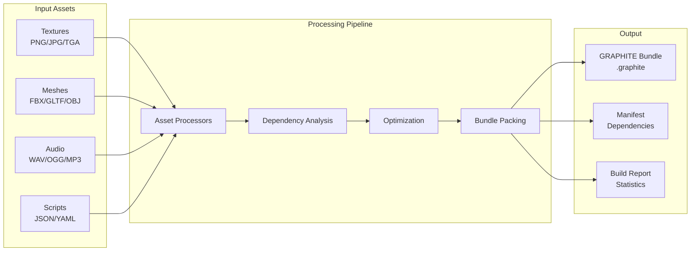

# Volume 2: Development & Integration
## Part 5: Development Tools

### Table of Contents
- [Chapter 12: Build System](#chapter-12-build-system)
  - [Build Pipeline Integration](#build-pipeline-integration)
  - [CMake Integration](#cmake-integration)
  - [Other Build Systems](#other-build-systems)
  - [CI/CD Integration](#cicd-integration)
  - [Incremental Builds](#incremental-builds)
- [Chapter 13: Command Line Tools](#chapter-13-command-line-tools)
  - [Core CLI Tools](#core-cli-tools)
  - [Bundle Operations](#bundle-operations)
  - [Analysis Tools](#analysis-tools)
  - [Development Utilities](#development-utilities)
- [Chapter 14: Testing Framework](#chapter-14-testing-framework)
  - [Unit Testing](#unit-testing)
  - [Integration Testing](#integration-testing)
  - [Property-Based Testing](#property-based-testing)
  - [Performance Testing](#performance-testing)
  - [Fuzz Testing](#fuzz-testing)
- [Cross-References](#cross-references)
- [Navigation](#navigation)

### Overview

This part covers GRAPHITE's comprehensive development toolchain, including build system integration, command-line utilities, and testing frameworks. Chapter 12 details seamless integration with modern build systems. Chapter 13 presents the full suite of command-line tools. Chapter 14 covers the comprehensive testing strategy from unit tests to fuzz testing.

---

## Chapter 12: Build System

GRAPHITE integrates seamlessly with modern build systems, providing first-class support for automated bundle generation, dependency tracking, and incremental builds across all major platforms.

### Build Pipeline Integration

GRAPHITE's build integration follows a declarative approach:



### CMake Integration

GRAPHITE provides comprehensive CMake modules for seamless integration:

```cmake
# FindGRAPHITE.cmake module
find_package(GRAPHITE REQUIRED)

# Create bundle target with full configuration
graphite_add_bundle(MyGame_Assets
    SOURCES 
        ${ASSET_FILES}
        assets/textures/*.png
        assets/models/*.gltf
        assets/sounds/*.wav
    OUTPUT ${CMAKE_BINARY_DIR}/assets/game.graphite
    COMPRESSION zstd
    COMPRESSION_LEVEL 19
    INTEGRITY blake3
    HOT_RELOAD $<CONFIG:Debug>
    DICTIONARY ${CMAKE_SOURCE_DIR}/assets/dict.zstd
)

# Advanced dependency tracking
graphite_add_dependencies(MyGame_Assets
    DEPENDS 
        texture_processor 
        mesh_optimizer
        audio_encoder
    TRIGGERS 
        ${SHADER_FILES} 
        ${TEXTURE_FILES}
        ${CONFIG_FILES}
)

# Custom transformation rules
graphite_add_transform(texture_transform
    INPUT_PATTERN "*.png;*.jpg;*.tga"
    OUTPUT_PATTERN "*.g_tex"
    COMMAND texture_processor 
        --format $<IF:$<CONFIG:Release>,bc7,rgba8>
        --mips 
        --quality $<IF:$<CONFIG:Release>,production,preview>
        --output $output 
        $input
    CACHE_KEY content_hash
    CACHE_DIR ${CMAKE_BINARY_DIR}/.graphite_cache
)

# Platform-specific bundle generation
if(WIN32)
    graphite_add_platform_bundle(MyGame_Assets_Win
        BASE_BUNDLE MyGame_Assets
        PLATFORM_ASSETS assets/platform/windows/*
        COMPRESSION_ALGORITHM lz4  # Faster for runtime
    )
elseif(APPLE)
    graphite_add_platform_bundle(MyGame_Assets_Mac
        BASE_BUNDLE MyGame_Assets
        PLATFORM_ASSETS assets/platform/macos/*
        CODE_SIGN_IDENTITY ${APPLE_DEVELOPER_ID}
    )
endif()

# Integration with install targets
install(FILES 
    $<TARGET_PROPERTY:MyGame_Assets,OUTPUT_FILE>
    DESTINATION ${CMAKE_INSTALL_PREFIX}/data
    COMPONENT GameAssets
)

# Generate asset manifest for runtime
graphite_generate_manifest(MyGame_Assets
    OUTPUT ${CMAKE_BINARY_DIR}/asset_manifest.h
    NAMESPACE MyGame
    LANGUAGE CXX
)
```

#### Advanced CMake Features

```cmake
# Multi-bundle dependencies
graphite_create_bundle_group(AllGameAssets
    BUNDLES
        CoreAssets
        LevelAssets
        CharacterAssets
        UIAssets
    MERGE_DUPLICATES ON
    CROSS_REFERENCE ON
)

# Conditional asset inclusion
graphite_add_bundle(DemoAssets
    SOURCES assets/demo/*
    CONDITION $<OR:$<CONFIG:Debug>,$<BOOL:${BUILD_DEMO}>>
)

# Asset validation rules
graphite_add_validation(MyGame_Assets
    RULES
        MAX_BUNDLE_SIZE 2GB
        MAX_TEXTURE_SIZE 4096
        REQUIRED_MIPMAPS ON
        COMPRESSION_RATIO_MIN 0.5
    FAIL_ON_WARNING $<CONFIG:Release>
)

# Performance profiling integration
graphite_enable_profiling(MyGame_Assets
    REPORT_FILE ${CMAKE_BINARY_DIR}/asset_build_profile.json
    TRACE_LEVEL detailed
    MEASURE_COMPRESSION_TIME ON
    MEASURE_IO_TIME ON
)
```

### Other Build Systems

#### Ninja Integration

Direct integration with Ninja for blazing-fast builds:

```ninja
# GRAPHITE build rules
rule graphite_pack
  command = graphite pack --config $config --output $out $in
  description = Packing GRAPHITE bundle $out
  deps = gcc
  depfile = $out.d
  restat = 1

rule graphite_incremental
  command = graphite update --bundle $bundle --changed $in --output $out
  description = Incrementally updating $bundle
  deps = gcc
  depfile = $out.d

# Build targets
build assets/game.graphite: graphite_pack $
    assets/textures/*.png $
    assets/models/*.gltf $
    assets/config/*.json $
    | graphite_config.json
  config = release

# Incremental updates
build assets/game_updated.graphite: graphite_incremental $
    assets/textures/player.png
  bundle = assets/game.graphite

# Asset processing pipeline
rule texture_process
  command = texture_processor --format bc7 --output $out $in

build processed/player.g_tex: texture_process assets/textures/player.png

# Bundle with processed assets
build final/game.graphite: graphite_pack processed/*.g_tex
  config = final
```

#### Bazel Integration

Hermetic builds with Bazel:

```python
# //tools/graphite:defs.bzl
load("@bazel_skylib//lib:paths.bzl", "paths")

def graphite_bundle(name, srcs, compression="zstd", integrity="blake3", 
                   dictionary=None, platform=None, **kwargs):
    """Create a GRAPHITE bundle from source assets."""
    
    cmd_parts = [
        "$(location //tools/graphite:pack)",
        "--compression=%s" % compression,
        "--integrity=%s" % integrity,
    ]
    
    if dictionary:
        cmd_parts.append("--dictionary=$(location %s)" % dictionary)
    
    if platform:
        cmd_parts.append("--platform=%s" % platform)
    
    cmd_parts.extend([
        "--output $@",
        "$(SRCS)"
    ])
    
    native.genrule(
        name = name,
        srcs = srcs,
        outs = [name + ".graphite"],
        cmd = " ".join(cmd_parts),
        tools = ["//tools/graphite:pack"],
        **kwargs
    )

def graphite_test_bundle(name, bundle, **kwargs):
    """Test a GRAPHITE bundle for integrity and performance."""
    native.sh_test(
        name = name + "_test",
        srcs = ["//tools/graphite:test_runner.sh"],
        data = [bundle],
        args = ["$(location %s)" % bundle],
        **kwargs
    )

# BUILD file usage
load("//tools/graphite:defs.bzl", "graphite_bundle", "graphite_test_bundle")

graphite_bundle(
    name = "game_assets",
    srcs = glob(["assets/**/*"]),
    compression = "zstd",
    compression_level = "19",
    integrity = "blake3",
    dictionary = "//assets:compression_dict",
    platform = select({
        "//platforms:windows": "win64",
        "//platforms:linux": "linux64",
        "//platforms:macos": "darwin64",
    }),
)

graphite_test_bundle(
    name = "game_assets_test",
    bundle = ":game_assets",
    size = "small",
)
```

#### Make Integration

Traditional Make with modern features:

```makefile
# GRAPHITE Makefile integration
GRAPHITE := graphite
GRAPHITE_FLAGS := --compression zstd --integrity blake3

# Directories
ASSET_DIR := assets
BUILD_DIR := build
CACHE_DIR := .graphite_cache

# Find all assets
TEXTURES := $(wildcard $(ASSET_DIR)/textures/*.png)
MODELS := $(wildcard $(ASSET_DIR)/models/*.gltf)
CONFIGS := $(wildcard $(ASSET_DIR)/config/*.json)

ALL_ASSETS := $(TEXTURES) $(MODELS) $(CONFIGS)

# Main bundle target
$(BUILD_DIR)/game.graphite: $(ALL_ASSETS) graphite.config
	@mkdir -p $(BUILD_DIR)
	$(GRAPHITE) pack $(GRAPHITE_FLAGS) \
		--config graphite.config \
		--output $@ \
		--depfile $@.d \
		--cache-dir $(CACHE_DIR) \
		$(ALL_ASSETS)

# Include dependency files
-include $(BUILD_DIR)/*.d

# Incremental updates
.PHONY: incremental
incremental: $(BUILD_DIR)/game.graphite
	@echo "Checking for asset updates..."
	@$(GRAPHITE) update \
		--bundle $< \
		--verify \
		--incremental

# Platform-specific bundles
$(BUILD_DIR)/game_%.graphite: $(BUILD_DIR)/game.graphite
	$(GRAPHITE) repack \
		--input $< \
		--platform $* \
		--output $@

# Clean targets
.PHONY: clean clean-cache
clean:
	rm -rf $(BUILD_DIR)

clean-cache:
	rm -rf $(CACHE_DIR)

# Performance analysis
.PHONY: analyze
analyze: $(BUILD_DIR)/game.graphite
	$(GRAPHITE) analyze $< \
		--report $(BUILD_DIR)/analysis.html \
		--format html
```

### CI/CD Integration

#### GitHub Actions

Comprehensive CI/CD workflow:

```yaml
name: Build and Deploy Assets

on:
  push:
    branches: [main, develop]
  pull_request:
    paths:
      - 'assets/**'
      - 'graphite.config'

env:
  GRAPHITE_VERSION: 1.0.0
  CACHE_KEY_PREFIX: graphite-cache-v1

jobs:
  build-assets:
    runs-on: ${{ matrix.os }}
    strategy:
      matrix:
        os: [ubuntu-latest, windows-latest, macos-latest]
        config: [debug, release]
    
    steps:
    - uses: actions/checkout@v3
      with:
        lfs: true  # For large asset files
    
    - name: Setup GRAPHITE
      uses: graphite-engine/setup-graphite@v1
      with:
        version: ${{ env.GRAPHITE_VERSION }}
    
    - name: Cache processed assets
      uses: actions/cache@v3
      with:
        path: |
          .graphite_cache
          build/cache
        key: ${{ env.CACHE_KEY_PREFIX }}-${{ matrix.os }}-${{ matrix.config }}-${{ hashFiles('assets/**') }}
        restore-keys: |
          ${{ env.CACHE_KEY_PREFIX }}-${{ matrix.os }}-${{ matrix.config }}-
          ${{ env.CACHE_KEY_PREFIX }}-${{ matrix.os }}-
    
    - name: Validate assets
      run: |
        graphite validate assets/ \
          --config validation-rules.json \
          --report validation-report.json
    
    - name: Build asset bundles
      run: |
        graphite pack \
          --config ${{ matrix.config }}.json \
          --platform ${{ runner.os }} \
          --output dist/${{ matrix.os }}-${{ matrix.config }}.graphite \
          --stats build-stats.json \
          assets/
    
    - name: Test bundle integrity
      run: |
        graphite verify dist/${{ matrix.os }}-${{ matrix.config }}.graphite \
          --full \
          --report integrity-report.json
    
    - name: Measure performance
      run: |
        graphite benchmark dist/${{ matrix.os }}-${{ matrix.config }}.graphite \
          --iterations 10 \
          --report performance-report.json
    
    - name: Generate size report
      run: |
        graphite size-report dist/${{ matrix.os }}-${{ matrix.config }}.graphite \
          --format markdown \
          --output size-report.md
    
    - name: Upload artifacts
      uses: actions/upload-artifact@v3
      with:
        name: asset-bundles-${{ matrix.os }}-${{ matrix.config }}
        path: |
          dist/*.graphite
          *-report.*
        retention-days: 30
    
    - name: Comment PR with reports
      if: github.event_name == 'pull_request'
      uses: actions/github-script@v6
      with:
        script: |
          const fs = require('fs');
          const sizeReport = fs.readFileSync('size-report.md', 'utf8');
          
          github.rest.issues.createComment({
            issue_number: context.issue.number,
            owner: context.repo.owner,
            repo: context.repo.name,
            body: `## Asset Build Report\n\n${sizeReport}`
          });

  deploy-assets:
    needs: build-assets
    if: github.ref == 'refs/heads/main'
    runs-on: ubuntu-latest
    
    steps:
    - name: Download all artifacts
      uses: actions/download-artifact@v3
    
    - name: Deploy to CDN
      env:
        CDN_BUCKET: ${{ secrets.CDN_BUCKET }}
        AWS_ACCESS_KEY_ID: ${{ secrets.AWS_ACCESS_KEY_ID }}
        AWS_SECRET_ACCESS_KEY: ${{ secrets.AWS_SECRET_ACCESS_KEY }}
      run: |
        for bundle in asset-bundles-*/*.graphite; do
          aws s3 cp $bundle s3://$CDN_BUCKET/assets/ \
            --content-type application/octet-stream \
            --cache-control "public, max-age=3600"
        done
    
    - name: Invalidate CDN cache
      run: |
        aws cloudfront create-invalidation \
          --distribution-id ${{ secrets.CLOUDFRONT_DISTRIBUTION_ID }} \
          --paths "/assets/*"
```

### Incremental Builds

GRAPHITE's incremental build system minimizes rebuild times:

```c
// Incremental build configuration
typedef struct {
    const char* cache_directory;
    const char* dependency_file;
    bool use_content_hash;
    bool use_timestamps;
    size_t max_cache_size;
    uint32_t cache_ttl_days;
} graphite_incremental_config;

// Dependency tracking
typedef struct {
    char* asset_path;
    uint64_t last_modified;
    uint8_t content_hash[32];
    char** dependencies;
    size_t dep_count;
} asset_dependency;

// Incremental build context
typedef struct {
    graphite_incremental_config config;
    hash_table* asset_cache;
    hash_table* dependency_graph;
    dynamic_array* changed_assets;
    dynamic_array* affected_bundles;
} incremental_build_context;

// Check if rebuild needed
bool needs_rebuild(incremental_build_context* ctx, const char* asset_path) {
    asset_dependency* dep = hash_table_get(ctx->dependency_graph, asset_path);
    if (!dep) {
        return true; // New asset
    }
    
    // Check timestamp
    struct stat st;
    if (stat(asset_path, &st) != 0) {
        return true; // File missing
    }
    
    if (ctx->config.use_timestamps && st.st_mtime > dep->last_modified) {
        return true; // Modified
    }
    
    // Check content hash
    if (ctx->config.use_content_hash) {
        uint8_t current_hash[32];
        if (compute_file_hash(asset_path, current_hash) != 0) {
            return true; // Hash computation failed
        }
        
        if (memcmp(current_hash, dep->content_hash, 32) != 0) {
            return true; // Content changed
        }
    }
    
    // Check dependencies recursively
    for (size_t i = 0; i < dep->dep_count; i++) {
        if (needs_rebuild(ctx, dep->dependencies[i])) {
            return true; // Dependency changed
        }
    }
    
    return false; // No rebuild needed
}

// Incremental bundle update
graphite_result update_bundle_incremental(
    const char* bundle_path,
    incremental_build_context* ctx
) {
    // Load existing bundle
    graphite_bundle* bundle = graphite_open(bundle_path, GRAPHITE_OPEN_WRITE);
    if (!bundle) {
        return GRAPHITE_ERROR_BUNDLE_OPEN;
    }
    
    // Find changed assets
    dynamic_array_clear(ctx->changed_assets);
    
    hash_table_iterator iter;
    hash_table_iter_init(&iter, ctx->dependency_graph);
    
    while (hash_table_iter_next(&iter)) {
        const char* asset_path = iter.key;
        if (needs_rebuild(ctx, asset_path)) {
            dynamic_array_push(ctx->changed_assets, &asset_path);
        }
    }
    
    if (ctx->changed_assets->size == 0) {
        graphite_close(bundle);
        return GRAPHITE_SUCCESS; // Nothing to update
    }
    
    // Process changed assets
    for (size_t i = 0; i < ctx->changed_assets->size; i++) {
        const char* asset_path = *(const char**)dynamic_array_get(
            ctx->changed_assets, i);
        
        // Process asset
        processed_asset* processed = process_asset(asset_path);
        if (!processed) {
            graphite_close(bundle);
            return GRAPHITE_ERROR_ASSET_PROCESSING;
        }
        
        // Update in bundle
        graphite_result result = graphite_bundle_update_chunk(
            bundle, 
            processed->chunk_id, 
            processed->data, 
            processed->size
        );
        
        if (result != GRAPHITE_SUCCESS) {
            free_processed_asset(processed);
            graphite_close(bundle);
            return result;
        }
        
        // Update cache
        update_asset_cache(ctx, asset_path, processed);
        
        free_processed_asset(processed);
    }
    
    // Update bundle metadata
    graphite_bundle_update_timestamp(bundle);
    graphite_bundle_recalculate_hashes(bundle);
    
    graphite_close(bundle);
    
    // Save dependency graph
    save_dependency_graph(ctx);
    
    return GRAPHITE_SUCCESS;
}
```

---

## Chapter 13: Command Line Tools

GRAPHITE provides a comprehensive suite of command-line tools for asset management, debugging, and optimization.

### Core CLI Tools

The main `graphite` command provides all essential operations:

```bash
# Basic information and inspection
graphite info bundle.graphite           # Show bundle statistics
graphite ls bundle.graphite             # List bundle contents
graphite ls bundle.graphite /textures   # List specific path
graphite tree bundle.graphite           # Show hierarchy tree

# Content extraction
graphite cat bundle.graphite /strings/42      # Extract string by ID
graphite extract bundle.graphite /meshes/player.mesh -o player.mesh
graphite extract-all bundle.graphite -o extracted/  # Extract everything

# Integrity verification  
graphite verify bundle.graphite         # Full integrity check
graphite verify --quick bundle.graphite # CRC only
graphite verify --deep bundle.graphite  # Full hash verification

# Performance testing
graphite bench bundle.graphite          # Performance measurement
graphite bench --detailed bundle.graphite    # Per-stage timing
graphite bench --compare old.graphite new.graphite  # A/B comparison
```

### Bundle Operations

Creating and manipulating bundles:

```bash
# Bundle creation
graphite pack assets/ output.graphite   # Basic packing
graphite pack --compress assets/ output.graphite # With compression
graphite pack --compress=zstd:19 assets/ output.graphite # Max compression
graphite pack --dict=dict.zstd assets/ output.graphite # Dictionary compression
graphite pack --encrypt --key=secret.key assets/ output.graphite # Encrypted

# Advanced packing options
graphite pack \
  --config production.json \
  --platform windows \
  --exclude "*.psd" \
  --exclude "source/" \
  --manifest manifest.json \
  --sign cert.pem \
  --timestamp \
  assets/ game.graphite

# Bundle manipulation
graphite merge bundle1.graphite bundle2.graphite -o merged.graphite
graphite split large.graphite --max-size 100MB -o chunks/chunk_
graphite repack old.graphite --compress=lz4 -o new.graphite
graphite optimize bloated.graphite -o optimized.graphite

# Differential updates
graphite diff old.graphite new.graphite # Show differences
graphite patch old.graphite changes.delta -o updated.graphite
graphite delta old.graphite new.graphite -o changes.delta
```

### Analysis Tools

Deep inspection and analysis capabilities:

```bash
# Size analysis
graphite size bundle.graphite           # Summary
graphite size --detailed bundle.graphite # Per-chunk breakdown
graphite size --format=json bundle.graphite > sizes.json

# Compression analysis
graphite compress-stats bundle.graphite
graphite compress-test bundle.graphite --algorithms all
graphite train-dict samples/*.json -o optimized.zstd

# Dependency analysis
graphite deps bundle.graphite           # Show dependencies
graphite deps --graph bundle.graphite   # Graphviz output
graphite deps --missing bundle.graphite # Find missing deps

# Performance analysis
graphite analyze bundle.graphite        # Optimization suggestions
graphite analyze --profile=mobile bundle.graphite # Platform-specific
graphite hotspots bundle.graphite      # Find performance issues

# Content analysis
graphite stats bundle.graphite         # Statistical analysis
graphite duplicates bundle.graphite    # Find duplicate data
graphite unused bundle.graphite        # Find unreferenced chunks
```

### Development Utilities

Tools for development and debugging:

```bash
# Test data generation
graphite generate --size=1GB --nodes=1M test.graphite
graphite generate --pattern=game-like --assets=10000 realistic.graphite
graphite generate --fuzzer --seed=42 fuzz.graphite

# Debugging tools
graphite dump bundle.graphite           # Human-readable dump
graphite dump --hex bundle.graphite     # Hex dump
graphite dump --chunk=42 bundle.graphite # Specific chunk
graphite trace bundle.graphite          # Load operation trace
graphite validate bundle.graphite       # Validate structure

# Format conversion
graphite convert old-format.dat -o new.graphite
graphite import unity.assets -o unity.graphite
graphite export bundle.graphite --format=gltf -o exported/

# Development server
graphite serve bundle.graphite --port=8080  # HTTP server
graphite watch assets/ --auto-pack          # File watcher
graphite repl bundle.graphite              # Interactive REPL
```

#### Command Implementation Examples

```c
// CLI command structure
typedef struct {
    const char* name;
    const char* description;
    int (*handler)(int argc, char** argv);
    const char* usage;
    graphite_cmd_flags flags;
} graphite_command;

// Info command implementation
int cmd_info(int argc, char** argv) {
    if (argc < 1) {
        fprintf(stderr, "Usage: graphite info <bundle>\n");
        return 1;
    }
    
    const char* bundle_path = argv[0];
    graphite_bundle* bundle = graphite_open(bundle_path, GRAPHITE_OPEN_READ);
    if (!bundle) {
        fprintf(stderr, "Error: Failed to open bundle '%s'\n", bundle_path);
        return 1;
    }
    
    // Get bundle statistics
    graphite_stats stats;
    graphite_get_stats(bundle, &stats);
    
    // Print information
    printf("GRAPHITE Bundle Information\n");
    printf("===========================\n");
    printf("File: %s\n", bundle_path);
    printf("Version: %d.%d\n", 
           bundle->header.version_major,
           bundle->header.version_minor);
    printf("Size: %.2f MB\n", stats.total_size / (1024.0 * 1024.0));
    printf("Chunks: %u\n", stats.chunk_count);
    printf("Graphs: %u\n", stats.graph_count);
    printf("Nodes: %u\n", stats.total_nodes);
    printf("Edges: %u\n", stats.total_edges);
    printf("Compression: %s\n", stats.compression_type);
    printf("Compression Ratio: %.2f%%\n", 
           100.0 * (1.0 - (double)stats.compressed_size / stats.uncompressed_size));
    printf("Integrity: %s\n", stats.has_integrity ? "Yes" : "No");
    
    if (stats.has_integrity) {
        printf("Hash Algorithm: %s\n", stats.hash_algorithm);
    }
    
    // Platform-specific info
    if (stats.platform[0]) {
        printf("Platform: %s\n", stats.platform);
    }
    
    if (stats.build_timestamp) {
        char timestamp[64];
        format_timestamp(stats.build_timestamp, timestamp, sizeof(timestamp));
        printf("Built: %s\n", timestamp);
    }
    
    graphite_close(bundle);
    return 0;
}

// Tree command with visualization
int cmd_tree(int argc, char** argv) {
    if (argc < 1) {
        fprintf(stderr, "Usage: graphite tree <bundle> [path]\n");
        return 1;
    }
    
    graphite_bundle* bundle = graphite_open(argv[0], GRAPHITE_OPEN_READ);
    if (!bundle) {
        fprintf(stderr, "Error: Failed to open bundle\n");
        return 1;
    }
    
    const char* start_path = argc > 1 ? argv[1] : "/";
    const graphite_graph* root = graphite_get_graph_by_path(bundle, start_path);
    
    if (!root) {
        fprintf(stderr, "Error: Path '%s' not found\n", start_path);
        graphite_close(bundle);
        return 1;
    }
    
    // Print tree visualization
    print_tree_recursive(root, 0, true, "");
    
    graphite_close(bundle);
    return 0;
}

void print_tree_recursive(const graphite_graph* node, int depth, 
                         bool is_last, const char* prefix) {
    // Print current node
    printf("%s", prefix);
    if (depth > 0) {
        printf("%s── ", is_last ? "└" : "├");
    }
    
    const char* name = graphite_get_node_name(node);
    const char* type = graphite_get_node_type(node);
    uint32_t size = graphite_get_node_size(node);
    
    printf("%s", name ? name : "<unnamed>");
    if (type) {
        printf(" [%s]", type);
    }
    if (size > 0) {
        char size_str[32];
        format_size(size, size_str, sizeof(size_str));
        printf(" (%s)", size_str);
    }
    printf("\n");
    
    // Update prefix for children
    char child_prefix[1024];
    snprintf(child_prefix, sizeof(child_prefix), "%s%s", 
             prefix, depth > 0 ? (is_last ? "    " : "│   ") : "");
    
    // Print children
    uint32_t child_count = graphite_node_count(node);
    for (uint32_t i = 0; i < child_count; i++) {
        const graphite_graph* child = graphite_get_node(node, i);
        bool child_is_last = (i == child_count - 1);
        print_tree_recursive(child, depth + 1, child_is_last, child_prefix);
    }
}
```

---

## Chapter 14: Testing Framework

GRAPHITE's comprehensive testing framework ensures reliability and performance across all components.

### Unit Testing

Lightweight, fast unit testing framework:

```c
// Test registration and execution
typedef enum {
    GRAPHITE_TEST_PASS,
    GRAPHITE_TEST_FAIL,
    GRAPHITE_TEST_SKIP,
    GRAPHITE_TEST_TIMEOUT
} graphite_test_result;

typedef struct {
    const char* name;
    const char* suite;
    graphite_test_result (*test_func)(void);
    uint64_t execution_time_ns;
    const char* failure_message;
    size_t memory_allocated;
    size_t memory_freed;
} graphite_test_case;

// Test fixtures for setup/teardown
typedef struct {
    void* (*setup)(void);
    void (*teardown)(void* context);
    const char* name;
} graphite_test_fixture;

// Assertion macros with detailed output
#define GRAPHITE_ASSERT_EQ(expected, actual) \
    do { \
        if ((expected) != (actual)) { \
            graphite_test_fail(__FILE__, __LINE__, \
                "Expected: %lld, Actual: %lld", \
                (long long)(expected), (long long)(actual)); \
            return GRAPHITE_TEST_FAIL; \
        } \
    } while(0)

#define GRAPHITE_ASSERT_STR_EQ(expected, actual) \
    do { \
        if (strcmp((expected), (actual)) != 0) { \
            graphite_test_fail(__FILE__, __LINE__, \
                "Expected: \"%s\", Actual: \"%s\"", \
                (expected), (actual)); \
            return GRAPHITE_TEST_FAIL; \
        } \
    } while(0)

#define GRAPHITE_ASSERT_NEAR(expected, actual, epsilon) \
    do { \
        double diff = fabs((double)(expected) - (double)(actual)); \
        if (diff > (epsilon)) { \
            graphite_test_fail(__FILE__, __LINE__, \
                "Expected: %f ± %f, Actual: %f (diff: %f)", \
                (double)(expected), (double)(epsilon), \
                (double)(actual), diff); \
            return GRAPHITE_TEST_FAIL; \
        } \
    } while(0)

// Example unit tests
graphite_test_result test_bundle_creation(void) {
    // Arrange
    graphite_builder* builder = graphite_builder_create();
    GRAPHITE_ASSERT_NOT_NULL(builder);
    
    // Act
    const char* test_string = "Hello, GRAPHITE!";
    uint32_t string_id = graphite_builder_add_string(builder, test_string);
    
    graphite_bundle* bundle = graphite_builder_finalize(builder);
    GRAPHITE_ASSERT_NOT_NULL(bundle);
    
    // Assert
    const char* retrieved = graphite_get_string(bundle, string_id);
    GRAPHITE_ASSERT_STR_EQ(test_string, retrieved);
    
    // Verify bundle structure
    GRAPHITE_ASSERT_EQ(1, bundle->header.string_count);
    GRAPHITE_ASSERT_GT(bundle->header.file_size, 0);
    
    // Cleanup
    graphite_close(bundle);
    graphite_builder_destroy(builder);
    
    return GRAPHITE_TEST_PASS;
}

graphite_test_result test_graph_operations(void) {
    graphite_test_fixture fixture = {
        .setup = setup_test_bundle,
        .teardown = teardown_test_bundle,
        .name = "GraphOps"
    };
    
    void* context = fixture.setup();
    GRAPHITE_ASSERT_NOT_NULL(context);
    
    test_bundle_context* ctx = (test_bundle_context*)context;
    
    // Test node creation
    graphite_node_id root = graphite_create_node(ctx->bundle);
    GRAPHITE_ASSERT_NE(INVALID_NODE_ID, root);
    
    // Test property operations
    graphite_set_property(ctx->bundle, root, "name", "root_node");
    const char* name = graphite_get_property_string(ctx->bundle, root, "name");
    GRAPHITE_ASSERT_STR_EQ("root_node", name);
    
    // Test edge creation
    graphite_node_id child = graphite_create_node(ctx->bundle);
    graphite_edge_id edge = graphite_create_edge(ctx->bundle, root, child);
    GRAPHITE_ASSERT_NE(INVALID_EDGE_ID, edge);
    
    // Test traversal
    size_t child_count = graphite_get_child_count(ctx->bundle, root);
    GRAPHITE_ASSERT_EQ(1, child_count);
    
    graphite_node_id retrieved_child = graphite_get_child(ctx->bundle, root, 0);
    GRAPHITE_ASSERT_EQ(child, retrieved_child);
    
    fixture.teardown(context);
    return GRAPHITE_TEST_PASS;
}
```

### Integration Testing

End-to-end testing of complete workflows:

```c
// Integration test framework
typedef struct {
    const char* temp_directory;
    char** created_files;
    size_t file_count;
    size_t file_capacity;
    graphite_test_fixture fixture;
} graphite_integration_context;

// Test complete asset pipeline
graphite_test_result test_asset_pipeline_integration(void) {
    graphite_integration_context ctx = {0};
    
    // Create temporary directory
    ctx.temp_directory = create_temp_directory("graphite_test");
    GRAPHITE_ASSERT_NOT_NULL(ctx.temp_directory);
    
    // Create test assets
    create_test_texture(&ctx, "player.png", 1024, 1024);
    create_test_mesh(&ctx, "player.gltf");
    create_test_config(&ctx, "config.json");
    
    // Run asset pipeline
    char command[1024];
    snprintf(command, sizeof(command),
        "graphite pack --compress --verify %s/assets output.graphite",
        ctx.temp_directory);
    
    int result = system(command);
    GRAPHITE_ASSERT_EQ(0, result);
    
    // Verify output bundle
    graphite_bundle* bundle = graphite_open("output.graphite", GRAPHITE_OPEN_READ);
    GRAPHITE_ASSERT_NOT_NULL(bundle);
    
    // Check contents
    GRAPHITE_ASSERT_TRUE(bundle_contains_asset(bundle, "player.png"));
    GRAPHITE_ASSERT_TRUE(bundle_contains_asset(bundle, "player.gltf"));
    GRAPHITE_ASSERT_TRUE(bundle_contains_asset(bundle, "config.json"));
    
    // Verify compression
    graphite_stats stats;
    graphite_get_stats(bundle, &stats);
    GRAPHITE_ASSERT_GT(stats.compression_ratio, 0.3); // At least 30% compression
    
    // Test loading performance
    uint64_t start_time = graphite_get_time_ns();
    
    for (int i = 0; i < 100; i++) {
        const void* data;
        size_t size;
        graphite_result res = graphite_get_asset(bundle, "player.png", &data, &size);
        GRAPHITE_ASSERT_EQ(GRAPHITE_SUCCESS, res);
        GRAPHITE_ASSERT_NOT_NULL(data);
        GRAPHITE_ASSERT_GT(size, 0);
    }
    
    uint64_t elapsed = graphite_get_time_ns() - start_time;
    double ms_per_load = (elapsed / 100.0) / 1e6;
    GRAPHITE_ASSERT_LT(ms_per_load, 1.0); // Less than 1ms per load
    
    // Cleanup
    graphite_close(bundle);
    cleanup_integration_context(&ctx);
    
    return GRAPHITE_TEST_PASS;
}

// Test hot reload functionality
graphite_test_result test_hot_reload_integration(void) {
    // Create initial bundle
    graphite_bundle* bundle = create_test_bundle_with_assets();
    GRAPHITE_ASSERT_NOT_NULL(bundle);
    
    // Set up file watcher
    hot_reload_context* reload_ctx = graphite_hot_reload_create();
    graphite_hot_reload_watch(reload_ctx, bundle);
    
    // Modify an asset
    modify_test_asset("assets/texture.png");
    
    // Wait for hot reload
    sleep_ms(100);
    
    // Verify reload occurred
    GRAPHITE_ASSERT_TRUE(reload_ctx->reload_count > 0);
    
    // Verify new content is loaded
    const void* texture_data;
    size_t texture_size;
    graphite_get_asset(bundle, "texture.png", &texture_data, &texture_size);
    
    uint32_t checksum = compute_checksum(texture_data, texture_size);
    GRAPHITE_ASSERT_NE(original_checksum, checksum);
    
    // Cleanup
    graphite_hot_reload_destroy(reload_ctx);
    graphite_close(bundle);
    
    return GRAPHITE_TEST_PASS;
}
```

### Property-Based Testing

Automated testing with generated inputs:

```c
// Property-based testing framework
typedef struct {
    void* (*generate)(graphite_rng* rng, size_t size_hint);
    void (*shrink)(void* input, void** smaller_inputs, size_t* count);
    void (*free_input)(void* input);
} graphite_generator;

typedef struct {
    bool (*property)(void* input);
    const char* description;
    graphite_generator* generator;
    size_t num_tests;
    uint64_t seed;
} graphite_property_test;

// Random generators
void* generate_random_bundle_data(graphite_rng* rng, size_t size_hint) {
    bundle_test_data* data = calloc(1, sizeof(bundle_test_data));
    
    // Generate random number of strings
    data->string_count = graphite_rng_range(rng, 0, 1000);
    data->strings = calloc(data->string_count, sizeof(char*));
    
    for (size_t i = 0; i < data->string_count; i++) {
        size_t len = graphite_rng_range(rng, 1, 1024);
        data->strings[i] = generate_random_string(rng, len);
    }
    
    // Generate random blobs
    data->blob_count = graphite_rng_range(rng, 0, 100);
    data->blobs = calloc(data->blob_count, sizeof(blob_data));
    
    for (size_t i = 0; i < data->blob_count; i++) {
        data->blobs[i].size = graphite_rng_range(rng, 0, size_hint);
        data->blobs[i].data = generate_random_bytes(rng, data->blobs[i].size);
    }
    
    // Generate random graph structure
    data->node_count = graphite_rng_range(rng, 1, 100);
    data->edge_probability = graphite_rng_float(rng);
    
    return data;
}

// Property: Bundle roundtrip preserves data
bool property_bundle_roundtrip(void* input) {
    bundle_test_data* data = (bundle_test_data*)input;
    
    // Create bundle
    graphite_builder* builder = graphite_builder_create();
    if (!builder) return false;
    
    // Add all strings
    for (size_t i = 0; i < data->string_count; i++) {
        uint32_t id = graphite_builder_add_string(builder, data->strings[i]);
        if (id != i) {
            graphite_builder_destroy(builder);
            return false;
        }
    }
    
    // Add all blobs
    for (size_t i = 0; i < data->blob_count; i++) {
        uint32_t id = graphite_builder_add_blob(builder, 
            data->blobs[i].data, data->blobs[i].size);
        if (id == INVALID_BLOB_ID) {
            graphite_builder_destroy(builder);
            return false;
        }
    }
    
    // Build graph structure
    if (!build_random_graph(builder, data)) {
        graphite_builder_destroy(builder);
        return false;
    }
    
    // Finalize bundle
    graphite_bundle* bundle = graphite_builder_finalize(builder);
    if (!bundle) {
        graphite_builder_destroy(builder);
        return false;
    }
    
    // Verify all data preserved
    bool success = verify_bundle_contents(bundle, data);
    
    graphite_close(bundle);
    graphite_builder_destroy(builder);
    
    return success;
}

// Run property-based tests
void run_property_tests(void) {
    graphite_property_test tests[] = {
        {
            .property = property_bundle_roundtrip,
            .description = "Bundle roundtrip preserves all data",
            .generator = &bundle_data_generator,
            .num_tests = 1000,
            .seed = 0  // 0 = random seed
        },
        {
            .property = property_compression_reduces_size,
            .description = "Compression never increases size",
            .generator = &compressible_data_generator,
            .num_tests = 100,
            .seed = 0
        },
        {
            .property = property_graph_acyclic_after_sort,
            .description = "Topological sort produces acyclic ordering",
            .generator = &dag_generator,
            .num_tests = 500,
            .seed = 0
        }
    };
    
    for (size_t i = 0; i < sizeof(tests) / sizeof(tests[0]); i++) {
        run_property_test(&tests[i]);
    }
}
```

### Performance Testing

Comprehensive performance benchmarking:

```c
// Performance test framework
typedef struct {
    const char* name;
    void (*setup)(void* context);
    void (*benchmark)(void* context);
    void (*teardown)(void* context);
    
    // Configuration
    size_t iterations;
    size_t warmup_iterations;
    double time_limit_seconds;
    
    // Results
    double* timings;
    size_t timing_count;
    double mean;
    double median;
    double stddev;
    double p95;
    double p99;
} graphite_benchmark;

// Benchmark bundle loading performance
void benchmark_bundle_loading(void* context) {
    benchmark_context* ctx = (benchmark_context*)context;
    
    // Clear caches
    clear_system_caches();
    
    // Time the operation
    uint64_t start = graphite_get_time_ns();
    
    graphite_bundle* bundle = graphite_open(ctx->bundle_path, GRAPHITE_OPEN_READ);
    if (bundle) {
        // Force load of root graph
        const graphite_graph* root = graphite_root(bundle);
        volatile uint32_t dummy = root->header.node_cnt;
        (void)dummy;
        
        graphite_close(bundle);
    }
    
    uint64_t elapsed = graphite_get_time_ns() - start;
    record_timing(ctx, elapsed);
}

// Benchmark graph traversal
void benchmark_graph_traversal(void* context) {
    benchmark_context* ctx = (benchmark_context*)context;
    
    uint64_t start = graphite_get_time_ns();
    
    size_t nodes_visited = 0;
    traverse_graph_dfs(ctx->bundle, ctx->root, &nodes_visited);
    
    uint64_t elapsed = graphite_get_time_ns() - start;
    
    // Record normalized timing (ns per node)
    double ns_per_node = (double)elapsed / nodes_visited;
    record_timing(ctx, ns_per_node);
}

// Run benchmarks and generate report
void run_performance_suite(void) {
    graphite_benchmark benchmarks[] = {
        {
            .name = "Bundle Open/Close",
            .setup = setup_bundle_benchmark,
            .benchmark = benchmark_bundle_loading,
            .teardown = teardown_bundle_benchmark,
            .iterations = 1000,
            .warmup_iterations = 100
        },
        {
            .name = "Graph Traversal (DFS)",
            .setup = setup_graph_benchmark,
            .benchmark = benchmark_graph_traversal,
            .teardown = teardown_graph_benchmark,
            .iterations = 10000,
            .warmup_iterations = 1000
        },
        {
            .name = "String Lookup",
            .setup = setup_string_benchmark,
            .benchmark = benchmark_string_lookup,
            .teardown = teardown_string_benchmark,
            .iterations = 100000,
            .warmup_iterations = 10000
        },
        {
            .name = "Memory-Mapped Access",
            .setup = setup_mmap_benchmark,
            .benchmark = benchmark_mmap_access,
            .teardown = teardown_mmap_benchmark,
            .iterations = 1000,
            .warmup_iterations = 100
        }
    };
    
    printf("GRAPHITE Performance Test Suite\n");
    printf("===============================\n\n");
    
    for (size_t i = 0; i < sizeof(benchmarks) / sizeof(benchmarks[0]); i++) {
        run_benchmark(&benchmarks[i]);
        print_benchmark_results(&benchmarks[i]);
    }
    
    // Generate comparison report
    generate_performance_report(benchmarks, 
        sizeof(benchmarks) / sizeof(benchmarks[0]),
        "performance_report.html");
}

// Statistical analysis of results
void analyze_benchmark_results(graphite_benchmark* bench) {
    if (bench->timing_count == 0) return;
    
    // Sort timings
    qsort(bench->timings, bench->timing_count, sizeof(double), compare_double);
    
    // Calculate statistics
    bench->mean = calculate_mean(bench->timings, bench->timing_count);
    bench->median = calculate_median(bench->timings, bench->timing_count);
    bench->stddev = calculate_stddev(bench->timings, bench->timing_count, bench->mean);
    bench->p95 = calculate_percentile(bench->timings, bench->timing_count, 0.95);
    bench->p99 = calculate_percentile(bench->timings, bench->timing_count, 0.99);
}
```

### Fuzz Testing

Automated security and robustness testing:

```c
// Fuzz testing harness
typedef struct {
    uint8_t* data;
    size_t size;
    uint32_t seed;
    size_t iteration;
} graphite_fuzz_input;

// Main fuzzing entry point
int LLVMFuzzerTestOneInput(const uint8_t* data, size_t size) {
    // Set resource limits
    set_memory_limit(256 * 1024 * 1024);  // 256MB
    set_time_limit(30);  // 30 seconds
    
    // Create temporary file
    char temp_path[] = "/tmp/fuzz_XXXXXX";
    int fd = mkstemp(temp_path);
    if (fd < 0) return 0;
    
    write(fd, data, size);
    close(fd);
    
    // Test bundle parsing
    graphite_bundle* bundle = graphite_open_secure(temp_path, 
        &graphite_security_strict);
    
    if (bundle) {
        // Exercise API surface
        fuzz_test_api(bundle);
        graphite_close(bundle);
    }
    
    unlink(temp_path);
    return 0;
}

// Targeted fuzzing for specific components
void fuzz_test_api(graphite_bundle* bundle) {
    // Test graph traversal
    const graphite_graph* root = graphite_root(bundle);
    if (root) {
        fuzz_graph_traversal(root, 0, MAX_DEPTH);
    }
    
    // Test string operations
    for (uint32_t i = 0; i < 100 && i < bundle->header.string_count; i++) {
        const char* str = graphite_get_string(bundle, i);
        if (str) {
            volatile size_t len = strlen(str);
            (void)len;
        }
    }
    
    // Test property access
    fuzz_property_access(bundle);
    
    // Test chunk operations
    fuzz_chunk_operations(bundle);
}

// Mutation-based fuzzing
typedef struct {
    size_t pos;
    size_t len;
    enum { MUTATE_FLIP, MUTATE_INSERT, MUTATE_DELETE, MUTATE_REPLACE } type;
    uint8_t data[16];
} mutation;

void mutate_bundle(uint8_t* data, size_t size, graphite_rng* rng) {
    size_t num_mutations = graphite_rng_range(rng, 1, 10);
    
    for (size_t i = 0; i < num_mutations; i++) {
        mutation mut;
        mut.pos = graphite_rng_range(rng, 0, size);
        mut.type = graphite_rng_range(rng, 0, 4);
        
        switch (mut.type) {
            case MUTATE_FLIP:
                if (mut.pos < size) {
                    data[mut.pos] ^= 1 << graphite_rng_range(rng, 0, 8);
                }
                break;
                
            case MUTATE_INSERT:
                // Insert random bytes
                mut.len = graphite_rng_range(rng, 1, 16);
                insert_bytes(data, size, mut.pos, mut.data, mut.len);
                break;
                
            case MUTATE_DELETE:
                // Delete bytes
                mut.len = graphite_rng_range(rng, 1, min(16, size - mut.pos));
                delete_bytes(data, size, mut.pos, mut.len);
                break;
                
            case MUTATE_REPLACE:
                // Replace with random data
                mut.len = graphite_rng_range(rng, 1, min(16, size - mut.pos));
                for (size_t j = 0; j < mut.len; j++) {
                    if (mut.pos + j < size) {
                        data[mut.pos + j] = graphite_rng_byte(rng);
                    }
                }
                break;
        }
    }
}

// Coverage-guided fuzzing
typedef struct {
    uint64_t* coverage_map;
    size_t map_size;
    size_t new_coverage_count;
    hash_table* corpus;
} fuzzer_state;

void coverage_guided_fuzz(fuzzer_state* state, const uint8_t* data, size_t size) {
    // Reset coverage map
    memset(state->coverage_map, 0, state->map_size * sizeof(uint64_t));
    
    // Run with coverage tracking
    __sanitizer_cov_reset_edgeguards();
    
    graphite_fuzz_input input = {
        .data = (uint8_t*)data,
        .size = size,
        .seed = random(),
        .iteration = state->iteration++
    };
    
    fuzz_one_input(&input);
    
    // Check for new coverage
    size_t new_edges = count_new_edges(state->coverage_map, state->map_size);
    
    if (new_edges > 0) {
        // Add to corpus for future mutation
        add_to_corpus(state->corpus, data, size);
        state->new_coverage_count += new_edges;
        
        printf("New coverage found! Edges: %zu Total: %zu\n", 
               new_edges, state->new_coverage_count);
    }
}
```

---

### Cross-References
- See [Chapter 11: Platform Abstraction](../volume-1-foundation/part-4-platform-security.md#chapter-11-platform-abstraction-layer) for platform-specific build considerations
- See [Chapter 10: Security & Encryption](../volume-1-foundation/part-4-platform-security.md#chapter-10-security--encryption) for security testing
- See [Chapter 15: Performance Optimization](../volume-3-advanced-future/part-8-performance-optimization.md#chapter-15-performance-optimization) for performance benchmarking
- See [Chapter 22: Editor Integration](../volume-2-development-integration/part-6-integration-migration.md#chapter-22-editor-integration) for IDE integration

### Navigation
[← Volume 1: Foundation & Core Systems](../volume-1-foundation/part-4-platform-security.md) | [Table of Contents](#table-of-contents) | [Part 6: Integration & Migration →](../volume-2-development-integration/part-6-integration-migration.md)