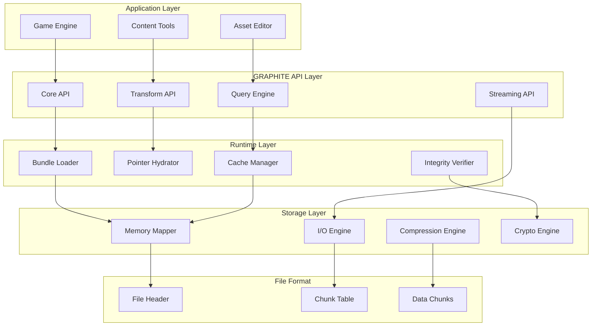
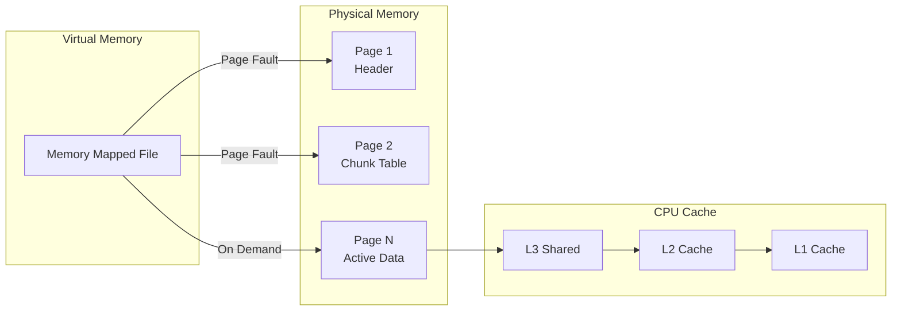
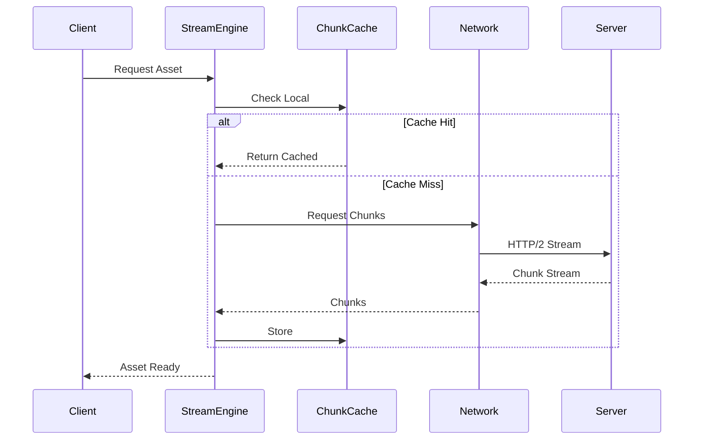
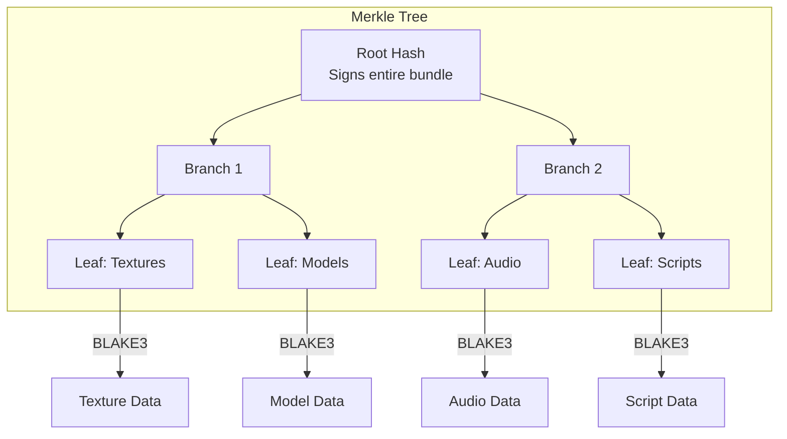

# Volume 1: Foundation & Core Systems
## Part 1: Introduction & Architecture

### Table of Contents
- [Chapter 1: Introduction & Overview](#chapter-1-introduction--overview)
  - [The Asset Management Crisis](#the-asset-management-crisis)
  - [The GRAPHITE Vision](#the-graphite-vision)
  - [What Makes GRAPHITE Revolutionary](#what-makes-graphite-revolutionary)
  - [Who Should Read This Documentation](#who-should-read-this-documentation)
  - [Documentation Roadmap](#documentation-roadmap)
- [Chapter 2: Core Concepts](#chapter-2-core-concepts)
- [Chapter 3: Architecture Overview](#chapter-3-architecture-overview)

### Overview
This part introduces GRAPHITE (Graphite Recursive Asset Pipeline – Hypergraph Infinite Turtling Engine), a revolutionary asset management system that fundamentally reimagines how digital assets are stored, versioned, and distributed. Building on the insight that "everything is a graph," GRAPHITE brings Git-like distributed version control to game assets while maintaining the performance characteristics required for production deployments.

---

## Chapter 1: Introduction & Overview

### The Asset Management Crisis

The game development industry faces a fundamental crisis in asset management. As games grow exponentially in complexity—with AAA titles now exceeding 100GB of assets—traditional approaches to asset storage, versioning, and distribution have reached their breaking point.

Consider the current state of affairs:
- **Fragmented Ecosystems**: Teams juggle between Perforce for versioning, proprietary formats for storage, CDNs for distribution, and custom tools for dependency tracking
- **Version Control Nightmares**: Binary assets don't merge, branches diverge catastrophically, and storage costs explode with every iteration
- **Pipeline Bottlenecks**: Artists wait hours for asset builds, programmers can't hot-reload changes, and QA struggles to reproduce specific asset configurations
- **Dependency Hell**: A simple texture change triggers cascading rebuilds across hundreds of materials, with no clear visibility into impact
- **Distribution Chaos**: Different platforms need different asset formats, patches require complex binary diffs, and streaming systems are built on fragile foundations

These aren't just inconveniences—they're existential threats to sustainable game development. Teams spend more time fighting their asset pipeline than creating content. Innovation stalls under the weight of technical debt. Smaller studios can't compete because the infrastructure cost is prohibitive.

### The GRAPHITE Vision

GRAPHITE represents a paradigm shift in how we think about game assets. Instead of treating assets as opaque binary blobs to be versioned and distributed, GRAPHITE recognizes a fundamental truth:

**Everything is a graph.**

This isn't metaphorical—it's the deepest insight into the nature of digital assets:
- A texture isn't just pixel data; it's a graph of mip levels, compression states, and channel mappings
- A 3D model isn't just vertices and triangles; it's a graph of meshes, materials, bones, and blend shapes
- A game level isn't just object placements; it's a graph of spatial relationships, dependencies, and streaming boundaries
- Even the relationships between assets form graphs—materials reference textures, prefabs reference models, levels reference everything

By embracing this graph-native reality, GRAPHITE enables something revolutionary: **Git for game assets**.

```bash
# Fork an entire game's assets
graphite fork activision/call-of-duty-assets my-studio/cod-mod

# Create experimental branches
graphite checkout -b next-gen-textures
graphite compress --algorithm=neural --quality=0.95 textures/

# Merge successful experiments
graphite merge next-gen-textures --strategy=size-optimized

# Push improvements back to the community
graphite push community/optimization-pack
```

But GRAPHITE goes beyond version control. It's a complete reimagining of the asset pipeline:
- **Zero-Copy Loading**: Memory-mapped files with one-time pointer hydration mean sub-200ms load times for gigabyte bundles
- **Cryptographic Integrity**: BLAKE3 Merkle trees ensure every byte is verified, preventing corruption and enabling trustless distribution
- **Universal Format**: One graph format rules them all—from individual textures to entire game databases
- **Distributed by Design**: Like Git, every clone is a complete repository. Work offline, fork freely, merge intelligently

### What Makes GRAPHITE Revolutionary

#### 1. The Recursive Graph Model

Traditional formats use hierarchies (trees) or flat structures (arrays). GRAPHITE uses recursive hypergraphs where:
- Nodes can be graphs
- Edges can be graphs  
- Properties can be graphs
- Even the format itself is a graph

This isn't complexity for its own sake—it's a recognition that assets are inherently interconnected, self-similar structures. A material graph contains texture graphs. A character graph contains animation graphs. A level graph contains everything.

#### 2. Git-Like Distributed Architecture

GRAPHITE brings true distributed version control to assets:
- **Every copy is a repository**: No distinction between client and server
- **Branching is free**: Copy-on-write semantics mean branches cost nothing
- **Merging is intelligent**: Graph-aware merge algorithms understand asset semantics
- **History is preserved**: Every change is tracked, every version accessible

#### 3. Performance Without Compromise

Unlike interchange formats that sacrifice runtime performance for flexibility, GRAPHITE delivers both:
- **Memory-mapped I/O**: Direct from disk to GPU with zero copies
- **Pointer hydration**: One-time fixup for native-speed traversal
- **NUMA awareness**: Optimized for modern multi-socket systems
- **Streaming-first**: Designed for progressive loading and partial updates

#### 4. Built-in Intelligence

GRAPHITE assets aren't just data—they're smart:
- **Self-describing**: Every asset knows its own schema
- **Self-validating**: Cryptographic hashes catch corruption instantly
- **Self-optimizing**: Graphs reorganize based on access patterns
- **Self-documenting**: Metadata and relationships are first-class citizens

### Who Should Read This Documentation

This documentation serves multiple audiences:

**Game Developers** will learn how to:
- Integrate GRAPHITE into existing pipelines
- Optimize asset loading and streaming
- Implement efficient hot-reload systems
- Build content delivery networks

**Engine Programmers** will discover how to:
- Implement GRAPHITE loaders from scratch
- Optimize for specific platforms
- Extend the format with custom node types
- Build graph-aware tools and editors

**Technical Artists** will understand how to:
- Author GRAPHITE-native content
- Optimize asset graphs for performance
- Create procedural asset pipelines
- Debug complex dependency chains

**Infrastructure Engineers** will master how to:
- Deploy GRAPHITE at scale
- Build distributed asset networks
- Implement caching and CDN strategies
- Monitor and optimize performance

### Documentation Roadmap

This documentation is organized into three volumes:

**Volume 1: Foundation & Core Systems** (You are here)
- Part 1: Introduction & Architecture
- Part 2: Data & Runtime
- Part 3: System Services  
- Part 4: Platform & Security

**Volume 2: Development & Integration**
- Part 5: Development Tools
- Part 6: Integration & Migration
- Part 7: Real-World Application

**Volume 3: Advanced Systems & Future**
- Part 8: Performance & Optimization
- Part 9: Advanced Features
- Part 10: Production & Analytics
- Part 11: Ecosystem & Future

Each part builds on the previous, but experienced readers can jump directly to topics of interest. Code examples are provided in C (the reference implementation language), but bindings exist for C++, Rust, Python, and more.

### A Note on Philosophy

GRAPHITE embodies a philosophical shift in how we think about digital assets. Just as Git revealed that version control is fundamentally about managing directed acyclic graphs of commits, GRAPHITE reveals that asset management is fundamentally about managing recursive hypergraphs of content.

This isn't just a technical observation—it's a recognition that the tools we use shape the games we create. By providing a graph-native foundation, GRAPHITE enables new forms of creativity:
- Procedural assets that evolve based on player behavior
- Community-driven content that forks and merges like open source
- AI-assisted creation that understands asset relationships
- Distributed worlds that exist across multiple servers

### Getting Started

The journey into GRAPHITE begins with understanding its core concepts. Chapter 2 explores the fundamental principles that make GRAPHITE possible: the recursive graph model, distributed architecture, and performance philosophy that underlies everything else.

But first, let's see GRAPHITE in action with a simple example:

```c
#include <graphite/graphite.h>

int main() {
    // Open a GRAPHITE bundle
    graphite_bundle* bundle = graphite_open("game_assets.grph");
    if (!bundle) {
        fprintf(stderr, "Failed to open bundle\n");
        return 1;
    }
    
    // Get the root graph
    const graphite_graph* root = graphite_root(bundle);
    
    // Find a specific asset by traversing the graph
    const graphite_node* textures = graphite_find_node(root, "textures");
    const graphite_node* player = graphite_find_node(textures, "characters/player");
    const graphite_node* diffuse = graphite_find_node(player, "diffuse");
    
    // Load the texture data (zero-copy if memory-mapped)
    graphite_blob blob = graphite_node_data(diffuse);
    printf("Loaded texture: %zu bytes\n", blob.size);
    
    // The blob points directly to memory-mapped data
    // No copies, no allocations, just pure performance
    
    graphite_close(bundle);
    return 0;
}
```

This simple example hints at the power within: a unified API for accessing any asset type, automatic dependency resolution, and performance that matches or exceeds custom binary formats.

### The Revolution Begins

GRAPHITE isn't just another asset format—it's a fundamental rethinking of how digital content is created, stored, versioned, and distributed. By recognizing that everything is a graph and building on decades of distributed systems research, GRAPHITE provides the foundation for the next generation of digital experiences.

The following chapters will take you deep into the technical details, but never forget the vision: a world where assets flow as freely as code, where creativity isn't constrained by pipeline limitations, and where the best ideas can spread and evolve without friction.

Welcome to the graph revolution. Welcome to GRAPHITE.

---

*"Where every asset is a graph, and every graph tells a story."*

---

### Cross-References
- For the philosophical foundations, see [Chapter 2: Core Concepts](#chapter-2-core-concepts)
- For technical architecture, see [Chapter 3: Architecture Overview](#chapter-3-architecture-overview)
- For hands-on examples, jump to [Part 5: Development Tools](../volume-2-development/part-5-development-tools.md)

### Navigation
[Table of Contents](#table-of-contents) | [Next: Chapter 2 →](#chapter-2-core-concepts)

---

## Chapter 2: Core Concepts

The power of GRAPHITE emerges from four fundamental principles that, when combined, create something far greater than their sum. These aren't arbitrary design decisions—they're recognitions of deep truths about the nature of digital assets and computation itself.

### 1. Everything Is A Graph

This principle is both the simplest and most profound insight underlying GRAPHITE. It's not a metaphor or an abstraction—it's a recognition of reality.

#### The Graph Awakening

Consider this truth:
```
git mind = everything's a graph
graphite = everything's a graph  
it's all graphs
all the way
down
```

Every computational system we've ever built is fundamentally a graph:
- **Git repositories** = Directed acyclic graphs (commits, trees, blobs)
- **File systems** = Tree graphs (directories and files)
- **Program execution** = Call graphs (functions calling functions)
- **Memory allocation** = Object reference graphs (pointers and references)
- **Database relations** = Entity relationship graphs (tables and foreign keys)
- **Web pages** = Hyperlink graphs (pages linking to pages)
- **Neural networks** = Computational graphs (neurons and connections)
- **Game worlds** = Spatial scene graphs (objects in space)

The revelation: **We've been building graph systems all along without fully realizing it.**

#### How GRAPHITE Applies This Principle

In GRAPHITE, every element is represented as a graph:

- **Individual Assets**: Even a simple texture is a graph—albeit a leaf graph with 0 nodes and 0 edges, where the data lives in the graph's properties
- **Asset Collections**: A texture atlas is a graph where nodes represent individual sprites
- **Dependencies**: The relationships between assets form edges in the graph, with metadata attached
- **Transforms**: Asset processing pipelines are graphs with input subgraphs, output subgraphs, and transformation logic
- **Bundles**: Entire asset packages are composite graphs containing multiple asset graphs
- **String Tables**: Even mundane elements like string pools become graphs where nodes point to string data

This isn't over-engineering—it's acknowledging that assets naturally form complex, interconnected structures. By making graphs the fundamental primitive, GRAPHITE provides a unified way to represent, query, and manipulate any asset type.

#### Practical Implications

The "everything is a graph" principle enables powerful capabilities:

```c
// Any asset can be treated uniformly
const graphite_graph* asset = graphite_load_any(bundle, "some/asset");

// Traverse relationships naturally
graphite_foreach_edge(asset, edge) {
    const graphite_graph* dependency = graphite_edge_target(edge);
    const char* relationship = graphite_edge_property(edge, "type");
    printf("Depends on %s via %s\n", 
           graphite_graph_name(dependency), relationship);
}

// Query complex relationships
graphite_query* q = graphite_query_create(
    "MATCH (texture:Texture)-[:USED_BY]->(material:Material)"
    "-[:APPLIED_TO]->(model:Model) "
    "WHERE texture.format = 'BC7' "
    "RETURN model"
);
```

### 2. Recursive Composition

If everything is a graph, then graphs must be able to contain other graphs. This recursive principle is what transforms GRAPHITE from a simple format into a universal representation.

#### The Power of Recursion

Graphs can contain other graphs at arbitrary depth:
- A **texture atlas graph** contains individual **sprite graphs**
- A **character graph** contains **mesh graphs**, **skeleton graphs**, and **animation graphs**
- A **transform graph** contains **input graphs**, **output graphs**, and **parameter graphs**
- A **bundle graph** contains **asset graphs**, **dependency graphs**, and **metadata graphs**

This recursion isn't limited to containment—edges can also be graphs:
- A **blend edge** between two animations can itself be a graph describing blend curves
- A **dependency edge** can be a graph containing version constraints and fallback options
- A **spatial edge** in a scene graph can contain transformation matrices and LOD information

#### Implementation Through Nested Graphs

```c
// A material is a graph containing other graphs
typedef struct {
    graphite_graph base;
    graphite_graph* diffuse_texture;   // Itself a graph
    graphite_graph* normal_texture;    // Itself a graph
    graphite_graph* shader_params;     // Graph of parameters
    graphite_graph* render_states;     // Graph of GPU states
} material_graph;

// Recursive traversal is natural
void process_graph_recursive(const graphite_graph* g, int depth) {
    // Process current level
    printf("%*sGraph: %s\n", depth*2, "", graphite_graph_name(g));
    
    // Recurse into node graphs
    graphite_foreach_node(g, node) {
        if (graphite_node_is_graph(node)) {
            const graphite_graph* subgraph = graphite_node_as_graph(node);
            process_graph_recursive(subgraph, depth + 1);
        }
    }
    
    // Even edges can be graphs!
    graphite_foreach_edge(g, edge) {
        if (graphite_edge_is_graph(edge)) {
            const graphite_graph* edge_graph = graphite_edge_as_graph(edge);
            process_graph_recursive(edge_graph, depth + 1);
        }
    }
}
```

#### Recursive Composition in Practice

This principle enables elegant solutions to complex problems:

1. **Level-of-Detail (LOD) Systems**: Each LOD level is a subgraph, contained within the asset graph
2. **Variant Management**: Texture variants (different resolutions, formats) are subgraphs of the main texture
3. **Procedural Assets**: Nodes can contain generation graphs that produce content on demand
4. **Asset Packages**: Bundles naturally compose—a game graph contains level graphs contains asset graphs

### 3. Binary Efficiency

While graphs provide expressiveness, games demand performance. GRAPHITE achieves both through careful binary design.

#### Memory-Mapped Architecture

GRAPHITE files are designed for direct memory mapping:
- **Zero-copy loading**: Files map directly into address space
- **Pointer hydration**: One-time fixup converts offsets to pointers
- **Page-fault driven**: OS loads only accessed data
- **Cache-friendly**: Related data is spatially local

```c
// Opening a bundle is nearly instantaneous
graphite_bundle* bundle = graphite_open("massive_game.grph");

// Even for multi-gigabyte files, this returns immediately
// The OS will page in data as needed

// First access triggers page fault and load
const graphite_graph* root = graphite_root(bundle);  // ~1ms

// Subsequent access is pure memory access
const graphite_graph* textures = graphite_find(root, "textures");  // ~1μs
```

#### Compact Representation

Every byte matters in the binary format:
- **Offset-based serialization**: Pointers become 40-bit offsets
- **Chunk-based organization**: Related data groups together
- **Bit-packed flags**: Boolean properties use single bits
- **Varint encoding**: Small numbers use fewer bytes
- **String deduplication**: Identical strings share storage

#### Incremental Loading

The chunk system enables sophisticated loading strategies:
- **Progressive streaming**: Load chunks based on priority
- **Partial updates**: Patch individual chunks
- **Parallel decompression**: Chunks decompress independently
- **Background prefetch**: Predict and preload chunks

### 4. Integrity By Design

In a distributed world, trust must be built in. GRAPHITE provides multiple layers of integrity checking.

#### Corruption Detection

Every chunk includes a CRC32 checksum:
```c
typedef struct {
    uint32_t type;      // Chunk type identifier
    uint32_t size;      // Chunk size in bytes
    uint32_t crc32;     // CRC of chunk data
    uint32_t offset;    // File offset to data
} chunk_header;
```

This catches:
- Disk corruption
- Network transmission errors  
- Memory corruption
- Accidental modification

#### Cryptographic Verification

For security-critical applications, GRAPHITE provides BLAKE3 Merkle trees:

```
                    Root Hash
                   /         \
              Bundle Hash   Metadata Hash
              /         \
        Assets Hash   Deps Hash
        /         \
   Textures    Models
   /      \
Tex1      Tex2
```

This enables:
- **Tamper detection**: Any modification invalidates hashes
- **Partial verification**: Verify only accessed portions
- **Trust chains**: Signed root hashes ensure authenticity
- **Incremental updates**: Only changed subtrees need rehashing

#### Production-Ready Security

```c
// Verify entire bundle integrity
if (!graphite_verify_full(bundle)) {
    fprintf(stderr, "Bundle corrupted or tampered!\n");
    return ERROR_INTEGRITY;
}

// Verify just what we're using (faster)
const graphite_graph* character = graphite_find(root, "player");
if (!graphite_verify_subtree(character)) {
    fprintf(stderr, "Character assets compromised!\n");
    return ERROR_INTEGRITY;
}

// For online games, verify signatures
if (!graphite_verify_signature(bundle, studio_public_key)) {
    fprintf(stderr, "Unofficial content detected!\n");
    return ERROR_UNAUTHORIZED;
}
```

### The Principles in Harmony

These four principles work together synergistically:

1. **Everything is a graph** provides the universal abstraction
2. **Recursive composition** enables arbitrary complexity
3. **Binary efficiency** ensures production-ready performance
4. **Integrity by design** enables distributed trust

The result is more than a file format—it's a foundation for the future of digital asset management.

### Beyond Storage: The Git Revelation

The deepest insight is that GRAPHITE isn't just inspired by Git—it recognizes that Git itself is a distributed graph database:

| Feature | Git | Traditional Database | GRAPHITE |
|---------|-----|---------------------|----------|
| **Distributed** | ✅ Native | ❌ Replication only | ✅ Native |
| **Version Control** | ✅ Core feature | ❌ Manual | ✅ Core feature |
| **Mergeable** | ✅ Built-in | ❌ Complex | ✅ Graph-aware |
| **Forkable** | ✅ One command | ❌ Database dump | ✅ One command |
| **Offline Capable** | ✅ Full functionality | ❌ Connection required | ✅ Full functionality |

This revelation enables revolutionary workflows:

```bash
# Fork entire game asset database
graphite fork bethesda/skyrim-assets my-mods/total-conversion

# Create experimental branches
graphite checkout -b hd-texture-pack
graphite transform textures/ --upscale=4x --ai-enhance

# Merge successful experiments
graphite merge hd-texture-pack --strategy=quality-first

# Share with the community
graphite push nexusmods/skyrim-hd-remaster
```

### Advanced Implications

The core principles enable capabilities that emerge naturally:

#### Dynamic Asset Graphs
Assets can modify themselves at runtime:
```c
// Game state as graph modifications
graphite_node* player_inventory = graphite_find_node(save_game, "inventory");
graphite_node* new_item = graphite_create_node("legendary_sword");
graphite_add_edge(player_inventory, new_item, "contains");
```

#### Asset Intelligence
Graphs can contain computation:
```c
// Procedural texture with embedded generation logic
const graphite_graph* proc_texture = graphite_find(bundle, "textures/grass");
const graphite_graph* generator = graphite_property_graph(proc_texture, "generator");

// Execute the embedded compute graph
graphite_execute(generator, params, output_buffer);
```

#### Semantic Queries
Graph structure enables powerful queries:
```c
// Find all assets affected by a shader change
graphite_query* affected = graphite_query_create(
    "MATCH (shader:Shader {name: 'uber_shader'})"
    "<-[:USES]-(material:Material)"
    "<-[:HAS_MATERIAL]-(model:Model)"
    "<-[:CONTAINS]-(level:Level)"
    "RETURN DISTINCT level"
);
```

### The Philosophy Made Real

GRAPHITE's core concepts aren't just technical features—they represent a philosophical shift in how we think about digital assets. By recognizing that everything is connected, that complexity emerges from simple recursive rules, that performance and expressiveness can coexist, and that trust must be built-in rather than bolted-on, GRAPHITE provides a foundation not just for today's games but for forms of digital creativity we haven't yet imagined.

The next chapter explores how these principles manifest in concrete architecture, but remember: at its heart, GRAPHITE is about recognizing the graph-native nature of reality itself. Once you see it, you can't unsee it. Everything really is a graph, all the way down.

---

### Cross-References
- See [Chapter 1: Introduction](#chapter-1-introduction--overview) for the vision
- See [Chapter 3: Architecture Overview](#chapter-3-architecture-overview) for implementation
- See [Part 2: Data & Runtime](../volume-1-foundation/part-2-data-runtime.md) for format details
- See [Part 9: Advanced Features](../volume-3-advanced/part-9-advanced-features.md) for graph algorithms

### Navigation
[← Chapter 1](#chapter-1-introduction--overview) | [Table of Contents](#table-of-contents) | [Next: Chapter 3 →](#chapter-3-architecture-overview)

---

## Chapter 3: Architecture Overview

GRAPHITE's architecture represents a carefully orchestrated balance between theoretical elegance and production pragmatism. While the core concept—everything is a graph—is simple, its implementation requires sophisticated engineering to deliver on the promise of a universal, high-performance asset format.

### System Architecture



### Binary Format Architecture

The GRAPHITE binary format is designed for direct memory mapping and efficient random access. Every design decision prioritizes runtime performance while maintaining the flexibility needed for a universal format.

#### File Layout

```
┌──────────────────────────────┐ 0x00
│ File Header      (128 bytes) │   ← Fixed size, 64-byte aligned
├──────────────────────────────┤ 0x80
│ Chunk Table   (#chunks×24 B) │   ← Array of fixed-width entries
├──────────────────────────────┤
│ Data Chunks                  │   ← Graphs, blobs, compressed data
└──────────────────────────────┘
```

This layout enables:
- **Single read** to load header and understand file structure
- **Direct indexing** into chunk table without parsing
- **Memory mapping** of entire file for zero-copy access
- **Partial loading** of only needed chunks

#### The File Header

```c
typedef struct {
    char     magic[4];       // "GRPH"
    uint8_t  version;        // 0x03
    uint8_t  endian;         // 0 = little-endian (only legal value)
    uint16_t header_sz;      // = 128
    uint64_t file_sz;        // Total file size in bytes

    uint64_t root_graph_idx; // Chunk table index of main graph
    uint64_t strings_idx;    // Index of string pool graph
    uint64_t integrity_idx;  // Index of hash root graph

    uint32_t flags;          // bit0 = mandatory hash verify
    uint32_t chunk_count;    // Number of chunks in table

    uint8_t  file_digest[32];// BLAKE3 of entire file except this field
    uint8_t  reserved[32];   // Reserved for future use
} graphite_hdr;
```

Key design decisions:
- **Fixed 128-byte size**: Allows future extension without breaking compatibility
- **64-byte alignment**: Optimizes for cache line boundaries
- **Little-endian only**: Simplifies implementation, matches most platforms
- **File digest**: Enables single-hash verification of entire bundle

#### Chunk System Architecture

The chunk system is the heart of GRAPHITE's flexibility. Each chunk is self-contained and can be:
- Loaded independently
- Compressed with different algorithms
- Encrypted for secure distribution
- Verified for integrity
- Streamed over networks

```c
typedef struct {
    _BitInt(40) offset;      // File offset (supports 1TB files)
    _BitInt(40) size;        // Chunk size in bytes
    uint8_t     kind;        // Chunk type (see below)
    uint8_t     flags;       // bit0=zstd, bit1=AES-GCM
    uint32_t    crc32;       // CRC32 for corruption detection
    uint32_t    reserved;    // Padding for 8-byte alignment
} chunk_entry;
```

The use of `_BitInt(40)` is particularly clever:
- Supports files up to 1TB (2^40 bytes)
- Saves 3 bytes per offset compared to uint64_t
- Aligns perfectly for compact 24-byte entries

### Graph Storage Architecture

Every graph in GRAPHITE follows the same structure, enabling uniform processing:

#### Graph Header Structure

```c
typedef struct {
    uint32_t node_count;     // Number of child graphs
    uint32_t edge_count;     // Number of relationships
    uint32_t prop_count;     // Number of properties
    uint32_t flags;          // bit0=has_cycles, bit1=parallel_group

    uint64_t node_table_ofs; // Offset to node index table
    uint64_t edge_table_ofs; // Offset to edge index table  
    uint64_t prop_table_ofs; // Offset to property table
    uint64_t reserved;       // Reserved for future use
} graphite_graph_hdr;
```

This fixed header enables:
- **O(1) access** to any component
- **Lazy loading** of only needed parts
- **Parallel processing** hints via flags
- **Future extensibility** via reserved space

#### Special Graph Types

GRAPHITE defines several special graph types that optimize common patterns:

##### String Pool Graph
```c
// flags = string_pool bit set
node_count = N;     // N strings
edge_count = 0;     // No relationships
// Each node points to a blob chunk containing UTF-8 string data
```

##### Asset Graph (Leaf)
```c
node_count = 0;     // No child graphs
edge_count = 0;     // No relationships
// Properties contain metadata:
// "data_blob_id" -> chunk index of actual asset data
// "mime_type" -> string ID for content type
// "size" -> original size before compression
```

##### Parallel Group Graph
```c
// flags = parallel_group bit set  
// Indicates nodes can be processed concurrently
// Used for optimization hints during execution
```

### Edge Architecture

One of GRAPHITE's most innovative features is that edges themselves are graphs. This enables incredibly rich relationships:

#### Simple Dependency Edge
```c
// Edge graph with metadata only
node_count = 0;
edge_count = 0;
// Properties: "type" -> "dependency", "optional" -> "false"
```

#### Transform Pipeline Edge
```c
// Complex transformation with multiple steps
node_count = 4;     // [input_validator][processor][optimizer][finalizer]
edge_count = 3;     // Sequential processing pipeline
// Properties contain transform parameters
```

#### Conditional Edge
```c
// Edge that applies only under certain conditions
node_count = 2;     // [condition][transform]
edge_count = 1;     // condition -> transform
// Properties: "condition" -> "environment == production"
```

### Memory Architecture

GRAPHITE's memory architecture is designed for modern hardware with NUMA nodes, large caches, and parallel execution units.

#### Memory Mapping Strategy



Key strategies:
- **Lazy loading**: Pages fault in only when accessed
- **Spatial locality**: Related data is kept together
- **Cache optimization**: Headers sized to cache lines
- **NUMA awareness**: Threads and data co-located

#### Arena Allocation

For runtime graph manipulation, GRAPHITE uses arena allocation:

```c
// Calculate arena size based on graph complexity
arena_size = 24 * total_nodes + 16 * total_edges + 8 * total_properties + 128KB

// Use huge pages for large arenas
void* arena = mmap(NULL, arena_size, PROT_READ|PROT_WRITE,
                   MAP_PRIVATE|MAP_ANONYMOUS, -1, 0);
if (arena_size >= 2*1024*1024) {
    madvise(arena, arena_size, MADV_HUGEPAGE);
}
```

#### NUMA Optimization

Modern servers have Non-Uniform Memory Access, where memory locality matters:

```c
#ifdef HAVE_NUMA
// Allocate arena on current NUMA node
int node = numa_node_of_cpu(sched_getcpu());
void* arena = numa_alloc_onnode(arena_size, node);

// Pin worker threads to same NUMA node
cpu_set_t cpuset;
CPU_ZERO(&cpuset);
for (int cpu : numa_node_cpus[node]) {
    CPU_SET(cpu, &cpuset);
}
pthread_setaffinity_np(worker_thread, sizeof(cpuset), &cpuset);
#endif
```

### I/O Architecture

GRAPHITE leverages cutting-edge I/O technologies for maximum performance.

#### Asynchronous I/O with io_uring

On Linux, GRAPHITE uses io_uring for zero-copy, asynchronous I/O:

```c
struct io_uring ring;
io_uring_queue_init(32, &ring, 0);

// Queue reads for compressed chunks
for (chunk : compressed_chunks) {
    sqe = io_uring_get_sqe(&ring);
    io_uring_prep_read(sqe, fd, buffer, chunk.size, chunk.offset);
    sqe->user_data = chunk.index;
}

// Submit all reads in one syscall
io_uring_submit(&ring);

// Process completions as they arrive
io_uring_for_each_cqe(&ring, head, cqe) {
    process_chunk(cqe->user_data, cqe->res);
}
```

This enables:
- **Batched syscalls**: Hundreds of reads in one call
- **Zero-copy**: Direct from kernel to userspace
- **Async processing**: CPU works while I/O happens
- **Scalability**: No thread-per-request overhead

### Streaming Architecture

For large assets and network delivery, GRAPHITE supports sophisticated streaming:



Key features:
- **Progressive loading**: Use asset before fully loaded
- **Predictive prefetch**: Load likely-needed chunks
- **Bandwidth adaptation**: Adjust quality based on connection
- **Multi-source**: Pull chunks from multiple servers

### Security Architecture

GRAPHITE's security is built on modern cryptographic primitives:

#### Integrity Verification



Benefits:
- **Selective verification**: Verify only what you use
- **Tamper evidence**: Any change breaks hashes
- **Incremental updates**: Rehash only changed branches
- **Signature chains**: Root can be signed by publisher

### Component Architecture

GRAPHITE is designed as a set of modular components:

#### Core Components

1. **Bundle Loader**
   - Memory maps files
   - Parses headers
   - Builds chunk index
   - Manages lifecycle

2. **Pointer Hydrator**
   - Converts offsets to pointers
   - Handles relocations
   - Manages address space
   - Ensures pointer stability

3. **Query Engine**
   - Graph traversal algorithms
   - Pattern matching
   - Index management
   - Result materialization

4. **Transform Engine**
   - Asset processing pipelines
   - Format conversions
   - Optimization passes
   - Validation

5. **Streaming Engine**
   - Chunk prioritization
   - Network protocols
   - Bandwidth management
   - Cache coordination

6. **Integrity Verifier**
   - CRC32 checking
   - BLAKE3 verification
   - Signature validation
   - Quarantine management

### Platform Architecture

GRAPHITE abstracts platform differences while leveraging platform-specific optimizations:

```c
// Platform abstraction layer
typedef struct {
    void* (*map_file)(const char* path, size_t* size);
    void  (*unmap_file)(void* addr, size_t size);
    void* (*alloc_arena)(size_t size, int numa_node);
    void  (*free_arena)(void* addr, size_t size);
    int   (*async_read)(int fd, void* buf, size_t size, off_t offset);
    // ... more platform APIs
} graphite_platform_api;

// Platform implementations
#ifdef _WIN32
    graphite_platform_api platform = {
        .map_file = win32_map_file,
        .unmap_file = win32_unmap_file,
        // ...
    };
#elif defined(__linux__)
    graphite_platform_api platform = {
        .map_file = linux_map_file,
        .unmap_file = linux_unmap_file,
        // ...
    };
#endif
```

### Performance Architecture

Every architectural decision in GRAPHITE is made with performance in mind:

#### Design Principles

1. **Zero-Copy Everything**
   - Memory mapping eliminates file reads
   - Pointer hydration eliminates copies
   - io_uring eliminates kernel copies

2. **Cache-Conscious Layout**
   - Headers fit in cache lines
   - Hot data grouped together
   - Cold data separated

3. **Parallelism First**
   - Lock-free data structures
   - Thread-local arenas
   - Parallel graph traversal
   - SIMD operations

4. **Lazy Evaluation**
   - Load only what's needed
   - Compute only when required
   - Cache aggressively

#### Performance Metrics

GRAPHITE targets aggressive performance goals:
- **< 200ms** to open 1GB bundle
- **< 3ms** P99 task processing latency
- **> 1M** graph traversals per second
- **> 10GB/s** streaming throughput

### Extensibility Architecture

GRAPHITE is designed for future evolution:

#### Version Negotiation
```c
// Loader checks version compatibility
if (header->version > GRAPHITE_MAX_VERSION) {
    // Try compatibility mode
    if (header->version & GRAPHITE_COMPAT_BIT) {
        use_compatibility_loader();
    } else {
        return ERROR_VERSION_TOO_NEW;
    }
}
```

#### Extension Chunks
```c
// Unknown chunk types are preserved but ignored
if (chunk->kind >= CHUNK_TYPE_EXTENSION_BASE) {
    // Skip unknown chunks
    mark_as_extension(chunk);
    continue;
}
```

#### Property Extensions
```c
// Properties use string keys for flexibility
const char* custom_prop = graphite_property(graph, "my_app.custom_data");
if (custom_prop) {
    process_custom_property(custom_prop);
}
```

### Architecture Benefits

This architecture delivers concrete benefits:

1. **Universal Representation**
   - Any asset type fits naturally
   - Relationships are first-class
   - Infinite nesting possible

2. **Production Performance**
   - Memory mapped for instant load
   - Zero-copy throughout
   - Parallel processing built-in

3. **Distributed by Design**
   - Self-contained bundles
   - Cryptographic integrity
   - Natural versioning

4. **Future-Proof**
   - Extensible format
   - Platform abstraction
   - Version compatibility

### Architecture in Practice

Here's how the architecture components work together in a typical asset load:

```c
// Application requests a texture
graphite_bundle* bundle = graphite_open("game_assets.grph");

// Header is already mapped, chunk table loaded
const graphite_graph* root = graphite_root(bundle);

// Graph traversal through memory-mapped data
const graphite_graph* textures = graphite_find_child(root, "textures");
const graphite_graph* player = graphite_find_child(textures, "player");
const graphite_graph* diffuse = graphite_find_child(player, "diffuse");

// Property lookup in string pool
const char* blob_id = graphite_property(diffuse, "data_blob_id");

// Direct access to memory-mapped chunk
graphite_blob blob = graphite_chunk_data(bundle, atoi(blob_id));

// Zero copies - blob points directly to mapped memory
upload_to_gpu(blob.data, blob.size);
```

The entire operation involves:
- Zero file reads (memory mapped)
- Zero allocations (all in mapped region)
- Zero copies (direct pointer access)
- Automatic caching (OS page cache)

### Summary

GRAPHITE's architecture represents a careful balance of theoretical elegance and production pragmatism. By building on a foundation of recursive graphs while leveraging modern hardware capabilities, it achieves what seemed impossible: a universal format that's also faster than specialized formats.

The key insights:
- **Chunks enable flexibility** without sacrificing performance
- **Memory mapping eliminates** the traditional I/O bottleneck
- **Graph recursion provides** infinite expressiveness
- **Platform abstraction ensures** portability without compromise

This architecture isn't just about storing assets—it's about enabling new forms of creativity by removing technical barriers. When assets can be composed, versioned, and distributed as easily as code, entire new workflows become possible.

The next parts of this documentation explore how these architectural principles translate into concrete implementations, but the foundation is now clear: GRAPHITE isn't just another format, it's a new paradigm for digital asset management.

---

### Cross-References
- See [Chapter 2: Core Concepts](#chapter-2-core-concepts) for theoretical foundation
- See [Part 2: Data & Runtime](../volume-1-foundation/part-2-data-runtime.md) for detailed specifications
- See [Part 3: System Services](../volume-1-foundation/part-3-system-services.md) for component details
- See [Part 8: Performance & Optimization](../volume-3-advanced/part-8-performance-optimization.md) for benchmarks

### Navigation
[← Chapter 2](#chapter-2-core-concepts) | [Table of Contents](#table-of-contents) | [Next: Part 2 →](../volume-1-foundation/part-2-data-runtime.md)