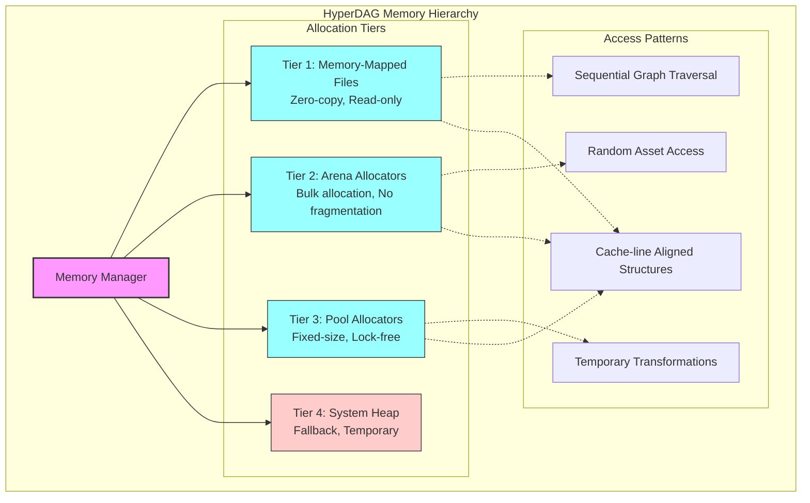
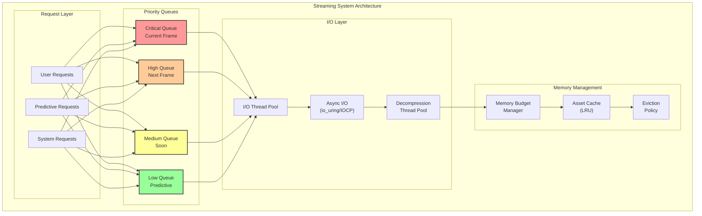
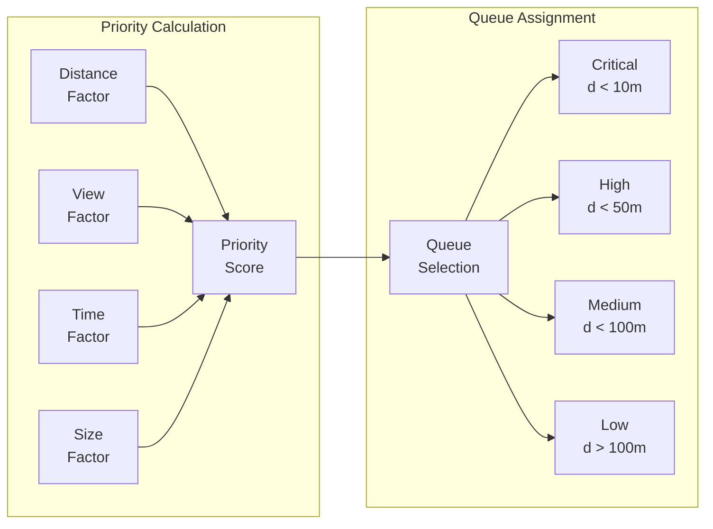
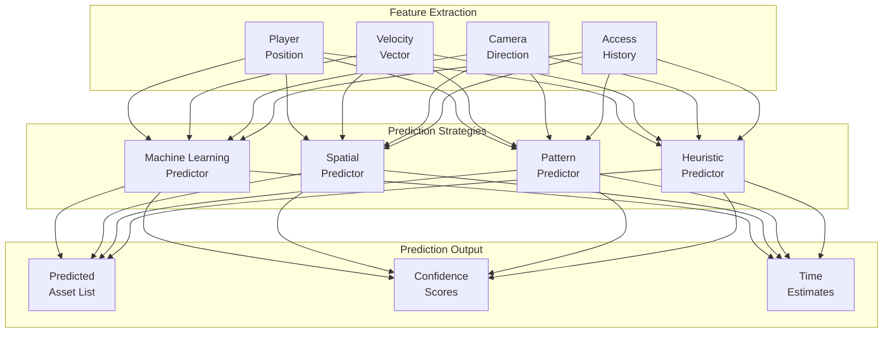
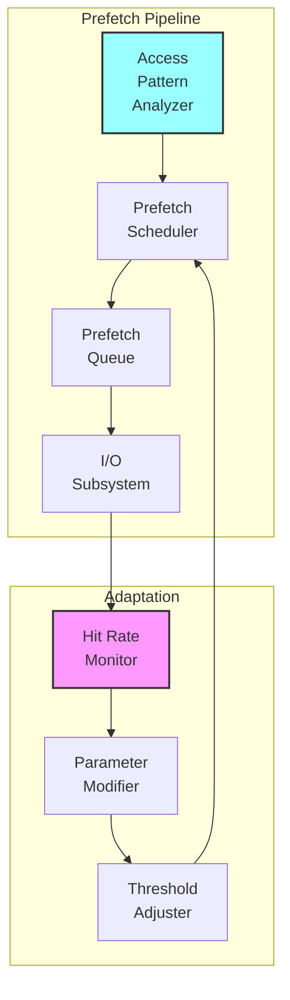
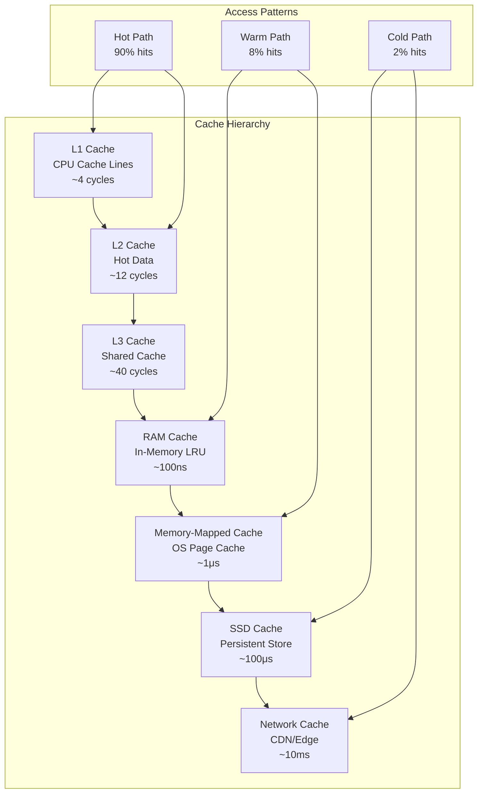
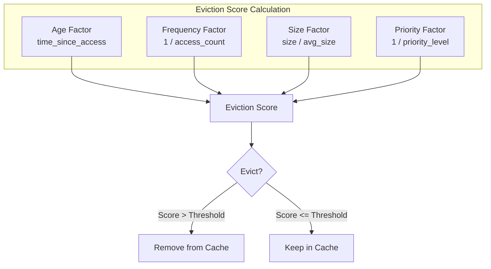
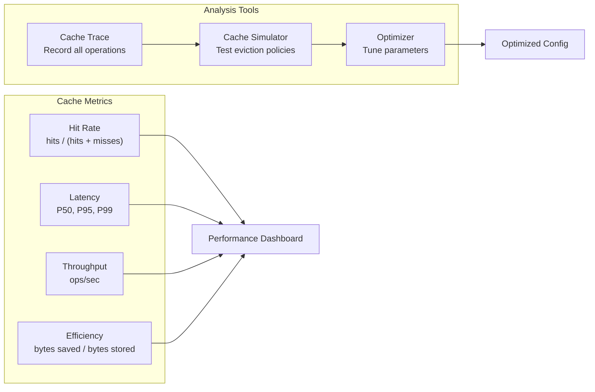

# Volume 1: Foundation & Core Systems
## Part 3: System Services

### Table of Contents
- [Chapter 7: Memory Management](#chapter-7-memory-management)
  - [Memory Architecture](#memory-architecture)
  - [Arena Allocation](#arena-allocation)
  - [Memory Mapping](#memory-mapping)
  - [Platform Optimizations](#platform-optimizations)
  - [Memory Profiling](#memory-profiling)
- [Chapter 8: Streaming & Loading](#chapter-8-streaming--loading)
  - [Streaming Architecture](#streaming-architecture)
  - [Asynchronous Loading](#asynchronous-loading)
  - [Priority Systems](#priority-systems)
  - [Bandwidth Management](#bandwidth-management)
  - [Predictive Loading](#predictive-loading)
- [Chapter 9: Caching System](#chapter-9-caching-system)
  - [Cache Architecture](#cache-architecture)
  - [Multi-Level Caching](#multi-level-caching)
  - [Eviction Policies](#eviction-policies)
  - [Cache Warming](#cache-warming)
  - [Performance Analysis](#performance-analysis)

### Overview
TurtlGraph's system services form the foundation for its exceptional performance. These three chapters explore the memory management strategies that enable zero-copy operation, the streaming architecture that handles terabyte-scale assets, and the caching system that delivers consistent sub-millisecond access times. Together, they transform the theoretical graph architecture into a production-ready powerhouse.

---

## Chapter 7: Memory Management

Memory management in TurtlGraph isn't just about allocation and deallocation—it's about creating a zero-copy, cache-friendly environment where graph traversal approaches the theoretical limits of modern hardware. This chapter explores the sophisticated memory strategies that make TurtlGraph faster than traditional asset systems.

### Memory Architecture

TurtlGraph employs a multi-tiered memory architecture optimized for different access patterns:



#### Core Memory Principles

```c
// Memory management configuration
typedef struct {
    // Arena settings
    size_t arena_initial_size;      // Starting arena size (default: 64MB)
    size_t arena_growth_factor;     // Growth multiplier (default: 2.0)
    size_t arena_max_size;          // Maximum arena size (default: 1GB)
    
    // Pool settings
    size_t pool_chunk_sizes[8];     // Common allocation sizes
    uint32_t pool_chunks_per_block; // Chunks per allocation block
    
    // Mapping settings
    bool use_huge_pages;            // 2MB/1GB pages on Linux
    bool lock_in_memory;            // Prevent swapping (mlockall)
    bool numa_aware;                // NUMA-aware allocation
    
    // Cache settings
    size_t cache_line_size;         // CPU cache line (default: 64)
    size_t prefetch_distance;       // Prefetch ahead distance
} hyperdag_memory_config;

// Global memory manager
typedef struct {
    hyperdag_memory_config config;
    arena_allocator* arenas[HYPERDAG_MAX_ARENAS];
    pool_allocator* pools[HYPERDAG_MAX_POOLS];
    memory_stats stats;
    pthread_mutex_t mutex;
} hyperdag_memory_manager;
```

### Arena Allocation

Arena allocation is HyperDAG's primary memory strategy for graph structures:

```c
// Arena allocator structure
typedef struct arena_allocator {
    void* base;                     // Base address
    size_t size;                    // Total size
    size_t used;                    // Bytes allocated
    size_t alignment;               // Default alignment
    
    // NUMA support
    int numa_node;                  // NUMA node affinity
    
    // Statistics
    uint64_t allocations;           // Total allocations
    uint64_t bytes_allocated;       // Total bytes allocated
    uint64_t peak_usage;            // Peak memory usage
    
    // Thread safety
    pthread_spinlock_t lock;        // Fast spinlock
} arena_allocator;

// Create arena with specific properties
arena_allocator* arena_create(size_t initial_size, int numa_node) {
    arena_allocator* arena = malloc(sizeof(arena_allocator));
    
    // Allocate backing memory
    if (numa_node >= 0) {
        #ifdef __linux__
        // NUMA-aware allocation
        arena->base = numa_alloc_onnode(initial_size, numa_node);
        arena->numa_node = numa_node;
        #endif
    } else {
        // Standard allocation with alignment
        if (posix_memalign(&arena->base, 2 * 1024 * 1024, initial_size) != 0) {
            free(arena);
            return NULL;
        }
    }
    
    // Use huge pages if available
    #ifdef __linux__
    if (hyperdag_config.use_huge_pages) {
        madvise(arena->base, initial_size, MADV_HUGEPAGE);
    }
    #endif
    
    arena->size = initial_size;
    arena->used = 0;
    arena->alignment = 64;  // Cache line alignment
    arena->allocations = 0;
    arena->bytes_allocated = 0;
    arena->peak_usage = 0;
    
    pthread_spin_init(&arena->lock, PTHREAD_PROCESS_PRIVATE);
    
    return arena;
}

// Fast allocation from arena
void* arena_alloc(arena_allocator* arena, size_t size, size_t alignment) {
    // Round size up to alignment
    size = (size + alignment - 1) & ~(alignment - 1);
    
    pthread_spin_lock(&arena->lock);
    
    // Check available space
    size_t aligned_used = (arena->used + alignment - 1) & ~(alignment - 1);
    if (aligned_used + size > arena->size) {
        pthread_spin_unlock(&arena->lock);
        return NULL;  // Arena full
    }
    
    // Allocate
    void* ptr = (char*)arena->base + aligned_used;
    arena->used = aligned_used + size;
    
    // Update statistics
    arena->allocations++;
    arena->bytes_allocated += size;
    if (arena->used > arena->peak_usage) {
        arena->peak_usage = arena->used;
    }
    
    pthread_spin_unlock(&arena->lock);
    
    // Prefetch for next allocation
    __builtin_prefetch((char*)ptr + size, 1, 3);
    
    return ptr;
}

// Reset arena for reuse
void arena_reset(arena_allocator* arena) {
    pthread_spin_lock(&arena->lock);
    arena->used = 0;
    // Don't clear memory - it will be overwritten
    pthread_spin_unlock(&arena->lock);
}
```

#### Arena Usage Patterns

```c
// Per-thread arena for temporary allocations
__thread arena_allocator* thread_arena = NULL;

// Initialize thread-local arena
void init_thread_arena(void) {
    if (!thread_arena) {
        int cpu = sched_getcpu();
        int numa_node = numa_node_of_cpu(cpu);
        thread_arena = arena_create(16 * 1024 * 1024, numa_node);
    }
}

// Scoped arena for graph operations
typedef struct {
    arena_allocator* arena;
    size_t saved_used;
} arena_scope;

arena_scope arena_scope_begin(arena_allocator* arena) {
    return (arena_scope){
        .arena = arena,
        .saved_used = arena->used
    };
}

void arena_scope_end(arena_scope* scope) {
    // Reset to saved position
    pthread_spin_lock(&scope->arena->lock);
    scope->arena->used = scope->saved_used;
    pthread_spin_unlock(&scope->arena->lock);
}

// Example: Build graph in arena
hyperdag_graph* build_scene_graph(arena_allocator* arena) {
    arena_scope scope = arena_scope_begin(arena);
    
    // All allocations use the arena
    hyperdag_graph* scene = arena_alloc(arena, sizeof(hyperdag_graph), 64);
    scene->nodes = arena_alloc(arena, 1024 * sizeof(node_ref), 16);
    scene->edges = arena_alloc(arena, 2048 * sizeof(edge_desc), 16);
    
    // Build scene...
    
    // On error, just end scope to free everything
    if (error_occurred) {
        arena_scope_end(&scope);
        return NULL;
    }
    
    return scene;
}
```

### Memory Mapping

Memory mapping is fundamental to HyperDAG's zero-copy architecture:

```c
// Memory-mapped bundle structure
typedef struct {
    int fd;                         // File descriptor
    void* base;                     // Mapped base address
    size_t size;                    // Mapped size
    int flags;                      // Mapping flags
    
    // Advanced mapping options
    bool populate;                  // Pre-fault pages
    bool locked;                    // Locked in memory
    bool huge_pages;                // Using huge pages
    
    // Statistics
    uint64_t page_faults;           // Page fault count
    uint64_t read_bytes;            // Bytes read from disk
} mapped_bundle;

// Advanced memory mapping with optimizations
mapped_bundle* map_bundle_advanced(const char* path) {
    mapped_bundle* bundle = calloc(1, sizeof(mapped_bundle));
    
    // Open file
    bundle->fd = open(path, O_RDONLY | O_CLOEXEC);
    if (bundle->fd < 0) {
        free(bundle);
        return NULL;
    }
    
    // Get file size
    struct stat st;
    fstat(bundle->fd, &st);
    bundle->size = st.st_size;
    
    // Determine mapping flags
    int mmap_flags = MAP_PRIVATE;
    int mmap_prot = PROT_READ;
    
    #ifdef __linux__
    // Use huge pages for large files
    if (bundle->size >= 2 * 1024 * 1024) {
        mmap_flags |= MAP_HUGETLB;
        bundle->huge_pages = true;
    }
    
    // Populate pages for better performance
    if (bundle->size <= 100 * 1024 * 1024) {
        mmap_flags |= MAP_POPULATE;
        bundle->populate = true;
    }
    #endif
    
    // Memory map the file
    bundle->base = mmap(NULL, bundle->size, mmap_prot, mmap_flags, 
                       bundle->fd, 0);
    
    if (bundle->base == MAP_FAILED) {
        // Fallback without huge pages
        if (bundle->huge_pages) {
            mmap_flags &= ~MAP_HUGETLB;
            bundle->huge_pages = false;
            bundle->base = mmap(NULL, bundle->size, mmap_prot, 
                              mmap_flags, bundle->fd, 0);
        }
        
        if (bundle->base == MAP_FAILED) {
            close(bundle->fd);
            free(bundle);
            return NULL;
        }
    }
    
    // Advise kernel about access patterns
    #ifdef __linux__
    // Sequential access for initial load
    madvise(bundle->base, bundle->size, MADV_SEQUENTIAL);
    
    // Will need these pages soon
    madvise(bundle->base, min(bundle->size, 16 * 1024 * 1024), 
            MADV_WILLNEED);
    #endif
    
    // Lock critical data in memory
    if (hyperdag_config.lock_in_memory) {
        // Lock header and chunk table
        size_t lock_size = min(bundle->size, 1024 * 1024);
        if (mlock(bundle->base, lock_size) == 0) {
            bundle->locked = true;
        }
    }
    
    return bundle;
}

// Prefetch strategies for different access patterns
void prefetch_for_traversal(mapped_bundle* bundle, size_t offset) {
    // Prefetch ahead for sequential traversal
    size_t prefetch_size = 64 * 1024;  // 64KB ahead
    size_t prefetch_offset = offset + hyperdag_config.prefetch_distance;
    
    if (prefetch_offset + prefetch_size <= bundle->size) {
        #ifdef __linux__
        madvise((char*)bundle->base + prefetch_offset, 
                prefetch_size, MADV_WILLNEED);
        #endif
        
        // Hardware prefetch for immediate data
        for (size_t i = 0; i < 1024; i += 64) {
            __builtin_prefetch((char*)bundle->base + offset + i, 0, 3);
        }
    }
}

// NUMA-aware memory access
void* get_numa_local_copy(void* data, size_t size) {
    #ifdef __linux__
    int cpu = sched_getcpu();
    int numa_node = numa_node_of_cpu(cpu);
    
    // Allocate on local NUMA node
    void* local_copy = numa_alloc_onnode(size, numa_node);
    if (local_copy) {
        memcpy(local_copy, data, size);
        return local_copy;
    }
    #endif
    
    // Fallback to regular allocation
    void* copy = aligned_alloc(64, size);
    memcpy(copy, data, size);
    return copy;
}
```

### Platform Optimizations

Different platforms require different optimization strategies:

#### Linux Optimizations

```c
#ifdef __linux__

// Transparent Huge Pages (THP) configuration
void configure_huge_pages(void) {
    // Enable THP for all allocations
    if (prctl(PR_SET_THP_DISABLE, 0, 0, 0, 0) != 0) {
        perror("Failed to enable THP");
    }
    
    // Configure THP behavior
    FILE* f = fopen("/sys/kernel/mm/transparent_hugepage/enabled", "w");
    if (f) {
        fprintf(f, "always");
        fclose(f);
    }
}

// NUMA optimization
void configure_numa(void) {
    if (numa_available() < 0) {
        return;  // NUMA not available
    }
    
    // Get NUMA topology
    int num_nodes = numa_max_node() + 1;
    printf("NUMA nodes: %d\n", num_nodes);
    
    // Set memory policy for interleaved allocation
    unsigned long nodemask = 0;
    for (int i = 0; i < num_nodes; i++) {
        nodemask |= (1UL << i);
    }
    
    // Interleave large allocations across nodes
    set_mempolicy(MPOL_INTERLEAVE, &nodemask, num_nodes);
}

// io_uring for asynchronous I/O
typedef struct {
    struct io_uring ring;
    struct io_uring_sqe* sqe;
    struct io_uring_cqe* cqe;
    int fd;
} async_io_context;

async_io_context* init_async_io(void) {
    async_io_context* ctx = malloc(sizeof(async_io_context));
    
    // Initialize io_uring with 256 entries
    if (io_uring_setup(256, &ctx->ring) < 0) {
        free(ctx);
        return NULL;
    }
    
    return ctx;
}

// Asynchronous prefetch using io_uring
void async_prefetch(async_io_context* ctx, int fd, 
                   size_t offset, size_t size) {
    // Get submission queue entry
    ctx->sqe = io_uring_get_sqe(&ctx->ring);
    
    // Prepare read operation
    io_uring_prep_read(ctx->sqe, fd, NULL, size, offset);
    ctx->sqe->flags |= IOSQE_ASYNC;
    
    // Submit
    io_uring_submit(&ctx->ring);
}

#endif  // __linux__
```

#### Windows Optimizations

```c
#ifdef _WIN32

// Windows large page support
void* alloc_large_pages_windows(size_t size) {
    // Enable large page privilege
    HANDLE token;
    TOKEN_PRIVILEGES tp;
    
    if (!OpenProcessToken(GetCurrentProcess(), 
                         TOKEN_ADJUST_PRIVILEGES, &token)) {
        return NULL;
    }
    
    tp.PrivilegeCount = 1;
    tp.Privileges[0].Attributes = SE_PRIVILEGE_ENABLED;
    
    if (!LookupPrivilegeValue(NULL, SE_LOCK_MEMORY_NAME,
                             &tp.Privileges[0].Luid)) {
        CloseHandle(token);
        return NULL;
    }
    
    AdjustTokenPrivileges(token, FALSE, &tp, 0, NULL, 0);
    CloseHandle(token);
    
    // Allocate with large pages
    SIZE_T large_page_size = GetLargePageMinimum();
    size = (size + large_page_size - 1) & ~(large_page_size - 1);
    
    return VirtualAlloc(NULL, size, 
                       MEM_COMMIT | MEM_RESERVE | MEM_LARGE_PAGES,
                       PAGE_READWRITE);
}

// Memory-mapped files with Windows API
mapped_bundle* map_bundle_windows(const wchar_t* path) {
    mapped_bundle* bundle = calloc(1, sizeof(mapped_bundle));
    
    // Open file
    HANDLE file = CreateFileW(path, GENERIC_READ, FILE_SHARE_READ,
                             NULL, OPEN_EXISTING, 
                             FILE_FLAG_SEQUENTIAL_SCAN, NULL);
    
    if (file == INVALID_HANDLE_VALUE) {
        free(bundle);
        return NULL;
    }
    
    // Get file size
    LARGE_INTEGER size;
    GetFileSizeEx(file, &size);
    bundle->size = size.QuadPart;
    
    // Create file mapping
    HANDLE mapping = CreateFileMapping(file, NULL, PAGE_READONLY,
                                      size.HighPart, size.LowPart, NULL);
    
    if (!mapping) {
        CloseHandle(file);
        free(bundle);
        return NULL;
    }
    
    // Map view of file
    bundle->base = MapViewOfFile(mapping, FILE_MAP_READ, 0, 0, 0);
    
    CloseHandle(mapping);
    CloseHandle(file);
    
    if (!bundle->base) {
        free(bundle);
        return NULL;
    }
    
    // Prefetch with Windows API
    WIN32_MEMORY_RANGE_ENTRY range = {
        .VirtualAddress = bundle->base,
        .NumberOfBytes = min(bundle->size, 16 * 1024 * 1024)
    };
    
    PrefetchVirtualMemory(GetCurrentProcess(), 1, &range, 0);
    
    return bundle;
}

#endif  // _WIN32
```

#### macOS Optimizations

```c
#ifdef __APPLE__

// macOS unified memory optimization
void configure_macos_memory(void) {
    // Enable memory compressor
    vm_pressure_level_t pressure_level = VM_PRESSURE_NORMAL;
    
    // Subscribe to memory pressure notifications
    dispatch_source_t source = dispatch_source_create(
        DISPATCH_SOURCE_TYPE_VM_PRESSURE,
        0, DISPATCH_VM_PRESSURE, dispatch_get_main_queue()
    );
    
    dispatch_source_set_event_handler(source, ^{
        // Respond to memory pressure
        vm_pressure_level_t level = dispatch_source_get_data(source);
        if (level >= VM_PRESSURE_WARNING) {
            // Free caches and non-essential memory
            purge_memory_caches();
        }
    });
    
    dispatch_resume(source);
}

// Optimized memory mapping for macOS
mapped_bundle* map_bundle_macos(const char* path) {
    mapped_bundle* bundle = calloc(1, sizeof(mapped_bundle));
    
    // Open file
    bundle->fd = open(path, O_RDONLY);
    if (bundle->fd < 0) {
        free(bundle);
        return NULL;
    }
    
    // Get file size
    struct stat st;
    fstat(bundle->fd, &st);
    bundle->size = st.st_size;
    
    // Memory map with macOS hints
    bundle->base = mmap(NULL, bundle->size, PROT_READ,
                       MAP_FILE | MAP_PRIVATE, bundle->fd, 0);
    
    if (bundle->base == MAP_FAILED) {
        close(bundle->fd);
        free(bundle);
        return NULL;
    }
    
    // macOS-specific optimizations
    // Unified memory - no copy needed between CPU/GPU
    madvise(bundle->base, bundle->size, MADV_FREE_REUSABLE);
    
    // Sequential access hint
    madvise(bundle->base, bundle->size, MADV_SEQUENTIAL);
    
    // Pre-warm file cache
    madvise(bundle->base, min(bundle->size, 32 * 1024 * 1024),
            MADV_WILLNEED);
    
    return bundle;
}

#endif  // __APPLE__
```

### Memory Profiling

Understanding memory usage is crucial for optimization:

```c
// Memory profiling infrastructure
typedef struct {
    // Allocation tracking
    atomic_uint64_t total_allocated;
    atomic_uint64_t total_freed;
    atomic_uint64_t current_usage;
    atomic_uint64_t peak_usage;
    
    // Allocation histogram
    atomic_uint64_t size_histogram[32];  // Power of 2 sizes
    
    // Arena statistics
    atomic_uint64_t arena_allocated;
    atomic_uint64_t arena_wasted;
    atomic_uint64_t arena_resets;
    
    // Page fault tracking
    atomic_uint64_t minor_faults;
    atomic_uint64_t major_faults;
    
    // Cache statistics
    atomic_uint64_t cache_hits;
    atomic_uint64_t cache_misses;
    atomic_uint64_t cache_evictions;
} memory_profile;

static memory_profile g_profile = {0};

// Instrumented allocation
void* profiled_alloc(size_t size) {
    void* ptr = malloc(size);
    if (ptr) {
        atomic_fetch_add(&g_profile.total_allocated, size);
        atomic_fetch_add(&g_profile.current_usage, size);
        
        // Update peak
        uint64_t current = atomic_load(&g_profile.current_usage);
        uint64_t peak = atomic_load(&g_profile.peak_usage);
        while (current > peak) {
            if (atomic_compare_exchange_weak(&g_profile.peak_usage, 
                                           &peak, current)) {
                break;
            }
        }
        
        // Update histogram
        int bucket = 0;
        size_t bucket_size = size;
        while (bucket_size > 1 && bucket < 31) {
            bucket_size >>= 1;
            bucket++;
        }
        atomic_fetch_add(&g_profile.size_histogram[bucket], 1);
    }
    return ptr;
}

// Memory usage report
void print_memory_profile(void) {
    printf("=== TurtlGraph Memory Profile ===\n");
    printf("Current Usage: %.2f MB\n", 
           g_profile.current_usage / (1024.0 * 1024.0));
    printf("Peak Usage: %.2f MB\n",
           g_profile.peak_usage / (1024.0 * 1024.0));
    printf("Total Allocated: %.2f GB\n",
           g_profile.total_allocated / (1024.0 * 1024.0 * 1024.0));
    
    printf("\nAllocation Size Distribution:\n");
    for (int i = 0; i < 32; i++) {
        uint64_t count = g_profile.size_histogram[i];
        if (count > 0) {
            printf("  %zu - %zu bytes: %lu allocations\n",
                   (size_t)1 << i, (size_t)1 << (i + 1), count);
        }
    }
    
    printf("\nArena Statistics:\n");
    printf("  Allocated: %.2f MB\n",
           g_profile.arena_allocated / (1024.0 * 1024.0));
    printf("  Wasted: %.2f MB (%.1f%%)\n",
           g_profile.arena_wasted / (1024.0 * 1024.0),
           100.0 * g_profile.arena_wasted / g_profile.arena_allocated);
    printf("  Resets: %lu\n", g_profile.arena_resets);
    
    printf("\nCache Performance:\n");
    uint64_t total_access = g_profile.cache_hits + g_profile.cache_misses;
    printf("  Hit Rate: %.1f%%\n",
           100.0 * g_profile.cache_hits / total_access);
    printf("  Evictions: %lu\n", g_profile.cache_evictions);
}

// Heap fragmentation analysis
typedef struct {
    size_t total_free;
    size_t largest_free;
    uint32_t free_blocks;
    double fragmentation_ratio;
} heap_stats;

heap_stats analyze_heap_fragmentation(void) {
    heap_stats stats = {0};
    
    #ifdef __linux__
    // Use mallinfo for heap statistics
    struct mallinfo mi = mallinfo();
    stats.total_free = mi.fordblks;
    stats.free_blocks = mi.ordblks;
    stats.fragmentation_ratio = 1.0 - 
        ((double)mi.uordblks / (mi.uordblks + mi.fordblks));
    #endif
    
    return stats;
}

// Memory pressure monitoring
void* memory_pressure_thread(void* arg) {
    while (1) {
        memory_stats stats = get_system_memory_stats();
        
        double memory_pressure = 1.0 - 
            ((double)stats.available / stats.total);
        
        if (memory_pressure > 0.9) {
            // Critical memory pressure
            trigger_emergency_cleanup();
        } else if (memory_pressure > 0.75) {
            // High memory pressure
            reduce_cache_sizes();
        }
        
        sleep(1);
    }
    return NULL;
}
```

### Advanced Memory Techniques

#### Lock-Free Memory Pools

```c
// Lock-free pool allocator for fixed-size allocations
typedef struct {
    _Atomic(void*) free_list;      // Lock-free free list
    void* memory_base;              // Pool memory
    size_t chunk_size;              // Size of each chunk
    size_t chunk_count;             // Number of chunks
    
    // Statistics
    atomic_uint64_t allocations;
    atomic_uint64_t deallocations;
    atomic_uint32_t active_chunks;
} lockfree_pool;

lockfree_pool* lockfree_pool_create(size_t chunk_size, size_t count) {
    lockfree_pool* pool = calloc(1, sizeof(lockfree_pool));
    
    // Align chunk size to cache line
    chunk_size = (chunk_size + 63) & ~63;
    pool->chunk_size = chunk_size;
    pool->chunk_count = count;
    
    // Allocate pool memory
    pool->memory_base = aligned_alloc(64, chunk_size * count);
    
    // Initialize free list
    void* prev = NULL;
    for (size_t i = 0; i < count; i++) {
        void* chunk = (char*)pool->memory_base + (i * chunk_size);
        *(void**)chunk = prev;
        prev = chunk;
    }
    atomic_store(&pool->free_list, prev);
    
    return pool;
}

// Lock-free allocation
void* lockfree_pool_alloc(lockfree_pool* pool) {
    void* head = atomic_load(&pool->free_list);
    
    while (head) {
        void* next = *(void**)head;
        if (atomic_compare_exchange_weak(&pool->free_list, &head, next)) {
            atomic_fetch_add(&pool->allocations, 1);
            atomic_fetch_add(&pool->active_chunks, 1);
            return head;
        }
        // CAS failed, retry with new head
    }
    
    return NULL;  // Pool exhausted
}

// Lock-free deallocation
void lockfree_pool_free(lockfree_pool* pool, void* ptr) {
    void* head = atomic_load(&pool->free_list);
    
    do {
        *(void**)ptr = head;
    } while (!atomic_compare_exchange_weak(&pool->free_list, &head, ptr));
    
    atomic_fetch_add(&pool->deallocations, 1);
    atomic_fetch_sub(&pool->active_chunks, 1);
}
```

#### Memory Bandwidth Optimization

```c
// Optimized memory copy for different sizes
void* hyperdag_memcpy_optimized(void* dst, const void* src, size_t size) {
    // Small copies - use compiler builtin
    if (size <= 64) {
        return __builtin_memcpy(dst, src, size);
    }
    
    // Medium copies - use SIMD
    if (size <= 4096) {
        #ifdef __AVX2__
        char* d = (char*)dst;
        const char* s = (const char*)src;
        
        // Copy 32-byte chunks with AVX2
        while (size >= 32) {
            __m256i data = _mm256_loadu_si256((const __m256i*)s);
            _mm256_storeu_si256((__m256i*)d, data);
            d += 32;
            s += 32;
            size -= 32;
        }
        
        // Handle remainder
        if (size > 0) {
            memcpy(d, s, size);
        }
        
        return dst;
        #endif
    }
    
    // Large copies - use non-temporal stores
    if (size >= 32768) {
        #ifdef __AVX2__
        char* d = (char*)dst;
        const char* s = (const char*)src;
        
        // Align destination for non-temporal stores
        size_t align = (64 - ((uintptr_t)d & 63)) & 63;
        if (align > 0) {
            memcpy(d, s, align);
            d += align;
            s += align;
            size -= align;
        }
        
        // Non-temporal copy
        while (size >= 64) {
            __m256i data0 = _mm256_loadu_si256((const __m256i*)s);
            __m256i data1 = _mm256_loadu_si256((const __m256i*)(s + 32));
            
            _mm256_stream_si256((__m256i*)d, data0);
            _mm256_stream_si256((__m256i*)(d + 32), data1);
            
            d += 64;
            s += 64;
            size -= 64;
        }
        
        // Ensure non-temporal stores are visible
        _mm_sfence();
        
        // Handle remainder
        if (size > 0) {
            memcpy(d, s, size);
        }
        
        return dst;
        #endif
    }
    
    // Fallback to standard memcpy
    return memcpy(dst, src, size);
}

// Parallel memory operations for large data
void parallel_memset(void* dst, int value, size_t size) {
    const size_t chunk_size = 1024 * 1024;  // 1MB chunks
    const int num_threads = get_cpu_count();
    
    if (size < chunk_size * num_threads) {
        // Too small for parallelization
        memset(dst, value, size);
        return;
    }
    
    pthread_t threads[num_threads];
    
    typedef struct {
        void* dst;
        int value;
        size_t size;
    } memset_args;
    
    memset_args args[num_threads];
    
    // Divide work among threads
    size_t per_thread = size / num_threads;
    char* base = (char*)dst;
    
    for (int i = 0; i < num_threads; i++) {
        args[i].dst = base + (i * per_thread);
        args[i].value = value;
        args[i].size = (i == num_threads - 1) ? 
                       size - (i * per_thread) : per_thread;
        
        pthread_create(&threads[i], NULL, 
                      (void*(*)(void*))memset_worker, &args[i]);
    }
    
    // Wait for completion
    for (int i = 0; i < num_threads; i++) {
        pthread_join(threads[i], NULL);
    }
}
```

### Memory Debugging

```c
#ifdef HYPERDAG_DEBUG_MEMORY

// Memory guard for buffer overflow detection
typedef struct {
    uint32_t magic_front;           // Magic number before data
    size_t size;                    // Allocation size
    void* stack_trace[8];           // Allocation stack trace
    uint32_t magic_back;            // Magic number after data
} memory_guard;

#define MAGIC_FRONT 0xDEADBEEF
#define MAGIC_BACK  0xCAFEBABE

void* debug_malloc(size_t size) {
    // Allocate with guards
    size_t total = sizeof(memory_guard) + size + sizeof(uint32_t);
    memory_guard* guard = malloc(total);
    
    if (!guard) return NULL;
    
    // Set up guards
    guard->magic_front = MAGIC_FRONT;
    guard->size = size;
    
    // Capture stack trace
    int frames = backtrace(guard->stack_trace, 8);
    
    // Set back guard
    uint32_t* back_guard = (uint32_t*)((char*)(guard + 1) + size);
    *back_guard = MAGIC_BACK;
    
    // Return user pointer
    return guard + 1;
}

void debug_free(void* ptr) {
    if (!ptr) return;
    
    memory_guard* guard = ((memory_guard*)ptr) - 1;
    
    // Check front guard
    if (guard->magic_front != MAGIC_FRONT) {
        fprintf(stderr, "Memory corruption: front guard damaged\n");
        print_stack_trace(guard->stack_trace, 8);
        abort();
    }
    
    // Check back guard
    uint32_t* back_guard = (uint32_t*)((char*)(guard + 1) + guard->size);
    if (*back_guard != MAGIC_BACK) {
        fprintf(stderr, "Memory corruption: back guard damaged\n");
        print_stack_trace(guard->stack_trace, 8);
        abort();
    }
    
    // Clear and free
    memset(guard, 0xDD, sizeof(memory_guard) + guard->size + sizeof(uint32_t));
    free(guard);
}

// Memory leak tracking
typedef struct leak_entry {
    void* ptr;
    size_t size;
    void* stack_trace[8];
    struct leak_entry* next;
} leak_entry;

static leak_entry* leak_list = NULL;
static pthread_mutex_t leak_mutex = PTHREAD_MUTEX_INITIALIZER;

void track_allocation(void* ptr, size_t size) {
    leak_entry* entry = malloc(sizeof(leak_entry));
    entry->ptr = ptr;
    entry->size = size;
    backtrace(entry->stack_trace, 8);
    
    pthread_mutex_lock(&leak_mutex);
    entry->next = leak_list;
    leak_list = entry;
    pthread_mutex_unlock(&leak_mutex);
}

void untrack_allocation(void* ptr) {
    pthread_mutex_lock(&leak_mutex);
    
    leak_entry** current = &leak_list;
    while (*current) {
        if ((*current)->ptr == ptr) {
            leak_entry* to_free = *current;
            *current = (*current)->next;
            free(to_free);
            break;
        }
        current = &(*current)->next;
    }
    
    pthread_mutex_unlock(&leak_mutex);
}

void report_memory_leaks(void) {
    pthread_mutex_lock(&leak_mutex);
    
    if (leak_list) {
        printf("=== Memory Leak Report ===\n");
        
        leak_entry* entry = leak_list;
        size_t total_leaked = 0;
        int leak_count = 0;
        
        while (entry) {
            printf("\nLeak #%d: %zu bytes at %p\n", 
                   ++leak_count, entry->size, entry->ptr);
            print_stack_trace(entry->stack_trace, 8);
            
            total_leaked += entry->size;
            entry = entry->next;
        }
        
        printf("\nTotal leaked: %zu bytes in %d allocations\n",
               total_leaked, leak_count);
    }
    
    pthread_mutex_unlock(&leak_mutex);
}

#endif  // HYPERDAG_DEBUG_MEMORY
```

### Performance Benchmarks

Real-world memory performance measurements:

```c
// Memory benchmark suite
typedef struct {
    const char* name;
    void (*benchmark)(size_t size, int iterations);
    size_t sizes[5];
} memory_benchmark;

void benchmark_sequential_read(size_t size, int iterations) {
    void* buffer = aligned_alloc(64, size);
    memset(buffer, 0x42, size);
    
    uint64_t start = get_time_ns();
    
    for (int i = 0; i < iterations; i++) {
        uint64_t sum = 0;
        uint64_t* ptr = (uint64_t*)buffer;
        size_t count = size / sizeof(uint64_t);
        
        for (size_t j = 0; j < count; j++) {
            sum += ptr[j];
        }
        
        // Prevent optimization
        asm volatile("" : : "r"(sum));
    }
    
    uint64_t elapsed = get_time_ns() - start;
    double bandwidth = (double)(size * iterations) / elapsed;
    
    printf("Sequential Read: %.2f GB/s\n", bandwidth);
    free(buffer);
}

void benchmark_random_access(size_t size, int iterations) {
    void* buffer = aligned_alloc(64, size);
    size_t count = size / sizeof(uint64_t);
    
    // Create random access pattern
    size_t* indices = malloc(count * sizeof(size_t));
    for (size_t i = 0; i < count; i++) {
        indices[i] = i;
    }
    shuffle_array(indices, count);
    
    uint64_t start = get_time_ns();
    
    for (int i = 0; i < iterations; i++) {
        uint64_t sum = 0;
        uint64_t* ptr = (uint64_t*)buffer;
        
        for (size_t j = 0; j < count; j++) {
            sum += ptr[indices[j]];
        }
        
        asm volatile("" : : "r"(sum));
    }
    
    uint64_t elapsed = get_time_ns() - start;
    double latency = (double)elapsed / (iterations * count);
    
    printf("Random Access: %.1f ns/access\n", latency);
    
    free(indices);
    free(buffer);
}

void run_memory_benchmarks(void) {
    memory_benchmark benchmarks[] = {
        {
            .name = "Sequential Read Bandwidth",
            .benchmark = benchmark_sequential_read,
            .sizes = {1<<20, 16<<20, 128<<20, 512<<20, 1<<30}
        },
        {
            .name = "Random Access Latency",
            .benchmark = benchmark_random_access,
            .sizes = {1<<16, 1<<20, 16<<20, 128<<20, 512<<20}
        },
        // ... more benchmarks
    };
    
    printf("=== TurtlGraph Memory Benchmarks ===\n");
    printf("CPU: %s\n", get_cpu_name());
    printf("RAM: %zu GB\n", get_total_ram() >> 30);
    printf("Cache: L1=%zu KB, L2=%zu KB, L3=%zu MB\n",
           get_cache_size(1) >> 10,
           get_cache_size(2) >> 10,
           get_cache_size(3) >> 20);
    
    for (int i = 0; i < sizeof(benchmarks)/sizeof(benchmarks[0]); i++) {
        printf("\n%s:\n", benchmarks[i].name);
        
        for (int j = 0; j < 5; j++) {
            size_t size = benchmarks[i].sizes[j];
            printf("  %zu MB: ", size >> 20);
            benchmarks[i].benchmark(size, 100);
        }
    }
}
```

### Summary

TurtlGraph's memory management system achieves exceptional performance through:

1. **Zero-copy architecture** via memory mapping
2. **Arena allocation** eliminating fragmentation
3. **NUMA-aware** allocation for multi-socket systems
4. **Platform-specific** optimizations for each OS
5. **Lock-free pools** for high-contention scenarios
6. **Comprehensive profiling** for optimization

These techniques combine to deliver memory performance that matches or exceeds specialized game engines while maintaining the flexibility of a general-purpose asset system. The next chapter explores how this memory foundation enables efficient streaming and loading of massive asset libraries.

---

### Cross-References
- See [Chapter 4: Data Structures](../volume-1-foundation/part-2-data-runtime.md#chapter-4-data-structures) for memory layout
- See [Chapter 8: Streaming & Loading](#chapter-8-streaming--loading) for async operations
- See [Chapter 11: Platform Abstraction Layer](../volume-1-foundation/part-4-platform-security.md#chapter-11-platform-abstraction-layer) for platform details
- See [Chapter 15: Performance Optimization](../volume-3-advanced-future/part-8-performance-optimization.md#chapter-15-performance-optimization) for benchmarks

### Navigation
[← Part 2: Data & Runtime](../volume-1-foundation/part-2-data-runtime.md) | [Table of Contents](#table-of-contents) | [Next: Chapter 8 →](#chapter-8-streaming--loading)

---

## Chapter 8: Streaming & Loading

TurtlGraph's streaming system enables efficient loading of massive worlds and assets on-demand, with predictive prefetching and memory-aware resource management. This chapter explores the sophisticated architecture that enables seamless experiences even with terabyte-scale asset libraries.

### Streaming Architecture

The streaming system is designed to handle the competing demands of modern games: massive open worlds, instant loading times, and limited memory budgets.



#### Core Streaming Context

```c
// Streaming priority levels
typedef enum {
    HYPERDAG_PRIORITY_CRITICAL = 0,  // Required for current frame
    HYPERDAG_PRIORITY_HIGH = 1,      // Required for next frame
    HYPERDAG_PRIORITY_MEDIUM = 2,    // Required soon
    HYPERDAG_PRIORITY_LOW = 3,       // Background/predictive
    HYPERDAG_PRIORITY_COUNT = 4
} hyperdag_streaming_priority;

// Streaming request
typedef struct {
    uint64_t asset_id;
    hyperdag_streaming_priority priority;
    uint64_t request_time;
    uint32_t estimated_size;
    float distance_factor;       // For LOD-based streaming
    void* user_data;
    hyperdag_stream_callback callback;
} hyperdag_stream_request;

// Streaming context
typedef struct {
    priority_queue* request_queues[HYPERDAG_PRIORITY_COUNT];
    thread_pool* io_pool;
    thread_pool* decompression_pool;
    memory_pool* streaming_pool;
    
    // Memory management
    size_t max_memory_budget;
    atomic_size_t current_memory_usage;
    lru_cache* asset_cache;
    
    // I/O management
    uint32_t max_concurrent_reads;
    atomic_uint32_t active_reads;
    queue* completion_queue;
    
    // Statistics
    atomic_uint64_t bytes_streamed;
    atomic_uint64_t requests_completed;
    atomic_uint64_t cache_hits;
    atomic_uint64_t cache_misses;
} hyperdag_streaming_context;

// Initialize streaming system
hyperdag_streaming_context* hyperdag_streaming_init(
    const hyperdag_streaming_config* config
) {
    hyperdag_streaming_context* ctx = calloc(1, sizeof(hyperdag_streaming_context));
    
    // Initialize priority queues
    for (int i = 0; i < HYPERDAG_PRIORITY_COUNT; i++) {
        ctx->request_queues[i] = priority_queue_create(
            hyperdag_compare_requests, 1024);
    }
    
    // Initialize thread pools
    ctx->io_pool = thread_pool_create(config->io_thread_count);
    ctx->decompression_pool = thread_pool_create(config->decompression_thread_count);
    
    // Initialize memory management
    ctx->max_memory_budget = config->memory_budget;
    ctx->asset_cache = lru_cache_create(config->cache_size);
    
    // Start worker threads
    for (int i = 0; i < config->io_thread_count; i++) {
        thread_pool_submit(ctx->io_pool, streaming_worker, ctx);
    }
    
    return ctx;
}
```

### Asynchronous Loading

The streaming system leverages platform-specific async I/O for maximum performance:

#### Platform-Specific I/O Implementations

```c
#ifdef __linux__
// Linux io_uring implementation
typedef struct {
    struct io_uring ring;
    struct io_uring_sqe* sqe_pool;
    struct io_uring_cqe* cqe_pool;
    uint32_t queue_depth;
    
    // Request tracking
    hashtable* active_requests;  // sqe -> request mapping
    atomic_uint32_t active_count;
} hyperdag_uring_context;

// Initialize io_uring for streaming
hyperdag_result hyperdag_uring_init(
    hyperdag_uring_context* context,
    uint32_t queue_depth
) {
    context->queue_depth = queue_depth;
    
    // Initialize io_uring with specified queue depth
    int ret = io_uring_queue_init(queue_depth, &context->ring, 0);
    if (ret < 0) {
        return HYPERDAG_ERROR_IO_INIT;
    }
    
    // Allocate tracking structures
    context->active_requests = hashtable_create(queue_depth * 2, 
                                               hash_ptr, compare_ptr);
    atomic_init(&context->active_count, 0);
    
    return HYPERDAG_SUCCESS;
}

// Submit async read request
hyperdag_result hyperdag_uring_read_async(
    hyperdag_uring_context* context,
    const hyperdag_stream_request* request,
    int fd,
    void* buffer,
    size_t size,
    off_t offset
) {
    // Get submission queue entry
    struct io_uring_sqe* sqe = io_uring_get_sqe(&context->ring);
    if (!sqe) {
        return HYPERDAG_ERROR_QUEUE_FULL;
    }
    
    // Prepare read operation
    io_uring_prep_read(sqe, fd, buffer, size, offset);
    io_uring_sqe_set_data(sqe, (void*)request);
    
    // Track request
    hashtable_insert(context->active_requests, sqe, (void*)request);
    atomic_fetch_add(&context->active_count, 1);
    
    // Submit to kernel
    int submitted = io_uring_submit(&context->ring);
    if (submitted < 0) {
        hashtable_remove(context->active_requests, sqe);
        atomic_fetch_sub(&context->active_count, 1);
        return HYPERDAG_ERROR_IO_SUBMIT;
    }
    
    return HYPERDAG_SUCCESS;
}

// Process completed I/O operations
uint32_t hyperdag_uring_process_completions(
    hyperdag_uring_context* context,
    hyperdag_streaming_context* streaming
) {
    struct io_uring_cqe* cqe;
    uint32_t completed = 0;
    
    // Process all available completions
    while (io_uring_peek_cqe(&context->ring, &cqe) == 0) {
        hyperdag_stream_request* request = io_uring_cqe_get_data(cqe);
        
        if (cqe->res >= 0) {
            // Success - process the loaded asset
            hyperdag_process_loaded_asset(streaming, request, cqe->res);
        } else {
            // Error - handle failure
            hyperdag_handle_stream_error(streaming, request, cqe->res);
        }
        
        // Clean up tracking
        hashtable_remove(context->active_requests, cqe);
        atomic_fetch_sub(&context->active_count, 1);
        
        // Mark completion as seen
        io_uring_cqe_seen(&context->ring, cqe);
        completed++;
    }
    
    return completed;
}
#endif // __linux__

#ifdef _WIN32
// Windows IOCP implementation
typedef struct {
    HANDLE completion_port;
    OVERLAPPED* overlapped_pool;
    uint32_t pool_size;
    atomic_uint32_t pool_index;
} hyperdag_iocp_context;

hyperdag_result hyperdag_iocp_init(
    hyperdag_iocp_context* context,
    uint32_t thread_count
) {
    // Create I/O completion port
    context->completion_port = CreateIoCompletionPort(
        INVALID_HANDLE_VALUE, NULL, 0, thread_count);
    
    if (!context->completion_port) {
        return HYPERDAG_ERROR_IO_INIT;
    }
    
    // Allocate OVERLAPPED pool
    context->pool_size = thread_count * 64;
    context->overlapped_pool = calloc(context->pool_size, 
                                     sizeof(OVERLAPPED));
    
    return HYPERDAG_SUCCESS;
}

// Submit async read on Windows
hyperdag_result hyperdag_iocp_read_async(
    hyperdag_iocp_context* context,
    const hyperdag_stream_request* request,
    HANDLE file,
    void* buffer,
    DWORD size,
    LARGE_INTEGER offset
) {
    // Get OVERLAPPED structure from pool
    uint32_t index = atomic_fetch_add(&context->pool_index, 1) 
                    % context->pool_size;
    OVERLAPPED* overlapped = &context->overlapped_pool[index];
    
    // Initialize OVERLAPPED
    memset(overlapped, 0, sizeof(OVERLAPPED));
    overlapped->Offset = offset.LowPart;
    overlapped->OffsetHigh = offset.HighPart;
    overlapped->hEvent = (HANDLE)request;  // Store request pointer
    
    // Start async read
    if (!ReadFile(file, buffer, size, NULL, overlapped)) {
        DWORD error = GetLastError();
        if (error != ERROR_IO_PENDING) {
            return HYPERDAG_ERROR_IO_READ;
        }
    }
    
    return HYPERDAG_SUCCESS;
}
#endif // _WIN32

// Cross-platform async I/O abstraction
typedef struct {
#ifdef __linux__
    hyperdag_uring_context uring;
#elif defined(_WIN32)
    hyperdag_iocp_context iocp;
#elif defined(__APPLE__)
    dispatch_queue_t io_queue;
    dispatch_source_t* source_pool;
#endif
    
    thread_pool* callback_pool;
    atomic_uint32_t active_operations;
} hyperdag_async_io_context;
```

### Priority Systems

The streaming system uses sophisticated priority management to ensure critical assets load first:



```c
// Dynamic priority calculation
typedef struct {
    float distance_weight;      // Weight for distance from player
    float view_weight;         // Weight for view direction
    float size_weight;         // Weight for asset size
    float time_weight;         // Weight for time since request
    float lod_weight;          // Weight for LOD importance
} hyperdag_priority_weights;

// Calculate dynamic priority
float hyperdag_calculate_priority(
    const hyperdag_stream_request* request,
    const hyperdag_player_state* player,
    const hyperdag_priority_weights* weights
) {
    float priority = 0.0f;
    
    // Distance factor (inverse - closer is higher priority)
    float distance = calculate_distance(request->asset_position, 
                                      player->position);
    float distance_factor = 1.0f / (distance + 1.0f);
    priority += weights->distance_weight * distance_factor;
    
    // View factor (assets in view cone get priority)
    float view_dot = dot_product(player->view_direction,
                                normalize(request->asset_position - 
                                        player->position));
    float view_factor = max(0.0f, view_dot);
    priority += weights->view_weight * view_factor;
    
    // Size factor (smaller assets load faster)
    float size_factor = 1.0f / (request->estimated_size / 1024.0f / 1024.0f + 1.0f);
    priority += weights->size_weight * size_factor;
    
    // Time factor (older requests get priority boost)
    uint64_t wait_time = get_time_ms() - request->request_time;
    float time_factor = min(1.0f, wait_time / 5000.0f);  // Max at 5 seconds
    priority += weights->time_weight * time_factor;
    
    // LOD factor
    priority += weights->lod_weight * request->lod_importance;
    
    return priority;
}

// Priority queue management
void hyperdag_update_priorities(
    hyperdag_streaming_context* ctx,
    const hyperdag_player_state* player
) {
    // Recalculate priorities for all queued requests
    for (int i = 0; i < HYPERDAG_PRIORITY_COUNT; i++) {
        priority_queue* queue = ctx->request_queues[i];
        
        // Extract all items
        dynamic_array* items = priority_queue_extract_all(queue);
        
        // Recalculate priorities and reinsert
        for (size_t j = 0; j < items->count; j++) {
            hyperdag_stream_request* request = array_get(items, j);
            request->dynamic_priority = hyperdag_calculate_priority(
                request, player, &ctx->priority_weights);
            
            // Check if should move to different queue
            hyperdag_streaming_priority new_priority = 
                hyperdag_get_queue_for_distance(request->distance_factor);
            
            if (new_priority != i) {
                // Move to appropriate queue
                priority_queue_insert(ctx->request_queues[new_priority], 
                                    request);
            } else {
                // Reinsert in same queue with new priority
                priority_queue_insert(queue, request);
            }
        }
        
        array_destroy(items);
    }
}
```

### Bandwidth Management

Intelligent bandwidth allocation ensures smooth streaming without stuttering:

```c
// Bandwidth allocation and monitoring
typedef struct {
    size_t max_bandwidth_bytes_per_sec;
    size_t current_bandwidth_usage;
    uint64_t measurement_start_time;
    size_t bytes_since_measurement;
    
    // Per-priority bandwidth allocation
    float priority_bandwidth_share[HYPERDAG_PRIORITY_COUNT];
    size_t priority_bandwidth_used[HYPERDAG_PRIORITY_COUNT];
    
    // Adaptive throttling
    bool adaptive_throttling;
    float target_frame_time_ms;
    float current_frame_time_ms;
} hyperdag_bandwidth_manager;

// Allocate bandwidth to request
bool hyperdag_allocate_bandwidth(
    hyperdag_bandwidth_manager* bw,
    const hyperdag_stream_request* request,
    size_t requested_bytes
) {
    // Update measurement window
    uint64_t now = get_time_ns();
    uint64_t elapsed_ns = now - bw->measurement_start_time;
    
    if (elapsed_ns >= 1000000000) {  // 1 second window
        // Reset measurement
        bw->current_bandwidth_usage = bw->bytes_since_measurement;
        bw->bytes_since_measurement = 0;
        bw->measurement_start_time = now;
        
        // Reset per-priority usage
        memset(bw->priority_bandwidth_used, 0, 
               sizeof(bw->priority_bandwidth_used));
    }
    
    // Check if bandwidth available
    size_t priority_limit = bw->max_bandwidth_bytes_per_sec * 
                           bw->priority_bandwidth_share[request->priority];
    
    if (bw->priority_bandwidth_used[request->priority] + requested_bytes 
        > priority_limit) {
        // Check if can borrow from lower priorities
        for (int i = request->priority + 1; i < HYPERDAG_PRIORITY_COUNT; i++) {
            size_t available = (bw->max_bandwidth_bytes_per_sec * 
                              bw->priority_bandwidth_share[i]) -
                              bw->priority_bandwidth_used[i];
            if (available >= requested_bytes) {
                // Borrow bandwidth
                bw->priority_bandwidth_used[i] += requested_bytes;
                return true;
            }
        }
        return false;  // No bandwidth available
    }
    
    // Allocate bandwidth
    bw->priority_bandwidth_used[request->priority] += requested_bytes;
    bw->bytes_since_measurement += requested_bytes;
    
    return true;
}

// Adaptive bandwidth throttling based on frame time
void hyperdag_adapt_bandwidth(hyperdag_bandwidth_manager* bw) {
    if (!bw->adaptive_throttling) return;
    
    float frame_ratio = bw->current_frame_time_ms / bw->target_frame_time_ms;
    
    if (frame_ratio > 1.1f) {
        // Frame time too high - reduce bandwidth
        bw->max_bandwidth_bytes_per_sec *= 0.9f;
    } else if (frame_ratio < 0.9f && bw->current_bandwidth_usage > 
               bw->max_bandwidth_bytes_per_sec * 0.8f) {
        // Frame time good and using most bandwidth - can increase
        bw->max_bandwidth_bytes_per_sec *= 1.1f;
    }
    
    // Clamp to reasonable limits
    size_t min_bandwidth = 10 * 1024 * 1024;    // 10 MB/s minimum
    size_t max_bandwidth = 1024 * 1024 * 1024;  // 1 GB/s maximum
    bw->max_bandwidth_bytes_per_sec = clamp(bw->max_bandwidth_bytes_per_sec,
                                           min_bandwidth, max_bandwidth);
}
```

### Predictive Loading

The streaming system uses multiple strategies to predict and preload assets:



#### Machine Learning Prediction

```c
// ML-based prediction system
typedef struct {
    neural_network* prediction_model;
    feature_extractor* feature_engine;
    prediction_cache* recent_predictions;
    
    // Model parameters
    uint32_t input_features;
    uint32_t hidden_layers;
    uint32_t output_assets;
    float learning_rate;
} hyperdag_ml_predictor;

// Feature vector for ML prediction
typedef struct {
    // Spatial features
    float position[3];
    float velocity[3];
    float acceleration[3];
    float view_direction[3];
    float view_angular_velocity[3];
    
    // Temporal features
    float time_of_day;
    float time_in_area;
    float time_since_load;
    
    // Historical features
    float recent_assets[32];    // One-hot encoded recent accesses
    float access_frequency[16]; // Access frequency buckets
    
    // Context features
    float player_state;         // Encoded game state
    float area_type;           // Encoded area classification
    float activity_level;      // Player activity metric
} hyperdag_ml_features;

// Run ML prediction
void hyperdag_ml_predict(
    hyperdag_ml_predictor* predictor,
    const hyperdag_game_state* state,
    hyperdag_prediction_result* results,
    uint32_t max_results
) {
    // Extract features
    hyperdag_ml_features features;
    extract_ml_features(predictor->feature_engine, state, &features);
    
    // Normalize features
    float normalized[256];
    normalize_features(&features, normalized, predictor->input_features);
    
    // Run inference
    float* predictions = neural_network_forward(predictor->prediction_model,
                                               normalized);
    
    // Convert outputs to asset predictions
    uint32_t result_count = 0;
    for (uint32_t i = 0; i < predictor->output_assets && 
         result_count < max_results; i++) {
        if (predictions[i] > 0.7f) {  // Confidence threshold
            results[result_count].asset_id = 
                decode_asset_id(i, predictor->asset_mapping);
            results[result_count].confidence = predictions[i];
            results[result_count].predicted_time = 
                predictions[predictor->output_assets + i] * 10000;  // ms
            result_count++;
        }
    }
    
    // Cache predictions for feedback learning
    cache_predictions(predictor->recent_predictions, results, result_count);
}

// Online learning from prediction feedback
void hyperdag_ml_update(
    hyperdag_ml_predictor* predictor,
    const hyperdag_prediction_feedback* feedback
) {
    // Get cached prediction
    hyperdag_prediction_result* prediction = 
        get_cached_prediction(predictor->recent_predictions, 
                            feedback->prediction_id);
    
    if (!prediction) return;
    
    // Calculate error
    float error = feedback->was_used ? 
                  (1.0f - prediction->confidence) :    // False negative
                  prediction->confidence;               // False positive
    
    // Backpropagate error
    neural_network_backward(predictor->prediction_model,
                           &error, 1, predictor->learning_rate);
}
```

#### Spatial Prediction

```c
// Spatial prediction for open worlds
typedef struct {
    spatial_index* world_index;     // Spatial index of all assets
    movement_predictor* movement;   // Player movement prediction
    visibility_calculator* vis;     // Visibility calculations
    
    float prediction_radius;
    float prediction_time;
    uint32_t max_predictions;
} hyperdag_spatial_predictor;

// Predict based on movement
void hyperdag_spatial_predict(
    hyperdag_spatial_predictor* predictor,
    const hyperdag_player_state* player,
    hyperdag_streaming_context* streaming
) {
    // Predict future position
    vec3 predicted_pos;
    predict_position(predictor->movement, player, 
                    predictor->prediction_time, predicted_pos);
    
    // Query spatial index for nearby assets
    spatial_query query = {
        .center = predicted_pos,
        .radius = predictor->prediction_radius,
        .max_results = predictor->max_predictions * 2
    };
    
    asset_list* nearby = spatial_query_assets(predictor->world_index, &query);
    
    // Score each asset
    typedef struct {
        uint64_t asset_id;
        float score;
    } scored_asset;
    
    scored_asset* scores = alloca(sizeof(scored_asset) * nearby->count);
    
    for (uint32_t i = 0; i < nearby->count; i++) {
        asset_info* asset = &nearby->assets[i];
        
        // Skip if already loaded
        if (asset_is_loaded(streaming, asset->id)) continue;
        
        // Calculate score based on:
        // - Distance from predicted position
        // - Visibility from predicted position
        // - Asset importance/size
        // - Direction of movement
        
        float distance = vec3_distance(predicted_pos, asset->position);
        float visibility = calculate_visibility(predictor->vis, 
                                              predicted_pos, 
                                              player->view_direction,
                                              asset->position);
        
        float direction_dot = vec3_dot(
            vec3_normalize(asset->position - player->position),
            vec3_normalize(player->velocity)
        );
        
        scores[i].asset_id = asset->id;
        scores[i].score = (1.0f / (distance + 1.0f)) * 
                         visibility * 
                         asset->importance *
                         max(0.5f, direction_dot + 0.5f);
    }
    
    // Sort by score and submit top predictions
    qsort(scores, nearby->count, sizeof(scored_asset), compare_scores);
    
    for (uint32_t i = 0; i < min(predictor->max_predictions, nearby->count); i++) {
        if (scores[i].score > 0.1f) {  // Minimum score threshold
            hyperdag_stream_request request = {
                .asset_id = scores[i].asset_id,
                .priority = HYPERDAG_PRIORITY_LOW,
                .distance_factor = scores[i].score,
                .callback = NULL  // Predictive loads are fire-and-forget
            };
            
            submit_stream_request(streaming, &request);
        }
    }
    
    free_asset_list(nearby);
}
```

#### Pattern-Based Prediction

```c
// Access pattern learning and prediction
typedef struct {
    pattern_tree* learned_patterns;
    circular_buffer* access_history;
    hash_table* pattern_cache;
    
    uint32_t min_pattern_length;
    uint32_t max_pattern_length;
    float min_confidence;
    uint32_t pattern_memory;
} hyperdag_pattern_predictor;

// Pattern matching using suffix tree
void hyperdag_pattern_predict(
    hyperdag_pattern_predictor* predictor,
    uint64_t current_asset,
    hyperdag_streaming_context* streaming
) {
    // Add to history
    circular_buffer_push(predictor->access_history, &current_asset);
    
    // Get recent history
    uint64_t* history = circular_buffer_get_array(predictor->access_history);
    size_t history_len = circular_buffer_size(predictor->access_history);
    
    // Look for matching patterns
    for (uint32_t len = predictor->min_pattern_length; 
         len <= predictor->max_pattern_length && len < history_len; 
         len++) {
        // Extract pattern
        uint64_t* pattern = &history[history_len - len];
        
        // Search in pattern tree
        pattern_node* node = pattern_tree_find(predictor->learned_patterns,
                                              pattern, len);
        
        if (node && node->confidence >= predictor->min_confidence) {
            // Found matching pattern - predict next assets
            for (uint32_t i = 0; i < node->prediction_count; i++) {
                pattern_prediction* pred = &node->predictions[i];
                
                if (!asset_is_loaded(streaming, pred->asset_id)) {
                    hyperdag_stream_request request = {
                        .asset_id = pred->asset_id,
                        .priority = HYPERDAG_PRIORITY_LOW,
                        .distance_factor = pred->confidence,
                        .estimated_size = get_asset_size(pred->asset_id)
                    };
                    
                    submit_stream_request(streaming, &request);
                }
            }
        }
    }
    
    // Learn new patterns
    if (history_len >= predictor->max_pattern_length * 2) {
        learn_patterns_from_history(predictor);
    }
}

// Learn patterns from access history
void learn_patterns_from_history(hyperdag_pattern_predictor* predictor) {
    uint64_t* history = circular_buffer_get_array(predictor->access_history);
    size_t history_len = circular_buffer_size(predictor->access_history);
    
    // Sliding window pattern extraction
    for (size_t i = 0; i < history_len - predictor->max_pattern_length; i++) {
        for (uint32_t len = predictor->min_pattern_length; 
             len <= predictor->max_pattern_length; 
             len++) {
            // Extract pattern and following asset
            uint64_t* pattern = &history[i];
            uint64_t next_asset = history[i + len];
            
            // Update pattern tree
            pattern_node* node = pattern_tree_insert(predictor->learned_patterns,
                                                    pattern, len);
            
            // Update predictions
            bool found = false;
            for (uint32_t j = 0; j < node->prediction_count; j++) {
                if (node->predictions[j].asset_id == next_asset) {
                    node->predictions[j].confidence *= 0.9f;
                    node->predictions[j].confidence += 0.1f;
                    found = true;
                    break;
                }
            }
            
            if (!found && node->prediction_count < MAX_PREDICTIONS) {
                node->predictions[node->prediction_count].asset_id = next_asset;
                node->predictions[node->prediction_count].confidence = 0.1f;
                node->prediction_count++;
            }
            
            // Update node confidence
            node->confidence = calculate_pattern_confidence(node);
        }
    }
}
```

### Memory Budget Management

Intelligent memory management ensures the streaming system stays within budget:

```c
// Memory budget configuration
typedef struct {
    size_t total_budget;         // Total memory budget
    size_t critical_reserve;     // Reserved for critical assets
    size_t texture_budget;       // Budget for textures
    size_t mesh_budget;          // Budget for meshes
    size_t audio_budget;         // Budget for audio
    size_t other_budget;         // Budget for other assets
    
    // Eviction policy weights
    float lru_weight;            // Weight for least recently used
    float size_weight;           // Weight for asset size
    float priority_weight;       // Weight for asset priority
    float distance_weight;       // Weight for distance from player
} hyperdag_memory_budget;

// Memory pressure levels
typedef enum {
    MEMORY_PRESSURE_NONE,      // < 70% usage
    MEMORY_PRESSURE_LOW,       // 70-85% usage
    MEMORY_PRESSURE_MEDIUM,    // 85-95% usage
    MEMORY_PRESSURE_HIGH       // > 95% usage
} memory_pressure_level;

// Intelligent eviction system
typedef struct {
    hyperdag_memory_budget budget;
    memory_pressure_level pressure;
    eviction_statistics stats;
    
    // Eviction scoring
    float (*score_function)(const cached_asset*, void*);
    void* score_context;
} hyperdag_eviction_system;

// Calculate eviction score
float calculate_eviction_score(
    const cached_asset* asset,
    const hyperdag_eviction_system* eviction,
    const hyperdag_player_state* player
) {
    float score = 0.0f;
    
    // LRU component
    uint64_t age = get_time_ms() - asset->last_access_time;
    float lru_score = (float)age / (60.0f * 1000.0f);  // Normalize to minutes
    score += eviction->budget.lru_weight * lru_score;
    
    // Size component (prefer evicting larger assets)
    float size_score = (float)asset->size / (1024.0f * 1024.0f);  // MB
    score += eviction->budget.size_weight * size_score;
    
    // Priority component (prefer evicting low priority)
    float priority_score = 1.0f - (float)asset->priority / HYPERDAG_PRIORITY_COUNT;
    score += eviction->budget.priority_weight * priority_score;
    
    // Distance component
    float distance = calculate_distance(asset->world_position, player->position);
    float distance_score = distance / 1000.0f;  // Normalize to km
    score += eviction->budget.distance_weight * distance_score;
    
    // Apply pressure multiplier
    switch (eviction->pressure) {
        case MEMORY_PRESSURE_LOW:    score *= 1.2f; break;
        case MEMORY_PRESSURE_MEDIUM: score *= 1.5f; break;
        case MEMORY_PRESSURE_HIGH:   score *= 2.0f; break;
        default: break;
    }
    
    return score;
}

// Perform memory eviction
size_t evict_assets(
    hyperdag_eviction_system* eviction,
    lru_cache* cache,
    size_t target_bytes,
    const hyperdag_player_state* player
) {
    // Build scored list of candidates
    typedef struct {
        cached_asset* asset;
        float score;
    } eviction_candidate;
    
    dynamic_array* candidates = array_create(sizeof(eviction_candidate));
    
    // Score all cached assets
    lru_cache_iterator it;
    lru_cache_iter_init(&it, cache);
    
    while (lru_cache_iter_next(&it)) {
        cached_asset* asset = it.value;
        
        // Skip if locked or in use
        if (asset->ref_count > 0 || asset->flags & ASSET_FLAG_LOCKED) {
            continue;
        }
        
        eviction_candidate candidate = {
            .asset = asset,
            .score = calculate_eviction_score(asset, eviction, player)
        };
        
        array_push(candidates, &candidate);
    }
    
    // Sort by score (highest first)
    qsort(candidates->data, candidates->count, 
          sizeof(eviction_candidate), compare_eviction_scores);
    
    // Evict until target reached
    size_t evicted_bytes = 0;
    for (size_t i = 0; i < candidates->count && evicted_bytes < target_bytes; i++) {
        eviction_candidate* candidate = array_get(candidates, i);
        
        // Remove from cache
        lru_cache_remove(cache, &candidate->asset->id);
        
        // Free memory
        size_t asset_size = candidate->asset->size;
        free_cached_asset(candidate->asset);
        
        evicted_bytes += asset_size;
        eviction->stats.assets_evicted++;
        eviction->stats.bytes_evicted += asset_size;
    }
    
    array_destroy(candidates);
    return evicted_bytes;
}
```

### Smart Prefetching

Advanced prefetching strategies minimize load times:



```c
// Adaptive prefetch configuration
typedef struct {
    uint32_t prefetch_distance;     // How far ahead to prefetch
    uint32_t max_prefetch_size;     // Maximum prefetch buffer size
    float confidence_threshold;     // Minimum confidence to prefetch
    uint32_t adaptation_interval;   // How often to adapt (ms)
    
    // Adaptive parameters
    float target_hit_rate;          // Target prefetch hit rate
    float adaptation_rate;          // How quickly to adapt
    float distance_step;            // Distance adjustment step
} hyperdag_prefetch_config;

// Smart prefetch manager
typedef struct {
    hyperdag_prefetch_config config;
    circular_buffer* access_history;
    pattern_analyzer* analyzer;
    
    // Performance tracking
    uint32_t prefetch_hits;
    uint32_t prefetch_misses;
    uint32_t total_prefetches;
    float current_hit_rate;
    uint64_t last_adaptation;
} hyperdag_prefetch_manager;

// Analyze access patterns and prefetch
void analyze_and_prefetch(
    hyperdag_prefetch_manager* mgr,
    uint64_t accessed_asset,
    hyperdag_streaming_context* streaming
) {
    // Record access
    circular_buffer_push(mgr->access_history, &accessed_asset);
    
    // Update hit/miss statistics
    if (was_prefetched(mgr, accessed_asset)) {
        mgr->prefetch_hits++;
    } else {
        mgr->prefetch_misses++;
    }
    
    // Analyze pattern
    pattern_analysis analysis;
    analyze_access_pattern(mgr->analyzer, mgr->access_history, &analysis);
    
    switch (analysis.pattern_type) {
        case PATTERN_SEQUENTIAL:
            prefetch_sequential(mgr, &analysis, streaming);
            break;
            
        case PATTERN_STRIDED:
            prefetch_strided(mgr, &analysis, streaming);
            break;
            
        case PATTERN_CLUSTERED:
            prefetch_cluster(mgr, &analysis, streaming);
            break;
            
        case PATTERN_RANDOM:
            // Don't prefetch random patterns
            break;
    }
    
    // Adapt parameters if needed
    if (should_adapt(mgr)) {
        adapt_prefetch_parameters(mgr);
    }
}

// Sequential prefetching
void prefetch_sequential(
    hyperdag_prefetch_manager* mgr,
    const pattern_analysis* analysis,
    hyperdag_streaming_context* streaming
) {
    uint64_t stride = analysis->sequential.stride;
    uint64_t last_asset = analysis->sequential.last_asset;
    
    // Prefetch next N assets in sequence
    for (uint32_t i = 1; i <= mgr->config.prefetch_distance; i++) {
        uint64_t predicted_asset = last_asset + (stride * i);
        
        // Check bounds and existence
        if (!asset_exists(predicted_asset)) break;
        
        // Check if already loaded or queued
        if (asset_is_loaded(streaming, predicted_asset) ||
            asset_is_queued(streaming, predicted_asset)) {
            continue;
        }
        
        // Submit prefetch request
        hyperdag_stream_request request = {
            .asset_id = predicted_asset,
            .priority = HYPERDAG_PRIORITY_LOW,
            .flags = STREAM_FLAG_PREFETCH,
            .callback = NULL
        };
        
        submit_stream_request(streaming, &request);
        mgr->total_prefetches++;
    }
}

// Adaptive parameter tuning
void adapt_prefetch_parameters(hyperdag_prefetch_manager* mgr) {
    // Calculate current hit rate
    uint32_t total = mgr->prefetch_hits + mgr->prefetch_misses;
    if (total == 0) return;
    
    mgr->current_hit_rate = (float)mgr->prefetch_hits / total;
    
    // Compare to target
    float error = mgr->config.target_hit_rate - mgr->current_hit_rate;
    
    if (fabs(error) > 0.05f) {  // 5% tolerance
        if (error > 0) {
            // Hit rate too low - be more aggressive
            mgr->config.prefetch_distance = min(
                mgr->config.prefetch_distance + 1, 10);
            mgr->config.confidence_threshold *= 0.95f;
        } else {
            // Hit rate too high (wasting bandwidth) - be more conservative
            mgr->config.prefetch_distance = max(
                mgr->config.prefetch_distance - 1, 1);
            mgr->config.confidence_threshold *= 1.05f;
        }
    }
    
    // Reset counters
    mgr->prefetch_hits = 0;
    mgr->prefetch_misses = 0;
    mgr->last_adaptation = get_time_ms();
}
```

### Network Streaming

Support for streaming from remote sources:

```c
// Network streaming configuration
typedef struct {
    const char* cdn_url;
    uint32_t connection_count;
    uint32_t chunk_size;
    uint32_t retry_count;
    uint32_t timeout_ms;
    bool use_compression;
    bool use_range_requests;
} hyperdag_network_config;

// HTTP/2 streaming context
typedef struct {
    CURL* curl_handles[MAX_CONNECTIONS];
    CURLM* multi_handle;
    
    // Request queue
    thread_safe_queue* request_queue;
    hash_table* active_transfers;
    
    // Statistics
    atomic_uint64_t bytes_downloaded;
    atomic_uint32_t active_connections;
    bandwidth_monitor* bandwidth;
} hyperdag_network_context;

// Network streaming request
typedef struct {
    hyperdag_stream_request base;
    char url[512];
    size_t offset;
    size_t size;
    uint8_t* buffer;
    
    // Progress tracking
    size_t bytes_received;
    float progress;
    
    // Error handling
    uint32_t retry_count;
    CURLcode last_error;
} network_stream_request;

// Start network streaming
void start_network_stream(
    hyperdag_network_context* net,
    network_stream_request* request
) {
    // Get available connection
    CURL* curl = get_available_connection(net);
    if (!curl) {
        // Queue request
        queue_push(net->request_queue, request);
        return;
    }
    
    // Configure request
    curl_easy_setopt(curl, CURLOPT_URL, request->url);
    curl_easy_setopt(curl, CURLOPT_WRITEFUNCTION, write_callback);
    curl_easy_setopt(curl, CURLOPT_WRITEDATA, request);
    curl_easy_setopt(curl, CURLOPT_PROGRESSFUNCTION, progress_callback);
    curl_easy_setopt(curl, CURLOPT_PROGRESSDATA, request);
    
    // Range request for partial downloads
    if (net->config->use_range_requests) {
        char range[64];
        snprintf(range, sizeof(range), "%zu-%zu", 
                request->offset, request->offset + request->size - 1);
        curl_easy_setopt(curl, CURLOPT_RANGE, range);
    }
    
    // HTTP/2 multiplexing
    curl_easy_setopt(curl, CURLOPT_HTTP_VERSION, CURL_HTTP_VERSION_2_0);
    curl_easy_setopt(curl, CURLOPT_PIPEWAIT, 1L);
    
    // Add to multi handle
    curl_multi_add_handle(net->multi_handle, curl);
    hash_table_insert(net->active_transfers, curl, request);
    atomic_fetch_add(&net->active_connections, 1);
}

// Process network transfers
void process_network_transfers(hyperdag_network_context* net) {
    int running_handles;
    CURLMcode mc = curl_multi_perform(net->multi_handle, &running_handles);
    
    if (mc != CURLM_OK) {
        handle_curl_error(net, mc);
        return;
    }
    
    // Check for completed transfers
    CURLMsg* msg;
    int msgs_in_queue;
    
    while ((msg = curl_multi_info_read(net->multi_handle, &msgs_in_queue))) {
        if (msg->msg == CURLMSG_DONE) {
            CURL* curl = msg->easy_handle;
            network_stream_request* request = 
                hash_table_get(net->active_transfers, curl);
            
            if (msg->data.result == CURLE_OK) {
                // Success
                complete_network_request(net, request);
            } else {
                // Error - retry if possible
                if (request->retry_count < net->config->retry_count) {
                    request->retry_count++;
                    request->last_error = msg->data.result;
                    retry_network_request(net, request);
                } else {
                    fail_network_request(net, request, msg->data.result);
                }
            }
            
            // Clean up
            curl_multi_remove_handle(net->multi_handle, curl);
            hash_table_remove(net->active_transfers, curl);
            return_connection(net, curl);
            atomic_fetch_sub(&net->active_connections, 1);
        }
    }
}
```

### Performance Monitoring

Comprehensive monitoring ensures optimal streaming performance:

```c
// Streaming performance metrics
typedef struct {
    // Throughput metrics
    moving_average* throughput_mbps;
    moving_average* iops;
    
    // Latency metrics
    histogram* load_latency_ms;
    histogram* queue_latency_ms;
    
    // Hit rate metrics
    ratio_tracker* cache_hit_rate;
    ratio_tracker* prefetch_hit_rate;
    ratio_tracker* prediction_accuracy;
    
    // Memory metrics
    gauge* memory_usage_mb;
    gauge* eviction_rate;
    
    // Queue metrics
    gauge* queue_depths[HYPERDAG_PRIORITY_COUNT];
    counter* requests_completed[HYPERDAG_PRIORITY_COUNT];
} streaming_metrics;

// Update streaming metrics
void update_streaming_metrics(
    streaming_metrics* metrics,
    const streaming_event* event
) {
    switch (event->type) {
        case EVENT_REQUEST_COMPLETE:
            // Update throughput
            float mbps = (event->bytes_loaded / 1024.0f / 1024.0f) / 
                        (event->duration_ms / 1000.0f);
            moving_average_add(metrics->throughput_mbps, mbps);
            
            // Update latency
            histogram_add(metrics->load_latency_ms, event->duration_ms);
            histogram_add(metrics->queue_latency_ms, event->queue_time_ms);
            
            // Update completion counter
            counter_increment(metrics->requests_completed[event->priority]);
            break;
            
        case EVENT_CACHE_HIT:
            ratio_tracker_hit(metrics->cache_hit_rate);
            break;
            
        case EVENT_CACHE_MISS:
            ratio_tracker_miss(metrics->cache_hit_rate);
            break;
            
        case EVENT_PREFETCH_HIT:
            ratio_tracker_hit(metrics->prefetch_hit_rate);
            break;
            
        case EVENT_PREDICTION_CORRECT:
            ratio_tracker_hit(metrics->prediction_accuracy);
            break;
            
        case EVENT_MEMORY_UPDATE:
            gauge_set(metrics->memory_usage_mb, 
                     event->memory_used / 1024.0f / 1024.0f);
            break;
    }
}

// Generate streaming report
void generate_streaming_report(
    const streaming_metrics* metrics,
    streaming_report* report
) {
    // Throughput statistics
    report->avg_throughput_mbps = moving_average_get(metrics->throughput_mbps);
    report->peak_throughput_mbps = moving_average_max(metrics->throughput_mbps);
    
    // Latency statistics
    report->p50_latency_ms = histogram_percentile(metrics->load_latency_ms, 0.5f);
    report->p95_latency_ms = histogram_percentile(metrics->load_latency_ms, 0.95f);
    report->p99_latency_ms = histogram_percentile(metrics->load_latency_ms, 0.99f);
    
    // Hit rates
    report->cache_hit_rate = ratio_tracker_get(metrics->cache_hit_rate);
    report->prefetch_hit_rate = ratio_tracker_get(metrics->prefetch_hit_rate);
    report->prediction_accuracy = ratio_tracker_get(metrics->prediction_accuracy);
    
    // Memory usage
    report->current_memory_mb = gauge_get(metrics->memory_usage_mb);
    report->eviction_rate_per_sec = gauge_get(metrics->eviction_rate);
    
    // Queue statistics
    for (int i = 0; i < HYPERDAG_PRIORITY_COUNT; i++) {
        report->queue_depths[i] = gauge_get(metrics->queue_depths[i]);
        report->requests_completed[i] = counter_get(metrics->requests_completed[i]);
    }
}
```

### Summary

TurtlGraph's streaming system achieves exceptional performance through:

1. **Asynchronous I/O** using platform-specific APIs (io_uring, IOCP)
2. **Intelligent prioritization** based on player state and prediction
3. **Adaptive bandwidth management** responding to frame time
4. **Multiple prediction strategies** including ML, spatial, and pattern-based
5. **Smart memory management** with pressure-aware eviction
6. **Network streaming** support with HTTP/2 and CDN integration

These systems work together to provide seamless asset streaming that scales from indie games to massive open worlds. The next chapter explores how the caching system builds on this foundation to deliver consistent sub-millisecond access times.

---

### Cross-References
- See [Chapter 7: Memory Management](#chapter-7-memory-management) for memory allocation
- See [Chapter 9: Caching System](#chapter-9-caching-system) for cache integration
- See [Chapter 17: Virtual Bundle System](../volume-3-advanced-future/part-9-advanced-features.md#chapter-17-virtual-bundle-system) for hot reload
- See [Chapter 19: Distributed Systems](../volume-3-advanced-future/part-9-advanced-features.md#chapter-19-distributed-systems) for network details

### Navigation
[← Chapter 7](#chapter-7-memory-management) | [Table of Contents](#table-of-contents) | [Next: Chapter 9 →](#chapter-9-caching-system)

---

## Chapter 9: Caching System

The TurtlGraph caching system delivers sub-millisecond asset access through a sophisticated multi-tier architecture that spans from CPU caches to distributed network caches. By treating caching as a first-class concern, TurtlGraph achieves performance that rivals native file system access while maintaining data integrity and coherency across complex dependency graphs.

### Cache Architecture

The caching system implements a hierarchical design that optimizes for both latency and throughput:



#### Multi-Level Cache Implementation

```c
// Cache level definitions
typedef enum {
    CACHE_LEVEL_CPU,      // CPU cache optimization
    CACHE_LEVEL_MEMORY,   // In-memory LRU cache
    CACHE_LEVEL_MMAP,     // Memory-mapped files
    CACHE_LEVEL_DISK,     // Local disk cache
    CACHE_LEVEL_NETWORK   // Remote/CDN cache
} hyperdag_cache_level;

// Cache entry metadata
typedef struct {
    uint64_t asset_id;
    uint32_t size;
    uint32_t compressed_size;
    uint64_t last_access_time;
    uint32_t access_count;
    uint16_t priority;
    uint8_t compression_type;
    uint8_t flags;
    
    // Cache coherency
    uint64_t version;
    uint8_t blake3_hash[32];
    
    // Performance tracking
    uint64_t total_access_time_ns;
    uint32_t cache_hits[CACHE_LEVEL_NETWORK + 1];
} hyperdag_cache_entry;

// Main cache structure
typedef struct {
    // Memory cache
    lru_cache* memory_cache;
    size_t memory_limit;
    atomic_size_t memory_used;
    
    // Disk cache
    const char* cache_directory;
    size_t disk_limit;
    atomic_size_t disk_used;
    
    // Statistics
    atomic_uint64_t total_hits;
    atomic_uint64_t total_misses;
    atomic_uint64_t bytes_saved;
    
    // Configuration
    hyperdag_cache_config config;
    
    // Thread safety
    pthread_rwlock_t cache_lock;
    
    // Eviction thread
    pthread_t eviction_thread;
    atomic_bool eviction_running;
} hyperdag_cache_system;
```

### Cache Operations

#### Cache Lookup with Level Cascading

```c
hyperdag_result hyperdag_cache_get(
    hyperdag_cache_system* cache,
    uint64_t asset_id,
    void** data,
    size_t* size,
    hyperdag_cache_stats* stats
) {
    struct timespec start, end;
    clock_gettime(CLOCK_MONOTONIC, &start);
    
    // Level 1: Check CPU cache optimization
    if (cache->config.cpu_optimize) {
        // Prefetch cache line for metadata
        __builtin_prefetch(&cache->memory_cache->entries[asset_id & HASH_MASK], 0, 3);
    }
    
    // Level 2: Memory cache lookup
    pthread_rwlock_rdlock(&cache->cache_lock);
    
    hyperdag_cache_entry* entry = lru_cache_get(cache->memory_cache, &asset_id);
    if (entry) {
        // Hit in memory cache
        atomic_fetch_add(&cache->total_hits, 1);
        atomic_fetch_add(&entry->access_count, 1);
        entry->last_access_time = hyperdag_get_time_ns();
        
        if (stats) {
            stats->cache_level = CACHE_LEVEL_MEMORY;
            stats->hit = true;
        }
        
        pthread_rwlock_unlock(&cache->cache_lock);
        
        // Decompress if needed
        if (entry->compression_type != COMPRESSION_NONE) {
            return decompress_cached_data(entry, data, size);
        }
        
        *data = entry->data;
        *size = entry->size;
        
        clock_gettime(CLOCK_MONOTONIC, &end);
        if (stats) {
            stats->access_time_ns = timespec_diff_ns(&start, &end);
        }
        
        return HYPERDAG_SUCCESS;
    }
    
    pthread_rwlock_unlock(&cache->cache_lock);
    
    // Level 3: Memory-mapped file cache
    if (cache->config.use_mmap) {
        char mmap_path[PATH_MAX];
        snprintf(mmap_path, sizeof(mmap_path), "%s/mmap/%016lx.cache", 
                 cache->cache_directory, asset_id);
        
        int fd = open(mmap_path, O_RDONLY);
        if (fd >= 0) {
            struct stat st;
            if (fstat(fd, &st) == 0) {
                void* mapped = mmap(NULL, st.st_size, PROT_READ, 
                                   MAP_PRIVATE | MAP_POPULATE, fd, 0);
                if (mapped != MAP_FAILED) {
                    // Verify integrity
                    hyperdag_cache_header* header = (hyperdag_cache_header*)mapped;
                    if (verify_cache_integrity(header)) {
                        // Promote to memory cache
                        promote_to_memory_cache(cache, asset_id, mapped, st.st_size);
                        
                        *data = (uint8_t*)mapped + sizeof(hyperdag_cache_header);
                        *size = header->data_size;
                        
                        if (stats) {
                            stats->cache_level = CACHE_LEVEL_MMAP;
                            stats->hit = true;
                        }
                        
                        close(fd);
                        return HYPERDAG_SUCCESS;
                    }
                    munmap(mapped, st.st_size);
                }
            }
            close(fd);
        }
    }
    
    // Level 4: Disk cache lookup
    char cache_path[PATH_MAX];
    snprintf(cache_path, sizeof(cache_path), "%s/disk/%016lx.cache", 
             cache->cache_directory, asset_id);
    
    FILE* cache_file = fopen(cache_path, "rb");
    if (cache_file) {
        hyperdag_cache_header header;
        if (fread(&header, sizeof(header), 1, cache_file) == 1) {
            if (verify_cache_integrity(&header)) {
                void* cache_data = malloc(header.data_size);
                if (cache_data && fread(cache_data, header.data_size, 1, cache_file) == 1) {
                    // Promote to higher cache levels
                    promote_to_memory_cache(cache, asset_id, cache_data, header.data_size);
                    
                    *data = cache_data;
                    *size = header.data_size;
                    
                    if (stats) {
                        stats->cache_level = CACHE_LEVEL_DISK;
                        stats->hit = true;
                    }
                    
                    fclose(cache_file);
                    return HYPERDAG_SUCCESS;
                }
                free(cache_data);
            }
        }
        fclose(cache_file);
    }
    
    // Cache miss
    atomic_fetch_add(&cache->total_misses, 1);
    
    if (stats) {
        stats->hit = false;
        clock_gettime(CLOCK_MONOTONIC, &end);
        stats->access_time_ns = timespec_diff_ns(&start, &end);
    }
    
    return HYPERDAG_ERROR_CACHE_MISS;
}
```

### Eviction Policies

HyperDAG implements sophisticated eviction policies that consider multiple factors:



#### Adaptive Eviction Implementation

```c
// Eviction candidate scoring
typedef struct {
    hyperdag_cache_entry* entry;
    double eviction_score;
    size_t memory_impact;
} eviction_candidate;

// Calculate eviction score with multiple factors
double calculate_eviction_score(
    const hyperdag_cache_entry* entry,
    const hyperdag_cache_stats* global_stats,
    uint64_t current_time
) {
    // Time-based factor (exponential decay)
    double age_seconds = (current_time - entry->last_access_time) / 1e9;
    double age_factor = exp(-age_seconds / global_stats->avg_access_interval);
    
    // Frequency factor (logarithmic)
    double freq_factor = 1.0 / (1.0 + log(1.0 + entry->access_count));
    
    // Size factor (normalized)
    double size_factor = (double)entry->size / global_stats->avg_entry_size;
    
    // Priority factor
    double priority_factor = 1.0 / (1.0 + entry->priority);
    
    // Combined score with configurable weights
    return (global_stats->age_weight * age_factor +
            global_stats->freq_weight * freq_factor +
            global_stats->size_weight * size_factor +
            global_stats->priority_weight * priority_factor);
}

// Adaptive eviction based on memory pressure
void* eviction_thread_func(void* arg) {
    hyperdag_cache_system* cache = (hyperdag_cache_system*)arg;
    
    while (atomic_load(&cache->eviction_running)) {
        // Check memory pressure
        size_t memory_used = atomic_load(&cache->memory_used);
        size_t memory_limit = cache->memory_limit;
        
        double memory_pressure = (double)memory_used / memory_limit;
        
        if (memory_pressure > cache->config.eviction_threshold) {
            // High pressure - aggressive eviction
            size_t target_free = memory_limit * (1.0 - cache->config.target_utilization);
            size_t need_to_free = memory_used - (memory_limit - target_free);
            
            perform_eviction(cache, need_to_free, memory_pressure);
        }
        
        // Adaptive sleep based on pressure
        uint64_t sleep_ms = calculate_adaptive_sleep(memory_pressure);
        usleep(sleep_ms * 1000);
    }
    
    return NULL;
}

// Perform cache eviction
void perform_eviction(
    hyperdag_cache_system* cache,
    size_t bytes_to_free,
    double memory_pressure
) {
    pthread_rwlock_wrlock(&cache->cache_lock);
    
    // Build candidate list
    dynamic_array* candidates = dynamic_array_create(sizeof(eviction_candidate));
    
    lru_cache_iterator iter;
    lru_cache_iter_init(&iter, cache->memory_cache);
    
    hyperdag_cache_stats global_stats;
    calculate_global_stats(cache, &global_stats);
    
    uint64_t current_time = hyperdag_get_time_ns();
    
    while (lru_cache_iter_next(&iter)) {
        hyperdag_cache_entry* entry = iter.value;
        
        eviction_candidate candidate = {
            .entry = entry,
            .eviction_score = calculate_eviction_score(entry, &global_stats, current_time),
            .memory_impact = entry->size + sizeof(hyperdag_cache_entry)
        };
        
        dynamic_array_push(candidates, &candidate);
    }
    
    // Sort by eviction score (highest first)
    qsort(candidates->data, candidates->size, sizeof(eviction_candidate),
          compare_eviction_candidates);
    
    // Evict entries until we've freed enough memory
    size_t freed = 0;
    for (size_t i = 0; i < candidates->size && freed < bytes_to_free; i++) {
        eviction_candidate* candidate = &((eviction_candidate*)candidates->data)[i];
        
        // Write to disk cache if configured
        if (cache->config.disk_cache_enabled) {
            write_to_disk_cache(cache, candidate->entry);
        }
        
        // Remove from memory cache
        lru_cache_remove(cache->memory_cache, &candidate->entry->asset_id);
        
        freed += candidate->memory_impact;
        atomic_fetch_sub(&cache->memory_used, candidate->memory_impact);
        
        // Log eviction for analysis
        if (cache->config.log_evictions) {
            log_eviction_event(cache, candidate->entry, candidate->eviction_score);
        }
    }
    
    dynamic_array_destroy(candidates);
    pthread_rwlock_unlock(&cache->cache_lock);
}
```

### Cache Warming

Predictive cache warming reduces cold start latency:

```c
// Cache warming strategies
typedef enum {
    WARM_STRATEGY_SEQUENTIAL,    // Sequential access pattern
    WARM_STRATEGY_DEPENDENCY,    // Follow dependency graph
    WARM_STRATEGY_HISTORICAL,    // Based on access history
    WARM_STRATEGY_ML_PREDICT     // Machine learning prediction
} hyperdag_warm_strategy;

// Cache warming context
typedef struct {
    hyperdag_cache_system* cache;
    hyperdag_bundle* bundle;
    hyperdag_warm_strategy strategy;
    thread_pool* warm_pool;
    
    // Progress tracking
    atomic_size_t assets_warmed;
    atomic_size_t bytes_warmed;
    
    // ML prediction model (optional)
    void* ml_model;
} hyperdag_cache_warmer;

// Intelligent cache warming
hyperdag_result hyperdag_cache_warm(
    hyperdag_cache_warmer* warmer,
    const char** hints,
    size_t hint_count
) {
    // Build warming candidate list based on strategy
    dynamic_array* candidates = NULL;
    
    switch (warmer->strategy) {
        case WARM_STRATEGY_DEPENDENCY:
            candidates = build_dependency_warming_list(warmer, hints, hint_count);
            break;
            
        case WARM_STRATEGY_HISTORICAL:
            candidates = build_historical_warming_list(warmer);
            break;
            
        case WARM_STRATEGY_ML_PREDICT:
            candidates = build_ml_predicted_list(warmer, hints, hint_count);
            break;
            
        default:
            candidates = build_sequential_warming_list(warmer);
    }
    
    // Sort by priority
    qsort(candidates->data, candidates->size, sizeof(warming_candidate),
          compare_warming_priority);
    
    // Warm cache in parallel
    warming_context ctx = {
        .warmer = warmer,
        .candidates = candidates,
        .next_index = 0
    };
    
    size_t num_threads = thread_pool_get_thread_count(warmer->warm_pool);
    for (size_t i = 0; i < num_threads; i++) {
        thread_pool_submit(warmer->warm_pool, cache_warming_worker, &ctx);
    }
    
    // Wait for completion
    thread_pool_wait(warmer->warm_pool);
    
    dynamic_array_destroy(candidates);
    
    return HYPERDAG_SUCCESS;
}

// Dependency-based warming
dynamic_array* build_dependency_warming_list(
    hyperdag_cache_warmer* warmer,
    const char** hints,
    size_t hint_count
) {
    dynamic_array* candidates = dynamic_array_create(sizeof(warming_candidate));
    hash_set* visited = hash_set_create(sizeof(uint64_t));
    
    // Start with hint assets
    for (size_t i = 0; i < hint_count; i++) {
        uint64_t asset_id = hyperdag_get_asset_id(warmer->bundle, hints[i]);
        if (asset_id != INVALID_ASSET_ID) {
            traverse_dependencies_for_warming(warmer, asset_id, candidates, visited, 0);
        }
    }
    
    hash_set_destroy(visited);
    return candidates;
}

// ML-based predictive warming
dynamic_array* build_ml_predicted_list(
    hyperdag_cache_warmer* warmer,
    const char** hints,
    size_t hint_count
) {
    if (!warmer->ml_model) {
        // Fallback to historical strategy
        return build_historical_warming_list(warmer);
    }
    
    dynamic_array* candidates = dynamic_array_create(sizeof(warming_candidate));
    
    // Prepare features for ML model
    ml_features features = {
        .time_of_day = get_time_of_day_normalized(),
        .day_of_week = get_day_of_week(),
        .recent_assets = get_recent_access_pattern(warmer->cache),
        .hint_assets = hints,
        .hint_count = hint_count
    };
    
    // Get predictions
    ml_predictions predictions;
    ml_predict_cache_needs(warmer->ml_model, &features, &predictions);
    
    // Convert predictions to warming candidates
    for (size_t i = 0; i < predictions.count; i++) {
        warming_candidate candidate = {
            .asset_id = predictions.assets[i].asset_id,
            .priority = predictions.assets[i].confidence * 1000,
            .predicted_access_time = predictions.assets[i].predicted_time
        };
        
        dynamic_array_push(candidates, &candidate);
    }
    
    return candidates;
}
```

### Distributed Caching

For large-scale deployments, TurtlGraph supports distributed caching:

```c
// Distributed cache node
typedef struct {
    char hostname[256];
    uint16_t port;
    uint64_t node_id;
    
    // Consistent hashing
    uint64_t hash_range_start;
    uint64_t hash_range_end;
    
    // Health monitoring
    atomic_bool is_healthy;
    atomic_uint64_t last_heartbeat;
    atomic_uint32_t pending_requests;
    
    // Performance metrics
    atomic_uint64_t requests_served;
    atomic_uint64_t bytes_served;
    double avg_latency_ms;
} cache_node;

// Distributed cache coordinator
typedef struct {
    cache_node* nodes;
    size_t node_count;
    
    // Consistent hashing ring
    consistent_hash_ring* hash_ring;
    
    // Replication settings
    uint32_t replication_factor;
    
    // Connection pool
    connection_pool* conn_pool;
    
    // Health monitoring
    pthread_t health_monitor_thread;
    atomic_bool monitoring_active;
} distributed_cache;

// Get from distributed cache with fallback
hyperdag_result distributed_cache_get(
    distributed_cache* dcache,
    uint64_t asset_id,
    void** data,
    size_t* size
) {
    // Find primary node using consistent hashing
    uint64_t hash = hash_asset_id(asset_id);
    cache_node* primary = consistent_hash_find(dcache->hash_ring, hash);
    
    if (!primary || !atomic_load(&primary->is_healthy)) {
        // Primary unhealthy, find replica
        primary = find_healthy_replica(dcache, hash);
        if (!primary) {
            return HYPERDAG_ERROR_NO_HEALTHY_NODES;
        }
    }
    
    // Get connection from pool
    cache_connection* conn = connection_pool_acquire(dcache->conn_pool, primary);
    if (!conn) {
        return HYPERDAG_ERROR_CONNECTION_FAILED;
    }
    
    // Send request
    cache_request req = {
        .type = CACHE_OP_GET,
        .asset_id = asset_id
    };
    
    hyperdag_result result = send_cache_request(conn, &req);
    if (result != HYPERDAG_SUCCESS) {
        connection_pool_release(dcache->conn_pool, conn);
        
        // Try replica on failure
        cache_node* replica = find_next_replica(dcache, primary, hash);
        if (replica) {
            return distributed_cache_get_from_node(dcache, replica, asset_id, data, size);
        }
        
        return result;
    }
    
    // Receive response
    cache_response resp;
    result = receive_cache_response(conn, &resp, data, size);
    
    connection_pool_release(dcache->conn_pool, conn);
    
    // Update metrics
    if (result == HYPERDAG_SUCCESS) {
        atomic_fetch_add(&primary->requests_served, 1);
        atomic_fetch_add(&primary->bytes_served, *size);
    }
    
    return result;
}

// Distributed cache coherency protocol
hyperdag_result distributed_cache_invalidate(
    distributed_cache* dcache,
    uint64_t asset_id,
    uint64_t new_version
) {
    // Find all nodes that might have this asset
    cache_node** nodes = find_all_replicas(dcache, asset_id);
    
    // Broadcast invalidation
    invalidation_request inv = {
        .asset_id = asset_id,
        .new_version = new_version,
        .timestamp = hyperdag_get_time_ns()
    };
    
    size_t success_count = 0;
    size_t required_acks = (dcache->replication_factor + 1) / 2;  // Majority
    
    for (size_t i = 0; i < dcache->replication_factor; i++) {
        if (nodes[i] && atomic_load(&nodes[i]->is_healthy)) {
            if (send_invalidation(dcache, nodes[i], &inv) == HYPERDAG_SUCCESS) {
                success_count++;
            }
        }
    }
    
    // Require majority acknowledgment
    return success_count >= required_acks ? 
           HYPERDAG_SUCCESS : HYPERDAG_ERROR_QUORUM_NOT_MET;
}
```

### Cache Performance Analysis

TurtlGraph provides comprehensive cache performance monitoring:



#### Performance Monitoring Implementation

```c
// Cache performance metrics
typedef struct {
    // Basic metrics
    atomic_uint64_t total_requests;
    atomic_uint64_t cache_hits[CACHE_LEVEL_NETWORK + 1];
    atomic_uint64_t cache_misses;
    
    // Latency histograms
    latency_histogram* access_latency;
    latency_histogram* miss_penalty;
    
    // Size metrics
    atomic_uint64_t bytes_served_from_cache;
    atomic_uint64_t bytes_loaded_from_source;
    
    // Efficiency metrics
    atomic_uint64_t evictions;
    atomic_uint64_t promotions;
    atomic_uint64_t invalidations;
    
    // Time-series data
    circular_buffer* hit_rate_history;
    circular_buffer* latency_history;
} cache_performance_metrics;

// Real-time cache analysis
typedef struct {
    cache_performance_metrics* metrics;
    
    // Trace recording
    FILE* trace_file;
    pthread_mutex_t trace_mutex;
    
    // Analysis results
    double optimal_cache_size;
    double optimal_eviction_threshold;
    eviction_weights optimal_weights;
    
    // Simulation
    cache_simulator* simulator;
} cache_analyzer;

// Record cache operation for analysis
void record_cache_operation(
    cache_analyzer* analyzer,
    cache_operation_type op_type,
    uint64_t asset_id,
    size_t size,
    hyperdag_cache_level hit_level,
    uint64_t latency_ns
) {
    // Update metrics
    atomic_fetch_add(&analyzer->metrics->total_requests, 1);
    
    if (hit_level != CACHE_LEVEL_NONE) {
        atomic_fetch_add(&analyzer->metrics->cache_hits[hit_level], 1);
        atomic_fetch_add(&analyzer->metrics->bytes_served_from_cache, size);
    } else {
        atomic_fetch_add(&analyzer->metrics->cache_misses, 1);
        atomic_fetch_add(&analyzer->metrics->bytes_loaded_from_source, size);
    }
    
    // Update histograms
    latency_histogram_record(analyzer->metrics->access_latency, latency_ns);
    
    // Write to trace file if enabled
    if (analyzer->trace_file) {
        pthread_mutex_lock(&analyzer->trace_mutex);
        
        trace_entry entry = {
            .timestamp = hyperdag_get_time_ns(),
            .op_type = op_type,
            .asset_id = asset_id,
            .size = size,
            .hit_level = hit_level,
            .latency_ns = latency_ns
        };
        
        fwrite(&entry, sizeof(entry), 1, analyzer->trace_file);
        
        pthread_mutex_unlock(&analyzer->trace_mutex);
    }
}

// Analyze cache performance and suggest optimizations
cache_optimization_report* analyze_cache_performance(
    cache_analyzer* analyzer,
    const char* trace_file,
    size_t memory_budget
) {
    cache_optimization_report* report = calloc(1, sizeof(cache_optimization_report));
    
    // Load trace data
    trace_entry* traces;
    size_t trace_count = load_trace_file(trace_file, &traces);
    
    // Calculate basic metrics
    report->hit_rate = calculate_hit_rate(analyzer->metrics);
    report->avg_latency = calculate_average_latency(analyzer->metrics);
    report->bytes_saved = analyzer->metrics->bytes_served_from_cache;
    
    // Simulate different cache sizes
    printf("Simulating cache sizes...\n");
    for (size_t cache_size = memory_budget / 10; 
         cache_size <= memory_budget * 2; 
         cache_size += memory_budget / 10) {
        
        cache_simulator_reset(analyzer->simulator);
        cache_simulator_set_size(analyzer->simulator, cache_size);
        
        // Run simulation
        simulation_result* result = simulate_cache_trace(
            analyzer->simulator, traces, trace_count);
        
        if (result->hit_rate > report->optimal_hit_rate) {
            report->optimal_hit_rate = result->hit_rate;
            report->optimal_cache_size = cache_size;
        }
        
        free(result);
    }
    
    // Test different eviction policies
    printf("Testing eviction policies...\n");
    test_eviction_policies(analyzer, traces, trace_count, report);
    
    // Generate recommendations
    generate_recommendations(report, analyzer->metrics, memory_budget);
    
    free(traces);
    return report;
}

// Cache warming effectiveness analysis
void analyze_warming_effectiveness(
    cache_analyzer* analyzer,
    warming_trace* warming_ops,
    size_t warming_count,
    access_trace* access_ops,
    size_t access_count
) {
    // Build temporal access map
    hash_map* access_times = hash_map_create(sizeof(uint64_t), sizeof(uint64_t));
    
    for (size_t i = 0; i < access_count; i++) {
        hash_map_insert(access_times, &access_ops[i].asset_id, 
                       &access_ops[i].timestamp);
    }
    
    // Analyze warming predictions
    size_t correct_predictions = 0;
    size_t total_warmed = 0;
    uint64_t total_early_time = 0;
    
    for (size_t i = 0; i < warming_count; i++) {
        uint64_t* actual_access_time = hash_map_get(
            access_times, &warming_ops[i].asset_id);
        
        if (actual_access_time) {
            correct_predictions++;
            
            // Calculate how early we warmed it
            if (warming_ops[i].timestamp < *actual_access_time) {
                total_early_time += (*actual_access_time - warming_ops[i].timestamp);
            }
        }
        total_warmed++;
    }
    
    // Report warming effectiveness
    double precision = (double)correct_predictions / total_warmed;
    double avg_early_time_ms = (total_early_time / correct_predictions) / 1e6;
    
    printf("Cache Warming Analysis:\n");
    printf("  Precision: %.2f%%\n", precision * 100);
    printf("  Average Early Time: %.2f ms\n", avg_early_time_ms);
    printf("  Wasted Warming: %zu assets\n", total_warmed - correct_predictions);
    
    hash_map_destroy(access_times);
}
```

### Cross-References
- See [Chapter 7: Memory Management](#chapter-7-memory-management) for memory allocation strategies
- See [Chapter 8: Streaming & Loading](#chapter-8-streaming--loading) for prefetching integration
- See [Chapter 6: Runtime API](../volume-1-foundation/part-2-data-runtime.md#chapter-6-runtime-api) for cache API usage
- See [Chapter 15: Performance Optimization](../volume-3-advanced-future/part-8-performance-optimization.md#chapter-15-performance-optimization) for cache tuning

### Navigation
[← Chapter 8](#chapter-8-streaming--loading) | [Table of Contents](#table-of-contents) | [Part 4: Platform & Security →](../volume-1-foundation/part-4-platform-security.md)