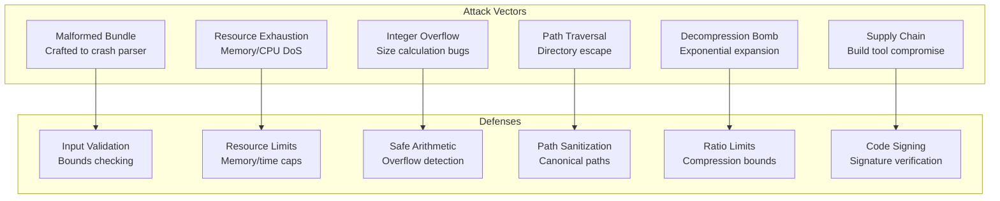
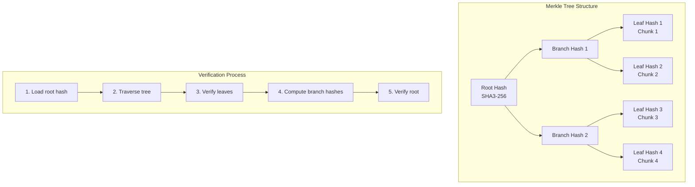
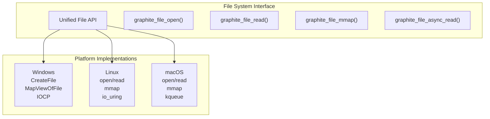

# Volume 1: Foundation & Core Systems
## Part 4: Platform & Security

### Table of Contents
- [Chapter 10: Security & Encryption](#chapter-10-security--encryption)
  - [Threat Model](#threat-model)
  - [Input Validation](#input-validation)
  - [Cryptographic Integrity](#cryptographic-integrity)
  - [Digital Signatures](#digital-signatures)
  - [Security Implementation](#security-implementation)
  - [Fuzzing & Testing](#fuzzing--testing)
- [Chapter 11: Platform Abstraction Layer](#chapter-11-platform-abstraction-layer)
  - [Platform Detection](#platform-detection)
  - [File System Abstraction](#file-system-abstraction)
  - [Memory Management](#memory-management)
  - [Threading Abstraction](#threading-abstraction)
  - [Performance Adaptations](#performance-adaptations)
- [Cross-References](#cross-references)
- [Navigation](#navigation)

### Overview

This part covers GRAPHITE's security architecture and platform abstraction layer, providing the foundation for safe, cross-platform operation. Chapter 10 details the comprehensive security model protecting against malicious inputs and ensuring data integrity. Chapter 11 presents the platform abstraction layer enabling efficient operation across Windows, Linux, macOS, and other systems.

---

## Chapter 10: Security & Encryption

GRAPHITE implements defense-in-depth security through cryptographic integrity verification, input validation, and comprehensive threat modeling. The security architecture protects against both malicious attacks and accidental corruption while maintaining high performance.

### Threat Model

GRAPHITE's security design addresses multiple attack vectors:



#### Comprehensive Threat Classification

```c
// Threat assessment matrix
typedef enum {
    GRAPHITE_THREAT_MALFORMED_BUNDLE,     // Crafted to crash parser
    GRAPHITE_THREAT_OVERSIZED_ALLOCATION, // Memory exhaustion attack
    GRAPHITE_THREAT_INFINITE_RECURSION,   // Stack overflow via deep graphs
    GRAPHITE_THREAT_INTEGER_OVERFLOW,     // Arithmetic overflow exploitation
    GRAPHITE_THREAT_PATH_TRAVERSAL,       // Directory traversal in paths
    GRAPHITE_THREAT_DECOMPRESSION_BOMB,   // ZIP bomb style attack
    GRAPHITE_THREAT_TIMING_ATTACK,        // Side-channel timing analysis
    GRAPHITE_THREAT_CACHE_COLLISION,      // Algorithmic complexity attack
    GRAPHITE_THREAT_SUPPLY_CHAIN,         // Compromised build pipeline
    GRAPHITE_THREAT_PRIVILEGE_ESCALATION, // Local privilege escalation
    GRAPHITE_THREAT_COUNT
} graphite_threat_type;

// Risk assessment for each threat
typedef struct {
    graphite_threat_type type;
    const char* description;
    uint8_t likelihood;     // 1-5 scale
    uint8_t impact;         // 1-5 scale
    uint8_t risk_score;     // likelihood * impact
    const char* mitigation;
} graphite_threat_assessment;

static const graphite_threat_assessment threat_matrix[] = {
    {
        .type = GRAPHITE_THREAT_MALFORMED_BUNDLE,
        .description = "Maliciously crafted bundle designed to crash parser",
        .likelihood = 4,
        .impact = 3,
        .risk_score = 12,
        .mitigation = "Comprehensive input validation, fuzzing, bounds checking"
    },
    {
        .type = GRAPHITE_THREAT_OVERSIZED_ALLOCATION,
        .description = "Bundle with huge size fields causing memory exhaustion",
        .likelihood = 3,
        .impact = 4,
        .risk_score = 12,
        .mitigation = "Memory limits, allocation guards, progressive loading"
    },
    {
        .type = GRAPHITE_THREAT_DECOMPRESSION_BOMB,
        .description = "Highly compressed data expanding to huge size",
        .likelihood = 2,
        .impact = 4,
        .risk_score = 8,
        .mitigation = "Decompression ratio limits, incremental decompression"
    }
};
```

#### Security Boundaries

```c
// Security context for sandboxed operations
typedef struct {
    // Memory limits
    size_t max_memory_allocation;    // Maximum single allocation
    size_t max_total_memory;         // Maximum total memory usage
    size_t max_decompressed_size;    // Maximum decompressed data size
    
    // Processing limits
    uint32_t max_recursion_depth;    // Maximum graph traversal depth
    uint32_t max_processing_time_ms; // Maximum processing time per operation
    uint32_t max_file_size;          // Maximum bundle file size
    
    // Feature restrictions
    bool allow_external_references;  // Allow external file references
    bool allow_code_execution;       // Allow embedded scripts/plugins
    bool allow_network_access;       // Allow network operations
    bool allow_file_system_access;   // Allow file system operations
    
    // Validation requirements
    bool require_signature;          // Require cryptographic signature
    bool require_integrity_check;    // Require full integrity verification
    bool strict_parsing;             // Reject any ambiguous content
} graphite_security_context;

// Predefined security contexts
static const graphite_security_context graphite_security_strict = {
    .max_memory_allocation = 64 * 1024 * 1024,  // 64 MB
    .max_total_memory = 512 * 1024 * 1024,      // 512 MB
    .max_decompressed_size = 1024 * 1024 * 1024, // 1 GB
    .max_recursion_depth = 64,
    .max_processing_time_ms = 30000,             // 30 seconds
    .max_file_size = 2ULL * 1024 * 1024 * 1024, // 2 GB
    .allow_external_references = false,
    .allow_code_execution = false,
    .allow_network_access = false,
    .allow_file_system_access = false,
    .require_signature = true,
    .require_integrity_check = true,
    .strict_parsing = true
};
```

### Input Validation

All external input undergoes rigorous validation:

```c
// Secure bundle parser with comprehensive validation
typedef struct {
    const uint8_t* data;
    size_t size;
    size_t position;
    const graphite_security_context* security;
    uint32_t recursion_depth;
    uint64_t start_time_ms;
    size_t allocated_memory;
} graphite_secure_parser;

// Safe integer operations with overflow checking
static inline bool safe_add_size_t(size_t a, size_t b, size_t* result) {
    if (a > SIZE_MAX - b) {
        return false; // Overflow would occur
    }
    *result = a + b;
    return true;
}

static inline bool safe_mul_size_t(size_t a, size_t b, size_t* result) {
    if (a != 0 && b > SIZE_MAX / a) {
        return false; // Overflow would occur
    }
    *result = a * b;
    return true;
}

// Validate chunk entry bounds
bool validate_chunk_entry(const chunk_entry* entry, uint64_t file_size) {
    // Check for overflow
    if (entry->offset > UINT64_MAX - entry->size) {
        return false;  // Addition would overflow
    }
    
    // Check bounds
    if (entry->offset + entry->size > file_size) {
        return false;  // Extends beyond file
    }
    
    // Check alignment
    if (entry->offset % 8 != 0) {
        return false;  // Misaligned access
    }
    
    // Check size sanity
    if (entry->size > MAX_CHUNK_SIZE) {
        return false;  // Too large
    }
    
    return true;
}

// Secure varint decoding with overflow protection
static graphite_result secure_read_varint(
    graphite_secure_parser* parser,
    uint64_t* value
) {
    *value = 0;
    uint32_t shift = 0;
    
    for (int i = 0; i < 10; i++) { // Max 10 bytes for 64-bit varint
        uint8_t byte;
        graphite_result result = secure_read_bytes(parser, &byte, 1);
        if (result != GRAPHITE_SUCCESS) {
            return result;
        }
        
        // Check for overflow
        if (shift >= 64) {
            return GRAPHITE_ERROR_VARINT_OVERFLOW;
        }
        
        uint64_t value_part = (byte & 0x7F);
        if (shift < 64 && value_part > (UINT64_MAX >> shift)) {
            return GRAPHITE_ERROR_VARINT_OVERFLOW;
        }
        
        *value |= value_part << shift;
        
        if ((byte & 0x80) == 0) {
            return GRAPHITE_SUCCESS;
        }
        
        shift += 7;
    }
    
    return GRAPHITE_ERROR_VARINT_TOO_LONG;
}
```

#### String Validation

```c
// Secure string validation with UTF-8 verification
static graphite_result secure_validate_string(const char* str, size_t length) {
    if (!str) return GRAPHITE_ERROR_NULL_POINTER;
    
    // Check for null termination
    bool found_null = false;
    for (size_t i = 0; i < length; i++) {
        if (str[i] == '\0') {
            found_null = true;
            break;
        }
        
        // Validate UTF-8 encoding
        uint8_t byte = (uint8_t)str[i];
        if (byte >= 0x80) {
            // Multi-byte UTF-8 character
            if ((byte & 0xE0) == 0xC0) {
                // 2-byte sequence
                if (i + 1 >= length || (str[i + 1] & 0xC0) != 0x80) {
                    return GRAPHITE_ERROR_INVALID_UTF8;
                }
                i++; // Skip next byte
            } else if ((byte & 0xF0) == 0xE0) {
                // 3-byte sequence
                if (i + 2 >= length || 
                    (str[i + 1] & 0xC0) != 0x80 || 
                    (str[i + 2] & 0xC0) != 0x80) {
                    return GRAPHITE_ERROR_INVALID_UTF8;
                }
                i += 2; // Skip next 2 bytes
            } else if ((byte & 0xF8) == 0xF0) {
                // 4-byte sequence
                if (i + 3 >= length ||
                    (str[i + 1] & 0xC0) != 0x80 ||
                    (str[i + 2] & 0xC0) != 0x80 ||
                    (str[i + 3] & 0xC0) != 0x80) {
                    return GRAPHITE_ERROR_INVALID_UTF8;
                }
                i += 3; // Skip next 3 bytes
            } else {
                return GRAPHITE_ERROR_INVALID_UTF8;
            }
        }
        
        // Check for path traversal attempts
        if (i + 2 < length && str[i] == '.' && str[i+1] == '.' && 
            (str[i+2] == '/' || str[i+2] == '\\')) {
            return GRAPHITE_ERROR_PATH_TRAVERSAL;
        }
    }
    
    if (!found_null) {
        return GRAPHITE_ERROR_STRING_NOT_TERMINATED;
    }
    
    return GRAPHITE_SUCCESS;
}
```

### Cryptographic Integrity

GRAPHITE uses BLAKE3 Merkle trees for cryptographic verification:



#### Hash Graph Implementation

```c
// Hash tree node types
typedef enum {
    HASH_NODE_LEAF = 2,   // Hash of data chunk
    HASH_NODE_BRANCH = 3  // Hash of child hashes
} hash_node_type;

// Hash leaf structure
typedef struct {
    chunk_kind kind;          // = HASH_NODE_LEAF
    uint32_t node_count;      // = 0
    uint32_t edge_count;      // = 0
    // Properties:
    // "algo" -> "blake3"
    // "digest" -> blob chunk containing 32-byte hash
    // "target_chunk_idx" -> chunk index being protected
} hash_leaf;

// Hash branch structure
typedef struct {
    chunk_kind kind;          // = HASH_NODE_BRANCH
    uint32_t node_count;      // = k child hash nodes
    uint32_t edge_count;      // = k-1 ordered relationships
    // Properties:
    // "algo" -> "blake3"
    // "digest" -> blob chunk containing computed hash
} hash_branch;

// Verify integrity of entire bundle
graphite_result verify_bundle_integrity(
    const graphite_bundle* bundle,
    const uint8_t* expected_root_hash
) {
    // Load hash root from integrity_idx
    const graphite_graph* hash_root = graphite_get_chunk_graph(
        bundle, bundle->header.integrity_idx);
    
    if (!hash_root) {
        return GRAPHITE_ERROR_NO_INTEGRITY_DATA;
    }
    
    // Recursively verify tree
    uint8_t computed_root_hash[32];
    graphite_result result = verify_hash_tree(
        bundle, hash_root, computed_root_hash);
    
    if (result != GRAPHITE_SUCCESS) {
        return result;
    }
    
    // Compare with expected hash
    if (memcmp(computed_root_hash, expected_root_hash, 32) != 0) {
        return GRAPHITE_ERROR_INTEGRITY_MISMATCH;
    }
    
    return GRAPHITE_SUCCESS;
}

// Recursive hash tree verification
static graphite_result verify_hash_tree(
    const graphite_bundle* bundle,
    const graphite_graph* node,
    uint8_t* output_hash
) {
    // Check node type
    uint32_t kind = graphite_get_property_u32(node, "kind", 0);
    
    if (kind == HASH_NODE_LEAF) {
        // Verify leaf node
        uint32_t target_idx = graphite_get_property_u32(
            node, "target_chunk_idx", INVALID_CHUNK);
        
        if (target_idx >= bundle->header.chunk_count) {
            return GRAPHITE_ERROR_INVALID_CHUNK_INDEX;
        }
        
        // Get target chunk data
        const void* chunk_data;
        size_t chunk_size;
        graphite_result result = graphite_get_chunk_data(
            bundle, target_idx, &chunk_data, &chunk_size);
        
        if (result != GRAPHITE_SUCCESS) {
            return result;
        }
        
        // Compute hash
        uint8_t computed_hash[32];
        blake3_hasher hasher;
        blake3_hasher_init(&hasher);
        blake3_hasher_update(&hasher, chunk_data, chunk_size);
        blake3_hasher_finalize(&hasher, computed_hash, 32);
        
        // Get stored hash
        const void* stored_hash = graphite_get_property_blob(
            node, "digest", NULL);
        
        if (!stored_hash) {
            return GRAPHITE_ERROR_NO_HASH_DATA;
        }
        
        // Compare hashes
        if (memcmp(computed_hash, stored_hash, 32) != 0) {
            return GRAPHITE_ERROR_HASH_MISMATCH;
        }
        
        // Return hash for parent computation
        memcpy(output_hash, computed_hash, 32);
        
    } else if (kind == HASH_NODE_BRANCH) {
        // Verify branch node
        blake3_hasher hasher;
        blake3_hasher_init(&hasher);
        
        // Process all child nodes
        uint32_t child_count = graphite_node_count(node);
        for (uint32_t i = 0; i < child_count; i++) {
            const graphite_graph* child = graphite_get_node(node, i);
            if (!child) {
                return GRAPHITE_ERROR_INVALID_NODE;
            }
            
            uint8_t child_hash[32];
            graphite_result result = verify_hash_tree(
                bundle, child, child_hash);
            
            if (result != GRAPHITE_SUCCESS) {
                return result;
            }
            
            // Add child hash to branch computation
            blake3_hasher_update(&hasher, child_hash, 32);
        }
        
        // Finalize branch hash
        blake3_hasher_finalize(&hasher, output_hash, 32);
        
        // Verify against stored hash if present
        const void* stored_hash = graphite_get_property_blob(
            node, "digest", NULL);
        
        if (stored_hash && memcmp(output_hash, stored_hash, 32) != 0) {
            return GRAPHITE_ERROR_HASH_MISMATCH;
        }
        
    } else {
        return GRAPHITE_ERROR_INVALID_HASH_NODE;
    }
    
    return GRAPHITE_SUCCESS;
}
```

### Digital Signatures

Support for Ed25519 digital signatures ensures authenticity:

```c
// Digital signature support using Ed25519
#include <sodium.h>

typedef struct {
    uint8_t public_key[crypto_sign_PUBLICKEYBYTES];
    uint8_t signature[crypto_sign_BYTES];
    uint64_t timestamp;
    char signer_id[64];
} graphite_signature;

typedef struct {
    uint32_t signature_count;
    graphite_signature signatures[];
} graphite_signature_block;

// Sign a bundle
graphite_result graphite_sign_bundle(
    const char* bundle_path,
    const uint8_t* private_key,
    const char* signer_id
) {
    // Read bundle data
    FILE* file = fopen(bundle_path, "rb");
    if (!file) {
        return GRAPHITE_ERROR_FILE_OPEN;
    }
    
    fseek(file, 0, SEEK_END);
    long file_size = ftell(file);
    fseek(file, 0, SEEK_SET);
    
    uint8_t* bundle_data = malloc(file_size);
    if (!bundle_data) {
        fclose(file);
        return GRAPHITE_ERROR_ALLOCATION;
    }
    
    if (fread(bundle_data, 1, file_size, file) != file_size) {
        free(bundle_data);
        fclose(file);
        return GRAPHITE_ERROR_IO;
    }
    fclose(file);
    
    // Calculate BLAKE3 hash of bundle
    uint8_t bundle_hash[32];
    blake3_hasher hasher;
    blake3_hasher_init(&hasher);
    blake3_hasher_update(&hasher, bundle_data, file_size);
    blake3_hasher_finalize(&hasher, bundle_hash, 32);
    
    // Create signature
    graphite_signature sig = {0};
    
    // Extract public key from private key
    memcpy(sig.public_key, private_key + 32, crypto_sign_PUBLICKEYBYTES);
    
    // Sign the bundle hash
    crypto_sign_detached(sig.signature, NULL, bundle_hash, 32, private_key);
    
    // Set metadata
    sig.timestamp = graphite_get_time_ms();
    strncpy(sig.signer_id, signer_id, sizeof(sig.signer_id) - 1);
    
    // Append signature to bundle
    // (Implementation depends on bundle format details)
    
    free(bundle_data);
    return GRAPHITE_SUCCESS;
}

// Verify bundle signatures
graphite_result graphite_verify_signatures(
    const graphite_bundle* bundle,
    const graphite_trust_store* trust_store
) {
    // Get signature block
    const graphite_signature_block* sig_block = 
        graphite_get_signature_block(bundle);
    
    if (!sig_block || sig_block->signature_count == 0) {
        return GRAPHITE_ERROR_NO_SIGNATURES;
    }
    
    // Calculate bundle hash
    uint8_t bundle_hash[32];
    graphite_result result = calculate_bundle_hash(bundle, bundle_hash);
    if (result != GRAPHITE_SUCCESS) {
        return result;
    }
    
    // Verify each signature
    bool valid_signature_found = false;
    
    for (uint32_t i = 0; i < sig_block->signature_count; i++) {
        const graphite_signature* sig = &sig_block->signatures[i];
        
        // Check if public key is trusted
        if (!is_key_trusted(trust_store, sig->public_key)) {
            continue;
        }
        
        // Verify signature
        if (crypto_sign_verify_detached(sig->signature, bundle_hash, 32, 
                                       sig->public_key) == 0) {
            valid_signature_found = true;
            
            // Log successful verification
            log_signature_verification(sig->signer_id, sig->timestamp);
        }
    }
    
    return valid_signature_found ? 
           GRAPHITE_SUCCESS : GRAPHITE_ERROR_SIGNATURE_INVALID;
}
```

### Security Implementation

#### Decompression Safety

Protection against decompression bombs:

```c
// Secure decompression with bomb protection
typedef struct {
    size_t max_output_size;
    size_t max_ratio;
    uint32_t max_time_ms;
    void* (*progress_callback)(size_t decompressed, void* user_data);
    void* user_data;
} graphite_secure_decompress_config;

graphite_result graphite_secure_decompress(
    const void* compressed_data,
    size_t compressed_size,
    void** decompressed_data,
    size_t* decompressed_size,
    const graphite_secure_decompress_config* config
) {
    // Initialize zstd decompression
    ZSTD_DCtx* dctx = ZSTD_createDCtx();
    if (!dctx) {
        return GRAPHITE_ERROR_DECOMPRESS_INIT;
    }
    
    // Get decompressed size hint
    size_t estimated_size = ZSTD_getFrameContentSize(
        compressed_data, compressed_size);
    
    if (estimated_size == ZSTD_CONTENTSIZE_ERROR) {
        ZSTD_freeDCtx(dctx);
        return GRAPHITE_ERROR_INVALID_COMPRESSED_DATA;
    }
    
    if (estimated_size == ZSTD_CONTENTSIZE_UNKNOWN) {
        // Stream mode required
        estimated_size = compressed_size * 4; // Initial guess
    }
    
    // Validate against limits
    if (estimated_size > config->max_output_size) {
        ZSTD_freeDCtx(dctx);
        return GRAPHITE_ERROR_SIZE_LIMIT;
    }
    
    // Check compression ratio
    if (compressed_size > 0) {
        size_t ratio = estimated_size / compressed_size;
        if (ratio > config->max_ratio) {
            ZSTD_freeDCtx(dctx);
            return GRAPHITE_ERROR_DECOMPRESS_RATIO;
        }
    }
    
    // Allocate output buffer
    void* output = malloc(estimated_size);
    if (!output) {
        ZSTD_freeDCtx(dctx);
        return GRAPHITE_ERROR_ALLOCATION;
    }
    
    // Decompress with timeout checking
    uint64_t start_time = graphite_get_time_ms();
    
    size_t decompressed = ZSTD_decompressDCtx(
        dctx, output, estimated_size,
        compressed_data, compressed_size);
    
    ZSTD_freeDCtx(dctx);
    
    // Check for errors
    if (ZSTD_isError(decompressed)) {
        free(output);
        return GRAPHITE_ERROR_DECOMPRESS_FAILED;
    }
    
    // Check time limit
    uint64_t elapsed = graphite_get_time_ms() - start_time;
    if (elapsed > config->max_time_ms) {
        free(output);
        return GRAPHITE_ERROR_TIMEOUT;
    }
    
    *decompressed_data = output;
    *decompressed_size = decompressed;
    
    return GRAPHITE_SUCCESS;
}
```

### Fuzzing & Testing

Comprehensive fuzzing integration for security testing:

```c
// libFuzzer entry point
int LLVMFuzzerTestOneInput(const uint8_t* data, size_t size) {
    if (size < sizeof(graphite_hdr)) {
        return 0;
    }
    
    // Create temporary file from fuzz input
    char temp_path[] = "/tmp/fuzz_XXXXXX";
    int fd = mkstemp(temp_path);
    write(fd, data, size);
    close(fd);
    
    // Set strict security context
    graphite_security_context security = graphite_security_strict;
    
    // Try to load - should never crash
    graphite_bundle* bundle = graphite_open_secure(temp_path, &security);
    if (bundle) {
        // Exercise API surface
        const graphite_graph* root = graphite_root(bundle);
        if (root) {
            uint32_t node_count = graphite_node_count(root);
            
            // Traverse graph with depth limit
            traverse_graph_secure(root, 0, security.max_recursion_depth);
        }
        
        // Test decompression if present
        test_decompression_secure(bundle, &security);
        
        // Verify integrity if available
        if (bundle->header.integrity_idx != INVALID_CHUNK) {
            verify_bundle_integrity(bundle, bundle->header.file_digest);
        }
        
        graphite_close(bundle);
    }
    
    unlink(temp_path);
    return 0;
}

// AFL++ harness
int main(int argc, char** argv) {
    #ifdef __AFL_HAVE_MANUAL_CONTROL
    __AFL_INIT();
    #endif
    
    uint8_t* data = __AFL_FUZZ_TESTCASE_BUF;
    while (__AFL_LOOP(10000)) {
        size_t size = __AFL_FUZZ_TESTCASE_LEN;
        
        // Fuzz with different security contexts
        fuzz_with_context(data, size, &graphite_security_strict);
        fuzz_with_context(data, size, &graphite_security_development);
    }
    
    return 0;
}
```

---

## Chapter 11: Platform Abstraction Layer

GRAPHITE's platform abstraction layer enables efficient cross-platform operation while leveraging platform-specific optimizations. The design balances portability with performance, providing a clean interface that adapts to each platform's strengths.

### Platform Detection

Comprehensive compile-time platform and architecture detection:

```c
// Platform detection macros
#if defined(_WIN32) || defined(_WIN64)
    #define GRAPHITE_PLATFORM_WINDOWS
    #ifdef _WIN64
        #define GRAPHITE_PLATFORM_WIN64
    #else
        #define GRAPHITE_PLATFORM_WIN32
    #endif
#elif defined(__linux__)
    #define GRAPHITE_PLATFORM_LINUX
    #ifdef __ANDROID__
        #define GRAPHITE_PLATFORM_ANDROID
    #endif
#elif defined(__APPLE__)
    #include <TargetConditionals.h>
    #if TARGET_OS_MAC
        #define GRAPHITE_PLATFORM_MACOS
    #elif TARGET_OS_IPHONE
        #define GRAPHITE_PLATFORM_IOS
    #endif
#elif defined(__FreeBSD__)
    #define GRAPHITE_PLATFORM_FREEBSD
#elif defined(__EMSCRIPTEN__)
    #define GRAPHITE_PLATFORM_WEB
#endif

// Architecture detection
#if defined(_M_X64) || defined(__x86_64__)
    #define GRAPHITE_ARCH_X64
    #define GRAPHITE_ARCH_64BIT
#elif defined(_M_IX86) || defined(__i386__)
    #define GRAPHITE_ARCH_X86
    #define GRAPHITE_ARCH_32BIT
#elif defined(_M_ARM64) || defined(__aarch64__)
    #define GRAPHITE_ARCH_ARM64
    #define GRAPHITE_ARCH_64BIT
#elif defined(_M_ARM) || defined(__arm__)
    #define GRAPHITE_ARCH_ARM32
    #define GRAPHITE_ARCH_32BIT
#elif defined(__riscv) && __riscv_xlen == 64
    #define GRAPHITE_ARCH_RISCV64
    #define GRAPHITE_ARCH_64BIT
#endif

// Endianness detection
#include <stdint.h>
static inline bool graphite_is_little_endian(void) {
    const uint16_t test = 0x0001;
    return *(const uint8_t*)&test == 1;
}

#define GRAPHITE_LITTLE_ENDIAN (graphite_is_little_endian())
#define GRAPHITE_BIG_ENDIAN (!graphite_is_little_endian())

// Compiler detection
#if defined(__clang__)
    #define GRAPHITE_COMPILER_CLANG
    #define GRAPHITE_COMPILER_VERSION __clang_major__
#elif defined(__GNUC__)
    #define GRAPHITE_COMPILER_GCC
    #define GRAPHITE_COMPILER_VERSION __GNUC__
#elif defined(_MSC_VER)
    #define GRAPHITE_COMPILER_MSVC
    #define GRAPHITE_COMPILER_VERSION _MSC_VER
#endif

// Feature detection
#ifdef __has_builtin
    #define GRAPHITE_HAS_BUILTIN(x) __has_builtin(x)
#else
    #define GRAPHITE_HAS_BUILTIN(x) 0
#endif

#ifdef __has_feature
    #define GRAPHITE_HAS_FEATURE(x) __has_feature(x)
#else
    #define GRAPHITE_HAS_FEATURE(x) 0
#endif
```

### File System Abstraction

Cross-platform file operations with platform-specific optimizations:



#### Platform-Agnostic File Interface

```c
// Platform-agnostic file system operations
typedef struct {
    void* handle;               // Platform-specific file handle
    const char* path;           // File path
    uint64_t size;              // File size
    bool is_memory_mapped;      // Whether file is memory-mapped
    void* mapped_memory;        // Memory-mapped region
    size_t mapped_size;         // Size of mapped region
    
    // Platform-specific data
    #ifdef GRAPHITE_PLATFORM_WINDOWS
    HANDLE mapping_handle;      // File mapping object
    #elif defined(GRAPHITE_PLATFORM_LINUX)
    int fd;                     // File descriptor
    #endif
} graphite_file;

// File operation flags
typedef enum {
    GRAPHITE_FILE_READ = 1 << 0,
    GRAPHITE_FILE_WRITE = 1 << 1,
    GRAPHITE_FILE_CREATE = 1 << 2,
    GRAPHITE_FILE_TRUNCATE = 1 << 3,
    GRAPHITE_FILE_SEQUENTIAL = 1 << 4,  // Optimize for sequential access
    GRAPHITE_FILE_RANDOM = 1 << 5,       // Optimize for random access
    GRAPHITE_FILE_DIRECT = 1 << 6,       // Bypass OS cache
} graphite_file_flags;

// Cross-platform file operations
graphite_result graphite_file_open(
    graphite_file* file,
    const char* path,
    uint32_t flags
);

graphite_result graphite_file_close(graphite_file* file);

graphite_result graphite_file_read(
    graphite_file* file,
    void* buffer,
    size_t size,
    size_t offset,
    size_t* bytes_read
);

graphite_result graphite_file_mmap(
    graphite_file* file,
    size_t offset,
    size_t size,
    void** mapped_ptr
);

graphite_result graphite_file_munmap(
    graphite_file* file,
    void* mapped_ptr,
    size_t size
);
```

#### Windows Implementation

```c
#ifdef GRAPHITE_PLATFORM_WINDOWS

graphite_result graphite_file_open_win32(
    graphite_file* file,
    const char* path,
    uint32_t flags
) {
    DWORD access = 0;
    DWORD share = FILE_SHARE_READ;
    DWORD creation = 0;
    DWORD attributes = FILE_ATTRIBUTE_NORMAL;
    
    // Map flags to Windows API
    if (flags & GRAPHITE_FILE_READ) access |= GENERIC_READ;
    if (flags & GRAPHITE_FILE_WRITE) {
        access |= GENERIC_WRITE;
        share = 0; // Exclusive access for writing
    }
    
    if (flags & GRAPHITE_FILE_CREATE) {
        creation = (flags & GRAPHITE_FILE_TRUNCATE) ? 
                   CREATE_ALWAYS : CREATE_NEW;
    } else {
        creation = OPEN_EXISTING;
    }
    
    // Optimization hints
    if (flags & GRAPHITE_FILE_SEQUENTIAL) {
        attributes |= FILE_FLAG_SEQUENTIAL_SCAN;
    }
    if (flags & GRAPHITE_FILE_RANDOM) {
        attributes |= FILE_FLAG_RANDOM_ACCESS;
    }
    if (flags & GRAPHITE_FILE_DIRECT) {
        attributes |= FILE_FLAG_NO_BUFFERING;
    }
    
    // Convert path to wide string for Unicode support
    wchar_t wide_path[MAX_PATH];
    if (MultiByteToWideChar(CP_UTF8, 0, path, -1, 
                            wide_path, MAX_PATH) == 0) {
        return GRAPHITE_ERROR_INVALID_PATH;
    }
    
    HANDLE handle = CreateFileW(
        wide_path,
        access,
        share,
        NULL,
        creation,
        attributes,
        NULL
    );
    
    if (handle == INVALID_HANDLE_VALUE) {
        return translate_windows_error(GetLastError());
    }
    
    // Get file size
    LARGE_INTEGER file_size;
    if (!GetFileSizeEx(handle, &file_size)) {
        CloseHandle(handle);
        return GRAPHITE_ERROR_FILE_SIZE;
    }
    
    file->handle = handle;
    file->path = path;
    file->size = file_size.QuadPart;
    file->is_memory_mapped = false;
    file->mapped_memory = NULL;
    file->mapped_size = 0;
    file->mapping_handle = NULL;
    
    return GRAPHITE_SUCCESS;
}

graphite_result graphite_file_mmap_win32(
    graphite_file* file,
    size_t offset,
    size_t size,
    void** mapped_ptr
) {
    // Create file mapping object
    HANDLE mapping = CreateFileMappingW(
        (HANDLE)file->handle,
        NULL,
        PAGE_READONLY,
        (DWORD)(file->size >> 32),
        (DWORD)(file->size & 0xFFFFFFFF),
        NULL
    );
    
    if (!mapping) {
        return GRAPHITE_ERROR_MMAP_CREATE;
    }
    
    // Map view of file
    void* mapped = MapViewOfFile(
        mapping,
        FILE_MAP_READ,
        (DWORD)(offset >> 32),
        (DWORD)(offset & 0xFFFFFFFF),
        size
    );
    
    if (!mapped) {
        CloseHandle(mapping);
        return GRAPHITE_ERROR_MMAP_VIEW;
    }
    
    // Prefetch pages for better performance
    WIN32_MEMORY_RANGE_ENTRY range = {
        .VirtualAddress = mapped,
        .NumberOfBytes = size
    };
    PrefetchVirtualMemory(GetCurrentProcess(), 1, &range, 0);
    
    *mapped_ptr = mapped;
    file->mapped_memory = mapped;
    file->mapped_size = size;
    file->mapping_handle = mapping;
    file->is_memory_mapped = true;
    
    return GRAPHITE_SUCCESS;
}

// Asynchronous I/O using IOCP
typedef struct {
    OVERLAPPED overlapped;
    void* buffer;
    size_t size;
    graphite_io_callback callback;
    void* user_data;
} graphite_async_io_win32;

graphite_result graphite_file_async_read_win32(
    graphite_file* file,
    void* buffer,
    size_t size,
    size_t offset,
    graphite_io_callback callback,
    void* user_data
) {
    graphite_async_io_win32* async_io = malloc(sizeof(graphite_async_io_win32));
    if (!async_io) {
        return GRAPHITE_ERROR_ALLOCATION;
    }
    
    memset(&async_io->overlapped, 0, sizeof(OVERLAPPED));
    async_io->overlapped.Offset = (DWORD)(offset & 0xFFFFFFFF);
    async_io->overlapped.OffsetHigh = (DWORD)(offset >> 32);
    async_io->buffer = buffer;
    async_io->size = size;
    async_io->callback = callback;
    async_io->user_data = user_data;
    
    if (!ReadFileEx((HANDLE)file->handle, buffer, (DWORD)size,
                    &async_io->overlapped, async_read_completion)) {
        free(async_io);
        return translate_windows_error(GetLastError());
    }
    
    return GRAPHITE_SUCCESS;
}

#endif // GRAPHITE_PLATFORM_WINDOWS
```

#### Linux Implementation

```c
#ifdef GRAPHITE_PLATFORM_LINUX

graphite_result graphite_file_open_linux(
    graphite_file* file,
    const char* path,
    uint32_t flags
) {
    int open_flags = 0;
    
    // Map flags to POSIX
    if ((flags & GRAPHITE_FILE_READ) && (flags & GRAPHITE_FILE_WRITE)) {
        open_flags = O_RDWR;
    } else if (flags & GRAPHITE_FILE_WRITE) {
        open_flags = O_WRONLY;
    } else {
        open_flags = O_RDONLY;
    }
    
    if (flags & GRAPHITE_FILE_CREATE) {
        open_flags |= O_CREAT;
        if (flags & GRAPHITE_FILE_TRUNCATE) {
            open_flags |= O_TRUNC;
        }
    }
    
    // Direct I/O for bypassing cache
    if (flags & GRAPHITE_FILE_DIRECT) {
        open_flags |= O_DIRECT;
    }
    
    int fd = open(path, open_flags, 0644);
    if (fd < 0) {
        return translate_errno(errno);
    }
    
    // Get file size
    struct stat st;
    if (fstat(fd, &st) < 0) {
        close(fd);
        return GRAPHITE_ERROR_FILE_SIZE;
    }
    
    // Set up hints for kernel
    if (flags & GRAPHITE_FILE_SEQUENTIAL) {
        posix_fadvise(fd, 0, st.st_size, POSIX_FADV_SEQUENTIAL);
    } else if (flags & GRAPHITE_FILE_RANDOM) {
        posix_fadvise(fd, 0, st.st_size, POSIX_FADV_RANDOM);
    }
    
    file->handle = (void*)(intptr_t)fd;
    file->path = path;
    file->size = st.st_size;
    file->is_memory_mapped = false;
    file->mapped_memory = NULL;
    file->mapped_size = 0;
    file->fd = fd;
    
    return GRAPHITE_SUCCESS;
}

graphite_result graphite_file_mmap_linux(
    graphite_file* file,
    size_t offset,
    size_t size,
    void** mapped_ptr
) {
    int fd = (int)(intptr_t)file->handle;
    
    // Ensure offset is page-aligned
    long page_size = sysconf(_SC_PAGE_SIZE);
    size_t aligned_offset = offset & ~(page_size - 1);
    size_t offset_diff = offset - aligned_offset;
    size_t map_size = size + offset_diff;
    
    void* mapped = mmap(
        NULL,
        map_size,
        PROT_READ,
        MAP_PRIVATE,
        fd,
        aligned_offset
    );
    
    if (mapped == MAP_FAILED) {
        return translate_errno(errno);
    }
    
    // Advise kernel about access pattern
    int advice = MADV_WILLNEED;
    if (file->size > 100 * 1024 * 1024) { // Large files
        advice |= MADV_HUGEPAGE; // Use huge pages if available
    }
    
    if (madvise(mapped, map_size, advice) < 0) {
        // Non-fatal - just a hint
    }
    
    *mapped_ptr = (uint8_t*)mapped + offset_diff;
    file->mapped_memory = mapped;
    file->mapped_size = map_size;
    file->is_memory_mapped = true;
    
    return GRAPHITE_SUCCESS;
}

// Asynchronous I/O using io_uring
#ifdef GRAPHITE_HAS_IO_URING
#include <liburing.h>

typedef struct {
    struct io_uring ring;
    pthread_t completion_thread;
    atomic_bool running;
} graphite_io_uring_context;

graphite_result graphite_file_async_read_uring(
    graphite_file* file,
    void* buffer,
    size_t size,
    size_t offset,
    graphite_io_callback callback,
    void* user_data
) {
    static graphite_io_uring_context* uring_ctx = NULL;
    
    // Initialize io_uring on first use
    if (!uring_ctx) {
        uring_ctx = malloc(sizeof(graphite_io_uring_context));
        if (io_uring_queue_init(256, &uring_ctx->ring, 0) < 0) {
            free(uring_ctx);
            return GRAPHITE_ERROR_IO_URING_INIT;
        }
        
        atomic_init(&uring_ctx->running, true);
        pthread_create(&uring_ctx->completion_thread, NULL,
                      io_uring_completion_thread, uring_ctx);
    }
    
    // Get submission queue entry
    struct io_uring_sqe* sqe = io_uring_get_sqe(&uring_ctx->ring);
    if (!sqe) {
        return GRAPHITE_ERROR_IO_URING_FULL;
    }
    
    // Set up async read
    graphite_async_io_data* async_data = malloc(sizeof(graphite_async_io_data));
    async_data->callback = callback;
    async_data->user_data = user_data;
    async_data->buffer = buffer;
    async_data->size = size;
    
    io_uring_prep_read(sqe, file->fd, buffer, size, offset);
    io_uring_sqe_set_data(sqe, async_data);
    
    // Submit request
    if (io_uring_submit(&uring_ctx->ring) < 0) {
        free(async_data);
        return GRAPHITE_ERROR_IO_SUBMIT;
    }
    
    return GRAPHITE_SUCCESS;
}
#endif // GRAPHITE_HAS_IO_URING

#endif // GRAPHITE_PLATFORM_LINUX
```

### Memory Management

Platform-specific memory allocation and optimization:

```c
// Platform-optimized memory allocation
typedef struct {
    size_t alignment;
    bool zero_memory;
    bool large_pages;
    bool numa_aware;
    int numa_node;
} graphite_alloc_flags;

// Aligned allocation with platform optimization
void* graphite_aligned_alloc(size_t size, size_t alignment) {
    #ifdef GRAPHITE_PLATFORM_WINDOWS
    return _aligned_malloc(size, alignment);
    
    #elif defined(GRAPHITE_PLATFORM_LINUX) || defined(GRAPHITE_PLATFORM_MACOS)
    void* ptr = NULL;
    if (posix_memalign(&ptr, alignment, size) != 0) {
        return NULL;
    }
    return ptr;
    
    #else
    // Fallback implementation
    void* raw = malloc(size + alignment + sizeof(void*));
    if (!raw) return NULL;
    
    void** aligned = (void**)(((uintptr_t)raw + alignment + sizeof(void*)) 
                              & ~(alignment - 1));
    aligned[-1] = raw;
    return aligned;
    #endif
}

// Large page allocation
void* graphite_large_page_alloc(size_t size) {
    #ifdef GRAPHITE_PLATFORM_WINDOWS
    // Enable large page privilege if needed
    static bool large_pages_enabled = false;
    if (!large_pages_enabled) {
        enable_large_page_privilege();
        large_pages_enabled = true;
    }
    
    size_t large_page_size = GetLargePageMinimum();
    if (large_page_size == 0) {
        return NULL; // Large pages not supported
    }
    
    // Round up to large page size
    size = (size + large_page_size - 1) & ~(large_page_size - 1);
    
    return VirtualAlloc(NULL, size, 
                       MEM_COMMIT | MEM_RESERVE | MEM_LARGE_PAGES,
                       PAGE_READWRITE);
    
    #elif defined(GRAPHITE_PLATFORM_LINUX)
    // Use hugetlbfs on Linux
    size_t huge_page_size = 2 * 1024 * 1024; // 2MB huge pages
    size = (size + huge_page_size - 1) & ~(huge_page_size - 1);
    
    void* ptr = mmap(NULL, size,
                     PROT_READ | PROT_WRITE,
                     MAP_PRIVATE | MAP_ANONYMOUS | MAP_HUGETLB,
                     -1, 0);
    
    if (ptr == MAP_FAILED) {
        // Fallback to regular pages
        ptr = mmap(NULL, size,
                   PROT_READ | PROT_WRITE,
                   MAP_PRIVATE | MAP_ANONYMOUS,
                   -1, 0);
    }
    
    return (ptr == MAP_FAILED) ? NULL : ptr;
    
    #else
    // Fallback to regular allocation
    return graphite_aligned_alloc(size, 4096);
    #endif
}

// NUMA-aware allocation
#ifdef GRAPHITE_PLATFORM_LINUX
#include <numa.h>

void* graphite_numa_alloc(size_t size, int node) {
    if (!numa_available()) {
        return malloc(size);
    }
    
    if (node < 0 || node >= numa_max_node()) {
        node = numa_preferred();
    }
    
    return numa_alloc_onnode(size, node);
}

void graphite_numa_free(void* ptr, size_t size) {
    numa_free(ptr, size);
}
#endif
```

### Threading Abstraction

Cross-platform threading with platform-specific optimizations:

```c
// Platform-agnostic thread abstraction
typedef struct {
    #ifdef GRAPHITE_PLATFORM_WINDOWS
    HANDLE handle;
    DWORD id;
    #else
    pthread_t thread;
    #endif
    
    graphite_thread_func func;
    void* arg;
    char name[32];
    int priority;
    size_t stack_size;
    
    #ifdef GRAPHITE_PLATFORM_LINUX
    cpu_set_t cpu_affinity;
    #endif
} graphite_thread;

// Thread creation with platform optimization
graphite_result graphite_thread_create(
    graphite_thread* thread,
    graphite_thread_func func,
    void* arg,
    const graphite_thread_attrs* attrs
) {
    thread->func = func;
    thread->arg = arg;
    
    if (attrs) {
        strncpy(thread->name, attrs->name, sizeof(thread->name) - 1);
        thread->priority = attrs->priority;
        thread->stack_size = attrs->stack_size;
    }
    
    #ifdef GRAPHITE_PLATFORM_WINDOWS
    thread->handle = CreateThread(
        NULL,
        attrs ? attrs->stack_size : 0,
        (LPTHREAD_START_ROUTINE)func,
        arg,
        0,
        &thread->id
    );
    
    if (!thread->handle) {
        return GRAPHITE_ERROR_THREAD_CREATE;
    }
    
    // Set thread name (Windows 10+)
    if (attrs && attrs->name[0]) {
        set_thread_name_win32(thread->handle, attrs->name);
    }
    
    // Set priority
    if (attrs && attrs->priority != 0) {
        SetThreadPriority(thread->handle, 
                         map_priority_to_windows(attrs->priority));
    }
    
    #else // POSIX
    pthread_attr_t attr;
    pthread_attr_init(&attr);
    
    if (attrs) {
        // Set stack size
        if (attrs->stack_size > 0) {
            pthread_attr_setstacksize(&attr, attrs->stack_size);
        }
        
        // Set scheduling policy and priority
        if (attrs->priority != 0) {
            struct sched_param param = {
                .sched_priority = attrs->priority
            };
            pthread_attr_setschedpolicy(&attr, SCHED_FIFO);
            pthread_attr_setschedparam(&attr, &param);
            pthread_attr_setinheritsched(&attr, PTHREAD_EXPLICIT_SCHED);
        }
    }
    
    int ret = pthread_create(&thread->thread, &attr, 
                            (void*(*)(void*))func, arg);
    
    pthread_attr_destroy(&attr);
    
    if (ret != 0) {
        return translate_errno(ret);
    }
    
    // Set thread name
    if (attrs && attrs->name[0]) {
        #ifdef GRAPHITE_PLATFORM_LINUX
        pthread_setname_np(thread->thread, attrs->name);
        #elif defined(GRAPHITE_PLATFORM_MACOS)
        // macOS requires setting from within thread
        // Store name to be set in thread function
        #endif
    }
    
    // Set CPU affinity on Linux
    #ifdef GRAPHITE_PLATFORM_LINUX
    if (attrs && attrs->cpu_affinity_mask != 0) {
        CPU_ZERO(&thread->cpu_affinity);
        for (int i = 0; i < CPU_SETSIZE; i++) {
            if (attrs->cpu_affinity_mask & (1ULL << i)) {
                CPU_SET(i, &thread->cpu_affinity);
            }
        }
        pthread_setaffinity_np(thread->thread, 
                              sizeof(cpu_set_t), 
                              &thread->cpu_affinity);
    }
    #endif
    
    #endif // Platform selection
    
    return GRAPHITE_SUCCESS;
}

// High-resolution timing
uint64_t graphite_get_time_ns(void) {
    #ifdef GRAPHITE_PLATFORM_WINDOWS
    static LARGE_INTEGER frequency = {0};
    if (frequency.QuadPart == 0) {
        QueryPerformanceFrequency(&frequency);
    }
    
    LARGE_INTEGER counter;
    QueryPerformanceCounter(&counter);
    
    return (counter.QuadPart * 1000000000) / frequency.QuadPart;
    
    #elif defined(GRAPHITE_PLATFORM_LINUX) || defined(GRAPHITE_PLATFORM_MACOS)
    struct timespec ts;
    clock_gettime(CLOCK_MONOTONIC, &ts);
    return (uint64_t)ts.tv_sec * 1000000000 + ts.tv_nsec;
    
    #else
    // Fallback to microsecond precision
    struct timeval tv;
    gettimeofday(&tv, NULL);
    return (uint64_t)tv.tv_sec * 1000000000 + tv.tv_usec * 1000;
    #endif
}
```

### Performance Adaptations

Platform-specific performance optimizations:

```c
// CPU feature detection
typedef struct {
    bool sse2;
    bool sse3;
    bool ssse3;
    bool sse41;
    bool sse42;
    bool avx;
    bool avx2;
    bool avx512f;
    bool neon;
    int cache_line_size;
    int l1_data_cache;
    int l2_cache;
    int l3_cache;
    int physical_cores;
    int logical_cores;
} graphite_cpu_info;

void graphite_detect_cpu_features(graphite_cpu_info* info) {
    memset(info, 0, sizeof(graphite_cpu_info));
    
    #if defined(GRAPHITE_ARCH_X64) || defined(GRAPHITE_ARCH_X86)
    // CPUID detection
    uint32_t regs[4];
    
    // Basic features
    cpuid(1, 0, regs);
    info->sse2 = (regs[3] & (1 << 26)) != 0;
    info->sse3 = (regs[2] & (1 << 0)) != 0;
    info->ssse3 = (regs[2] & (1 << 9)) != 0;
    info->sse41 = (regs[2] & (1 << 19)) != 0;
    info->sse42 = (regs[2] & (1 << 20)) != 0;
    
    // Extended features
    cpuid(7, 0, regs);
    info->avx2 = (regs[1] & (1 << 5)) != 0;
    info->avx512f = (regs[1] & (1 << 16)) != 0;
    
    // Cache information
    cpuid(0x80000006, 0, regs);
    info->l2_cache = ((regs[2] >> 16) & 0xFFFF) * 1024;
    info->cache_line_size = regs[2] & 0xFF;
    
    #elif defined(GRAPHITE_ARCH_ARM64) || defined(GRAPHITE_ARCH_ARM32)
    // ARM feature detection
    #ifdef __linux__
    // Parse /proc/cpuinfo
    FILE* cpuinfo = fopen("/proc/cpuinfo", "r");
    if (cpuinfo) {
        char line[256];
        while (fgets(line, sizeof(line), cpuinfo)) {
            if (strstr(line, "Features") && strstr(line, "neon")) {
                info->neon = true;
            }
        }
        fclose(cpuinfo);
    }
    #endif
    
    info->cache_line_size = 64; // Common ARM cache line size
    #endif
    
    // Get core count
    #ifdef GRAPHITE_PLATFORM_WINDOWS
    SYSTEM_INFO sysinfo;
    GetSystemInfo(&sysinfo);
    info->logical_cores = sysinfo.dwNumberOfProcessors;
    
    // Get physical cores
    DWORD buffer_size = 0;
    GetLogicalProcessorInformation(NULL, &buffer_size);
    SYSTEM_LOGICAL_PROCESSOR_INFORMATION* buffer = malloc(buffer_size);
    if (GetLogicalProcessorInformation(buffer, &buffer_size)) {
        info->physical_cores = count_physical_cores(buffer, buffer_size);
    }
    free(buffer);
    
    #elif defined(GRAPHITE_PLATFORM_LINUX)
    info->logical_cores = sysconf(_SC_NPROCESSORS_ONLN);
    
    // Parse /proc/cpuinfo for physical cores
    info->physical_cores = parse_physical_cores_linux();
    
    // Get cache sizes from sysfs
    info->l1_data_cache = read_sysfs_cache_size(0, "L1d");
    info->l2_cache = read_sysfs_cache_size(0, "L2");
    info->l3_cache = read_sysfs_cache_size(0, "L3");
    
    #elif defined(GRAPHITE_PLATFORM_MACOS)
    size_t size = sizeof(int);
    sysctlbyname("hw.logicalcpu", &info->logical_cores, &size, NULL, 0);
    sysctlbyname("hw.physicalcpu", &info->physical_cores, &size, NULL, 0);
    sysctlbyname("hw.cachelinesize", &info->cache_line_size, &size, NULL, 0);
    
    size_t l1_size;
    size = sizeof(l1_size);
    sysctlbyname("hw.l1dcachesize", &l1_size, &size, NULL, 0);
    info->l1_data_cache = l1_size;
    #endif
}

// Select optimal implementation based on CPU features
typedef void (*graphite_memcpy_func)(void* dst, const void* src, size_t n);

graphite_memcpy_func graphite_select_memcpy(void) {
    static graphite_memcpy_func selected_func = NULL;
    
    if (!selected_func) {
        graphite_cpu_info cpu;
        graphite_detect_cpu_features(&cpu);
        
        #if defined(GRAPHITE_ARCH_X64)
        if (cpu.avx2) {
            selected_func = graphite_memcpy_avx2;
        } else if (cpu.sse42) {
            selected_func = graphite_memcpy_sse42;
        } else {
            selected_func = memcpy;
        }
        
        #elif defined(GRAPHITE_ARCH_ARM64)
        if (cpu.neon) {
            selected_func = graphite_memcpy_neon;
        } else {
            selected_func = memcpy;
        }
        
        #else
        selected_func = memcpy;
        #endif
    }
    
    return selected_func;
}
```

---

### Cross-References
- See [Chapter 7: Memory Management](../volume-1-foundation/part-3-system-services.md#chapter-7-memory-management) for memory security
- See [Chapter 8: Streaming & Loading](../volume-1-foundation/part-3-system-services.md#chapter-8-streaming--loading) for I/O security
- See [Chapter 12: Build System](../volume-2-development-integration/part-5-development-tools.md#chapter-12-build-system) for secure builds
- See [Chapter 21: Advanced Features](../volume-3-advanced-future/part-10-production-analytics.md#chapter-21-advanced-features) for security extensions

### Navigation
[← Part 3: System Services](../volume-1-foundation/part-3-system-services.md) | [Table of Contents](#table-of-contents) | [Volume 2: Development & Integration →](../volume-2-development-integration/README.md)