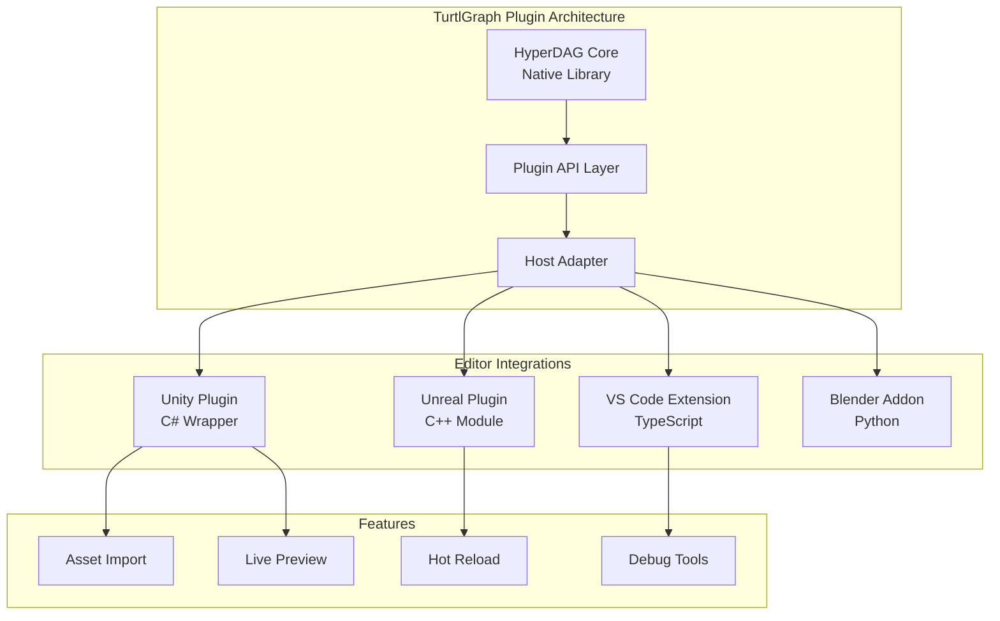
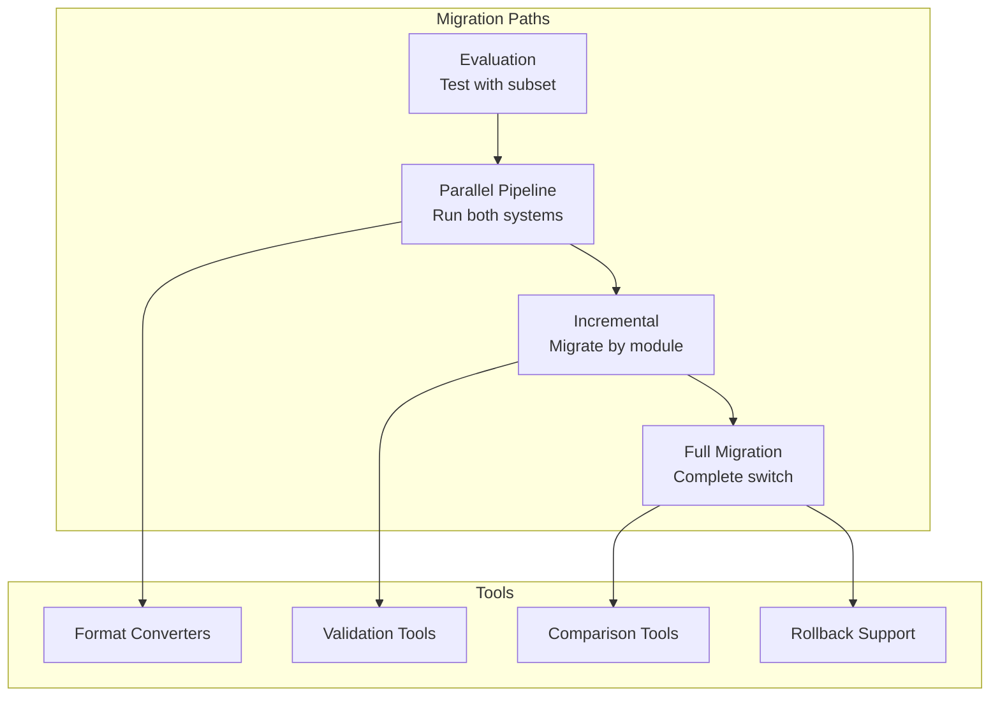

# Volume 2: Development & Integration
## Part 6: Integration & Migration

### Table of Contents
- [Chapter 22: Editor Integration](#chapter-22-editor-integration)
  - [Plugin Architecture](#plugin-architecture)
  - [Unity Integration](#unity-integration)
  - [Unreal Engine Integration](#unreal-engine-integration)
  - [VS Code Extension](#vs-code-extension)
  - [Custom Editor Support](#custom-editor-support)
- [Chapter 23: Language Bindings](#chapter-23-language-bindings)
  - [C/C++ Native API](#cc-native-api)
  - [Python Bindings](#python-bindings)
  - [Rust Bindings](#rust-bindings)
  - [JavaScript/Node.js](#javascriptnodejs)
  - [C# Bindings](#c-bindings)
- [Chapter 25: Migration & Compatibility](#chapter-25-migration--compatibility)
  - [Migration Strategies](#migration-strategies)
  - [Format Converters](#format-converters)
  - [Compatibility Layers](#compatibility-layers)
  - [Version Management](#version-management)
- [Cross-References](#cross-references)
- [Navigation](#navigation)

### Overview

This part covers TurtlGraph's integration with popular game engines, development tools, and programming languages. Chapter 22 details editor plugins and IDE integration. Chapter 23 presents comprehensive language bindings. Chapter 25 provides migration strategies and compatibility layers for transitioning existing projects to TurtlGraph.

---

## Chapter 22: Editor Integration

TurtlGraph provides deep integration with popular game engines and development environments, enabling seamless asset management within existing workflows.

### Plugin Architecture

The TurtlGraph plugin system follows a modular architecture that adapts to each host environment:



#### Core Plugin Interface

```c
// Universal plugin interface
typedef struct {
    uint32_t version;
    const char* name;
    const char* vendor;
    
    // Lifecycle callbacks
    hyperdag_result (*initialize)(void** context, const hyperdag_plugin_config* config);
    hyperdag_result (*shutdown)(void* context);
    
    // Asset operations
    hyperdag_result (*import_asset)(void* context, const char* path, hyperdag_import_options* options);
    hyperdag_result (*export_asset)(void* context, const hyperdag_graph* asset, const char* path);
    
    // Live operations
    hyperdag_result (*on_asset_changed)(void* context, const char* bundle_path, uint64_t asset_id);
    hyperdag_result (*on_hot_reload)(void* context, const hyperdag_bundle* old_bundle, const hyperdag_bundle* new_bundle);
    
    // Editor integration
    void* (*get_preview_data)(void* context, const hyperdag_graph* asset);
    bool (*can_handle_asset)(void* context, const char* asset_type);
} hyperdag_plugin_interface;

// Plugin registration
hyperdag_result hyperdag_register_plugin(
    const hyperdag_plugin_interface* interface,
    hyperdag_plugin_handle* handle
);
```

### Unity Integration

Comprehensive Unity integration with native performance:

```csharp
// Unity plugin implementation
namespace TurtlGraph.Unity
{
    [System.Runtime.InteropServices.DllImport("hyperdag_unity")]
    private static extern IntPtr hyperdag_unity_open(string path);
    
    [System.Runtime.InteropServices.DllImport("hyperdag_unity")]
    private static extern void hyperdag_unity_close(IntPtr bundle);
    
    [System.Runtime.InteropServices.DllImport("hyperdag_unity")]
    private static extern IntPtr hyperdag_unity_get_texture(
        IntPtr bundle, 
        uint assetId,
        out int width,
        out int height,
        out TextureFormat format
    );
    
    // High-level wrapper
    public class TurtlGraphBundle : IDisposable
    {
        private IntPtr handle;
        private Dictionary<uint, UnityEngine.Object> assetCache;
        
        public TurtlGraphBundle(string path)
        {
            handle = hyperdag_unity_open(path);
            if (handle == IntPtr.Zero)
            {
                throw new TurtlGraphException($"Failed to open bundle: {path}");
            }
            
            assetCache = new Dictionary<uint, UnityEngine.Object>();
        }
        
        public T LoadAsset<T>(string assetPath) where T : UnityEngine.Object
        {
            uint assetId = GetAssetId(assetPath);
            
            // Check cache
            if (assetCache.TryGetValue(assetId, out var cached))
            {
                return cached as T;
            }
            
            // Load based on type
            if (typeof(T) == typeof(Texture2D))
            {
                return LoadTexture(assetId) as T;
            }
            else if (typeof(T) == typeof(Mesh))
            {
                return LoadMesh(assetId) as T;
            }
            else if (typeof(T) == typeof(AudioClip))
            {
                return LoadAudioClip(assetId) as T;
            }
            
            throw new TurtlGraphException($"Unsupported asset type: {typeof(T)}");
        }
        
        private Texture2D LoadTexture(uint assetId)
        {
            int width, height;
            TextureFormat format;
            
            IntPtr pixelData = hyperdag_unity_get_texture(
                handle, assetId, out width, out height, out format);
            
            if (pixelData == IntPtr.Zero)
            {
                return null;
            }
            
            // Create Unity texture
            Texture2D texture = new Texture2D(width, height, format, true);
            texture.LoadRawTextureData(pixelData, width * height * GetPixelSize(format));
            texture.Apply(true, true);
            
            // Cache it
            assetCache[assetId] = texture;
            
            return texture;
        }
        
        public void Dispose()
        {
            if (handle != IntPtr.Zero)
            {
                // Clean up cached assets
                foreach (var asset in assetCache.Values)
                {
                    if (asset != null)
                    {
                        UnityEngine.Object.Destroy(asset);
                    }
                }
                
                hyperdag_unity_close(handle);
                handle = IntPtr.Zero;
            }
        }
    }
    
    // Async loading with coroutines
    public class TurtlGraphAsyncLoader : MonoBehaviour
    {
        private Queue<LoadRequest> loadQueue = new Queue<LoadRequest>();
        private bool isLoading = false;
        
        public void LoadBundleAsync(string path, System.Action<TurtlGraphBundle> callback)
        {
            loadQueue.Enqueue(new LoadRequest { Path = path, Callback = callback });
            
            if (!isLoading)
            {
                StartCoroutine(ProcessLoadQueue());
            }
        }
        
        private IEnumerator ProcessLoadQueue()
        {
            isLoading = true;
            
            while (loadQueue.Count > 0)
            {
                var request = loadQueue.Dequeue();
                
                // Load on background thread
                TurtlGraphBundle bundle = null;
                Exception error = null;
                
                var thread = new System.Threading.Thread(() =>
                {
                    try
                    {
                        bundle = new TurtlGraphBundle(request.Path);
                    }
                    catch (Exception e)
                    {
                        error = e;
                    }
                });
                
                thread.Start();
                
                // Wait for completion
                while (thread.IsAlive)
                {
                    yield return null;
                }
                
                // Invoke callback on main thread
                if (error != null)
                {
                    Debug.LogError($"Failed to load bundle: {error.Message}");
                    request.Callback(null);
                }
                else
                {
                    request.Callback(bundle);
                }
            }
            
            isLoading = false;
        }
    }
    
    // Editor integration
    #if UNITY_EDITOR
    [UnityEditor.AssetImporter(version: 1, exts: new[] { "turtlgraph" })]
    public class TurtlGraphImporter : UnityEditor.AssetImporters.ScriptedImporter
    {
        public override void OnImportAsset(UnityEditor.AssetImporters.AssetImportContext ctx)
        {
            var bundle = new TurtlGraphBundle(ctx.assetPath);
            
            // Import all assets from bundle
            foreach (var assetInfo in bundle.GetAssetList())
            {
                UnityEngine.Object asset = null;
                
                switch (assetInfo.Type)
                {
                    case TurtlGraphAssetType.Texture:
                        asset = bundle.LoadAsset<Texture2D>(assetInfo.Path);
                        break;
                    case TurtlGraphAssetType.Mesh:
                        asset = bundle.LoadAsset<Mesh>(assetInfo.Path);
                        break;
                    case TurtlGraphAssetType.Audio:
                        asset = bundle.LoadAsset<AudioClip>(assetInfo.Path);
                        break;
                }
                
                if (asset != null)
                {
                    ctx.AddObjectToAsset(assetInfo.Path, asset);
                }
            }
            
            // Set main object
            var mainAsset = new TurtlGraphBundleAsset { Bundle = bundle };
            ctx.AddObjectToAsset("main", mainAsset);
            ctx.SetMainObject(mainAsset);
        }
    }
    
    // Custom inspector
    [UnityEditor.CustomEditor(typeof(TurtlGraphBundleAsset))]
    public class TurtlGraphBundleInspector : UnityEditor.Editor
    {
        private TurtlGraphBundleAsset bundle;
        private Vector2 scrollPosition;
        
        void OnEnable()
        {
            bundle = target as TurtlGraphBundleAsset;
        }
        
        public override void OnInspectorGUI()
        {
            EditorGUILayout.LabelField("TurtlGraph Bundle", EditorStyles.boldLabel);
            
            // Bundle info
            EditorGUILayout.LabelField($"Version: {bundle.Version}");
            EditorGUILayout.LabelField($"Assets: {bundle.AssetCount}");
            EditorGUILayout.LabelField($"Size: {EditorUtility.FormatBytes(bundle.Size)}");
            
            EditorGUILayout.Space();
            
            // Asset list
            EditorGUILayout.LabelField("Contents", EditorStyles.boldLabel);
            scrollPosition = EditorGUILayout.BeginScrollView(scrollPosition, 
                GUILayout.Height(200));
            
            foreach (var asset in bundle.GetAssets())
            {
                EditorGUILayout.BeginHorizontal();
                
                // Icon based on type
                var icon = GetAssetIcon(asset.Type);
                EditorGUILayout.LabelField(new GUIContent(icon), 
                    GUILayout.Width(20), GUILayout.Height(20));
                
                // Asset path
                EditorGUILayout.LabelField(asset.Path);
                
                // Preview button
                if (GUILayout.Button("Preview", GUILayout.Width(60)))
                {
                    ShowAssetPreview(asset);
                }
                
                EditorGUILayout.EndHorizontal();
            }
            
            EditorGUILayout.EndScrollView();
        }
    }
    #endif
}
```

### Unreal Engine Integration

Native Unreal Engine module with full Blueprint support:

```cpp
// Unreal Engine plugin module
#pragma once

#include "CoreMinimal.h"
#include "Modules/ModuleManager.h"
#include "Engine/StreamableManager.h"
#include "turtlgraph.h"

class FTurtlGraphModule : public IModuleInterface
{
public:
    virtual void StartupModule() override;
    virtual void ShutdownModule() override;
    
    static FTurtlGraphModule& Get()
    {
        return FModuleManager::LoadModuleChecked<FTurtlGraphModule>("TurtlGraph");
    }
};

// Asset factory
UCLASS()
class TURTLGRAPH_API UTurtlGraphFactory : public UFactory
{
    GENERATED_BODY()
    
public:
    UTurtlGraphFactory();
    
    virtual UObject* FactoryCreateFile(
        UClass* InClass,
        UObject* InParent,
        FName InName,
        EObjectFlags Flags,
        const FString& Filename,
        const TCHAR* Parms,
        FFeedbackContext* Warn,
        bool& bOutOperationCanceled
    ) override;
    
    virtual bool FactoryCanImport(const FString& Filename) override;
    
private:
    void ImportBundle(const FString& Path, UObject* Parent);
    UTexture2D* CreateTextureFromTurtlGraph(const hyperdag_graph* Graph);
    UStaticMesh* CreateMeshFromTurtlGraph(const hyperdag_graph* Graph);
};

// Runtime asset loader
UCLASS(BlueprintType)
class TURTLGRAPH_API UTurtlGraphBundle : public UObject
{
    GENERATED_BODY()
    
private:
    hyperdag_bundle* Bundle;
    TMap<FString, TWeakObjectPtr<UObject>> AssetCache;
    
public:
    UFUNCTION(BlueprintCallable, Category = "TurtlGraph")
    static UTurtlGraphBundle* LoadBundle(const FString& Path);
    
    UFUNCTION(BlueprintCallable, Category = "TurtlGraph")
    UObject* LoadAsset(const FString& AssetPath);
    
    UFUNCTION(BlueprintCallable, Category = "TurtlGraph", 
              meta = (DisplayName = "Load Texture"))
    UTexture2D* LoadTexture(const FString& AssetPath);
    
    UFUNCTION(BlueprintCallable, Category = "TurtlGraph",
              meta = (DisplayName = "Load Static Mesh"))
    UStaticMesh* LoadStaticMesh(const FString& AssetPath);
    
    UFUNCTION(BlueprintCallable, Category = "TurtlGraph",
              meta = (DisplayName = "Load Sound"))
    USoundWave* LoadSound(const FString& AssetPath);
    
    UFUNCTION(BlueprintCallable, Category = "TurtlGraph")
    void UnloadAsset(const FString& AssetPath);
    
    UFUNCTION(BlueprintPure, Category = "TurtlGraph")
    TArray<FString> GetAssetList() const;
    
    virtual void BeginDestroy() override;
};

// Implementation
UTurtlGraphBundle* UTurtlGraphBundle::LoadBundle(const FString& Path)
{
    FString FullPath = FPaths::ConvertRelativePathToFull(Path);
    
    hyperdag_bundle* NativeBundle = hyperdag_open(TCHAR_TO_UTF8(*FullPath));
    if (!NativeBundle)
    {
        UE_LOG(LogTurtlGraph, Error, TEXT("Failed to open bundle: %s"), *Path);
        return nullptr;
    }
    
    UTurtlGraphBundle* Bundle = NewObject<UTurtlGraphBundle>();
    Bundle->Bundle = NativeBundle;
    Bundle->AddToRoot(); // Prevent garbage collection
    
    return Bundle;
}

UTexture2D* UTurtlGraphBundle::LoadTexture(const FString& AssetPath)
{
    // Check cache
    if (TWeakObjectPtr<UObject>* Cached = AssetCache.Find(AssetPath))
    {
        if (Cached->IsValid())
        {
            return Cast<UTexture2D>(Cached->Get());
        }
    }
    
    // Load from bundle
    uint64_t AssetId = hyperdag_get_asset_id(Bundle, TCHAR_TO_UTF8(*AssetPath));
    if (AssetId == HYPERDAG_INVALID_ID)
    {
        return nullptr;
    }
    
    const hyperdag_graph* AssetGraph = hyperdag_get_asset(Bundle, AssetId);
    if (!AssetGraph)
    {
        return nullptr;
    }
    
    // Extract texture data
    TurtlGraphTextureInfo Info;
    if (!ExtractTextureInfo(AssetGraph, Info))
    {
        return nullptr;
    }
    
    // Create Unreal texture
    UTexture2D* Texture = UTexture2D::CreateTransient(
        Info.Width, Info.Height, Info.Format);
    
    if (!Texture)
    {
        return nullptr;
    }
    
    // Copy pixel data
    FTexture2DMipMap& Mip = Texture->PlatformData->Mips[0];
    void* Data = Mip.BulkData.Lock(LOCK_READ_WRITE);
    FMemory::Memcpy(Data, Info.PixelData, Info.DataSize);
    Mip.BulkData.Unlock();
    
    // Update texture settings
    Texture->UpdateResource();
    Texture->RefreshSamplerStates();
    
    // Cache it
    AssetCache.Add(AssetPath, Texture);
    
    return Texture;
}

// Hot reload support
class FTurtlGraphHotReloadManager : public FTickableGameObject
{
private:
    TMap<FString, FDateTime> BundleTimestamps;
    TArray<TWeakObjectPtr<UTurtlGraphBundle>> LiveBundles;
    
public:
    virtual void Tick(float DeltaTime) override
    {
        // Check for modified bundles
        for (TWeakObjectPtr<UTurtlGraphBundle>& BundlePtr : LiveBundles)
        {
            if (!BundlePtr.IsValid())
                continue;
                
            UTurtlGraphBundle* Bundle = BundlePtr.Get();
            FString Path = Bundle->GetPath();
            
            FDateTime CurrentTime = IFileManager::Get().GetTimeStamp(*Path);
            FDateTime* LastTime = BundleTimestamps.Find(Path);
            
            if (LastTime && CurrentTime > *LastTime)
            {
                // Bundle has been modified
                ReloadBundle(Bundle);
                BundleTimestamps[Path] = CurrentTime;
            }
        }
    }
    
    void ReloadBundle(UTurtlGraphBundle* Bundle)
    {
        UE_LOG(LogTurtlGraph, Log, TEXT("Hot reloading bundle: %s"), 
               *Bundle->GetPath());
        
        // Notify all users
        OnBundleReloaded.Broadcast(Bundle);
        
        // Reload internal state
        Bundle->Reload();
    }
    
    DECLARE_MULTICAST_DELEGATE_OneParam(FOnBundleReloaded, UTurtlGraphBundle*);
    FOnBundleReloaded OnBundleReloaded;
};

// Blueprint function library
UCLASS()
class TURTLGRAPH_API UTurtlGraphBlueprintLibrary : public UBlueprintFunctionLibrary
{
    GENERATED_BODY()
    
public:
    UFUNCTION(BlueprintCallable, Category = "TurtlGraph",
              meta = (WorldContext = "WorldContextObject"))
    static void PreloadBundleAsync(
        UObject* WorldContextObject,
        const FString& BundlePath,
        const FTurtlGraphPreloadComplete& OnComplete
    );
    
    UFUNCTION(BlueprintPure, Category = "TurtlGraph")
    static bool IsBundleLoaded(const FString& BundlePath);
    
    UFUNCTION(BlueprintCallable, Category = "TurtlGraph")
    static void UnloadBundle(const FString& BundlePath);
    
    UFUNCTION(BlueprintCallable, Category = "TurtlGraph",
              meta = (CallInEditor = "true"))
    static void ValidateBundle(const FString& BundlePath);
};
```

### VS Code Extension

TypeScript-based VS Code extension for TurtlGraph development:

```typescript
// VS Code extension implementation
import * as vscode from 'vscode';
import * as path from 'path';
import { TurtlGraphLanguageClient } from './languageClient';
import { TurtlGraphBundleProvider } from './bundleProvider';
import { TurtlGraphDebuggingProvider } from './debugProvider';

export function activate(context: vscode.ExtensionContext) {
    console.log('TurtlGraph extension is now active');
    
    // Register bundle explorer
    const bundleProvider = new TurtlGraphBundleProvider(context);
    vscode.window.registerTreeDataProvider('turtlgraphBundles', bundleProvider);
    
    // Register commands
    context.subscriptions.push(
        vscode.commands.registerCommand('turtlgraph.openBundle', openBundle),
        vscode.commands.registerCommand('turtlgraph.packAssets', packAssets),
        vscode.commands.registerCommand('turtlgraph.validateBundle', validateBundle),
        vscode.commands.registerCommand('turtlgraph.showBundleInfo', showBundleInfo)
    );
    
    // Language server
    const client = new TurtlGraphLanguageClient(context);
    client.start();
    
    // Debugging support
    const debugProvider = new TurtlGraphDebuggingProvider();
    context.subscriptions.push(
        vscode.debug.registerDebugConfigurationProvider('turtlgraph', debugProvider)
    );
    
    // File watchers
    const watcher = vscode.workspace.createFileSystemWatcher('**/*.turtlgraph');
    watcher.onDidChange(uri => bundleProvider.refresh());
    watcher.onDidCreate(uri => bundleProvider.refresh());
    watcher.onDidDelete(uri => bundleProvider.refresh());
    
    context.subscriptions.push(watcher);
}

// Bundle tree provider
class TurtlGraphBundleProvider implements vscode.TreeDataProvider<BundleItem> {
    private _onDidChangeTreeData = new vscode.EventEmitter<BundleItem | undefined | null | void>();
    readonly onDidChangeTreeData = this._onDidChangeTreeData.event;
    
    private bundles: Map<string, TurtlGraphBundle> = new Map();
    
    constructor(private context: vscode.ExtensionContext) {
        this.loadBundles();
    }
    
    refresh(): void {
        this.loadBundles();
        this._onDidChangeTreeData.fire();
    }
    
    getTreeItem(element: BundleItem): vscode.TreeItem {
        return element;
    }
    
    getChildren(element?: BundleItem): Thenable<BundleItem[]> {
        if (!element) {
            // Root level - show bundles
            return Promise.resolve(
                Array.from(this.bundles.values()).map(bundle => 
                    new BundleItem(bundle.name, bundle.path, 
                        vscode.TreeItemCollapsibleState.Collapsed)
                )
            );
        } else {
            // Show bundle contents
            const bundle = this.bundles.get(element.bundlePath);
            if (!bundle) {
                return Promise.resolve([]);
            }
            
            return this.getBundleContents(bundle);
        }
    }
    
    private async getBundleContents(bundle: TurtlGraphBundle): Promise<BundleItem[]> {
        const items: BundleItem[] = [];
        
        // Group by asset type
        const groups = new Map<string, AssetInfo[]>();
        
        for (const asset of bundle.assets) {
            const type = this.getAssetType(asset.path);
            if (!groups.has(type)) {
                groups.set(type, []);
            }
            groups.get(type)!.push(asset);
        }
        
        // Create tree items
        for (const [type, assets] of groups) {
            const groupItem = new BundleItem(
                `${type} (${assets.length})`,
                bundle.path,
                vscode.TreeItemCollapsibleState.Collapsed,
                type
            );
            
            groupItem.children = assets.map(asset => 
                new BundleItem(
                    path.basename(asset.path),
                    bundle.path,
                    vscode.TreeItemCollapsibleState.None,
                    type,
                    asset
                )
            );
            
            items.push(groupItem);
        }
        
        return items;
    }
}

// Custom editor for .turtlgraph files
class TurtlGraphBundleEditor implements vscode.CustomReadonlyEditorProvider {
    public static readonly viewType = 'turtlgraph.bundleEditor';
    
    constructor(
        private readonly context: vscode.ExtensionContext
    ) {}
    
    async openCustomDocument(
        uri: vscode.Uri,
        openContext: vscode.CustomDocumentOpenContext,
        token: vscode.CancellationToken
    ): Promise<vscode.CustomDocument> {
        const bundle = await this.loadBundle(uri);
        return new TurtlGraphBundleDocument(uri, bundle);
    }
    
    async resolveCustomEditor(
        document: vscode.CustomDocument,
        webviewPanel: vscode.WebviewPanel,
        token: vscode.CancellationToken
    ): Promise<void> {
        webviewPanel.webview.options = {
            enableScripts: true,
            localResourceRoots: [this.context.extensionUri]
        };
        
        webviewPanel.webview.html = this.getHtmlForWebview(
            webviewPanel.webview,
            document as TurtlGraphBundleDocument
        );
        
        // Handle messages from webview
        webviewPanel.webview.onDidReceiveMessage(message => {
            switch (message.command) {
                case 'extractAsset':
                    this.extractAsset(document.uri, message.assetPath);
                    break;
                case 'showAssetInfo':
                    this.showAssetInfo(document.uri, message.assetId);
                    break;
            }
        });
    }
    
    private getHtmlForWebview(
        webview: vscode.Webview,
        document: TurtlGraphBundleDocument
    ): string {
        const scriptUri = webview.asWebviewUri(
            vscode.Uri.joinPath(this.context.extensionUri, 'media', 'bundleViewer.js')
        );
        
        const styleUri = webview.asWebviewUri(
            vscode.Uri.joinPath(this.context.extensionUri, 'media', 'bundleViewer.css')
        );
        
        return `<!DOCTYPE html>
        <html lang="en">
        <head>
            <meta charset="UTF-8">
            <meta name="viewport" content="width=device-width, initial-scale=1.0">
            <link href="${styleUri}" rel="stylesheet">
            <title>TurtlGraph Bundle</title>
        </head>
        <body>
            <div id="bundle-info">
                <h1>${document.bundle.name}</h1>
                <div class="stats">
                    <span>Version: ${document.bundle.version}</span>
                    <span>Assets: ${document.bundle.assetCount}</span>
                    <span>Size: ${this.formatBytes(document.bundle.size)}</span>
                </div>
            </div>
            
            <div id="asset-tree"></div>
            
            <script src="${scriptUri}"></script>
            <script>
                window.bundleData = ${JSON.stringify(document.bundle)};
            </script>
        </body>
        </html>`;
    }
}

// Language server integration
class TurtlGraphLanguageClient {
    private client: LanguageClient;
    
    constructor(context: vscode.ExtensionContext) {
        const serverModule = context.asAbsolutePath(
            path.join('server', 'out', 'server.js')
        );
        
        const serverOptions: ServerOptions = {
            run: { module: serverModule, transport: TransportKind.ipc },
            debug: {
                module: serverModule,
                transport: TransportKind.ipc,
                options: { execArgv: ['--nolazy', '--inspect=6009'] }
            }
        };
        
        const clientOptions: LanguageClientOptions = {
            documentSelector: [
                { scheme: 'file', language: 'turtlgraph-script' },
                { scheme: 'file', pattern: '**/*.turtlgraph.json' }
            ],
            synchronize: {
                fileEvents: vscode.workspace.createFileSystemWatcher('**/.turtlgraph')
            }
        };
        
        this.client = new LanguageClient(
            'turtlgraphLanguageServer',
            'TurtlGraph Language Server',
            serverOptions,
            clientOptions
        );
    }
    
    start(): void {
        this.client.start();
    }
    
    stop(): void {
        return this.client.stop();
    }
}
```

### Custom Editor Support

Framework for integrating TurtlGraph with any editor:

```c
// Generic editor integration framework
typedef struct {
    // Editor metadata
    const char* editor_name;
    const char* editor_version;
    uint32_t api_version;
    
    // Capabilities
    struct {
        bool can_preview_textures;
        bool can_preview_meshes;
        bool can_preview_audio;
        bool supports_hot_reload;
        bool supports_debugging;
    } capabilities;
    
    // Callbacks
    struct {
        // Asset preview generation
        void* (*generate_preview)(const hyperdag_graph* asset, 
                                 int width, int height,
                                 hyperdag_preview_format format);
        
        // Asset import/export
        bool (*can_import_format)(const char* extension);
        hyperdag_result (*import_asset)(const char* path, 
                                       hyperdag_import_options* options,
                                       hyperdag_graph** out_asset);
        
        // Editor UI integration
        void (*show_asset_properties)(const hyperdag_graph* asset);
        void (*show_bundle_explorer)(const hyperdag_bundle* bundle);
        
        // Debugging
        void (*on_breakpoint_hit)(const hyperdag_debug_context* context);
        void (*show_memory_view)(const void* address, size_t size);
    } callbacks;
} hyperdag_editor_integration;

// Preview generation
typedef enum {
    HYPERDAG_PREVIEW_THUMBNAIL,
    HYPERDAG_PREVIEW_FULL,
    HYPERDAG_PREVIEW_ANIMATED
} hyperdag_preview_format;

void* generate_texture_preview(
    const hyperdag_graph* asset,
    int width, int height,
    hyperdag_preview_format format
) {
    // Extract texture data
    hyperdag_texture_info info;
    if (hyperdag_get_texture_info(asset, &info) != HYPERDAG_SUCCESS) {
        return NULL;
    }
    
    // Generate preview based on format
    switch (format) {
        case HYPERDAG_PREVIEW_THUMBNAIL:
            return generate_thumbnail(info.pixels, info.width, info.height,
                                    width, height);
                                    
        case HYPERDAG_PREVIEW_FULL:
            return generate_full_preview(info.pixels, info.width, info.height,
                                       width, height);
                                       
        case HYPERDAG_PREVIEW_ANIMATED:
            if (info.frame_count > 1) {
                return generate_animated_preview(info.pixels, info.width, 
                                               info.height, info.frame_count);
            }
            break;
    }
    
    return NULL;
}

// Blender integration example
#ifdef BLENDER_PLUGIN
static PyObject* hyperdag_blender_import(PyObject* self, PyObject* args) {
    const char* bundle_path;
    const char* asset_path;
    
    if (!PyArg_ParseTuple(args, "ss", &bundle_path, &asset_path)) {
        return NULL;
    }
    
    // Open bundle
    hyperdag_bundle* bundle = hyperdag_open(bundle_path);
    if (!bundle) {
        PyErr_SetString(PyExc_IOError, "Failed to open TurtlGraph bundle");
        return NULL;
    }
    
    // Find asset
    uint64_t asset_id = hyperdag_get_asset_id(bundle, asset_path);
    if (asset_id == HYPERDAG_INVALID_ID) {
        hyperdag_close(bundle);
        PyErr_SetString(PyExc_KeyError, "Asset not found in bundle");
        return NULL;
    }
    
    // Import based on type
    const hyperdag_graph* asset = hyperdag_get_asset(bundle, asset_id);
    const char* asset_type = hyperdag_get_asset_type(asset);
    
    PyObject* result = NULL;
    
    if (strcmp(asset_type, "mesh") == 0) {
        result = import_mesh_to_blender(asset);
    } else if (strcmp(asset_type, "texture") == 0) {
        result = import_texture_to_blender(asset);
    } else if (strcmp(asset_type, "material") == 0) {
        result = import_material_to_blender(asset);
    }
    
    hyperdag_close(bundle);
    return result;
}

static PyMethodDef hyperdag_methods[] = {
    {"import_from_bundle", hyperdag_blender_import, METH_VARARGS,
     "Import an asset from a TurtlGraph bundle"},
    {NULL, NULL, 0, NULL}
};

static struct PyModuleDef hyperdag_module = {
    PyModuleDef_HEAD_INIT,
    "hyperdag_blender",
    "TurtlGraph integration for Blender",
    -1,
    hyperdag_methods
};

PyMODINIT_FUNC PyInit_hyperdag_blender(void) {
    return PyModule_Create(&hyperdag_module);
}
#endif
```

---

## Chapter 23: Language Bindings

TurtlGraph provides idiomatic bindings for major programming languages, ensuring native performance and ease of use.

### C/C++ Native API

The core C API with C++ convenience wrappers:

```cpp
// Modern C++ wrapper
namespace turtlgraph {
    
    // RAII bundle wrapper
    class Bundle {
    private:
        hyperdag_bundle* bundle_;
        
    public:
        explicit Bundle(const std::string& path) 
            : bundle_(hyperdag_open(path.c_str())) {
            if (!bundle_) {
                throw std::runtime_error("Failed to open bundle: " + path);
            }
        }
        
        Bundle(Bundle&& other) noexcept : bundle_(other.bundle_) {
            other.bundle_ = nullptr;
        }
        
        ~Bundle() {
            if (bundle_) {
                hyperdag_close(bundle_);
            }
        }
        
        // Prevent copying
        Bundle(const Bundle&) = delete;
        Bundle& operator=(const Bundle&) = delete;
        
        // Asset access
        template<typename T>
        std::optional<T> load(const std::string& path) const {
            uint64_t id = hyperdag_get_asset_id(bundle_, path.c_str());
            if (id == HYPERDAG_INVALID_ID) {
                return std::nullopt;
            }
            
            return AssetLoader<T>::load(bundle_, id);
        }
        
        // Range-based iteration
        class Iterator {
        private:
            const Bundle* bundle_;
            uint32_t index_;
            
        public:
            Iterator(const Bundle* bundle, uint32_t index) 
                : bundle_(bundle), index_(index) {}
                
            AssetInfo operator*() const {
                return bundle_->get_asset_info(index_);
            }
            
            Iterator& operator++() {
                ++index_;
                return *this;
            }
            
            bool operator!=(const Iterator& other) const {
                return index_ != other.index_;
            }
        };
        
        Iterator begin() const { return Iterator(this, 0); }
        Iterator end() const { return Iterator(this, asset_count()); }
        
        uint32_t asset_count() const {
            return hyperdag_get_asset_count(bundle_);
        }
    };
    
    // Type-safe asset loading
    template<typename T>
    struct AssetLoader {
        static std::optional<T> load(hyperdag_bundle* bundle, uint64_t id);
    };
    
    // Specializations
    template<>
    struct AssetLoader<Texture> {
        static std::optional<Texture> load(hyperdag_bundle* bundle, uint64_t id) {
            const hyperdag_graph* asset = hyperdag_get_asset(bundle, id);
            if (!asset) return std::nullopt;
            
            hyperdag_texture_info info;
            if (hyperdag_get_texture_info(asset, &info) != HYPERDAG_SUCCESS) {
                return std::nullopt;
            }
            
            return Texture{
                .width = info.width,
                .height = info.height,
                .format = info.format,
                .data = std::vector<uint8_t>(
                    info.pixels, 
                    info.pixels + info.data_size
                )
            };
        }
    };
    
    // Async loading with C++20 coroutines
    template<typename T>
    class AsyncBundle {
    private:
        std::unique_ptr<Bundle> bundle_;
        std::thread::id loader_thread_;
        
    public:
        std::future<std::optional<T>> load_async(const std::string& path) {
            return std::async(std::launch::async, [this, path]() {
                return bundle_->load<T>(path);
            });
        }
        
        // C++20 coroutine support
        template<typename T>
        struct AssetAwaiter {
            std::future<std::optional<T>> future;
            
            bool await_ready() { return future.wait_for(0s) == std::future_status::ready; }
            void await_suspend(std::coroutine_handle<> h) {
                std::thread([this, h]() {
                    future.wait();
                    h.resume();
                }).detach();
            }
            std::optional<T> await_resume() { return future.get(); }
        };
        
        AssetAwaiter<T> co_load(const std::string& path) {
            return { load_async<T>(path) };
        }
    };
    
    // Builder pattern for bundle creation
    class BundleBuilder {
    private:
        hyperdag_builder* builder_;
        
    public:
        BundleBuilder() : builder_(hyperdag_builder_create()) {
            if (!builder_) {
                throw std::runtime_error("Failed to create builder");
            }
        }
        
        ~BundleBuilder() {
            if (builder_) {
                hyperdag_builder_destroy(builder_);
            }
        }
        
        BundleBuilder& add_texture(const std::string& path, const Texture& texture) {
            // Implementation
            return *this;
        }
        
        BundleBuilder& add_mesh(const std::string& path, const Mesh& mesh) {
            // Implementation
            return *this;
        }
        
        BundleBuilder& with_compression(CompressionType type, int level = 5) {
            hyperdag_builder_set_compression(builder_, 
                static_cast<hyperdag_compression>(type), level);
            return *this;
        }
        
        Bundle build() {
            hyperdag_bundle* bundle = hyperdag_builder_finalize(builder_);
            builder_ = nullptr;  // Ownership transferred
            return Bundle(bundle);
        }
    };
}
```

### Python Bindings

Pythonic interface with NumPy integration:

```python
# Python bindings using pybind11
import turtlgraph
import numpy as np
from typing import Optional, List, Dict, Any

class Bundle:
    """TurtlGraph bundle for Python"""
    
    def __init__(self, path: str):
        self._handle = turtlgraph._open_bundle(path)
        if not self._handle:
            raise IOError(f"Failed to open bundle: {path}")
    
    def __enter__(self):
        return self
    
    def __exit__(self, exc_type, exc_val, exc_tb):
        self.close()
    
    def close(self):
        if self._handle:
            turtlgraph._close_bundle(self._handle)
            self._handle = None
    
    def load_texture(self, path: str) -> Optional[np.ndarray]:
        """Load texture as NumPy array"""
        data = turtlgraph._load_texture(self._handle, path)
        if data is None:
            return None
        
        # Convert to NumPy array (height, width, channels)
        return np.frombuffer(data['pixels'], dtype=np.uint8).reshape(
            data['height'], data['width'], data['channels']
        )
    
    def load_mesh(self, path: str) -> Optional[Dict[str, np.ndarray]]:
        """Load mesh with vertices, normals, and indices"""
        data = turtlgraph._load_mesh(self._handle, path)
        if data is None:
            return None
        
        return {
            'vertices': np.array(data['vertices'], dtype=np.float32).reshape(-1, 3),
            'normals': np.array(data['normals'], dtype=np.float32).reshape(-1, 3),
            'uvs': np.array(data['uvs'], dtype=np.float32).reshape(-1, 2),
            'indices': np.array(data['indices'], dtype=np.uint32)
        }
    
    def load_json(self, path: str) -> Optional[Dict[str, Any]]:
        """Load JSON data"""
        import json
        data = turtlgraph._load_text(self._handle, path)
        return json.loads(data) if data else None
    
    def list_assets(self, pattern: str = "*") -> List[str]:
        """List all assets matching pattern"""
        return turtlgraph._list_assets(self._handle, pattern)
    
    def __getitem__(self, path: str) -> Any:
        """Dictionary-style access"""
        # Determine type from extension
        if path.endswith(('.png', '.jpg', '.tga')):
            return self.load_texture(path)
        elif path.endswith(('.obj', '.gltf', '.fbx')):
            return self.load_mesh(path)
        elif path.endswith('.json'):
            return self.load_json(path)
        else:
            return turtlgraph._load_raw(self._handle, path)
    
    def __iter__(self):
        """Iterate over all assets"""
        for asset in self.list_assets():
            yield asset
    
    @property
    def info(self) -> Dict[str, Any]:
        """Bundle metadata"""
        return turtlgraph._get_bundle_info(self._handle)

# Async loading with asyncio
import asyncio

class AsyncBundle(Bundle):
    """Async TurtlGraph bundle operations"""
    
    async def load_texture_async(self, path: str) -> Optional[np.ndarray]:
        loop = asyncio.get_event_loop()
        return await loop.run_in_executor(None, self.load_texture, path)
    
    async def load_mesh_async(self, path: str) -> Optional[Dict[str, np.ndarray]]:
        loop = asyncio.get_event_loop()
        return await loop.run_in_executor(None, self.load_mesh, path)
    
    async def load_many(self, paths: List[str]) -> List[Any]:
        """Load multiple assets concurrently"""
        tasks = []
        for path in paths:
            if path.endswith(('.png', '.jpg', '.tga')):
                tasks.append(self.load_texture_async(path))
            elif path.endswith(('.obj', '.gltf', '.fbx')):
                tasks.append(self.load_mesh_async(path))
            else:
                # Fallback to sync loading
                tasks.append(asyncio.create_task(
                    asyncio.to_thread(lambda p: self[p], path)
                ))
        
        return await asyncio.gather(*tasks)

# Builder interface
class BundleBuilder:
    """Build TurtlGraph bundles from Python"""
    
    def __init__(self):
        self._handle = turtlgraph._create_builder()
    
    def add_texture(self, path: str, image: np.ndarray) -> 'BundleBuilder':
        """Add texture from NumPy array"""
        if image.dtype != np.uint8:
            image = (image * 255).astype(np.uint8)
        
        height, width = image.shape[:2]
        channels = image.shape[2] if len(image.shape) > 2 else 1
        
        turtlgraph._builder_add_texture(
            self._handle, path, 
            image.tobytes(), width, height, channels
        )
        return self
    
    def add_mesh(self, path: str, vertices: np.ndarray, 
                 indices: np.ndarray, **kwargs) -> 'BundleBuilder':
        """Add mesh from NumPy arrays"""
        mesh_data = {
            'vertices': vertices.astype(np.float32).tobytes(),
            'indices': indices.astype(np.uint32).tobytes(),
            'vertex_count': len(vertices),
            'index_count': len(indices)
        }
        
        # Optional attributes
        if 'normals' in kwargs:
            mesh_data['normals'] = kwargs['normals'].astype(np.float32).tobytes()
        if 'uvs' in kwargs:
            mesh_data['uvs'] = kwargs['uvs'].astype(np.float32).tobytes()
        
        turtlgraph._builder_add_mesh(self._handle, path, mesh_data)
        return self
    
    def add_json(self, path: str, data: Dict[str, Any]) -> 'BundleBuilder':
        """Add JSON data"""
        import json
        turtlgraph._builder_add_text(self._handle, path, json.dumps(data))
        return self
    
    def with_compression(self, algorithm: str = 'zstd', 
                        level: int = 5) -> 'BundleBuilder':
        """Configure compression"""
        turtlgraph._builder_set_compression(self._handle, algorithm, level)
        return self
    
    def build(self, output_path: str) -> None:
        """Build and save bundle"""
        turtlgraph._builder_finalize(self._handle, output_path)

# Integration with popular libraries
try:
    import PIL.Image
    
    def load_pil_image(bundle: Bundle, path: str) -> Optional[PIL.Image.Image]:
        """Load texture as PIL Image"""
        arr = bundle.load_texture(path)
        if arr is None:
            return None
        return PIL.Image.fromarray(arr)
    
    Bundle.load_pil_image = load_pil_image
except ImportError:
    pass

try:
    import trimesh
    
    def load_trimesh(bundle: Bundle, path: str) -> Optional[trimesh.Trimesh]:
        """Load mesh as trimesh object"""
        data = bundle.load_mesh(path)
        if data is None:
            return None
        return trimesh.Trimesh(
            vertices=data['vertices'],
            faces=data['indices'].reshape(-1, 3)
        )
    
    Bundle.load_trimesh = load_trimesh
except ImportError:
    pass
```

### Rust Bindings

Safe, zero-cost Rust bindings:

```rust
// Rust bindings
use std::path::Path;
use std::ffi::CString;
use std::os::raw::{c_char, c_void};
use std::marker::PhantomData;

// FFI declarations
extern "C" {
    fn hyperdag_open(path: *const c_char) -> *mut c_void;
    fn hyperdag_close(bundle: *mut c_void);
    fn hyperdag_get_asset_id(bundle: *const c_void, path: *const c_char) -> u64;
    fn hyperdag_get_asset(bundle: *const c_void, id: u64) -> *const c_void;
}

// Safe wrapper types
pub struct Bundle {
    ptr: *mut c_void,
}

impl Bundle {
    pub fn open<P: AsRef<Path>>(path: P) -> Result<Self, TurtlGraphError> {
        let path_str = path.as_ref()
            .to_str()
            .ok_or(TurtlGraphError::InvalidPath)?;
        
        let c_path = CString::new(path_str)
            .map_err(|_| TurtlGraphError::InvalidPath)?;
        
        let ptr = unsafe { hyperdag_open(c_path.as_ptr()) };
        
        if ptr.is_null() {
            Err(TurtlGraphError::OpenFailed)
        } else {
            Ok(Bundle { ptr })
        }
    }
    
    pub fn load<T: Asset>(&self, path: &str) -> Result<T, TurtlGraphError> {
        let c_path = CString::new(path)
            .map_err(|_| TurtlGraphError::InvalidPath)?;
        
        let asset_id = unsafe { 
            hyperdag_get_asset_id(self.ptr, c_path.as_ptr()) 
        };
        
        if asset_id == u64::MAX {
            return Err(TurtlGraphError::AssetNotFound);
        }
        
        let asset_ptr = unsafe { hyperdag_get_asset(self.ptr, asset_id) };
        
        if asset_ptr.is_null() {
            return Err(TurtlGraphError::LoadFailed);
        }
        
        T::from_raw(asset_ptr)
    }
    
    pub fn list_assets(&self) -> Vec<String> {
        // Implementation
        vec![]
    }
    
    pub fn iter(&self) -> BundleIterator {
        BundleIterator::new(self)
    }
}

impl Drop for Bundle {
    fn drop(&mut self) {
        unsafe { hyperdag_close(self.ptr) }
    }
}

// Send + Sync for thread safety
unsafe impl Send for Bundle {}
unsafe impl Sync for Bundle {}

// Asset trait for type-safe loading
pub trait Asset: Sized {
    fn from_raw(ptr: *const c_void) -> Result<Self, TurtlGraphError>;
}

// Texture type
#[derive(Debug)]
pub struct Texture {
    pub width: u32,
    pub height: u32,
    pub format: TextureFormat,
    pub data: Vec<u8>,
}

impl Asset for Texture {
    fn from_raw(ptr: *const c_void) -> Result<Self, TurtlGraphError> {
        // Extract texture data from raw pointer
        // Implementation details...
        Ok(Texture {
            width: 0,
            height: 0,
            format: TextureFormat::RGBA8,
            data: vec![],
        })
    }
}

// Mesh type
#[derive(Debug)]
pub struct Mesh {
    pub vertices: Vec<[f32; 3]>,
    pub normals: Vec<[f32; 3]>,
    pub uvs: Vec<[f32; 2]>,
    pub indices: Vec<u32>,
}

impl Asset for Mesh {
    fn from_raw(ptr: *const c_void) -> Result<Self, TurtlGraphError> {
        // Extract mesh data
        Ok(Mesh {
            vertices: vec![],
            normals: vec![],
            uvs: vec![],
            indices: vec![],
        })
    }
}

// Iterator support
pub struct BundleIterator<'a> {
    bundle: &'a Bundle,
    index: usize,
    count: usize,
}

impl<'a> BundleIterator<'a> {
    fn new(bundle: &'a Bundle) -> Self {
        BundleIterator {
            bundle,
            index: 0,
            count: bundle.list_assets().len(),
        }
    }
}

impl<'a> Iterator for BundleIterator<'a> {
    type Item = AssetInfo;
    
    fn next(&mut self) -> Option<Self::Item> {
        if self.index >= self.count {
            return None;
        }
        
        // Get asset info at index
        let info = self.bundle.get_asset_info(self.index);
        self.index += 1;
        
        Some(info)
    }
}

// Async support with tokio
#[cfg(feature = "async")]
use tokio::task;

#[cfg(feature = "async")]
impl Bundle {
    pub async fn load_async<T: Asset + Send + 'static>(
        &self, 
        path: String
    ) -> Result<T, TurtlGraphError> {
        let bundle_ptr = self.ptr;
        
        task::spawn_blocking(move || {
            // Safe because Bundle is Send+Sync
            let bundle = Bundle { ptr: bundle_ptr };
            bundle.load::<T>(&path)
        })
        .await
        .map_err(|_| TurtlGraphError::TaskFailed)?
    }
}

// Builder pattern
pub struct BundleBuilder {
    handle: *mut c_void,
}

impl BundleBuilder {
    pub fn new() -> Result<Self, TurtlGraphError> {
        // Create builder
        Ok(BundleBuilder { handle: std::ptr::null_mut() })
    }
    
    pub fn add_texture(mut self, path: &str, texture: &Texture) -> Self {
        // Add texture
        self
    }
    
    pub fn add_mesh(mut self, path: &str, mesh: &Mesh) -> Self {
        // Add mesh
        self
    }
    
    pub fn with_compression(mut self, algorithm: Compression) -> Self {
        // Set compression
        self
    }
    
    pub fn build<P: AsRef<Path>>(self, path: P) -> Result<(), TurtlGraphError> {
        // Finalize and save
        Ok(())
    }
}

// Error handling
#[derive(Debug, thiserror::Error)]
pub enum TurtlGraphError {
    #[error("Invalid path")]
    InvalidPath,
    #[error("Failed to open bundle")]
    OpenFailed,
    #[error("Asset not found")]
    AssetNotFound,
    #[error("Failed to load asset")]
    LoadFailed,
    #[error("Task failed")]
    TaskFailed,
}

// Serde integration
#[cfg(feature = "serde")]
use serde::{Serialize, Deserialize};

#[cfg(feature = "serde")]
impl Bundle {
    pub fn load_json<T: for<'de> Deserialize<'de>>(
        &self, 
        path: &str
    ) -> Result<T, TurtlGraphError> {
        let json_str = self.load::<String>(path)?;
        serde_json::from_str(&json_str)
            .map_err(|_| TurtlGraphError::LoadFailed)
    }
}
```

### JavaScript/Node.js

Modern JavaScript bindings with TypeScript support:

```typescript
// TypeScript definitions
declare module 'turtlgraph' {
    export interface BundleOptions {
        readonly?: boolean;
        validateOnOpen?: boolean;
        cacheSize?: number;
    }
    
    export interface AssetInfo {
        path: string;
        type: string;
        size: number;
        compressed: boolean;
    }
    
    export interface Texture {
        width: number;
        height: number;
        format: 'rgba8' | 'rgb8' | 'bc7' | 'etc2';
        data: Buffer;
    }
    
    export interface Mesh {
        vertices: Float32Array;
        normals?: Float32Array;
        uvs?: Float32Array;
        indices: Uint32Array;
    }
    
    export class Bundle {
        constructor(path: string, options?: BundleOptions);
        
        load<T = any>(path: string): T | null;
        loadTexture(path: string): Texture | null;
        loadMesh(path: string): Mesh | null;
        loadJSON<T = any>(path: string): T | null;
        
        listAssets(pattern?: string): AssetInfo[];
        hasAsset(path: string): boolean;
        
        close(): void;
        
        readonly path: string;
        readonly version: string;
        readonly assetCount: number;
        readonly size: number;
    }
    
    export class BundleBuilder {
        constructor();
        
        addTexture(path: string, image: Buffer | ImageData): this;
        addMesh(path: string, mesh: Mesh): this;
        addJSON(path: string, data: any): this;
        addFile(path: string, data: Buffer): this;
        
        withCompression(algorithm: 'zstd' | 'lz4', level?: number): this;
        withEncryption(key: Buffer): this;
        
        build(outputPath: string): Promise<void>;
    }
    
    export function openBundle(path: string, options?: BundleOptions): Bundle;
    export function createBuilder(): BundleBuilder;
}

// JavaScript implementation
const turtlgraph = require('bindings')('hyperdag_node');
const { promisify } = require('util');
const fs = require('fs');
const path = require('path');

class Bundle {
    constructor(filePath, options = {}) {
        this.path = filePath;
        this.handle = turtlgraph.open(filePath, options);
        
        if (!this.handle) {
            throw new Error(`Failed to open bundle: ${filePath}`);
        }
        
        // Cache for loaded assets
        this._cache = new Map();
        this._cacheSize = options.cacheSize || 50;
    }
    
    load(assetPath) {
        // Check cache
        if (this._cache.has(assetPath)) {
            return this._cache.get(assetPath);
        }
        
        const asset = turtlgraph.loadAsset(this.handle, assetPath);
        
        if (asset && this._cache.size < this._cacheSize) {
            this._cache.set(assetPath, asset);
        }
        
        return asset;
    }
    
    loadTexture(assetPath) {
        const data = turtlgraph.loadTexture(this.handle, assetPath);
        if (!data) return null;
        
        return {
            width: data.width,
            height: data.height,
            format: data.format,
            data: Buffer.from(data.pixels)
        };
    }
    
    loadMesh(assetPath) {
        const data = turtlgraph.loadMesh(this.handle, assetPath);
        if (!data) return null;
        
        return {
            vertices: new Float32Array(data.vertices),
            normals: data.normals ? new Float32Array(data.normals) : undefined,
            uvs: data.uvs ? new Float32Array(data.uvs) : undefined,
            indices: new Uint32Array(data.indices)
        };
    }
    
    loadJSON(assetPath) {
        const text = turtlgraph.loadText(this.handle, assetPath);
        if (!text) return null;
        
        try {
            return JSON.parse(text);
        } catch (e) {
            console.error(`Failed to parse JSON from ${assetPath}:`, e);
            return null;
        }
    }
    
    async loadAsync(assetPath) {
        return new Promise((resolve, reject) => {
            // Use thread pool for async loading
            turtlgraph.loadAssetAsync(this.handle, assetPath, (err, data) => {
                if (err) reject(err);
                else resolve(data);
            });
        });
    }
    
    listAssets(pattern = '*') {
        return turtlgraph.listAssets(this.handle, pattern);
    }
    
    hasAsset(assetPath) {
        return turtlgraph.hasAsset(this.handle, assetPath);
    }
    
    [Symbol.iterator]() {
        const assets = this.listAssets();
        let index = 0;
        
        return {
            next: () => {
                if (index < assets.length) {
                    return { value: assets[index++], done: false };
                }
                return { done: true };
            }
        };
    }
    
    close() {
        if (this.handle) {
            turtlgraph.close(this.handle);
            this.handle = null;
            this._cache.clear();
        }
    }
    
    get version() {
        return turtlgraph.getVersion(this.handle);
    }
    
    get assetCount() {
        return turtlgraph.getAssetCount(this.handle);
    }
    
    get size() {
        return turtlgraph.getBundleSize(this.handle);
    }
}

// Builder implementation
class BundleBuilder {
    constructor() {
        this.handle = turtlgraph.createBuilder();
        if (!this.handle) {
            throw new Error('Failed to create bundle builder');
        }
    }
    
    addTexture(assetPath, image) {
        if (image instanceof ImageData) {
            // Convert ImageData to Buffer
            image = Buffer.from(image.data);
        }
        
        turtlgraph.addTexture(this.handle, assetPath, image);
        return this;
    }
    
    addMesh(assetPath, mesh) {
        turtlgraph.addMesh(this.handle, assetPath, {
            vertices: Array.from(mesh.vertices),
            normals: mesh.normals ? Array.from(mesh.normals) : null,
            uvs: mesh.uvs ? Array.from(mesh.uvs) : null,
            indices: Array.from(mesh.indices)
        });
        return this;
    }
    
    addJSON(assetPath, data) {
        const json = JSON.stringify(data);
        turtlgraph.addText(this.handle, assetPath, json);
        return this;
    }
    
    addFile(assetPath, data) {
        turtlgraph.addBlob(this.handle, assetPath, data);
        return this;
    }
    
    withCompression(algorithm, level = 5) {
        turtlgraph.setCompression(this.handle, algorithm, level);
        return this;
    }
    
    async build(outputPath) {
        return new Promise((resolve, reject) => {
            turtlgraph.buildBundle(this.handle, outputPath, (err) => {
                if (err) reject(err);
                else resolve();
            });
        });
    }
}

// Convenience functions
function openBundle(path, options) {
    return new Bundle(path, options);
}

function createBuilder() {
    return new BundleBuilder();
}

// Stream support
const { Readable, Transform } = require('stream');

class BundleStream extends Readable {
    constructor(bundle, options = {}) {
        super({ objectMode: true, ...options });
        this.bundle = bundle;
        this.assets = bundle.listAssets();
        this.index = 0;
    }
    
    _read() {
        if (this.index >= this.assets.length) {
            this.push(null);
            return;
        }
        
        const assetInfo = this.assets[this.index++];
        const asset = this.bundle.load(assetInfo.path);
        
        if (asset) {
            this.push({ path: assetInfo.path, data: asset });
        }
    }
}

// Export everything
module.exports = {
    Bundle,
    BundleBuilder,
    openBundle,
    createBuilder,
    BundleStream
};
```

### C# Bindings

.NET bindings with async/await support:

```csharp
using System;
using System.Collections.Generic;
using System.Runtime.InteropServices;
using System.Threading.Tasks;
using System.IO;
using System.Text.Json;

namespace TurtlGraph
{
    // P/Invoke declarations
    internal static class Native
    {
        [DllImport("turtlgraph")]
        public static extern IntPtr hyperdag_open(string path);
        
        [DllImport("turtlgraph")]
        public static extern void hyperdag_close(IntPtr bundle);
        
        [DllImport("turtlgraph")]
        public static extern ulong hyperdag_get_asset_id(IntPtr bundle, string path);
        
        [DllImport("turtlgraph")]
        public static extern IntPtr hyperdag_get_asset(IntPtr bundle, ulong id);
    }
    
    // Main bundle class
    public class Bundle : IDisposable
    {
        private IntPtr handle;
        private readonly Dictionary<string, WeakReference> cache = new();
        
        public string Path { get; }
        
        public Bundle(string path)
        {
            Path = path;
            handle = Native.hyperdag_open(path);
            
            if (handle == IntPtr.Zero)
            {
                throw new TurtlGraphException($"Failed to open bundle: {path}");
            }
        }
        
        public T Load<T>(string assetPath) where T : class
        {
            // Check cache
            if (cache.TryGetValue(assetPath, out var weakRef) && 
                weakRef.IsAlive && weakRef.Target is T cached)
            {
                return cached;
            }
            
            var assetId = Native.hyperdag_get_asset_id(handle, assetPath);
            if (assetId == ulong.MaxValue)
            {
                return null;
            }
            
            var assetPtr = Native.hyperdag_get_asset(handle, assetId);
            if (assetPtr == IntPtr.Zero)
            {
                return null;
            }
            
            T asset = LoadAsset<T>(assetPtr);
            
            // Update cache
            cache[assetPath] = new WeakReference(asset);
            
            return asset;
        }
        
        public async Task<T> LoadAsync<T>(string assetPath) where T : class
        {
            return await Task.Run(() => Load<T>(assetPath));
        }
        
        public async Task<IEnumerable<T>> LoadManyAsync<T>(
            IEnumerable<string> paths) where T : class
        {
            var tasks = paths.Select(p => LoadAsync<T>(p));
            return await Task.WhenAll(tasks);
        }
        
        private T LoadAsset<T>(IntPtr assetPtr) where T : class
        {
            if (typeof(T) == typeof(Texture))
            {
                return LoadTexture(assetPtr) as T;
            }
            else if (typeof(T) == typeof(Mesh))
            {
                return LoadMesh(assetPtr) as T;
            }
            else if (typeof(T).IsAssignableFrom(typeof(JsonDocument)))
            {
                return LoadJson(assetPtr) as T;
            }
            
            throw new NotSupportedException($"Type {typeof(T)} not supported");
        }
        
        public void Dispose()
        {
            if (handle != IntPtr.Zero)
            {
                Native.hyperdag_close(handle);
                handle = IntPtr.Zero;
            }
            
            cache.Clear();
            GC.SuppressFinalize(this);
        }
        
        ~Bundle()
        {
            Dispose();
        }
    }
    
    // Asset types
    public class Texture
    {
        public int Width { get; set; }
        public int Height { get; set; }
        public TextureFormat Format { get; set; }
        public byte[] Data { get; set; }
        
        public Span<byte> GetPixelData() => new Span<byte>(Data);
        
        public Span<T> GetPixelData<T>() where T : unmanaged
        {
            return MemoryMarshal.Cast<byte, T>(GetPixelData());
        }
    }
    
    public class Mesh
    {
        public Vector3[] Vertices { get; set; }
        public Vector3[] Normals { get; set; }
        public Vector2[] UVs { get; set; }
        public int[] Indices { get; set; }
        
        public int VertexCount => Vertices?.Length ?? 0;
        public int TriangleCount => (Indices?.Length ?? 0) / 3;
    }
    
    // LINQ support
    public static class BundleExtensions
    {
        public static IEnumerable<AssetInfo> EnumerateAssets(this Bundle bundle)
        {
            // Implementation
            yield break;
        }
        
        public static IEnumerable<T> LoadAll<T>(this Bundle bundle) where T : class
        {
            return bundle.EnumerateAssets()
                .Select(info => bundle.Load<T>(info.Path))
                .Where(asset => asset != null);
        }
        
        public static IAsyncEnumerable<T> LoadAllAsync<T>(
            this Bundle bundle) where T : class
        {
            return bundle.EnumerateAssets()
                .ToAsyncEnumerable()
                .SelectAwait(async info => await bundle.LoadAsync<T>(info.Path))
                .Where(asset => asset != null);
        }
    }
    
    // Builder
    public class BundleBuilder : IDisposable
    {
        private IntPtr handle;
        
        public BundleBuilder()
        {
            handle = Native.hyperdag_create_builder();
        }
        
        public BundleBuilder AddTexture(string path, Texture texture)
        {
            // Implementation
            return this;
        }
        
        public BundleBuilder AddMesh(string path, Mesh mesh)
        {
            // Implementation
            return this;
        }
        
        public BundleBuilder AddJson<T>(string path, T data)
        {
            var json = JsonSerializer.Serialize(data);
            // Add as text asset
            return this;
        }
        
        public BundleBuilder WithCompression(
            CompressionAlgorithm algorithm, 
            int level = 5)
        {
            // Set compression
            return this;
        }
        
        public async Task BuildAsync(string outputPath)
        {
            await Task.Run(() => Build(outputPath));
        }
        
        public void Build(string outputPath)
        {
            // Finalize bundle
        }
        
        public void Dispose()
        {
            if (handle != IntPtr.Zero)
            {
                Native.hyperdag_destroy_builder(handle);
                handle = IntPtr.Zero;
            }
        }
    }
}
```

---

## Chapter 25: Migration & Compatibility

TurtlGraph provides comprehensive tools and strategies for migrating existing asset pipelines and maintaining compatibility across versions.

### Migration Strategies

Different approaches for various project sizes and requirements:



#### Migration Planning

```yaml
# migration-config.yaml
migration:
  source_format: "unity_assetbundle"
  target_version: "hyperdag_1.0"
  
  phases:
    - name: "evaluation"
      duration: "2 weeks"
      scope:
        - "test_assets/*"
        - "prototypes/*"
      validation:
        - integrity_check: true
        - performance_comparison: true
        - size_comparison: true
    
    - name: "parallel_pipeline"
      duration: "1 month"
      scope:
        - "shared_assets/*"
        - "core_assets/*"
      features:
        - hot_reload: true
        - fallback_enabled: true
        - monitoring: true
    
    - name: "incremental_migration"
      duration: "3 months"
      modules:
        - name: "textures"
          priority: 1
          converter: "texture_converter"
        - name: "meshes"
          priority: 2
          converter: "mesh_converter"
        - name: "audio"
          priority: 3
          converter: "audio_converter"
    
    - name: "full_migration"
      validation:
        - full_integrity_check: true
        - performance_benchmarks: true
        - rollback_test: true

  compatibility:
    maintain_legacy_support: true
    legacy_format_version: "2019.4"
    compatibility_layer: "unity_compat"
    
  rollback:
    enabled: true
    checkpoint_interval: "daily"
    max_checkpoints: 7
```

### Format Converters

Automated conversion from popular formats:

```c
// Universal converter framework
typedef struct {
    const char* name;
    const char* source_format;
    const char* source_version;
    
    // Detection
    bool (*can_convert)(const char* file_path);
    
    // Conversion
    hyperdag_result (*convert)(
        const char* source_path,
        hyperdag_builder* builder,
        const hyperdag_convert_options* options
    );
    
    // Validation
    bool (*validate_conversion)(
        const void* source_data,
        size_t source_size,
        const hyperdag_graph* converted
    );
} hyperdag_converter;

// Unity AssetBundle converter
hyperdag_result convert_unity_bundle(
    const char* source_path,
    hyperdag_builder* builder,
    const hyperdag_convert_options* options
) {
    // Open Unity bundle
    unity_bundle* bundle = unity_open_bundle(source_path);
    if (!bundle) {
        return TURTLGRAPH_ERROR_INVALID_FORMAT;
    }
    
    // Get asset list
    unity_asset_info* assets;
    size_t asset_count;
    unity_get_asset_list(bundle, &assets, &asset_count);
    
    // Progress tracking
    progress_reporter* progress = NULL;
    if (options->progress_callback) {
        progress = create_progress_reporter(
            options->progress_callback,
            options->progress_context,
            asset_count
        );
    }
    
    // Convert each asset
    for (size_t i = 0; i < asset_count; i++) {
        unity_asset* asset = unity_load_asset(bundle, assets[i].id);
        if (!asset) continue;
        
        // Convert based on type
        switch (assets[i].type) {
            case UNITY_TEXTURE2D:
                convert_unity_texture(asset, builder, options);
                break;
                
            case UNITY_MESH:
                convert_unity_mesh(asset, builder, options);
                break;
                
            case UNITY_AUDIOCLIP:
                convert_unity_audio(asset, builder, options);
                break;
                
            case UNITY_PREFAB:
                convert_unity_prefab(asset, builder, options);
                break;
        }
        
        unity_free_asset(asset);
        
        if (progress) {
            update_progress(progress, i + 1);
        }
    }
    
    // Convert dependencies
    if (options->include_dependencies) {
        convert_unity_dependencies(bundle, builder, options);
    }
    
    unity_close_bundle(bundle);
    return TURTLGRAPH_SUCCESS;
}

// Texture conversion with format optimization
void convert_unity_texture(
    unity_asset* asset,
    hyperdag_builder* builder,
    const hyperdag_convert_options* options
) {
    unity_texture2d* texture = (unity_texture2d*)asset->data;
    
    // Determine optimal format
    hyperdag_texture_format target_format = HYPERDAG_FORMAT_RGBA8;
    
    if (options->optimize_formats) {
        target_format = determine_optimal_format(
            texture->format,
            texture->width,
            texture->height,
            analyze_texture_content(texture)
        );
    }
    
    // Convert pixel data
    void* converted_pixels = NULL;
    size_t converted_size = 0;
    
    convert_texture_format(
        texture->pixels,
        texture->format,
        texture->width * texture->height,
        target_format,
        &converted_pixels,
        &converted_size
    );
    
    // Add to bundle
    hyperdag_texture_info info = {
        .width = texture->width,
        .height = texture->height,
        .format = target_format,
        .mip_count = texture->mip_count,
        .pixels = converted_pixels,
        .data_size = converted_size
    };
    
    hyperdag_builder_add_texture(
        builder,
        asset->name,
        &info
    );
    
    free(converted_pixels);
}

// Batch conversion tool
typedef struct {
    const char* source_directory;
    const char* output_directory;
    const char* source_format;
    hyperdag_converter* converter;
    
    // Options
    bool recursive;
    bool validate;
    bool keep_structure;
    
    // Statistics
    atomic_size_t files_processed;
    atomic_size_t files_succeeded;
    atomic_size_t files_failed;
    atomic_size_t bytes_processed;
} batch_convert_context;

void batch_convert_directory(batch_convert_context* ctx) {
    // Find all convertible files
    file_list* files = find_files(
        ctx->source_directory,
        ctx->source_format,
        ctx->recursive
    );
    
    // Create thread pool for parallel conversion
    thread_pool* pool = thread_pool_create(get_cpu_count());
    
    // Queue conversion tasks
    for (size_t i = 0; i < files->count; i++) {
        conversion_task* task = malloc(sizeof(conversion_task));
        task->source_path = files->paths[i];
        task->output_path = compute_output_path(
            files->paths[i],
            ctx->source_directory,
            ctx->output_directory,
            ctx->keep_structure
        );
        task->context = ctx;
        
        thread_pool_submit(pool, convert_file_task, task);
    }
    
    // Wait for completion
    thread_pool_wait(pool);
    thread_pool_destroy(pool);
    
    // Print summary
    printf("Conversion complete:\n");
    printf("  Files processed: %zu\n", ctx->files_processed);
    printf("  Succeeded: %zu\n", ctx->files_succeeded);
    printf("  Failed: %zu\n", ctx->files_failed);
    printf("  Total size: %.2f MB\n", ctx->bytes_processed / (1024.0 * 1024.0));
}
```

### Compatibility Layers

Runtime compatibility for gradual migration:

```cpp
// Compatibility layer interface
class TurtlGraphCompatibilityLayer {
public:
    virtual ~TurtlGraphCompatibilityLayer() = default;
    
    // Asset loading with fallback
    virtual void* LoadAsset(const char* path, AssetType type) = 0;
    
    // Format translation
    virtual bool TranslateAssetPath(
        const char* legacy_path,
        char* hyperdag_path,
        size_t buffer_size
    ) = 0;
    
    // Runtime conversion
    virtual hyperdag_graph* ConvertOnDemand(
        const void* legacy_asset,
        AssetType type
    ) = 0;
};

// Unity compatibility layer
class UnityCompatibilityLayer : public TurtlGraphCompatibilityLayer {
private:
    hyperdag_bundle* bundle_;
    UnityEngine::AssetBundle* legacy_bundle_;
    std::unordered_map<std::string, std::string> path_mapping_;
    LRUCache<std::string, hyperdag_graph*> conversion_cache_;
    
public:
    void* LoadAsset(const char* path, AssetType type) override {
        // Try TurtlGraph first
        if (bundle_) {
            uint64_t id = hyperdag_get_asset_id(bundle_, path);
            if (id != HYPERDAG_INVALID_ID) {
                return LoadFromTurtlGraph(id, type);
            }
        }
        
        // Fall back to Unity
        if (legacy_bundle_) {
            return LoadFromUnity(path, type);
        }
        
        return nullptr;
    }
    
    bool TranslateAssetPath(
        const char* legacy_path,
        char* hyperdag_path,
        size_t buffer_size
    ) override {
        // Check mapping
        auto it = path_mapping_.find(legacy_path);
        if (it != path_mapping_.end()) {
            strncpy(hyperdag_path, it->second.c_str(), buffer_size);
            return true;
        }
        
        // Apply translation rules
        return ApplyPathTranslation(legacy_path, hyperdag_path, buffer_size);
    }
    
private:
    void* LoadFromUnity(const char* path, AssetType type) {
        // Check conversion cache
        auto cached = conversion_cache_.get(path);
        if (cached) {
            return cached;
        }
        
        // Load from Unity
        UnityEngine::Object* unity_asset = legacy_bundle_->LoadAsset(path);
        if (!unity_asset) {
            return nullptr;
        }
        
        // Convert on demand
        hyperdag_graph* converted = ConvertOnDemand(unity_asset, type);
        if (converted) {
            conversion_cache_.put(path, converted);
        }
        
        return converted;
    }
};

// Hybrid loading system
class HybridAssetLoader {
private:
    std::vector<std::unique_ptr<TurtlGraphCompatibilityLayer>> layers_;
    hyperdag_bundle* primary_bundle_;
    
public:
    template<typename T>
    T* Load(const std::string& path) {
        // Try primary bundle
        if (primary_bundle_) {
            if (auto asset = LoadFromBundle<T>(primary_bundle_, path)) {
                return asset;
            }
        }
        
        // Try compatibility layers
        for (auto& layer : layers_) {
            char translated_path[1024];
            if (layer->TranslateAssetPath(
                path.c_str(), translated_path, sizeof(translated_path))) {
                
                if (auto asset = layer->LoadAsset(
                    translated_path, GetAssetType<T>())) {
                    return static_cast<T*>(asset);
                }
            }
        }
        
        return nullptr;
    }
    
    void AddCompatibilityLayer(
        std::unique_ptr<TurtlGraphCompatibilityLayer> layer) {
        layers_.push_back(std::move(layer));
    }
};
```

### Version Management

Handling multiple TurtlGraph versions:

```c
// Version compatibility matrix
typedef struct {
    uint32_t format_version;
    uint32_t min_reader_version;
    uint32_t max_reader_version;
    
    struct {
        bool has_compression;
        bool has_encryption;
        bool has_streaming;
        bool has_dependencies;
    } features;
    
    // Migration functions
    hyperdag_result (*migrate_from_previous)(
        const void* old_data,
        size_t old_size,
        void** new_data,
        size_t* new_size
    );
} hyperdag_version_info;

static const hyperdag_version_info version_history[] = {
    {
        .format_version = 0x00010000,  // 1.0
        .min_reader_version = 0x00010000,
        .max_reader_version = 0x00019999,
        .features = {
            .has_compression = true,
            .has_encryption = false,
            .has_streaming = false,
            .has_dependencies = true
        },
        .migrate_from_previous = NULL
    },
    {
        .format_version = 0x00020000,  // 2.0
        .min_reader_version = 0x00010000,
        .max_reader_version = 0x00029999,
        .features = {
            .has_compression = true,
            .has_encryption = true,
            .has_streaming = true,
            .has_dependencies = true
        },
        .migrate_from_previous = migrate_v1_to_v2
    }
};

// Version negotiation
hyperdag_result hyperdag_open_versioned(
    const char* path,
    hyperdag_bundle** bundle,
    hyperdag_version_options* options
) {
    // Read header to determine version
    hyperdag_header header;
    if (!read_header(path, &header)) {
        return TURTLGRAPH_ERROR_INVALID_HEADER;
    }
    
    // Find version info
    const hyperdag_version_info* version = NULL;
    for (size_t i = 0; i < ARRAY_SIZE(version_history); i++) {
        if (version_history[i].format_version == header.version) {
            version = &version_history[i];
            break;
        }
    }
    
    if (!version) {
        return TURTLGRAPH_ERROR_UNSUPPORTED_VERSION;
    }
    
    // Check if we can read this version
    uint32_t reader_version = hyperdag_get_reader_version();
    if (reader_version < version->min_reader_version ||
        reader_version > version->max_reader_version) {
        
        if (options->allow_migration) {
            return migrate_bundle(path, header.version, reader_version);
        }
        
        return TURTLGRAPH_ERROR_VERSION_MISMATCH;
    }
    
    // Open with version-specific loader
    return open_bundle_with_version(path, bundle, version);
}

// Automatic migration
hyperdag_result migrate_bundle(
    const char* source_path,
    uint32_t source_version,
    uint32_t target_version
) {
    // Find migration path
    migration_step* steps;
    size_t step_count;
    
    if (!find_migration_path(
        source_version, target_version, &steps, &step_count)) {
        return TURTLGRAPH_ERROR_NO_MIGRATION_PATH;
    }
    
    // Create temporary files for intermediate versions
    char temp_paths[MAX_MIGRATION_STEPS][PATH_MAX];
    
    // Perform migration steps
    const char* current_path = source_path;
    
    for (size_t i = 0; i < step_count; i++) {
        const char* output_path = (i == step_count - 1) ? 
            source_path : temp_paths[i];
        
        hyperdag_result result = steps[i].migrate(
            current_path, output_path);
        
        if (result != TURTLGRAPH_SUCCESS) {
            // Clean up temporary files
            cleanup_temp_files(temp_paths, i);
            return result;
        }
        
        current_path = output_path;
    }
    
    return TURTLGRAPH_SUCCESS;
}
```

---

### Cross-References
- See [Chapter 12: Build System](../volume-2-development-integration/part-5-development-tools.md#chapter-12-build-system) for build integration
- See [Chapter 13: Command Line Tools](../volume-2-development-integration/part-5-development-tools.md#chapter-13-command-line-tools) for conversion tools
- See [Chapter 24: Real-World Case Studies](../volume-2-development-integration/part-7-real-world-application.md#chapter-24-real-world-case-studies) for migration examples
- See [Chapter 27: Future Roadmap](../volume-3-advanced-future/part-11-ecosystem-future.md#chapter-27-future-roadmap) for version planning

### Navigation
[← Part 5: Development Tools](../volume-2-development-integration/part-5-development-tools.md) | [Table of Contents](#table-of-contents) | [Part 7: Real-World Application →](../volume-2-development-integration/part-7-real-world-application.md)