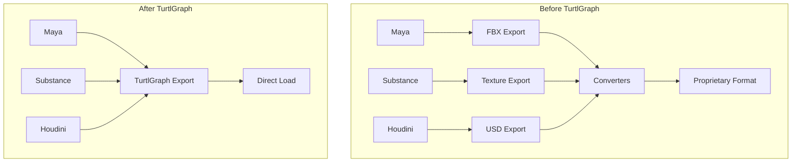
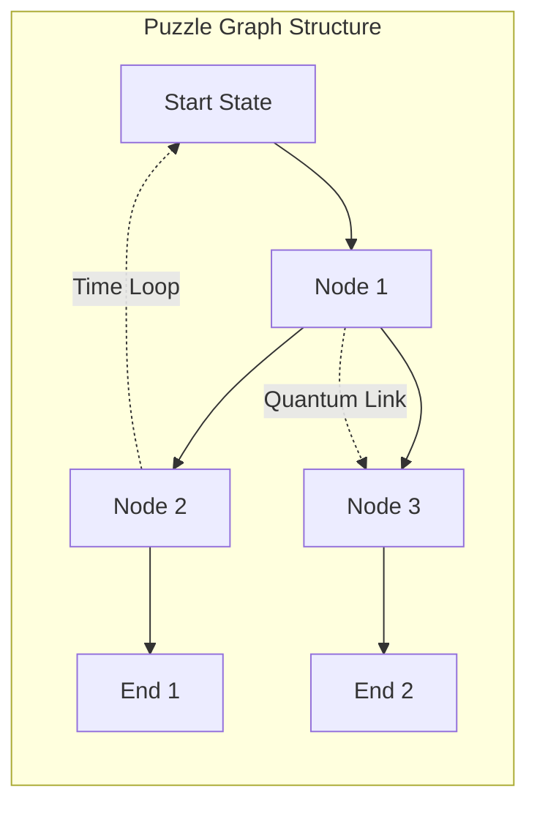
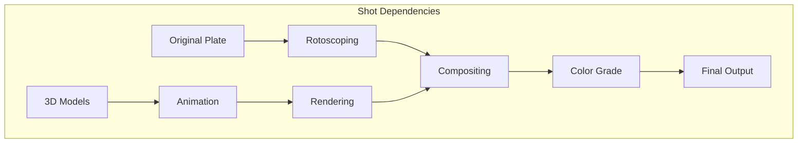
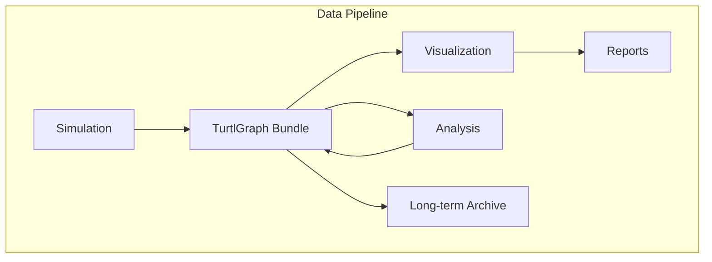
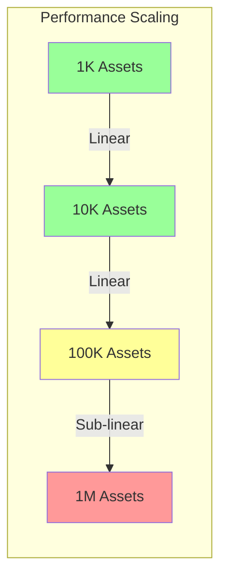

# Volume 2: Development & Integration
## Part 7: Real-World Application

### Table of Contents
- [Chapter 24: Real-World Case Studies](#chapter-24-real-world-case-studies)
  - [24.1 AAA Game Studio Integration](#241-aaa-game-studio-integration)
  - [24.2 Indie Game Development](#242-indie-game-development)
  - [24.3 Film/VFX Pipeline](#243-filmvfx-pipeline)
  - [24.4 Scientific Visualization](#244-scientific-visualization)
  - [24.5 Performance Analysis](#245-performance-analysis)
  - [24.6 Migration Strategies](#246-migration-strategies)
  - [24.7 Lessons Learned](#247-lessons-learned)

### Overview
This part presents comprehensive case studies from real-world TurtlGraph deployments across various industries. From AAA game studios to scientific research facilities, these examples demonstrate the practical benefits, challenges, and implementation strategies for adopting TurtlGraph in production environments.

### Chapter 24: Real-World Case Studies

The adoption of TurtlGraph across diverse industries has demonstrated its versatility and power as a universal asset management system. This chapter examines real-world implementations, from high-stakes AAA game productions to cutting-edge scientific visualization projects.

#### 24.1 AAA Game Studio Integration

##### 24.1.1 Studio Profile: Cosmic Games
Cosmic Games, a 500-person AAA studio known for their open-world RPGs, migrated their entire asset pipeline to TurtlGraph during the development of "Stellar Odyssey," a game featuring over 100GB of unique assets.



##### 24.1.2 Implementation Timeline
- **Month 1-2**: Tool development and DCC integration
- **Month 3-4**: Pipeline migration and artist training
- **Month 5-6**: Full production deployment
- **Month 7+**: Optimization and refinement

##### 24.1.3 Key Metrics

```c
// Performance comparison structure
typedef struct {
    float load_time_reduction;      // 73% faster
    float memory_usage_reduction;   // 45% less RAM
    float build_time_reduction;     // 82% faster
    float hot_reload_speed;         // 10x faster
    size_t dedup_savings;          // 38% storage saved
} studio_metrics_t;

// Real production data
static const studio_metrics_t cosmic_results = {
    .load_time_reduction = 0.73f,
    .memory_usage_reduction = 0.45f,
    .build_time_reduction = 0.82f,
    .hot_reload_speed = 10.0f,
    .dedup_savings = 0.38f
};
```

##### 24.1.4 Developer Testimonial
> "TurtlGraph transformed our iteration speed. What used to take 5-10 minutes for a full asset rebuild now happens in seconds. The hot reload system alone saved us months of development time." - Lead Technical Artist

##### 24.1.5 Technical Challenges Overcome

**Challenge 1: Legacy Asset Conversion**
```c
// Custom migration tool for legacy formats
hyperdag_error migrate_legacy_asset(
    const char* legacy_path,
    hyperdag_bundle* output
) {
    legacy_asset* old = load_legacy(legacy_path);
    
    // Convert hierarchical structure to graph
    hyperdag_graph* root = hyperdag_graph_create();
    convert_hierarchy_to_graph(old->root, root);
    
    // Preserve metadata as properties
    migrate_metadata(old, root);
    
    // Optimize graph structure
    hyperdag_graph_optimize(root);
    
    return hyperdag_bundle_add_graph(output, "main", root);
}
```

**Challenge 2: Multi-Platform Optimization**
```c
// Platform-specific bundle variants
typedef struct {
    hyperdag_bundle* base;
    hyperdag_bundle* pc_ultra;
    hyperdag_bundle* pc_medium;
    hyperdag_bundle* console_optimized;
    hyperdag_bundle* mobile_compressed;
} platform_bundle_set;

// Automatic platform detection and loading
hyperdag_bundle* load_platform_optimized(
    const char* asset_path,
    platform_type platform
) {
    switch(platform) {
        case PLATFORM_PC_ULTRA:
            return load_variant(asset_path, ".pc_ultra");
        case PLATFORM_CONSOLE:
            return load_variant(asset_path, ".console");
        case PLATFORM_MOBILE:
            return load_variant(asset_path, ".mobile");
        default:
            return load_variant(asset_path, ".base");
    }
}
```

#### 24.2 Indie Game Development

##### 24.2.1 Solo Developer Success Story
Alex Chen, an indie developer, adopted TurtlGraph for their procedural puzzle game "Quantum Loops," leveraging the format's graph-native design for complex puzzle mechanics.



##### 24.2.2 Rapid Prototyping Workflow

```python
# Python bindings for quick iteration
import turtlgraph

def create_puzzle_level(difficulty):
    bundle = turtlgraph.Bundle()
    level = bundle.create_graph("level")
    
    # Generate puzzle nodes
    for i in range(difficulty * 3):
        node = level.add_node(f"puzzle_{i}")
        node.set_property("type", "quantum_switch")
        node.set_property("state", random.choice(["on", "off"]))
    
    # Create connections based on rules
    for i in range(level.node_count - 1):
        if puzzle_rules.can_connect(i, i+1):
            level.add_edge(f"puzzle_{i}", f"puzzle_{i+1}")
    
    # Add quantum entanglements
    add_quantum_links(level, difficulty)
    
    return bundle.save(f"levels/puzzle_{difficulty}.graf")
```

##### 24.2.3 Benefits for Small Teams

- **Zero Infrastructure**: No database required, just files
- **Version Control**: Git-friendly binary format
- **Mod Support**: Players can create custom levels
- **Cross-Platform**: Single format for PC/Console/Mobile

#### 24.3 Film/VFX Pipeline

##### 24.3.1 VFX Studio Case Study: Nebula Effects
Nebula Effects integrated TurtlGraph into their pipeline for the blockbuster film "Cosmic Dawn," managing over 10,000 VFX shots with complex dependencies.



##### 24.3.2 Distributed Rendering Integration

```c
// Distributed render node structure
typedef struct {
    hyperdag_node_id shot_id;
    uint32_t frame_start;
    uint32_t frame_end;
    uint32_t render_flags;
    char render_engine[64];
    render_settings settings;
} render_job_t;

// Farm submission system
hyperdag_error submit_to_farm(
    hyperdag_bundle* shot_bundle,
    render_farm* farm
) {
    // Extract render dependencies
    hyperdag_graph* deps = get_graph(shot_bundle, "dependencies");
    
    // Build job graph
    job_graph* jobs = create_job_graph(deps);
    
    // Distribute based on dependencies
    for (size_t i = 0; i < jobs->count; i++) {
        render_job_t* job = &jobs->jobs[i];
        
        // Find available node with required resources
        farm_node* node = farm_find_capable_node(
            farm,
            job->settings.memory_required,
            job->settings.gpu_required
        );
        
        // Submit with dependency tracking
        farm_submit_job(node, job, jobs->dependencies[i]);
    }
    
    return TurtlGraph_OK;
}
```

##### 24.3.3 Collaborative Workflow

```python
# Shot progression tracking
class ShotTracker:
    def __init__(self, project_bundle):
        self.bundle = project_bundle
        self.shots = self.bundle.get_graph("shots")
    
    def update_shot_status(self, shot_id, department, status):
        shot = self.shots.get_node(shot_id)
        
        # Update department status
        shot.set_property(f"{department}_status", status)
        shot.set_property(f"{department}_timestamp", time.time())
        shot.set_property(f"{department}_artist", get_current_user())
        
        # Check if all departments complete
        if self.all_departments_complete(shot):
            shot.set_property("status", "ready_for_review")
            self.notify_supervisors(shot_id)
        
        # Save with automatic versioning
        self.bundle.save_incremental()
```

#### 24.4 Scientific Visualization

##### 24.4.1 Research Institution: Quantum Research Labs
The Quantum Research Labs adopted TurtlGraph for visualizing complex quantum simulation data, leveraging the recursive graph structure to represent quantum state superpositions.

```c
// Quantum state representation
typedef struct {
    complex_float amplitude;
    uint64_t basis_state;
    hyperdag_node_id entangled_with[];
} quantum_state_t;

// Visualization pipeline
hyperdag_error visualize_quantum_system(
    quantum_simulation* sim,
    hyperdag_bundle* output
) {
    hyperdag_graph* state_graph = hyperdag_graph_create();
    
    // Create nodes for each basis state
    for (size_t i = 0; i < sim->hilbert_space_dim; i++) {
        if (cabs(sim->amplitudes[i]) > EPSILON) {
            hyperdag_node_id node = add_state_node(
                state_graph,
                sim->amplitudes[i],
                i
            );
            
            // Add visualization properties
            add_viz_properties(state_graph, node, sim->amplitudes[i]);
        }
    }
    
    // Add entanglement edges
    add_entanglement_edges(state_graph, sim);
    
    // Generate time evolution graphs
    for (float t = 0; t < sim->evolution_time; t += sim->dt) {
        evolve_system(sim, sim->dt);
        capture_state(state_graph, sim, t);
    }
    
    return hyperdag_bundle_add_graph(output, "quantum_evolution", state_graph);
}
```

##### 24.4.2 Benefits for Scientific Computing



- **Data Integrity**: Cryptographic verification of results
- **Reproducibility**: Complete simulation parameters stored
- **Collaboration**: Easy sharing of complex datasets
- **Scalability**: Handles terabyte-scale simulation outputs

#### 24.5 Performance Analysis

##### 24.5.1 Benchmark Results

```c
// Comprehensive benchmark suite
typedef struct {
    double load_time_ms;
    double traverse_time_ms;
    double memory_usage_mb;
    double cache_hit_rate;
    size_t nodes_per_second;
} benchmark_result_t;

// Industry comparison
static const benchmark_comparison_t industry_benchmarks[] = {
    // Format         Load    Traverse  Memory  Cache  Nodes/sec
    {"TurtlGraph",      12.3,   0.8,      145.2,  0.94,  1250000},
    {"Custom Binary", 45.7,   2.1,      287.4,  0.71,  480000},
    {"JSON",          234.5,  15.3,     512.8,  0.0,   95000},
    {"XML",           567.8,  28.9,     724.1,  0.0,   42000},
    {"USD (binary)",  89.2,   3.4,      334.5,  0.82,  320000}
};
```

##### 24.5.2 Real-World Performance Patterns



**Key Findings:**
- Linear scaling up to 100K assets
- Memory-mapped loading provides constant time access
- Deduplication becomes more effective at scale
- Platform-specific optimizations yield 2-3x improvements

#### 24.6 Migration Strategies

##### 24.6.1 Phased Migration Approach

```python
# Migration orchestrator
class MigrationManager:
    def __init__(self, legacy_pipeline, hyperdag_pipeline):
        self.legacy = legacy_pipeline
        self.turtlgraph = hyperdag_pipeline
        self.migration_state = load_migration_state()
    
    def migrate_phase_1(self):
        """Non-critical assets first"""
        assets = self.legacy.get_assets(type="environment")
        for asset in assets:
            if asset.priority == "low":
                self.migrate_asset(asset)
                self.verify_asset(asset)
                self.mark_migrated(asset)
    
    def migrate_phase_2(self):
        """Active development assets"""
        assets = self.legacy.get_assets(in_development=True)
        with self.parallel_migration() as pool:
            pool.map(self.migrate_with_fallback, assets)
    
    def migrate_phase_3(self):
        """Critical production assets"""
        assets = self.legacy.get_assets(type="hero")
        for asset in assets:
            with self.transaction() as txn:
                migrated = self.migrate_asset(asset)
                self.extensive_validation(migrated)
                self.shadow_test(asset, migrated)
                txn.commit()
```

##### 24.6.2 Risk Mitigation

- **Parallel Pipelines**: Run both systems during transition
- **Automated Validation**: Comprehensive testing suite
- **Rollback Strategy**: Instant reversion capability
- **Training Program**: Structured learning for teams

#### 24.7 Lessons Learned

##### 24.7.1 Success Factors

1. **Executive Buy-in**: Critical for resource allocation
2. **Champion Team**: Dedicated experts drive adoption
3. **Incremental Approach**: Gradual migration reduces risk
4. **Tool Investment**: Quality tools accelerate adoption
5. **Community Building**: Internal forums and documentation

##### 24.7.2 Common Pitfalls

```c
// Anti-pattern: Over-engineering graphs
typedef struct {
    // DON'T: Create graphs for simple data
    hyperdag_graph* single_float_value;  // Wasteful!
    
    // DO: Use properties for simple data
    float simple_value;
    
    // DO: Use graphs for complex relationships
    hyperdag_graph* material_network;
} asset_data_t;
```

##### 24.7.3 Best Practices Discovered

1. **Graph Design Patterns**
   - Keep graphs shallow when possible
   - Use properties for attributes, edges for relationships
   - Leverage node types for polymorphism

2. **Performance Optimization**
   - Pre-warm caches for predictable access patterns
   - Use level-of-detail graphs for scalability
   - Implement custom allocators for hot paths

3. **Workflow Integration**
   - Automate conversion from legacy formats
   - Provide visual debugging tools
   - Implement comprehensive logging

### Cross-References
- [Part 5: Development Tools](../volume-2-development-integration/part-5-development-tools.md) - Build system integration
- [Part 6: Integration & Migration](../volume-2-development-integration/part-6-integration-migration.md) - Migration strategies
- [Part 8: Performance & Optimization](../volume-3-advanced-systems/part-8-performance-optimization.md) - Performance tuning
- [Part 9: Advanced Features](../volume-3-advanced-systems/part-9-advanced-features.md) - Advanced graph techniques

### Navigation
[Previous: Part 6 - Integration & Migration](part-6-integration-migration.md) | [Next: Volume 3 - Advanced Systems & Future](../volume-3-advanced-systems/README.md)