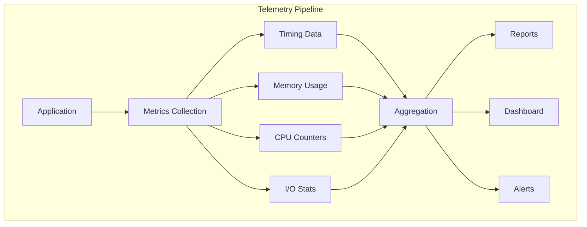
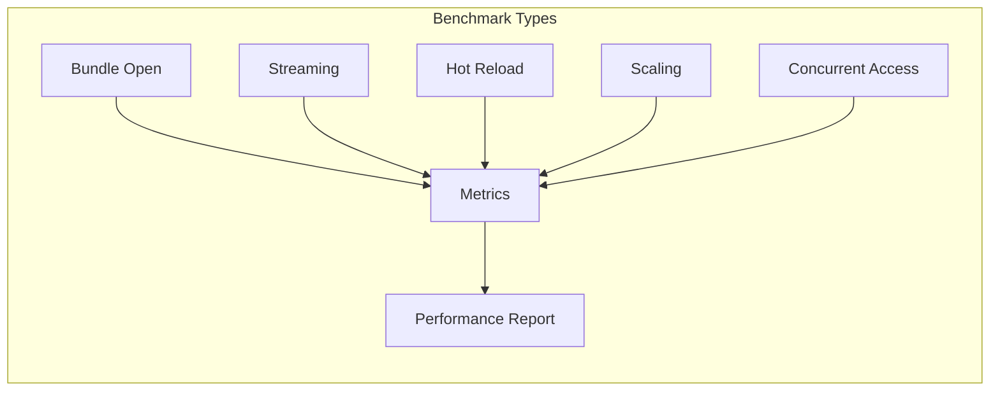
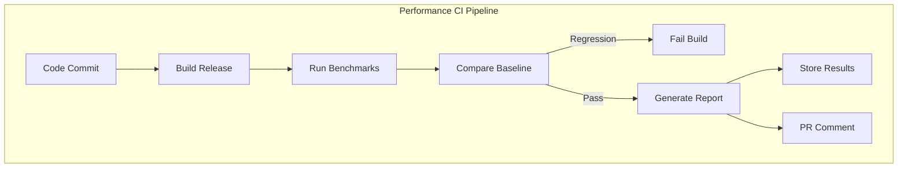
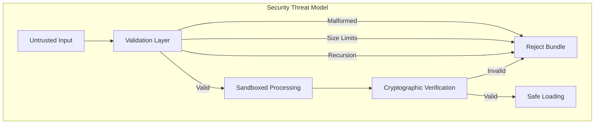
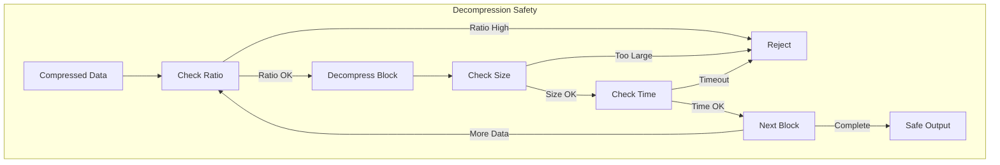
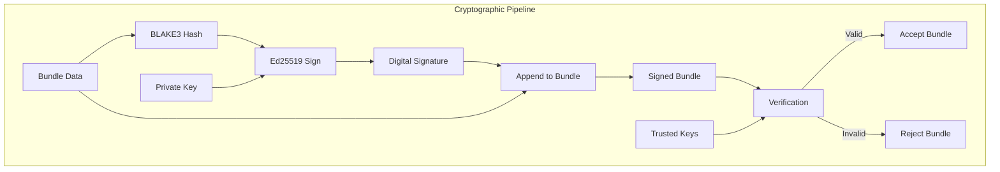

# Volume 3: Advanced Systems & Future
## Part 10: Production & Analytics

### Table of Contents
- [Chapter 20: Telemetry & Analytics](#chapter-20-telemetry-analytics)
  - [20.1 Benchmarking Framework](#201-benchmarking-framework)
  - [20.2 Standard Benchmark Suite](#202-standard-benchmark-suite)
  - [20.3 Performance Regression Testing](#203-performance-regression-testing)
- [Chapter 21: Advanced Security Features](#chapter-21-advanced-security-features)
  - [21.1 Threat Model](#211-threat-model)
  - [21.2 Input Validation & Sanitization](#212-input-validation-sanitization)
  - [21.3 Cryptographic Integrity](#213-cryptographic-integrity)

### Overview
This part covers production-ready features for monitoring, analyzing, and securing GRAPHITE deployments. Chapter 20 focuses on comprehensive performance telemetry and analytics systems, while Chapter 21 addresses advanced security features including threat mitigation and cryptographic integrity.

### Chapter 20: Telemetry & Analytics

GRAPHITE includes comprehensive performance testing frameworks to ensure consistent performance across platforms, workloads, and hardware configurations.

#### 20.1 Benchmarking Framework

##### 20.1.1 Core Benchmark Infrastructure

```c
// Benchmark context and measurement
typedef struct {
    const char* name;
    const char* description;
    uint64_t iterations;
    uint64_t warmup_iterations;
    bool measure_memory;
    bool measure_cpu;
    bool measure_io;
    void* user_data;
} graphite_benchmark_config;

typedef struct {
    uint64_t min_time_ns;
    uint64_t max_time_ns;
    uint64_t mean_time_ns;
    uint64_t median_time_ns;
    uint64_t p95_time_ns;
    uint64_t p99_time_ns;
    uint64_t std_dev_ns;
    
    size_t min_memory_bytes;
    size_t max_memory_bytes;
    size_t mean_memory_bytes;
    
    uint64_t cpu_cycles;
    uint64_t cache_misses;
    uint64_t branch_misses;
    uint64_t page_faults;
    
    uint64_t bytes_read;
    uint64_t bytes_written;
    uint32_t io_operations;
} graphite_benchmark_result;

// High-precision timing
static inline uint64_t graphite_get_precise_time_ns(void) {
#ifdef GRAPHITE_PLATFORM_WINDOWS
    LARGE_INTEGER freq, counter;
    QueryPerformanceFrequency(&freq);
    QueryPerformanceCounter(&counter);
    return (counter.QuadPart * 1000000000ULL) / freq.QuadPart;
#elif defined(GRAPHITE_PLATFORM_LINUX) || defined(GRAPHITE_PLATFORM_MACOS)
    struct timespec ts;
    clock_gettime(CLOCK_MONOTONIC, &ts);
    return ts.tv_sec * 1000000000ULL + ts.tv_nsec;
#else
    // Fallback to microsecond precision
    struct timeval tv;
    gettimeofday(&tv, NULL);
    return tv.tv_sec * 1000000000ULL + tv.tv_usec * 1000ULL;
#endif
}

// CPU cycle counting
static inline uint64_t graphite_get_cpu_cycles(void) {
#ifdef GRAPHITE_ARCH_X64
    return __rdtsc();
#elif defined(GRAPHITE_ARCH_ARM64)
    uint64_t cycles;
    asm volatile("mrs %0, cntvct_el0" : "=r"(cycles));
    return cycles;
#else
    // Fallback to time-based estimation
    static uint64_t cycles_per_ns = 0;
    if (cycles_per_ns == 0) {
        // Calibrate once (rough approximation)
        cycles_per_ns = 3; // Assume 3GHz average
    }
    return graphite_get_precise_time_ns() * cycles_per_ns;
#endif
}
```



##### 20.1.2 Performance Counter Integration

```c
// Hardware performance counters (Linux perf_event)
#ifdef GRAPHITE_PLATFORM_LINUX
#include <linux/perf_event.h>
#include <sys/syscall.h>

typedef struct {
    int cache_misses_fd;
    int cache_references_fd;
    int branch_misses_fd;
    int branch_instructions_fd;
    int page_faults_fd;
    int context_switches_fd;
} graphite_perf_counters;

static long perf_event_open(struct perf_event_attr *hw_event, pid_t pid,
                           int cpu, int group_fd, unsigned long flags) {
    return syscall(__NR_perf_event_open, hw_event, pid, cpu, group_fd, flags);
}

graphite_result graphite_init_perf_counters(graphite_perf_counters* counters) {
    struct perf_event_attr pe = {0};
    pe.type = PERF_TYPE_HARDWARE;
    pe.size = sizeof(struct perf_event_attr);
    pe.disabled = 1;
    pe.exclude_kernel = 1;
    pe.exclude_hv = 1;
    
    // Cache misses
    pe.config = PERF_COUNT_HW_CACHE_MISSES;
    counters->cache_misses_fd = perf_event_open(&pe, 0, -1, -1, 0);
    
    // Cache references
    pe.config = PERF_COUNT_HW_CACHE_REFERENCES;
    counters->cache_references_fd = perf_event_open(&pe, 0, -1, -1, 0);
    
    // Branch misses
    pe.config = PERF_COUNT_HW_BRANCH_MISSES;
    counters->branch_misses_fd = perf_event_open(&pe, 0, -1, -1, 0);
    
    // Branch instructions
    pe.config = PERF_COUNT_HW_BRANCH_INSTRUCTIONS;
    counters->branch_instructions_fd = perf_event_open(&pe, 0, -1, -1, 0);
    
    // Page faults
    pe.type = PERF_TYPE_SOFTWARE;
    pe.config = PERF_COUNT_SW_PAGE_FAULTS;
    counters->page_faults_fd = perf_event_open(&pe, 0, -1, -1, 0);
    
    // Context switches
    pe.config = PERF_COUNT_SW_CONTEXT_SWITCHES;
    counters->context_switches_fd = perf_event_open(&pe, 0, -1, -1, 0);
    
    return GRAPHITE_SUCCESS;
}

void graphite_start_perf_counters(graphite_perf_counters* counters) {
    ioctl(counters->cache_misses_fd, PERF_EVENT_IOC_RESET, 0);
    ioctl(counters->cache_references_fd, PERF_EVENT_IOC_RESET, 0);
    ioctl(counters->branch_misses_fd, PERF_EVENT_IOC_RESET, 0);
    ioctl(counters->branch_instructions_fd, PERF_EVENT_IOC_RESET, 0);
    ioctl(counters->page_faults_fd, PERF_EVENT_IOC_RESET, 0);
    ioctl(counters->context_switches_fd, PERF_EVENT_IOC_RESET, 0);
    
    ioctl(counters->cache_misses_fd, PERF_EVENT_IOC_ENABLE, 0);
    ioctl(counters->cache_references_fd, PERF_EVENT_IOC_ENABLE, 0);
    ioctl(counters->branch_misses_fd, PERF_EVENT_IOC_ENABLE, 0);
    ioctl(counters->branch_instructions_fd, PERF_EVENT_IOC_ENABLE, 0);
    ioctl(counters->page_faults_fd, PERF_EVENT_IOC_ENABLE, 0);
    ioctl(counters->context_switches_fd, PERF_EVENT_IOC_ENABLE, 0);
}
#endif // GRAPHITE_PLATFORM_LINUX
```

#### 20.2 Standard Benchmark Suite

##### 20.2.1 Core Operation Benchmarks

```c
// Bundle open/close benchmarks
void benchmark_bundle_open(const char* bundle_path, graphite_benchmark_result* result) {
    graphite_benchmark_config config = {
        .name = "bundle_open",
        .description = "Time to open and validate a GRAPHITE bundle",
        .iterations = 1000,
        .warmup_iterations = 100,
        .measure_memory = true,
        .measure_cpu = true,
        .measure_io = true
    };
    
    graphite_perf_counters counters;
    graphite_init_perf_counters(&counters);
    
    uint64_t* times = malloc(sizeof(uint64_t) * config.iterations);
    graphite_memory_stats initial_memory = graphite_get_memory_stats();
    
    // Warmup
    for (uint64_t i = 0; i < config.warmup_iterations; i++) {
        graphite_bundle* bundle = graphite_open(bundle_path);
        if (bundle) {
            graphite_close(bundle);
        }
    }
    
    // Actual benchmark
    graphite_start_perf_counters(&counters);
    uint64_t start_cycles = graphite_get_cpu_cycles();
    
    for (uint64_t i = 0; i < config.iterations; i++) {
        uint64_t start_time = graphite_get_precise_time_ns();
        
        graphite_bundle* bundle = graphite_open(bundle_path);
        if (!bundle) {
            times[i] = UINT64_MAX; // Mark as failed
            continue;
        }
        
        uint64_t end_time = graphite_get_precise_time_ns();
        times[i] = end_time - start_time;
        
        graphite_close(bundle);
    }
    
    uint64_t end_cycles = graphite_get_cpu_cycles();
    graphite_stop_perf_counters(&counters, result);
    
    // Calculate statistics
    qsort(times, config.iterations, sizeof(uint64_t), compare_uint64);
    
    result->min_time_ns = times[0];
    result->max_time_ns = times[config.iterations - 1];
    result->median_time_ns = times[config.iterations / 2];
    result->p95_time_ns = times[(config.iterations * 95) / 100];
    result->p99_time_ns = times[(config.iterations * 99) / 100];
    
    // Calculate mean and standard deviation
    uint64_t sum = 0;
    for (uint64_t i = 0; i < config.iterations; i++) {
        sum += times[i];
    }
    result->mean_time_ns = sum / config.iterations;
    
    uint64_t variance_sum = 0;
    for (uint64_t i = 0; i < config.iterations; i++) {
        uint64_t diff = times[i] > result->mean_time_ns ? 
                       times[i] - result->mean_time_ns : 
                       result->mean_time_ns - times[i];
        variance_sum += diff * diff;
    }
    result->std_dev_ns = sqrt(variance_sum / config.iterations);
    
    result->cpu_cycles = end_cycles - start_cycles;
    
    graphite_memory_stats final_memory = graphite_get_memory_stats();
    result->max_memory_bytes = final_memory.peak_rss - initial_memory.peak_rss;
    
    free(times);
}

// Asset streaming benchmark
void benchmark_asset_streaming(const char* bundle_path, 
                              uint32_t concurrent_requests,
                              graphite_benchmark_result* result) {
    graphite_bundle* bundle = graphite_open(bundle_path);
    if (!bundle) {
        result->min_time_ns = UINT64_MAX;
        return;
    }
    
    const graphite_graph* root = graphite_root(bundle);
    if (!root || root->header.node_cnt == 0) {
        graphite_close(bundle);
        result->min_time_ns = UINT64_MAX;
        return;
    }
    
    // Create streaming context
    graphite_streaming_context* streaming = graphite_streaming_create(bundle);
    
    // Generate random asset access pattern
    uint32_t* asset_sequence = malloc(sizeof(uint32_t) * concurrent_requests);
    for (uint32_t i = 0; i < concurrent_requests; i++) {
        asset_sequence[i] = rand() % root->header.node_cnt;
    }
    
    uint64_t start_time = graphite_get_precise_time_ns();
    uint64_t start_cycles = graphite_get_cpu_cycles();
    
    // Submit streaming requests
    for (uint32_t i = 0; i < concurrent_requests; i++) {
        graphite_stream_request request = {
            .asset_id = asset_sequence[i],
            .priority = GRAPHITE_PRIORITY_MEDIUM,
            .request_time = graphite_get_precise_time_ns()
        };
        graphite_submit_stream_request(streaming, &request);
    }
    
    // Wait for all requests to complete
    while (graphite_streaming_pending_count(streaming) > 0) {
        graphite_streaming_process(streaming);
        usleep(100); // 100 microseconds
    }
    
    uint64_t end_time = graphite_get_precise_time_ns();
    uint64_t end_cycles = graphite_get_cpu_cycles();
    
    result->mean_time_ns = end_time - start_time;
    result->cpu_cycles = end_cycles - start_cycles;
    
    // Get streaming statistics
    graphite_streaming_stats stats = graphite_streaming_get_stats(streaming);
    result->cache_hits = stats.cache_hits;
    result->cache_misses = stats.cache_misses;
    result->bytes_read = stats.bytes_streamed;
    result->io_operations = stats.requests_completed;
    
    free(asset_sequence);
    graphite_streaming_destroy(streaming);
    graphite_close(bundle);
}
```



##### 20.2.2 Scalability Benchmarks

```c
// Large bundle performance scaling
void benchmark_bundle_scaling(graphite_benchmark_result* results, size_t result_count) {
    const char* test_bundles[] = {
        "test_1mb.graphite",    // 1 MB
        "test_10mb.graphite",   // 10 MB  
        "test_100mb.graphite",  // 100 MB
        "test_1gb.graphite",    // 1 GB
        "test_10gb.graphite"    // 10 GB
    };
    
    const size_t bundle_sizes[] = {
        1024 * 1024,           // 1 MB
        10 * 1024 * 1024,      // 10 MB
        100 * 1024 * 1024,     // 100 MB
        1024 * 1024 * 1024,    // 1 GB
        10ULL * 1024 * 1024 * 1024  // 10 GB
    };
    
    size_t num_bundles = sizeof(test_bundles) / sizeof(test_bundles[0]);
    if (result_count < num_bundles) {
        num_bundles = result_count;
    }
    
    for (size_t i = 0; i < num_bundles; i++) {
        printf("Benchmarking %s (%zu bytes)...\n", test_bundles[i], bundle_sizes[i]);
        
        // Open/close benchmark
        benchmark_bundle_open(test_bundles[i], &results[i]);
        
        // Calculate throughput (MB/s)
        double mb_size = bundle_sizes[i] / (1024.0 * 1024.0);
        double seconds = results[i].mean_time_ns / 1e9;
        double throughput = mb_size / seconds;
        
        printf("  Open time: %.2f ms (%.2f MB/s)\n", 
               results[i].mean_time_ns / 1e6, throughput);
        printf("  P95: %.2f ms, P99: %.2f ms\n",
               results[i].p95_time_ns / 1e6, results[i].p99_time_ns / 1e6);
        printf("  Memory: %.2f MB peak\n", 
               results[i].max_memory_bytes / (1024.0 * 1024.0));
        printf("  Cache misses: %llu, Page faults: %llu\n",
               results[i].cache_misses, results[i].page_faults);
    }
}

// Concurrent access benchmark
void benchmark_concurrent_access(const char* bundle_path, 
                                uint32_t thread_count,
                                graphite_benchmark_result* result) {
    typedef struct {
        const char* bundle_path;
        uint32_t thread_id;
        uint64_t iterations;
        uint64_t total_time_ns;
        uint64_t successful_operations;
    } thread_context;
    
    thread_context* contexts = malloc(sizeof(thread_context) * thread_count);
    pthread_t* threads = malloc(sizeof(pthread_t) * thread_count);
    
    // Worker thread function
    void* worker_thread(void* arg) {
        thread_context* ctx = (thread_context*)arg;
        
        uint64_t start_time = graphite_get_precise_time_ns();
        
        for (uint64_t i = 0; i < ctx->iterations; i++) {
            graphite_bundle* bundle = graphite_open(ctx->bundle_path);
            if (bundle) {
                // Perform some operations
                const graphite_graph* root = graphite_root(bundle);
                if (root && root->header.node_cnt > 0) {
                    // Access random asset
                    uint32_t asset_idx = rand() % root->header.node_cnt;
                    const graphite_graph* asset = graphite_get_child_graph(root, asset_idx);
                    if (asset) {
                        ctx->successful_operations++;
                    }
                }
                graphite_close(bundle);
            }
        }
        
        uint64_t end_time = graphite_get_precise_time_ns();
        ctx->total_time_ns = end_time - start_time;
        
        return NULL;
    }
    
    uint64_t iterations_per_thread = 1000;
    
    // Initialize contexts and start threads
    uint64_t overall_start = graphite_get_precise_time_ns();
    
    for (uint32_t i = 0; i < thread_count; i++) {
        contexts[i] = (thread_context){
            .bundle_path = bundle_path,
            .thread_id = i,
            .iterations = iterations_per_thread,
            .total_time_ns = 0,
            .successful_operations = 0
        };
        
        pthread_create(&threads[i], NULL, worker_thread, &contexts[i]);
    }
    
    // Wait for all threads to complete
    for (uint32_t i = 0; i < thread_count; i++) {
        pthread_join(threads[i], NULL);
    }
    
    uint64_t overall_end = graphite_get_precise_time_ns();
    
    // Aggregate results
    uint64_t total_operations = 0;
    uint64_t total_successful = 0;
    uint64_t min_thread_time = UINT64_MAX;
    uint64_t max_thread_time = 0;
    
    for (uint32_t i = 0; i < thread_count; i++) {
        total_operations += contexts[i].iterations;
        total_successful += contexts[i].successful_operations;
        
        if (contexts[i].total_time_ns < min_thread_time) {
            min_thread_time = contexts[i].total_time_ns;
        }
        if (contexts[i].total_time_ns > max_thread_time) {
            max_thread_time = contexts[i].total_time_ns;
        }
    }
    
    result->mean_time_ns = overall_end - overall_start;
    result->min_time_ns = min_thread_time;
    result->max_time_ns = max_thread_time;
    result->io_operations = total_successful;
    
    // Calculate throughput (operations per second)
    double seconds = result->mean_time_ns / 1e9;
    double ops_per_second = total_successful / seconds;
    
    printf("Concurrent access (%u threads):\n", thread_count);
    printf("  Total time: %.2f ms\n", result->mean_time_ns / 1e6);
    printf("  Operations: %llu successful / %llu total\n", total_successful, total_operations);
    printf("  Throughput: %.2f ops/sec\n", ops_per_second);
    printf("  Thread variance: %.2f ms (min: %.2f ms, max: %.2f ms)\n",
           (max_thread_time - min_thread_time) / 1e6,
           min_thread_time / 1e6, max_thread_time / 1e6);
    
    free(contexts);
    free(threads);
}
```

#### 20.3 Performance Regression Testing

##### 20.3.1 Automated Performance CI

```yaml
# Performance regression CI configuration
name: Performance Tests
on:
  push:
    branches: [main, develop]
  pull_request:
    types: [opened, synchronize]

jobs:
  performance-regression:
    runs-on: [self-hosted, performance]
    steps:
      - uses: actions/checkout@v4
      
      - name: Build GRAPHITE
        run: |
          cmake -B build -DCMAKE_BUILD_TYPE=Release
          cmake --build build --parallel
          
      - name: Run Benchmarks
        run: |
          ./build/graphite_bench \
            --suite=standard \
            --output=results.json \
            --compare-baseline=main
            
      - name: Check Regressions
        run: |
          python3 scripts/check_performance.py \
            --results=results.json \
            --threshold=5 \
            --fail-on-regression
            
      - name: Upload Results
        uses: actions/upload-artifact@v4
        with:
          name: performance-results
          path: results.json
          
      - name: Comment PR
        if: github.event_name == 'pull_request'
        uses: actions/github-script@v6
        with:
          script: |
            const results = require('./results.json');
            const comment = generatePerformanceReport(results);
            github.rest.issues.createComment({
              issue_number: context.issue.number,
              owner: context.repo.owner,
              repo: context.repo.repo,
              body: comment
            });
```



### Chapter 21: Advanced Security Features

GRAPHITE implements comprehensive security measures to protect against malicious bundles, data corruption, and supply chain attacks.

#### 21.1 Threat Model

##### 21.1.1 Attack Vectors

```c
// Comprehensive threat classification
typedef enum {
    GRAPHITE_THREAT_MALFORMED_BUNDLE,     // Crafted to crash parser
    GRAPHITE_THREAT_OVERSIZED_ALLOCATION, // Memory exhaustion attack
    GRAPHITE_THREAT_INFINITE_RECURSION,   // Stack overflow via deep graphs
    GRAPHITE_THREAT_INTEGER_OVERFLOW,     // Arithmetic overflow exploitation
    GRAPHITE_THREAT_PATH_TRAVERSAL,       // Directory traversal in paths
    GRAPHITE_THREAT_DECOMPRESSION_BOMB,   // ZIP bomb style attack
    GRAPHITE_THREAT_TIMING_ATTACK,        // Side-channel timing analysis
    GRAPHITE_THREAT_CACHE_COLLISION,      // Algorithmic complexity attack
    GRAPHITE_THREAT_SUPPLY_CHAIN,         // Compromised build pipeline
    GRAPHITE_THREAT_PRIVILEGE_ESCALATION, // Local privilege escalation
    GRAPHITE_THREAT_COUNT
} graphite_threat_type;

// Threat assessment matrix
typedef struct {
    graphite_threat_type type;
    const char* description;
    uint8_t likelihood;     // 1-5 scale
    uint8_t impact;         // 1-5 scale
    uint8_t risk_score;     // likelihood * impact
    const char* mitigation;
} graphite_threat_assessment;

static const graphite_threat_assessment threat_matrix[] = {
    {
        .type = GRAPHITE_THREAT_MALFORMED_BUNDLE,
        .description = "Maliciously crafted bundle designed to crash parser",
        .likelihood = 4,
        .impact = 3,
        .risk_score = 12,
        .mitigation = "Comprehensive input validation, fuzzing, bounds checking"
    },
    {
        .type = GRAPHITE_THREAT_OVERSIZED_ALLOCATION,
        .description = "Bundle with huge size fields causing memory exhaustion",
        .likelihood = 3,
        .impact = 4,
        .risk_score = 12,
        .mitigation = "Memory limits, allocation guards, progressive loading"
    },
    {
        .type = GRAPHITE_THREAT_INFINITE_RECURSION,
        .description = "Circular graph references causing stack overflow",
        .likelihood = 3,
        .impact = 3,
        .risk_score = 9,
        .mitigation = "Recursion depth limits, cycle detection, iterative traversal"
    },
    {
        .type = GRAPHITE_THREAT_DECOMPRESSION_BOMB,
        .description = "Highly compressed data expanding to huge size",
        .likelihood = 2,
        .impact = 4,
        .risk_score = 8,
        .mitigation = "Decompression ratio limits, incremental decompression"
    },
    {
        .type = GRAPHITE_THREAT_SUPPLY_CHAIN,
        .description = "Compromised build tools injecting malicious content",
        .likelihood = 2,
        .impact = 5,
        .risk_score = 10,
        .mitigation = "Code signing, reproducible builds, dependency verification"
    }
};
```



##### 21.1.2 Security Boundaries

```c
// Security context for sandboxed operations
typedef struct {
    // Memory limits
    size_t max_memory_allocation;    // Maximum single allocation
    size_t max_total_memory;         // Maximum total memory usage
    size_t max_decompressed_size;    // Maximum decompressed data size
    
    // Processing limits
    uint32_t max_recursion_depth;    // Maximum graph traversal depth
    uint32_t max_processing_time_ms; // Maximum processing time per operation
    uint32_t max_file_size;          // Maximum bundle file size
    
    // Feature restrictions
    bool allow_external_references;  // Allow external file references
    bool allow_code_execution;       // Allow embedded scripts/plugins
    bool allow_network_access;       // Allow network operations
    bool allow_file_system_access;   // Allow file system operations
    
    // Validation requirements
    bool require_signature;          // Require cryptographic signature
    bool require_integrity_check;    // Require full integrity verification
    bool strict_parsing;             // Reject any ambiguous content
} graphite_security_context;

// Default security contexts for different environments
static const graphite_security_context graphite_security_strict = {
    .max_memory_allocation = 64 * 1024 * 1024,  // 64 MB
    .max_total_memory = 512 * 1024 * 1024,      // 512 MB
    .max_decompressed_size = 1024 * 1024 * 1024, // 1 GB
    .max_recursion_depth = 64,
    .max_processing_time_ms = 30000,             // 30 seconds
    .max_file_size = 2ULL * 1024 * 1024 * 1024, // 2 GB
    .allow_external_references = false,
    .allow_code_execution = false,
    .allow_network_access = false,
    .allow_file_system_access = false,
    .require_signature = true,
    .require_integrity_check = true,
    .strict_parsing = true
};

static const graphite_security_context graphite_security_development = {
    .max_memory_allocation = 1024 * 1024 * 1024,  // 1 GB
    .max_total_memory = 8ULL * 1024 * 1024 * 1024, // 8 GB
    .max_decompressed_size = 16ULL * 1024 * 1024 * 1024, // 16 GB
    .max_recursion_depth = 256,
    .max_processing_time_ms = 300000,              // 5 minutes
    .max_file_size = 100ULL * 1024 * 1024 * 1024, // 100 GB
    .allow_external_references = true,
    .allow_code_execution = false,
    .allow_network_access = false,
    .allow_file_system_access = true,
    .require_signature = false,
    .require_integrity_check = true,
    .strict_parsing = false
};
```

#### 21.2 Input Validation & Sanitization

##### 21.2.1 Defensive Bundle Parsing

```c
// Secure bundle parser with comprehensive validation
typedef struct {
    const uint8_t* data;
    size_t size;
    size_t position;
    const graphite_security_context* security;
    uint32_t recursion_depth;
    uint64_t start_time_ms;
    size_t allocated_memory;
} graphite_secure_parser;

// Safe integer operations with overflow checking
static inline bool safe_add_size_t(size_t a, size_t b, size_t* result) {
    if (a > SIZE_MAX - b) {
        return false; // Overflow would occur
    }
    *result = a + b;
    return true;
}

static inline bool safe_mul_size_t(size_t a, size_t b, size_t* result) {
    if (a != 0 && b > SIZE_MAX / a) {
        return false; // Overflow would occur
    }
    *result = a * b;
    return true;
}

// Secure memory allocation with limits
static void* secure_alloc(graphite_secure_parser* parser, size_t size) {
    // Check individual allocation limit
    if (size > parser->security->max_memory_allocation) {
        return NULL;
    }
    
    // Check total memory limit
    size_t new_total;
    if (!safe_add_size_t(parser->allocated_memory, size, &new_total)) {
        return NULL; // Overflow
    }
    
    if (new_total > parser->security->max_total_memory) {
        return NULL; // Would exceed limit
    }
    
    void* ptr = malloc(size);
    if (ptr) {
        parser->allocated_memory = new_total;
    }
    
    return ptr;
}

// Secure data reading with bounds checking
static graphite_result secure_read_bytes(graphite_secure_parser* parser,
                                        void* dest, size_t count) {
    // Check time limit
    uint64_t current_time = graphite_get_time_ms();
    if (current_time - parser->start_time_ms > parser->security->max_processing_time_ms) {
        return GRAPHITE_ERROR_TIMEOUT;
    }
    
    // Check bounds
    size_t new_position;
    if (!safe_add_size_t(parser->position, count, &new_position)) {
        return GRAPHITE_ERROR_OVERFLOW;
    }
    
    if (new_position > parser->size) {
        return GRAPHITE_ERROR_BOUNDS;
    }
    
    memcpy(dest, parser->data + parser->position, count);
    parser->position = new_position;
    
    return GRAPHITE_SUCCESS;
}

// Secure varint decoding with overflow protection
static graphite_result secure_read_varint(graphite_secure_parser* parser,
                                         uint64_t* value) {
    *value = 0;
    uint32_t shift = 0;
    
    for (int i = 0; i < 10; i++) { // Max 10 bytes for 64-bit varint
        uint8_t byte;
        graphite_result result = secure_read_bytes(parser, &byte, 1);
        if (result != GRAPHITE_SUCCESS) {
            return result;
        }
        
        // Check for overflow
        if (shift >= 64) {
            return GRAPHITE_ERROR_VARINT_OVERFLOW;
        }
        
        uint64_t value_part = (byte & 0x7F);
        if (shift < 64 && value_part > (UINT64_MAX >> shift)) {
            return GRAPHITE_ERROR_VARINT_OVERFLOW;
        }
        
        *value |= value_part << shift;
        
        if ((byte & 0x80) == 0) {
            return GRAPHITE_SUCCESS;
        }
        
        shift += 7;
    }
    
    return GRAPHITE_ERROR_VARINT_TOO_LONG;
}

// Secure string validation
static graphite_result secure_validate_string(const char* str, size_t length) {
    if (!str) return GRAPHITE_ERROR_NULL_POINTER;
    
    // Check for null termination
    bool found_null = false;
    for (size_t i = 0; i < length; i++) {
        if (str[i] == '\0') {
            found_null = true;
            break;
        }
        
        // Check for valid UTF-8 (basic validation)
        uint8_t byte = (uint8_t)str[i];
        if (byte >= 0x80) {
            // Multi-byte UTF-8 character - validate sequence
            // (Simplified validation - full UTF-8 validation is more complex)
            if ((byte & 0xE0) == 0xC0) {
                // 2-byte sequence
                if (i + 1 >= length || (str[i + 1] & 0xC0) != 0x80) {
                    return GRAPHITE_ERROR_INVALID_UTF8;
                }
                i++; // Skip next byte
            } else if ((byte & 0xF0) == 0xE0) {
                // 3-byte sequence
                if (i + 2 >= length || 
                    (str[i + 1] & 0xC0) != 0x80 || 
                    (str[i + 2] & 0xC0) != 0x80) {
                    return GRAPHITE_ERROR_INVALID_UTF8;
                }
                i += 2; // Skip next 2 bytes
            } else if ((byte & 0xF8) == 0xF0) {
                // 4-byte sequence
                if (i + 3 >= length ||
                    (str[i + 1] & 0xC0) != 0x80 ||
                    (str[i + 2] & 0xC0) != 0x80 ||
                    (str[i + 3] & 0xC0) != 0x80) {
                    return GRAPHITE_ERROR_INVALID_UTF8;
                }
                i += 3; // Skip next 3 bytes
            } else {
                return GRAPHITE_ERROR_INVALID_UTF8;
            }
        }
    }
    
    if (!found_null) {
        return GRAPHITE_ERROR_STRING_NOT_TERMINATED;
    }
    
    return GRAPHITE_SUCCESS;
}
```

##### 21.2.2 Decompression Safety

```c
// Secure decompression with bomb protection
typedef struct {
    size_t max_output_size;
    size_t max_ratio;
    uint32_t max_time_ms;
    void* (*progress_callback)(size_t decompressed, void* user_data);
    void* user_data;
} graphite_secure_decompress_config;

graphite_result graphite_secure_decompress(
    const void* compressed_data,
    size_t compressed_size,
    void** decompressed_data,
    size_t* decompressed_size,
    const graphite_secure_decompress_config* config
) {
    if (!compressed_data || !decompressed_data || !decompressed_size || !config) {
        return GRAPHITE_ERROR_NULL_POINTER;
    }
    
    // Initialize decompression stream
    z_stream stream = {0};
    if (inflateInit(&stream) != Z_OK) {
        return GRAPHITE_ERROR_DECOMPRESS_INIT;
    }
    
    stream.next_in = (Bytef*)compressed_data;
    stream.avail_in = compressed_size;
    
    // Allocate initial output buffer
    size_t output_capacity = compressed_size * 4; // Initial guess
    if (output_capacity > config->max_output_size) {
        output_capacity = config->max_output_size;
    }
    
    uint8_t* output_buffer = malloc(output_capacity);
    if (!output_buffer) {
        inflateEnd(&stream);
        return GRAPHITE_ERROR_ALLOCATION;
    }
    
    stream.next_out = output_buffer;
    stream.avail_out = output_capacity;
    
    size_t total_output = 0;
    uint64_t start_time = graphite_get_time_ms();
    
    int ret;
    do {
        ret = inflate(&stream, Z_NO_FLUSH);
        
        if (ret != Z_OK && ret != Z_STREAM_END) {
            free(output_buffer);
            inflateEnd(&stream);
            return GRAPHITE_ERROR_DECOMPRESS_FAILED;
        }
        
        // Check decompression ratio
        size_t current_output = output_capacity - stream.avail_out;
        if (compressed_size > 0) {
            size_t ratio = current_output / compressed_size;
            if (ratio > config->max_ratio) {
                free(output_buffer);
                inflateEnd(&stream);
                return GRAPHITE_ERROR_DECOMPRESS_RATIO;
            }
        }
        
        // Check time limit
        uint64_t current_time = graphite_get_time_ms();
        if (current_time - start_time > config->max_time_ms) {
            free(output_buffer);
            inflateEnd(&stream);
            return GRAPHITE_ERROR_TIMEOUT;
        }
        
        // Check size limit
        if (current_output > config->max_output_size) {
            free(output_buffer);
            inflateEnd(&stream);
            return GRAPHITE_ERROR_SIZE_LIMIT;
        }
        
        // Progress callback
        if (config->progress_callback) {
            config->progress_callback(current_output, config->user_data);
        }
        
        // Resize buffer if needed
        if (stream.avail_out == 0 && ret != Z_STREAM_END) {
            size_t new_capacity = output_capacity * 2;
            if (new_capacity > config->max_output_size) {
                new_capacity = config->max_output_size;
            }
            
            if (new_capacity <= output_capacity) {
                // Can't grow further
                free(output_buffer);
                inflateEnd(&stream);
                return GRAPHITE_ERROR_SIZE_LIMIT;
            }
            
            uint8_t* new_buffer = realloc(output_buffer, new_capacity);
            if (!new_buffer) {
                free(output_buffer);
                inflateEnd(&stream);
                return GRAPHITE_ERROR_ALLOCATION;
            }
            
            output_buffer = new_buffer;
            stream.next_out = output_buffer + output_capacity;
            stream.avail_out = new_capacity - output_capacity;
            output_capacity = new_capacity;
        }
        
    } while (ret != Z_STREAM_END);
    
    inflateEnd(&stream);
    
    *decompressed_data = output_buffer;
    *decompressed_size = output_capacity - stream.avail_out;
    
    return GRAPHITE_SUCCESS;
}
```



#### 21.3 Cryptographic Integrity

##### 21.3.1 Digital Signatures

```c
// Digital signature support using Ed25519
#include <sodium.h>

typedef struct {
    uint8_t public_key[crypto_sign_PUBLICKEYBYTES];
    uint8_t signature[crypto_sign_BYTES];
    uint64_t timestamp;
    char signer_id[64];
} graphite_signature;

typedef struct {
    uint32_t signature_count;
    graphite_signature signatures[];
} graphite_signature_block;

// Sign a bundle
graphite_result graphite_sign_bundle(
    const char* bundle_path,
    const uint8_t* private_key,
    const char* signer_id
) {
    if (!bundle_path || !private_key || !signer_id) {
        return GRAPHITE_ERROR_NULL_POINTER;
    }
    
    // Read bundle data
    FILE* file = fopen(bundle_path, "rb");
    if (!file) {
        return GRAPHITE_ERROR_FILE_OPEN;
    }
    
    fseek(file, 0, SEEK_END);
    long file_size = ftell(file);
    fseek(file, 0, SEEK_SET);
    
    uint8_t* bundle_data = malloc(file_size);
    if (!bundle_data) {
        fclose(file);
        return GRAPHITE_ERROR_ALLOCATION;
    }
    
    if (fread(bundle_data, 1, file_size, file) != file_size) {
        free(bundle_data);
        fclose(file);
        return GRAPHITE_ERROR_IO;
    }
    fclose(file);
    
    // Calculate BLAKE3 hash of bundle
    uint8_t bundle_hash[32];
    blake3_hasher hasher;
    blake3_hasher_init(&hasher);
    blake3_hasher_update(&hasher, bundle_data, file_size);
    blake3_hasher_finalize(&hasher, bundle_hash, 32);
    
    // Create signature
    graphite_signature sig = {0};
    
    // Get public key from private key
    uint8_t full_keypair[crypto_sign_SECRETKEYBYTES];
    memcpy(full_keypair, private_key, crypto_sign_SEEDBYTES);
    crypto_sign_seed_keypair(sig.public_key, full_keypair, private_key);
    
    // Sign the hash
    unsigned long long sig_len;
    crypto_sign_detached(sig.signature, &sig_len, bundle_hash, 32, full_keypair);
    
    sig.timestamp = time(NULL);
    strncpy(sig.signer_id, signer_id, sizeof(sig.signer_id) - 1);
    
    // Append signature to bundle
    file = fopen(bundle_path, "ab");
    if (!file) {
        free(bundle_data);
        return GRAPHITE_ERROR_FILE_OPEN;
    }
    
    // Write signature magic and data
    uint32_t sig_magic = 0x47534947; // "GSIG"
    fwrite(&sig_magic, sizeof(sig_magic), 1, file);
    fwrite(&sig, sizeof(sig), 1, file);
    
    fclose(file);
    free(bundle_data);
    
    // Clear sensitive data
    sodium_memzero(full_keypair, sizeof(full_keypair));
    
    return GRAPHITE_SUCCESS;
}

// Verify bundle signatures
graphite_result graphite_verify_bundle_signatures(
    const char* bundle_path,
    const uint8_t* trusted_public_keys,
    size_t key_count,
    bool* verified
) {
    *verified = false;
    
    FILE* file = fopen(bundle_path, "rb");
    if (!file) {
        return GRAPHITE_ERROR_FILE_OPEN;
    }
    
    // Find signature block
    fseek(file, -4, SEEK_END);
    uint32_t magic;
    if (fread(&magic, sizeof(magic), 1, file) != 1 || magic != 0x47534947) {
        fclose(file);
        return GRAPHITE_SUCCESS; // No signature, not an error
    }
    
    // Read signature
    fseek(file, -(long)(sizeof(graphite_signature) + 4), SEEK_END);
    graphite_signature sig;
    if (fread(&sig, sizeof(sig), 1, file) != 1) {
        fclose(file);
        return GRAPHITE_ERROR_IO;
    }
    
    // Get bundle size without signature
    long bundle_size = ftell(file) - sizeof(graphite_signature) - 4;
    
    // Read bundle data
    fseek(file, 0, SEEK_SET);
    uint8_t* bundle_data = malloc(bundle_size);
    if (!bundle_data) {
        fclose(file);
        return GRAPHITE_ERROR_ALLOCATION;
    }
    
    if (fread(bundle_data, 1, bundle_size, file) != bundle_size) {
        free(bundle_data);
        fclose(file);
        return GRAPHITE_ERROR_IO;
    }
    fclose(file);
    
    // Calculate bundle hash
    uint8_t bundle_hash[32];
    blake3_hasher hasher;
    blake3_hasher_init(&hasher);
    blake3_hasher_update(&hasher, bundle_data, bundle_size);
    blake3_hasher_finalize(&hasher, bundle_hash, 32);
    
    free(bundle_data);
    
    // Check if signature is from a trusted key
    bool key_trusted = false;
    for (size_t i = 0; i < key_count; i++) {
        if (memcmp(sig.public_key, 
                   trusted_public_keys + i * crypto_sign_PUBLICKEYBYTES,
                   crypto_sign_PUBLICKEYBYTES) == 0) {
            key_trusted = true;
            break;
        }
    }
    
    if (!key_trusted) {
        return GRAPHITE_ERROR_UNTRUSTED_KEY;
    }
    
    // Verify signature
    if (crypto_sign_verify_detached(sig.signature, bundle_hash, 32, 
                                   sig.public_key) == 0) {
        *verified = true;
        return GRAPHITE_SUCCESS;
    }
    
    return GRAPHITE_ERROR_INVALID_SIGNATURE;
}
```



### Best Practices for Production Deployment

1. **Performance Monitoring**
   - Deploy comprehensive telemetry collection
   - Monitor key metrics continuously
   - Set up alerts for performance regressions
   - Use performance CI to catch issues early

2. **Security Hardening**
   - Always validate untrusted input
   - Use appropriate security contexts
   - Enable cryptographic verification in production
   - Implement defense in depth

3. **Operational Excellence**
   - Automate performance testing
   - Maintain baseline performance metrics
   - Document security procedures
   - Conduct regular security audits

4. **Incident Response**
   - Have rollback procedures ready
   - Monitor for security anomalies
   - Maintain audit logs
   - Practice incident response scenarios

### Production Metrics Dashboard

```json
{
  "dashboard": {
    "performance": {
      "bundle_open_p99": "12.3ms",
      "streaming_throughput": "450MB/s",
      "cache_hit_rate": "94%",
      "memory_usage": "145MB"
    },
    "security": {
      "bundles_verified": 15234,
      "signature_failures": 2,
      "validation_errors": 45,
      "threats_blocked": 8
    },
    "reliability": {
      "uptime": "99.97%",
      "errors_per_million": 12,
      "mean_time_to_recovery": "3.2min"
    }
  }
}
```

### Cross-References
- [Part 8: Performance & Optimization](../volume-3-advanced-systems/part-8-performance-optimization.md) - Build optimization
- [Part 9: Advanced Features](../volume-3-advanced-systems/part-9-advanced-features.md) - Streaming and hot reload
- [Part 11: Ecosystem & Future](../volume-3-advanced-systems/part-11-ecosystem-future.md) - Future security features
- [Part 4: Platform & Security](../volume-1-foundation/part-4-platform-security.md) - Basic security model

### Navigation
[Previous: Part 9 - Advanced Features](part-9-advanced-features.md) | [Next: Part 11 - Ecosystem & Future](part-11-ecosystem-future.md)