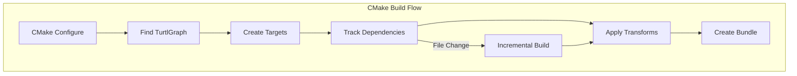
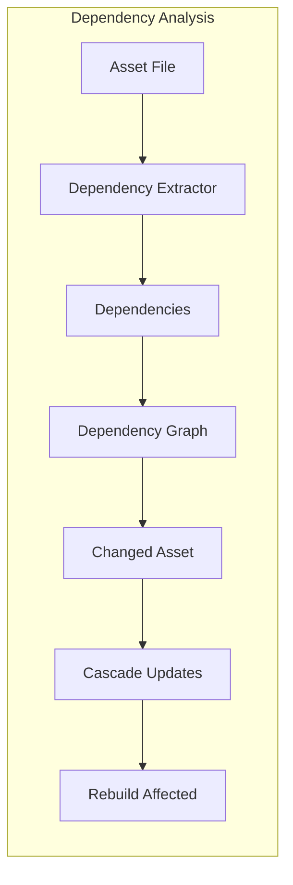
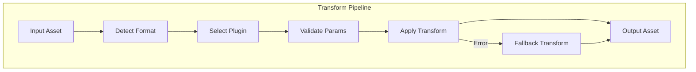
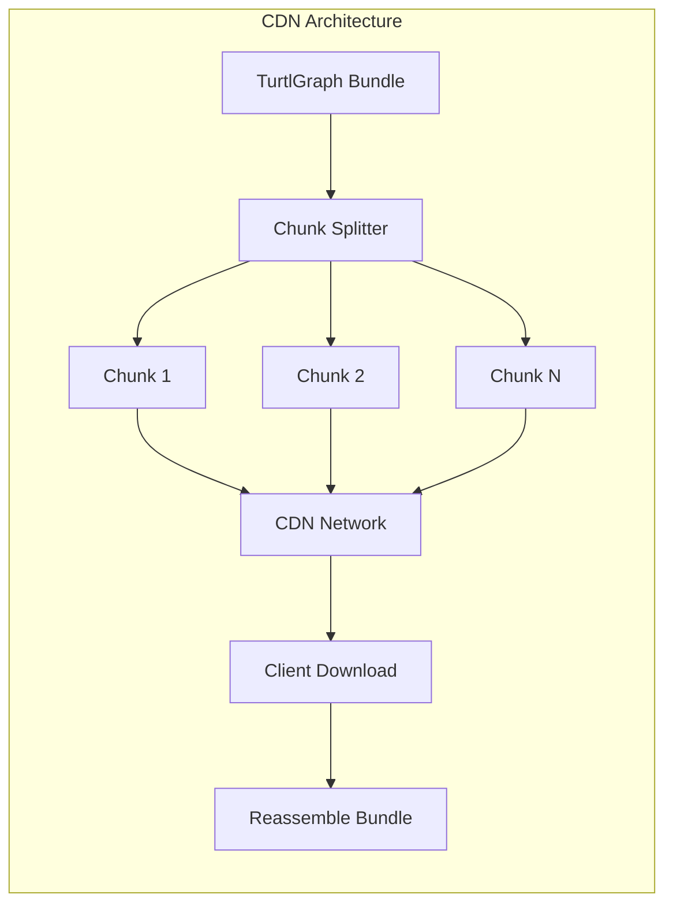
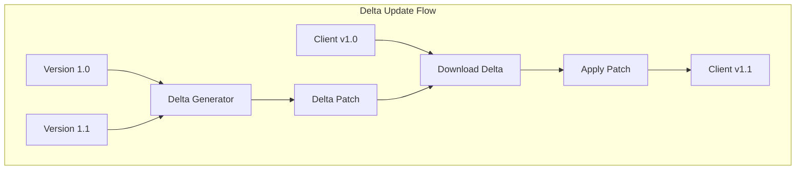
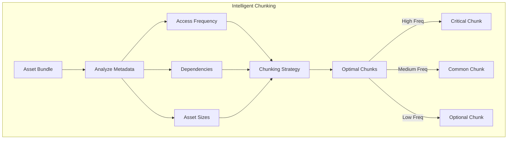

# Volume 3: Advanced Systems & Future
## Part 8: Performance & Optimization

### Table of Contents
- [Chapter 15: Performance Optimization](#chapter-15-performance-optimization)
  - [15.1 Build System Integration](#151-build-system-integration)
  - [15.2 Continuous Integration Integration](#152-continuous-integration-integration)
  - [15.3 Asset Dependency Tracking](#153-asset-dependency-tracking)
  - [15.4 Custom Transform Pipeline](#154-custom-transform-pipeline)
- [Chapter 16: Advanced Integration Patterns](#chapter-16-advanced-integration-patterns)
  - [16.1 CDN-Optimized Bundle Structure](#161-cdn-optimized-bundle-structure)
  - [16.2 CDN Deployment Tools](#162-cdn-deployment-tools)
  - [16.3 CDN Integration APIs](#163-cdn-integration-apis)
  - [16.4 CDN Optimization Strategies](#164-cdn-optimization-strategies)

### Overview
This part covers advanced performance optimization techniques and integration patterns for TurtlGraph. Chapter 15 focuses on asset pipeline integration, enabling seamless incorporation into existing build systems and workflows. Chapter 16 explores content delivery network integration, providing efficient distribution mechanisms for large-scale deployments.

### Chapter 15: Performance Optimization

TurtlGraph is designed for seamless integration into existing asset build pipelines, providing comprehensive hooks for automated bundle generation, dependency tracking, and incremental builds.

#### 15.1 Build System Integration

##### 15.1.1 CMake Integration

```cmake
# FindTurtlGraph.cmake module
find_package(TurtlGraph REQUIRED)

# Create bundle target
hyperdag_add_bundle(MyGame_Assets
    SOURCES ${ASSET_FILES}
    OUTPUT ${CMAKE_BINARY_DIR}/assets/game.turtlgraph
    COMPRESSION zstd
    INTEGRITY blake3
    HOT_RELOAD $<CONFIG:Debug>
)

# Dependency tracking
hyperdag_add_dependencies(MyGame_Assets
    DEPENDS texture_processor mesh_optimizer
    TRIGGERS ${SHADER_FILES} ${TEXTURE_FILES}
)

# Custom build rules
hyperdag_add_transform(texture_transform
    INPUT_PATTERN "*.png;*.jpg;*.tga"
    OUTPUT_PATTERN "*.g_tex"
    COMMAND texture_processor --format bc7 --mips --output $output $input
    CACHE_KEY content_hash
)
```



##### 15.1.2 Ninja Integration

```ninja
# Direct ninja rule for TurtlGraph bundles
rule hyperdag_pack
  command = turtlgraph pack --config $config --output $out $in
  description = Packing TurtlGraph bundle $out
  deps = gcc
  depfile = $out.d

build assets/game.turtlgraph: hyperdag_pack $assets | hyperdag_config.json
  config = release

# Incremental rebuild support
rule hyperdag_incremental
  command = turtlgraph update --bundle $bundle --changed $in
  description = Updating TurtlGraph bundle $bundle
  deps = gcc
  depfile = $bundle.d

build assets/game.turtlgraph: hyperdag_incremental assets/textures/player.png
  bundle = assets/game.turtlgraph
```

##### 15.1.3 Bazel Integration

```python
# //tools/turtlgraph:defs.bzl
def hyperdag_bundle(name, srcs, compression="zstd", integrity="blake3", **kwargs):
    native.genrule(
        name = name,
        srcs = srcs,
        outs = [name + ".turtlgraph"],
        cmd = "$(location //tools/turtlgraph:pack) " +
              "--compression=%s --integrity=%s " % (compression, integrity) +
              "--output $@ $(SRCS)",
        tools = ["//tools/turtlgraph:pack"],
        **kwargs
    )

# BUILD file usage
hyperdag_bundle(
    name = "game_assets",
    srcs = glob(["assets/**/*"]),
    compression = "zstd",
    integrity = "blake3",
)
```

##### 15.1.4 Make Integration

```makefile
# Traditional Makefile support
TurtlGraph := turtlgraph
ASSET_DIR := assets
OUTPUT_DIR := build

%.turtlgraph: $(shell find $(ASSET_DIR) -type f)
	$(TurtlGraph) pack --config release.json --output $@ $(ASSET_DIR)

# Dependency tracking with .d files
include $(wildcard *.d)

game.turtlgraph: assets.d
	$(TurtlGraph) pack --output $@ --depfile $@.d $(ASSET_DIR)
```

#### 15.2 Continuous Integration Integration

##### 15.2.1 GitHub Actions

```yaml
name: Build Assets
on: [push, pull_request]

jobs:
  build-assets:
    runs-on: ubuntu-latest
    steps:
      - uses: actions/checkout@v4
      
      - name: Install TurtlGraph
        run: |
          wget https://github.com/turtlgraph/releases/latest/turtlgraph-linux-x64.tar.gz
          tar -xzf turtlgraph-linux-x64.tar.gz
          sudo mv turtlgraph /usr/local/bin/
          
      - name: Build Asset Bundles
        run: |
          turtlgraph pack --config ci.json --output dist/game.turtlgraph assets/
          
      - name: Validate Bundles
        run: |
          turtlgraph verify dist/game.turtlgraph
          turtlgraph benchmark --quick dist/game.turtlgraph
          
      - name: Upload Bundles
        uses: actions/upload-artifact@v4
        with:
          name: asset-bundles
          path: dist/*.turtlgraph
```

##### 15.2.2 Jenkins Pipeline

```groovy
pipeline {
    agent any
    
    stages {
        stage('Build Assets') {
            steps {
                sh '''
                    turtlgraph pack --config jenkins.json \
                        --output build/assets.turtlgraph \
                        --progress \
                        assets/
                '''
            }
        }
        
        stage('Quality Gates') {
            parallel {
                stage('Integrity Check') {
                    steps {
                        sh 'turtlgraph verify build/assets.turtlgraph'
                    }
                }
                stage('Performance Check') {
                    steps {
                        sh '''
                            turtlgraph benchmark build/assets.turtlgraph > perf.txt
                            python3 scripts/check_performance_regression.py perf.txt
                        '''
                    }
                }
                stage('Size Check') {
                    steps {
                        sh '''
                            SIZE=$(stat -c%s build/assets.turtlgraph)
                            if [ $SIZE -gt 104857600 ]; then  # 100MB
                                echo "Bundle size $SIZE exceeds 100MB limit"
                                exit 1
                            fi
                        '''
                    }
                }
            }
        }
    }
    
    post {
        always {
            archiveArtifacts artifacts: 'build/*.turtlgraph', fingerprint: true
            publishTestResults testResultsPattern: 'test-results.xml'
        }
    }
}
```

#### 15.3 Asset Dependency Tracking

##### 15.3.1 Dependency Graph Generation

```c
// Automatic dependency extraction during pack
typedef struct {
    const char* asset_path;
    const char** dependencies;
    size_t dependency_count;
    uint64_t content_hash;
    uint64_t dependency_hash;
} hyperdag_asset_info;

// Plugin interface for custom dependency extractors
typedef struct {
    const char* file_extension;
    hyperdag_asset_info* (*extract_deps)(const char* file_path);
    void (*free_info)(hyperdag_asset_info* info);
} hyperdag_dependency_extractor;

// Built-in extractors
extern const hyperdag_dependency_extractor hyperdag_gltf_extractor;
extern const hyperdag_dependency_extractor hyperdag_fbx_extractor;
extern const hyperdag_dependency_extractor hyperdag_material_extractor;
```



##### 15.3.2 Incremental Build Support

```json
{
  "incremental_config": {
    "cache_directory": ".hyperdag_cache",
    "hash_algorithm": "blake3",
    "dependency_tracking": true,
    "parallel_analysis": true,
    "max_cache_size_mb": 1024
  },
  "build_rules": [
    {
      "pattern": "*.gltf",
      "dependencies": ["textures", "materials"],
      "cache_key": "content_and_deps"
    },
    {
      "pattern": "*.hlsl",
      "dependencies": ["includes"],
      "cache_key": "content_only"
    }
  ]
}
```

#### 15.4 Custom Transform Pipeline

##### 15.4.1 Transform Plugin Architecture

```c
// Transform plugin interface
typedef struct {
    const char* name;
    const char* version;
    const char** input_formats;
    const char** output_formats;
    
    // Transform function
    hyperdag_result (*transform)(
        const void* input_data,
        size_t input_size,
        const char* input_format,
        void** output_data,
        size_t* output_size,
        const char* output_format,
        const hyperdag_transform_params* params
    );
    
    // Optional: validate parameters
    bool (*validate_params)(const hyperdag_transform_params* params);
    
    // Optional: estimate output size
    size_t (*estimate_output_size)(size_t input_size, const hyperdag_transform_params* params);
} hyperdag_transform_plugin;

// Registration
void hyperdag_register_transform(const hyperdag_transform_plugin* plugin);
```



##### 15.4.2 Transform Configuration

```json
{
  "transforms": [
    {
      "name": "texture_compress",
      "plugin": "texture_tools",
      "input_patterns": ["*.png", "*.jpg", "*.tga"],
      "output_format": "bc7",
      "parameters": {
        "quality": "high",
        "generate_mips": true,
        "max_size": 2048
      }
    },
    {
      "name": "mesh_optimize",
      "plugin": "meshoptimizer",
      "input_patterns": ["*.gltf", "*.fbx"],
      "output_format": "optimized_mesh",
      "parameters": {
        "vertex_cache_optimize": true,
        "overdraw_optimize": true,
        "vertex_fetch_optimize": true
      }
    },
    {
      "name": "shader_compile",
      "plugin": "shader_compiler",
      "input_patterns": ["*.hlsl", "*.glsl"],
      "output_format": "spirv",
      "parameters": {
        "optimization_level": 3,
        "target_vulkan": "1.3",
        "target_dx12": true
      }
    }
  ]
}
```

### Chapter 16: Advanced Integration Patterns

TurtlGraph provides first-class support for CDN deployment and delta updates, enabling efficient content delivery for live service games and applications.

#### 16.1 CDN-Optimized Bundle Structure

##### 16.1.1 Chunk-Based Distribution

```c
// CDN chunk header
typedef struct {
    char magic[4];              // "GCHK"
    uint8_t version;            // Format version
    uint8_t flags;              // Compression, encryption flags
    uint16_t reserved;          // Future use
    uint64_t chunk_id;          // Unique chunk identifier
    uint64_t content_hash;      // BLAKE3 hash of decompressed content
    uint32_t compressed_size;   // Size of compressed data
    uint32_t uncompressed_size; // Size after decompression
    uint64_t bundle_id;         // Parent bundle identifier
    uint32_t chunk_index;       // Index within bundle
    uint32_t total_chunks;      // Total chunks in bundle
} hyperdag_cdn_chunk_header;

// CDN manifest
typedef struct {
    char magic[4];              // "GMAN"
    uint8_t version;
    uint8_t reserved[3];
    uint64_t bundle_id;
    uint64_t bundle_version;
    uint32_t chunk_count;
    uint32_t total_size;
    hyperdag_cdn_chunk_info chunks[];
} hyperdag_cdn_manifest;
```



##### 16.1.2 Delta Update System

```c
// Delta patch header
typedef struct {
    char magic[4];              // "GDLT"
    uint8_t version;
    uint8_t compression;        // zstd, lz4, etc.
    uint16_t flags;
    uint64_t base_version;      // Source bundle version
    uint64_t target_version;    // Destination bundle version
    uint32_t operation_count;   // Number of delta operations
    uint64_t base_hash;         // Hash of base bundle
    uint64_t target_hash;       // Hash of target bundle
} hyperdag_delta_header;

// Delta operations
typedef enum {
    TurtlGraph_DELTA_COPY,        // Copy from base
    TurtlGraph_DELTA_INSERT,      // Insert new data
    TurtlGraph_DELTA_DELETE,      // Delete range
    TurtlGraph_DELTA_REPLACE      // Replace range
} hyperdag_delta_operation_type;

typedef struct {
    hyperdag_delta_operation_type type;
    uint64_t offset;            // Offset in target
    uint32_t length;            // Length of operation
    uint64_t source_offset;     // For COPY operations
    // Followed by inline data for INSERT/REPLACE
} hyperdag_delta_operation;
```

#### 16.2 CDN Deployment Tools

##### 16.2.1 Bundle Chunking

```bash
# Split bundle into CDN-optimized chunks
turtlgraph cdn-split game.turtlgraph \
    --chunk-size 4MB \
    --output-dir cdn_chunks/ \
    --manifest cdn_manifest.json \
    --compression zstd \
    --level 9

# Generate chunk URLs for CDN
turtlgraph cdn-upload-config \
    --manifest cdn_manifest.json \
    --base-url https://cdn.example.com/assets/ \
    --output upload_config.json
```

##### 16.2.2 Delta Generation

```bash
# Generate delta between versions
turtlgraph delta-create \
    --base game_v1.0.turtlgraph \
    --target game_v1.1.turtlgraph \
    --output game_v1.0_to_v1.1.delta \
    --compression zstd \
    --level 9

# Validate delta
turtlgraph delta-verify \
    --base game_v1.0.turtlgraph \
    --delta game_v1.0_to_v1.1.delta \
    --expected game_v1.1.turtlgraph
```



#### 16.3 CDN Integration APIs

##### 16.3.1 Chunk Download Manager

```c
// CDN download configuration
typedef struct {
    const char* base_url;
    const char* auth_token;
    uint32_t max_concurrent_downloads;
    uint32_t retry_count;
    uint32_t timeout_seconds;
    bool verify_chunks;
    const char* cache_directory;
} hyperdag_cdn_config;

// Async chunk downloader
typedef struct hyperdag_cdn_downloader hyperdag_cdn_downloader;

hyperdag_cdn_downloader* hyperdag_cdn_create(const hyperdag_cdn_config* config);
void hyperdag_cdn_destroy(hyperdag_cdn_downloader* downloader);

// Download bundle with progress tracking
typedef void (*hyperdag_progress_callback)(
    uint64_t bytes_downloaded,
    uint64_t total_bytes,
    uint32_t chunks_completed,
    uint32_t total_chunks,
    void* user_data
);

hyperdag_result hyperdag_cdn_download_bundle(
    hyperdag_cdn_downloader* downloader,
    const char* manifest_url,
    const char* output_path,
    hyperdag_progress_callback progress,
    void* user_data
);

// Check for updates
typedef struct {
    uint64_t current_version;
    uint64_t latest_version;
    uint64_t delta_size;
    bool update_available;
    const char* delta_url;
} hyperdag_update_info;

hyperdag_result hyperdag_cdn_check_update(
    hyperdag_cdn_downloader* downloader,
    const char* current_bundle_path,
    const char* version_check_url,
    hyperdag_update_info* update_info
);
```

##### 16.3.2 Delta Application

```c
// Apply delta patch
hyperdag_result hyperdag_delta_apply(
    const char* base_bundle_path,
    const char* delta_path,
    const char* output_path,
    hyperdag_progress_callback progress,
    void* user_data
);

// Verify applied delta
hyperdag_result hyperdag_delta_verify_result(
    const char* patched_bundle_path,
    const char* expected_hash,
    uint64_t expected_version
);

// Rollback support
hyperdag_result hyperdag_delta_create_rollback(
    const char* base_bundle_path,
    const char* updated_bundle_path,
    const char* rollback_delta_path
);
```

#### 16.4 CDN Optimization Strategies

##### 16.4.1 Intelligent Chunking

```c
// Asset-aware chunking
typedef struct {
    const char* asset_path;
    uint64_t size;
    uint32_t access_frequency;  // From analytics
    uint32_t dependency_level;  // 0 = leaf, higher = more deps
    bool is_critical;           // Required for initial load
} hyperdag_asset_metadata;

// Chunking strategy
typedef enum {
    TurtlGraph_CHUNK_UNIFORM,     // Fixed size chunks
    TurtlGraph_CHUNK_ASSET_AWARE, // Group related assets
    TurtlGraph_CHUNK_FREQUENCY,   // Group by access patterns
    TurtlGraph_CHUNK_DEPENDENCY   // Group by dependency levels
} hyperdag_chunking_strategy;

hyperdag_result hyperdag_cdn_optimal_chunking(
    const char* bundle_path,
    const hyperdag_asset_metadata* metadata,
    size_t metadata_count,
    hyperdag_chunking_strategy strategy,
    uint32_t target_chunk_size,
    const char* output_dir
);
```



##### 16.4.2 Predictive Prefetching

```json
{
  "prefetch_config": {
    "strategy": "ml_predicted",
    "max_prefetch_mb": 50,
    "prefetch_triggers": [
      {
        "asset_pattern": "levels/*.level",
        "prefetch_radius": 2,
        "prefetch_assets": ["textures", "sounds", "scripts"]
      },
      {
        "user_action": "menu_navigate",
        "prefetch_probability_threshold": 0.7
      }
    ]
  }
}
```

### Best Practices for Performance Optimization

1. **Build System Integration**
   - Use native build system features for dependency tracking
   - Implement incremental builds to minimize rebuild times
   - Leverage parallel processing for transform operations

2. **CDN Deployment**
   - Choose chunk sizes based on network conditions (2-8MB typical)
   - Group frequently accessed assets in the same chunks
   - Implement delta updates for live service games

3. **Transform Pipeline**
   - Cache transform results to avoid redundant processing
   - Use platform-specific optimizations when available
   - Validate transform parameters before processing

4. **Monitoring and Analytics**
   - Track CDN hit rates and optimize chunk distribution
   - Monitor delta patch sizes and generation times
   - Analyze access patterns to improve prefetching

### Performance Benchmarks

```c
// Typical performance metrics for optimized deployments
typedef struct {
    // Build Performance
    float incremental_build_speedup;    // 10-20x vs full rebuild
    float parallel_transform_speedup;   // 3-5x with 8 cores
    
    // CDN Performance  
    float chunk_download_efficiency;    // 85-95% bandwidth utilization
    float delta_patch_size_ratio;       // 5-15% of full bundle
    
    // Runtime Performance
    float hot_reload_time_ms;           // 50-100ms typical
    float streaming_latency_ms;         // 10-30ms with prefetch
} hyperdag_performance_metrics;
```

### Cross-References
- [Part 5: Development Tools](../volume-2-development-integration/part-5-development-tools.md) - Build system basics
- [Part 9: Advanced Features](../volume-3-advanced-systems/part-9-advanced-features.md) - Hot reload and streaming
- [Part 10: Production & Analytics](../volume-3-advanced-systems/part-10-production-analytics.md) - Performance monitoring
- [Part 11: Ecosystem & Future](../volume-3-advanced-systems/part-11-ecosystem-future.md) - Future optimizations

### Navigation
[Previous: Part 7 - Real-World Application](../volume-2-development-integration/part-7-real-world-application.md) | [Next: Part 9 - Advanced Features](part-9-advanced-features.md)