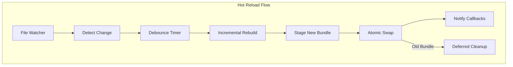
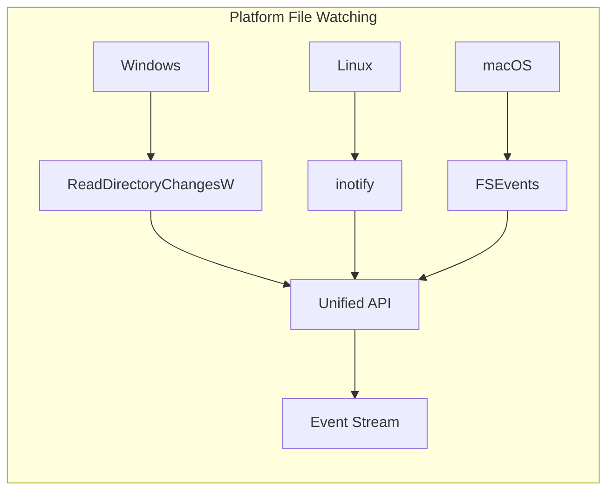
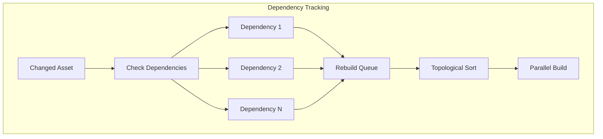
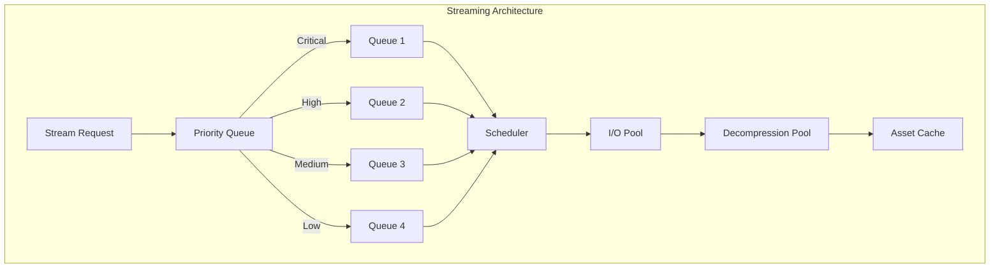
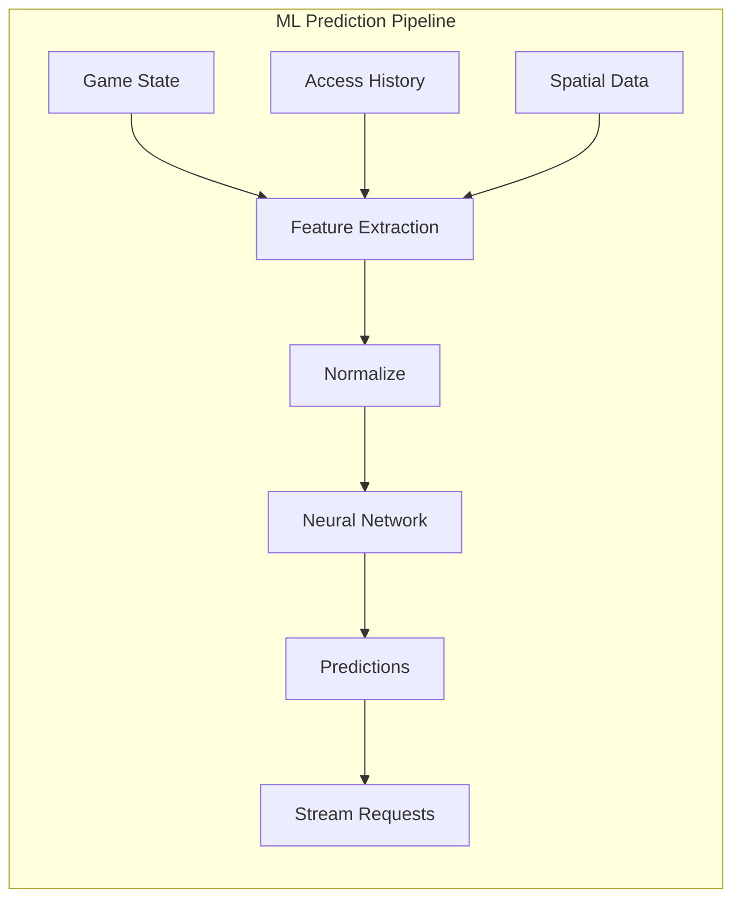
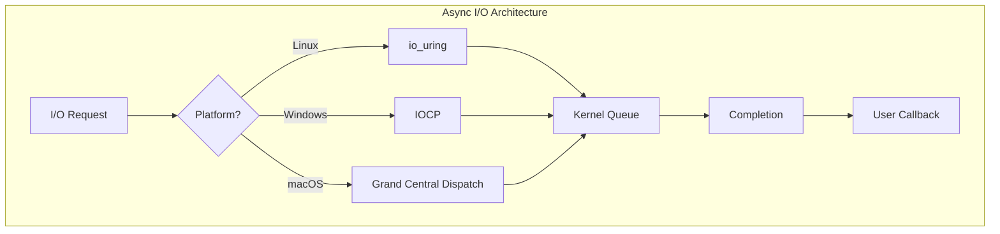
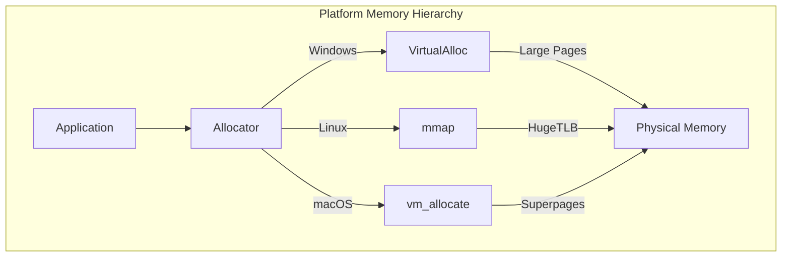
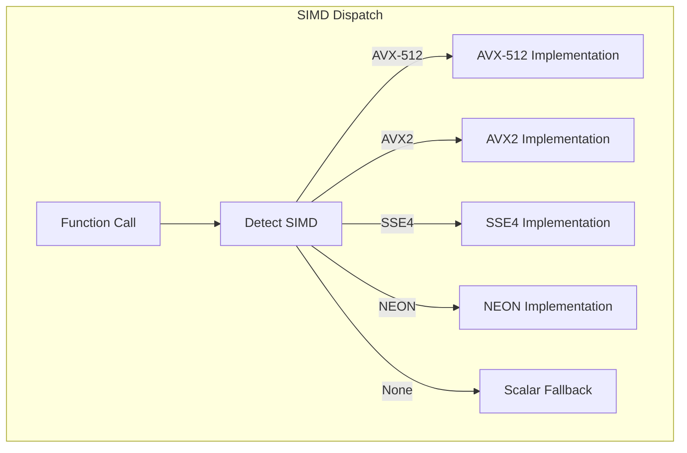

# Volume 3: Advanced Systems & Future
## Part 9: Advanced Features

### Table of Contents
- [Chapter 17: Virtual Bundle System](#chapter-17-virtual-bundle-system)
  - [17.1 Hot Reload Architecture](#171-hot-reload-architecture)
  - [17.2 File System Monitoring](#172-file-system-monitoring)
  - [17.3 Incremental Rebuild](#173-incremental-rebuild)
  - [17.4 Runtime Integration](#174-runtime-integration)
- [Chapter 18: Graph Analysis Tools](#chapter-18-graph-analysis-tools)
  - [18.1 Streaming Core Architecture](#181-streaming-core-architecture)
  - [18.2 Predictive Streaming](#182-predictive-streaming)
  - [18.3 I/O Optimization](#183-io-optimization)
- [Chapter 19: Distributed Systems](#chapter-19-distributed-systems)
  - [19.1 Platform Abstraction Layer](#191-platform-abstraction-layer)
  - [19.2 Memory Management](#192-memory-management)
  - [19.3 SIMD Optimization](#193-simd-optimization)

### Overview
This part explores GRAPHITE's advanced features that enable real-time development workflows and distributed computing capabilities. Chapter 17 covers the hot reload system for instant asset updates, Chapter 18 details the sophisticated streaming architecture for large-scale asset management, and Chapter 19 addresses cross-platform considerations and distributed system support.

### Chapter 17: Virtual Bundle System

GRAPHITE's hot reload system enables real-time asset updates during development and live service updates in production with sub-100ms reload times.

#### 17.1 Hot Reload Architecture

##### 17.1.1 Memory-Mapped Hot Reload

```c
// Hot reload context
typedef struct {
    void* base_mapping;         // Current bundle mmap
    size_t mapping_size;        // Size of current mapping
    void* staging_mapping;      // New bundle mmap
    size_t staging_size;        // Size of staging mapping
    atomic_bool reload_pending; // Atomic reload flag
    atomic_uint64_t version;    // Current version counter
} graphite_hot_reload_context;

// Hot reload configuration
typedef struct {
    const char* watch_directory;    // Directory to monitor
    const char* bundle_path;        // Target bundle file
    uint32_t debounce_ms;          // Debounce file changes
    bool atomic_reload;            // Use atomic pointer swap
    bool preserve_handle_state;    // Keep existing handles valid
    graphite_reload_callback callback; // Notification callback
    void* user_data;
} graphite_hot_reload_config;

// Initialize hot reload system
graphite_hot_reload_context* graphite_hot_reload_init(
    const graphite_hot_reload_config* config
);

void graphite_hot_reload_shutdown(graphite_hot_reload_context* context);
```



##### 17.1.2 Atomic Pointer Swapping

```c
// Thread-safe bundle swapping
typedef struct {
    atomic_ptr bundle_ptr;      // Current active bundle
    atomic_ptr staging_ptr;     // Staging bundle for reload
    atomic_uint64_t version;    // Version counter
    rwlock_t reader_lock;       // Reader-writer lock
} graphite_atomic_bundle;

// Reader acquisition (fast path)
static inline const graphite_bundle* graphite_acquire_reader(
    graphite_atomic_bundle* atomic_bundle,
    uint64_t* version_out
) {
    rwlock_read_lock(&atomic_bundle->reader_lock);
    const graphite_bundle* bundle = atomic_load(&atomic_bundle->bundle_ptr);
    *version_out = atomic_load(&atomic_bundle->version);
    return bundle;
}

static inline void graphite_release_reader(
    graphite_atomic_bundle* atomic_bundle
) {
    rwlock_read_unlock(&atomic_bundle->reader_lock);
}

// Writer swap (reload path)
graphite_result graphite_atomic_swap_bundle(
    graphite_atomic_bundle* atomic_bundle,
    graphite_bundle* new_bundle
) {
    rwlock_write_lock(&atomic_bundle->reader_lock);
    
    graphite_bundle* old_bundle = atomic_load(&atomic_bundle->bundle_ptr);
    atomic_store(&atomic_bundle->bundle_ptr, new_bundle);
    atomic_fetch_add(&atomic_bundle->version, 1);
    
    rwlock_write_unlock(&atomic_bundle->reader_lock);
    
    // Schedule old bundle cleanup
    graphite_schedule_cleanup(old_bundle);
    return GRAPHITE_SUCCESS;
}
```

#### 17.2 File System Monitoring

##### 17.2.1 Cross-Platform File Watching

```c
// File system event types
typedef enum {
    GRAPHITE_FS_CREATED,
    GRAPHITE_FS_MODIFIED,
    GRAPHITE_FS_DELETED,
    GRAPHITE_FS_MOVED
} graphite_fs_event_type;

typedef struct {
    graphite_fs_event_type type;
    const char* path;
    const char* old_path;   // For move events
    uint64_t timestamp;
} graphite_fs_event;

typedef void (*graphite_fs_callback)(
    const graphite_fs_event* event,
    void* user_data
);

// Platform-specific implementations
#ifdef _WIN32
    // Windows: ReadDirectoryChangesW
    typedef struct {
        HANDLE directory_handle;
        OVERLAPPED overlapped;
        char buffer[8192];
        graphite_fs_callback callback;
        void* user_data;
    } graphite_fs_watcher_win32;
#elif defined(__linux__)
    // Linux: inotify
    typedef struct {
        int inotify_fd;
        int watch_descriptor;
        graphite_fs_callback callback;
        void* user_data;
    } graphite_fs_watcher_linux;
#elif defined(__APPLE__)
    // macOS: FSEvents
    typedef struct {
        FSEventStreamRef stream;
        CFRunLoopRef run_loop;
        graphite_fs_callback callback;
        void* user_data;
    } graphite_fs_watcher_macos;
#endif

// Unified interface
typedef struct graphite_fs_watcher graphite_fs_watcher;

graphite_fs_watcher* graphite_fs_watcher_create(
    const char* path,
    bool recursive,
    graphite_fs_callback callback,
    void* user_data
);

void graphite_fs_watcher_destroy(graphite_fs_watcher* watcher);
```



##### 17.2.2 Debounced Change Detection

```c
// Debounce configuration
typedef struct {
    uint32_t debounce_ms;       // Minimum time between triggers
    uint32_t max_delay_ms;      // Maximum delay before forcing trigger
    bool coalesce_events;       // Merge multiple changes to same file
    const char** ignore_patterns; // Patterns to ignore (*.tmp, *.lock)
} graphite_debounce_config;

// Debounced file watcher
typedef struct {
    graphite_fs_watcher* watcher;
    hashtable* pending_changes;  // path -> timestamp
    timer_t debounce_timer;
    graphite_debounce_config config;
    graphite_fs_callback final_callback;
    void* user_data;
} graphite_debounced_watcher;

// Process debounced changes
static void graphite_debounce_timer_callback(timer_t timer, void* user_data) {
    graphite_debounced_watcher* debounced = user_data;
    uint64_t now = graphite_get_time_ms();
    
    // Check which changes are ready
    hashtable_iterator iter;
    hashtable_iter_init(&iter, debounced->pending_changes);
    
    while (hashtable_iter_next(&iter)) {
        const char* path = iter.key;
        uint64_t change_time = *(uint64_t*)iter.value;
        
        if (now - change_time >= debounced->config.debounce_ms) {
            // Change is debounced, trigger callback
            graphite_fs_event event = {
                .type = GRAPHITE_FS_MODIFIED,
                .path = path,
                .timestamp = change_time
            };
            debounced->final_callback(&event, debounced->user_data);
            
            // Remove from pending
            hashtable_remove(debounced->pending_changes, path);
        }
    }
}
```

#### 17.3 Incremental Rebuild

##### 17.3.1 Dependency-Aware Rebuilds

```c
// Dependency tracking for hot reload
typedef struct {
    const char* asset_path;
    uint64_t content_hash;
    uint64_t modification_time;
    const char** dependencies;
    size_t dependency_count;
    bool needs_rebuild;
} graphite_asset_state;

// Hot reload rebuild context
typedef struct {
    hashtable* asset_states;    // path -> graphite_asset_state
    graph* dependency_graph;    // Asset dependency graph
    queue* rebuild_queue;       // Assets pending rebuild
    threadpool* worker_pool;    // Parallel rebuild workers
} graphite_rebuild_context;

// Check if asset needs rebuild
bool graphite_asset_needs_rebuild(
    const graphite_rebuild_context* context,
    const char* asset_path
) {
    graphite_asset_state* state = hashtable_get(context->asset_states, asset_path);
    if (!state) return true;  // Unknown asset, rebuild
    
    // Check file modification time
    struct stat file_stat;
    if (stat(asset_path, &file_stat) != 0) return true;
    
    if (file_stat.st_mtime > state->modification_time) {
        return true;  // File modified
    }
    
    // Check dependencies
    for (size_t i = 0; i < state->dependency_count; i++) {
        if (graphite_asset_needs_rebuild(context, state->dependencies[i])) {
            return true;  // Dependency changed
        }
    }
    
    return false;
}
```



##### 17.3.2 Parallel Asset Processing

```c
// Worker thread for asset rebuilding
typedef struct {
    const char* asset_path;
    graphite_rebuild_context* context;
    graphite_transform_config* transform_config;
} graphite_rebuild_task;

static void* graphite_rebuild_worker(void* arg) {
    graphite_rebuild_task* task = arg;
    
    // Apply transforms to asset
    graphite_result result = graphite_apply_transforms(
        task->asset_path,
        task->transform_config
    );
    
    if (result == GRAPHITE_SUCCESS) {
        // Update asset state
        graphite_asset_state* state = hashtable_get(
            task->context->asset_states,
            task->asset_path
        );
        
        if (state) {
            state->content_hash = graphite_hash_file(task->asset_path);
            state->modification_time = graphite_get_file_mtime(task->asset_path);
            state->needs_rebuild = false;
        }
    }
    
    free(task);
    return NULL;
}

// Process rebuild queue
void graphite_process_rebuild_queue(graphite_rebuild_context* context) {
    while (!queue_empty(context->rebuild_queue)) {
        const char* asset_path = queue_pop(context->rebuild_queue);
        
        // Create rebuild task
        graphite_rebuild_task* task = malloc(sizeof(graphite_rebuild_task));
        task->asset_path = asset_path;
        task->context = context;
        task->transform_config = graphite_get_transform_config(asset_path);
        
        // Submit to thread pool
        threadpool_submit(context->worker_pool, graphite_rebuild_worker, task);
    }
    
    // Wait for all rebuilds to complete
    threadpool_wait(context->worker_pool);
}
```

#### 17.4 Runtime Integration

##### 17.4.1 Game Engine Hot Reload Hooks

```c
// Unity integration
typedef struct {
    graphite_hot_reload_context* reload_context;
    UnityEngine_AssetDatabase* asset_db;
    void* asset_cache;
} graphite_unity_hot_reload;

// Hot reload callback for Unity
static void graphite_unity_reload_callback(
    const graphite_bundle* old_bundle,
    const graphite_bundle* new_bundle,
    void* user_data
) {
    graphite_unity_hot_reload* unity_reload = user_data;
    
    // Invalidate Unity asset cache
    UnityEngine_AssetDatabase_Refresh(unity_reload->asset_db);
    
    // Update native plugin asset references
    graphite_unity_update_asset_references(old_bundle, new_bundle);
    
    // Trigger Unity reimport for changed assets
    graphite_unity_trigger_reimport(new_bundle);
}

// Unreal Engine integration
typedef struct {
    graphite_hot_reload_context* reload_context;
    UAssetRegistry* asset_registry;
    FAssetData* cached_assets;
} graphite_unreal_hot_reload;

static void graphite_unreal_reload_callback(
    const graphite_bundle* old_bundle,
    const graphite_bundle* new_bundle,
    void* user_data
) {
    graphite_unreal_hot_reload* unreal_reload = user_data;
    
    // Mark assets for reload in Unreal's asset system
    graphite_unreal_mark_assets_dirty(old_bundle, new_bundle);
    
    // Broadcast asset change notifications
    unreal_reload->asset_registry->AssetRenamed.Broadcast(FAssetData(), FAssetData());
    
    // Force garbage collection of old assets
    graphite_unreal_force_gc();
}
```

##### 17.4.2 Hot Reload Performance Optimization

```c
// Pre-allocated reload buffers
typedef struct {
    void* staging_buffer;       // Pre-allocated staging memory
    size_t staging_size;        // Size of staging buffer
    void* copy_buffer;          // Temporary copy buffer
    size_t copy_size;           // Size of copy buffer
    atomic_bool buffer_in_use;  // Atomic flag for buffer usage
} graphite_reload_buffers;

// Optimize reload for minimal allocation
graphite_result graphite_optimized_reload(
    graphite_hot_reload_context* context,
    const char* new_bundle_path,
    graphite_reload_buffers* buffers
) {
    // Try to use pre-allocated buffers
    if (!atomic_exchange(&buffers->buffer_in_use, true)) {
        // Got the buffers, use them for reload
        graphite_result result = graphite_reload_with_buffers(
            context,
            new_bundle_path,
            buffers->staging_buffer,
            buffers->staging_size
        );
        
        atomic_store(&buffers->buffer_in_use, false);
        return result;
    } else {
        // Buffers in use, fall back to allocation
        return graphite_reload_with_allocation(context, new_bundle_path);
    }
}
```

### Chapter 18: Graph Analysis Tools

GRAPHITE's streaming system enables efficient loading of large worlds and assets on-demand, with predictive prefetching and memory-aware resource management.

#### 18.1 Streaming Core Architecture

##### 18.1.1 Streaming Context Management

```c
// Streaming priority levels
typedef enum {
    GRAPHITE_PRIORITY_CRITICAL = 0,  // Required for current frame
    GRAPHITE_PRIORITY_HIGH = 1,      // Required for next frame
    GRAPHITE_PRIORITY_MEDIUM = 2,    // Required soon
    GRAPHITE_PRIORITY_LOW = 3,       // Background/predictive
    GRAPHITE_PRIORITY_COUNT = 4
} graphite_streaming_priority;

// Streaming request
typedef struct {
    uint64_t asset_id;
    graphite_streaming_priority priority;
    uint64_t request_time;
    uint32_t estimated_size;
    float distance_factor;       // For LOD-based streaming
    void* user_data;
    graphite_stream_callback callback;
} graphite_stream_request;

// Streaming context
typedef struct {
    priority_queue* request_queues[GRAPHITE_PRIORITY_COUNT];
    thread_pool* io_pool;
    thread_pool* decompression_pool;
    memory_pool* streaming_pool;
    
    // Memory management
    size_t max_memory_budget;
    atomic_size_t current_memory_usage;
    lru_cache* asset_cache;
    
    // I/O management
    uint32_t max_concurrent_reads;
    atomic_uint32_t active_reads;
    queue* completion_queue;
    
    // Statistics
    atomic_uint64_t bytes_streamed;
    atomic_uint64_t requests_completed;
    atomic_uint64_t cache_hits;
    atomic_uint64_t cache_misses;
} graphite_streaming_context;
```



##### 18.1.2 Memory Budget Management

```c
// Memory budget configuration
typedef struct {
    size_t total_budget;         // Total memory budget
    size_t critical_reserve;     // Reserved for critical assets
    size_t texture_budget;       // Budget for textures
    size_t mesh_budget;          // Budget for meshes
    size_t audio_budget;         // Budget for audio
    size_t other_budget;         // Budget for other assets
    
    // Eviction policy
    float lru_factor;            // Weight for LRU eviction
    float size_factor;           // Weight for size-based eviction
    float priority_factor;       // Weight for priority-based eviction
} graphite_memory_budget;

// Memory pressure handling
typedef enum {
    GRAPHITE_PRESSURE_NONE,      // Memory usage < 70% budget
    GRAPHITE_PRESSURE_MILD,      // Memory usage 70-85% budget
    GRAPHITE_PRESSURE_MODERATE,  // Memory usage 85-95% budget
    GRAPHITE_PRESSURE_SEVERE     // Memory usage > 95% budget
} graphite_memory_pressure;

// Memory management functions
graphite_memory_pressure graphite_check_memory_pressure(
    const graphite_streaming_context* context
) {
    size_t current = atomic_load(&context->current_memory_usage);
    size_t total = context->memory_budget.total_budget;
    
    float usage_ratio = (float)current / total;
    
    if (usage_ratio < 0.70f) return GRAPHITE_PRESSURE_NONE;
    if (usage_ratio < 0.85f) return GRAPHITE_PRESSURE_MILD;
    if (usage_ratio < 0.95f) return GRAPHITE_PRESSURE_MODERATE;
    return GRAPHITE_PRESSURE_SEVERE;
}
```

#### 18.2 Predictive Streaming

##### 18.2.1 Machine Learning Prediction

```c
// Streaming prediction model
typedef struct {
    neural_network* prediction_model;   // ML model for prediction
    feature_vector* current_features;   // Current game state features
    sliding_window* access_history;     // Recent asset access patterns
    
    // Prediction configuration
    float prediction_threshold;         // Confidence threshold
    uint32_t prediction_horizon_ms;     // How far ahead to predict
    uint32_t max_predictions;           // Max concurrent predictions
} graphite_prediction_context;

// Feature extraction from game state
typedef struct {
    float player_position[3];           // Player world position
    float player_velocity[3];           // Player movement vector
    float camera_direction[3];          // Camera facing direction
    uint32_t current_level_id;          // Current level/area
    uint32_t current_state;             // Game state (menu, gameplay, etc.)
    float time_in_state;                // Time spent in current state
    uint32_t recent_asset_accesses[16]; // Recently accessed assets
} graphite_game_features;

// Run prediction model
graphite_result graphite_predict_asset_needs(
    graphite_prediction_context* context,
    const graphite_game_features* features,
    graphite_prediction_result* predictions,
    size_t max_predictions
) {
    // Normalize features for neural network
    float normalized_features[64];
    graphite_normalize_features(features, normalized_features);
    
    // Run inference
    float* output = neural_network_predict(context->prediction_model, 
                                          normalized_features);
    
    // Convert network output to asset predictions
    size_t prediction_count = 0;
    for (size_t i = 0; i < context->max_predictions && prediction_count < max_predictions; i++) {
        if (output[i] > context->prediction_threshold) {
            predictions[prediction_count].asset_id = i;
            predictions[prediction_count].confidence = output[i];
            predictions[prediction_count].predicted_time_ms = 
                (uint32_t)(output[i + context->max_predictions] * context->prediction_horizon_ms);
            prediction_count++;
        }
    }
    
    free(output);
    
    // Submit predictions to streaming system
    for (size_t i = 0; i < prediction_count; i++) {
        graphite_stream_request request = {
            .asset_id = predictions[i].asset_id,
            .priority = GRAPHITE_PRIORITY_LOW,
            .request_time = graphite_get_time_ms(),
            .estimated_size = graphite_get_asset_size(predictions[i].asset_id),
            .user_data = NULL,
            .callback = NULL
        };
        
        graphite_submit_stream_request(context->streaming_context, &request);
    }
    
    return GRAPHITE_SUCCESS;
}
```



##### 18.2.2 Heuristic-Based Prediction

```c
// Spatial prediction for open-world games
typedef struct {
    float position[3];          // Player position
    float view_direction[3];    // Camera direction
    float movement_vector[3];   // Movement direction
    float speed;                // Movement speed
    uint32_t area_id;           // Current area/zone
} graphite_spatial_context;

// Pattern-based prediction
typedef struct {
    uint32_t pattern_id;
    uint32_t trigger_asset;
    uint32_t* predicted_assets;
    size_t predicted_count;
    float confidence;
    uint32_t delay_ms;
} graphite_access_pattern;

// Database of learned access patterns
typedef struct {
    hashtable* patterns;        // trigger_asset -> pattern array
    sliding_window* history;    // Recent access history
    uint32_t pattern_length;    // Length of patterns to learn
} graphite_pattern_database;

// Learn access patterns from history
void graphite_learn_patterns(graphite_pattern_database* db) {
    uint32_t* recent_accesses = sliding_window_get_data(db->history);
    size_t access_count = sliding_window_get_count(db->history);
    
    // Extract patterns of specified length
    for (size_t i = 0; i < access_count - db->pattern_length; i++) {
        uint32_t trigger = recent_accesses[i];
        
        // Find existing pattern or create new one
        dynamic_array* patterns = hashtable_get(db->patterns, &trigger);
        if (!patterns) {
            patterns = dynamic_array_create(sizeof(graphite_access_pattern));
            hashtable_insert(db->patterns, &trigger, patterns);
        }
        
        // Create new pattern
        graphite_access_pattern pattern = {
            .pattern_id = graphite_generate_pattern_id(),
            .trigger_asset = trigger,
            .predicted_assets = malloc(sizeof(uint32_t) * (db->pattern_length - 1)),
            .predicted_count = db->pattern_length - 1,
            .confidence = 1.0f,
            .delay_ms = 1000  // 1 second default delay
        };
        
        // Copy predicted assets
        memcpy(pattern.predicted_assets, 
               &recent_accesses[i + 1], 
               sizeof(uint32_t) * pattern.predicted_count);
        
        // Check if pattern already exists
        bool found_existing = false;
        for (size_t j = 0; j < patterns->count; j++) {
            graphite_access_pattern* existing = dynamic_array_get(patterns, j);
            if (graphite_patterns_match(&pattern, existing)) {
                existing->confidence += 0.1f;  // Increase confidence
                found_existing = true;
                free(pattern.predicted_assets);
                break;
            }
        }
        
        if (!found_existing) {
            dynamic_array_push(patterns, &pattern);
        }
    }
}
```

#### 18.3 I/O Optimization

##### 18.3.1 Asynchronous I/O with io_uring

```c
#ifdef __linux__
// Linux-specific io_uring implementation
typedef struct {
    struct io_uring ring;
    struct io_uring_sqe* sqe_pool;
    struct io_uring_cqe* cqe_pool;
    uint32_t queue_depth;
    
    // Request tracking
    hashtable* active_requests;  // sqe -> request mapping
    atomic_uint32_t active_count;
} graphite_uring_context;

// Initialize io_uring for streaming
graphite_result graphite_uring_init(
    graphite_uring_context* context,
    uint32_t queue_depth
) {
    context->queue_depth = queue_depth;
    
    // Initialize io_uring with specified queue depth
    int ret = io_uring_queue_init(queue_depth, &context->ring, 0);
    if (ret < 0) {
        return GRAPHITE_ERROR_IO_INIT;
    }
    
    // Allocate tracking structures
    context->active_requests = hashtable_create(queue_depth * 2, 
                                               hash_ptr, compare_ptr);
    atomic_init(&context->active_count, 0);
    
    return GRAPHITE_SUCCESS;
}

// Submit async read request
graphite_result graphite_uring_read_async(
    graphite_uring_context* context,
    const graphite_stream_request* request,
    int fd,
    void* buffer,
    size_t size,
    off_t offset
) {
    // Get submission queue entry
    struct io_uring_sqe* sqe = io_uring_get_sqe(&context->ring);
    if (!sqe) {
        return GRAPHITE_ERROR_QUEUE_FULL;
    }
    
    // Prepare read operation
    io_uring_prep_read(sqe, fd, buffer, size, offset);
    io_uring_sqe_set_data(sqe, (void*)request);
    
    // Track request
    hashtable_insert(context->active_requests, sqe, (void*)request);
    atomic_fetch_add(&context->active_count, 1);
    
    // Submit to kernel
    int submitted = io_uring_submit(&context->ring);
    if (submitted < 0) {
        hashtable_remove(context->active_requests, sqe);
        atomic_fetch_sub(&context->active_count, 1);
        return GRAPHITE_ERROR_IO_SUBMIT;
    }
    
    return GRAPHITE_SUCCESS;
}
#endif // __linux__

// Cross-platform async I/O abstraction
typedef struct {
#ifdef __linux__
    graphite_uring_context uring;
#elif defined(_WIN32)
    HANDLE completion_port;
    OVERLAPPED* overlapped_pool;
#elif defined(__APPLE__)
    dispatch_queue_t io_queue;
    dispatch_source_t* source_pool;
#endif
    
    thread_pool* callback_pool;
    atomic_uint32_t active_operations;
} graphite_async_io_context;
```



### Chapter 19: Distributed Systems

GRAPHITE is designed for seamless operation across all major platforms, with careful attention to architecture-specific optimizations and platform limitations.

#### 19.1 Platform Abstraction Layer

##### 19.1.1 Core Platform Abstraction

```c
// Platform detection macros
#if defined(_WIN32) || defined(_WIN64)
    #define GRAPHITE_PLATFORM_WINDOWS
#elif defined(__linux__)
    #define GRAPHITE_PLATFORM_LINUX
#elif defined(__APPLE__)
    #include <TargetConditionals.h>
    #if TARGET_OS_MAC
        #define GRAPHITE_PLATFORM_MACOS
    #elif TARGET_OS_IPHONE
        #define GRAPHITE_PLATFORM_IOS
    #endif
#elif defined(__ANDROID__)
    #define GRAPHITE_PLATFORM_ANDROID
#elif defined(__EMSCRIPTEN__)
    #define GRAPHITE_PLATFORM_WEB
#endif

// Architecture detection
#if defined(_M_X64) || defined(__x86_64__)
    #define GRAPHITE_ARCH_X64
#elif defined(_M_IX86) || defined(__i386__)
    #define GRAPHITE_ARCH_X86
#elif defined(_M_ARM64) || defined(__aarch64__)
    #define GRAPHITE_ARCH_ARM64
#elif defined(_M_ARM) || defined(__arm__)
    #define GRAPHITE_ARCH_ARM32
#endif

// Endianness detection
#include <stdint.h>
static inline bool graphite_is_little_endian(void) {
    const uint16_t test = 0x0001;
    return *(const uint8_t*)&test == 1;
}

#define GRAPHITE_LITTLE_ENDIAN (graphite_is_little_endian())
#define GRAPHITE_BIG_ENDIAN (!graphite_is_little_endian())
```

##### 19.1.2 File System Abstraction

```c
// Platform-agnostic file system operations
typedef struct {
    void* handle;               // Platform-specific file handle
    const char* path;           // File path
    uint64_t size;              // File size
    bool is_memory_mapped;      // Whether file is memory-mapped
    void* mapped_memory;        // Memory-mapped region
    size_t mapped_size;         // Size of mapped region
} graphite_file;

// Cross-platform file operations
graphite_result graphite_file_open(
    graphite_file* file,
    const char* path,
    uint32_t flags
);

graphite_result graphite_file_close(graphite_file* file);

graphite_result graphite_file_read(
    graphite_file* file,
    void* buffer,
    size_t size,
    size_t offset,
    size_t* bytes_read
);

graphite_result graphite_file_mmap(
    graphite_file* file,
    size_t offset,
    size_t size,
    void** mapped_ptr
);

// Platform-specific implementations
#ifdef GRAPHITE_PLATFORM_WINDOWS
graphite_result graphite_file_open_win32(
    graphite_file* file,
    const char* path,
    uint32_t flags
) {
    DWORD access = 0;
    DWORD creation = 0;
    
    if (flags & GRAPHITE_FILE_READ) access |= GENERIC_READ;
    if (flags & GRAPHITE_FILE_WRITE) access |= GENERIC_WRITE;
    
    creation = (flags & GRAPHITE_FILE_CREATE) ? CREATE_ALWAYS : OPEN_EXISTING;
    
    HANDLE handle = CreateFileA(
        path,
        access,
        FILE_SHARE_READ,
        NULL,
        creation,
        FILE_ATTRIBUTE_NORMAL,
        NULL
    );
    
    if (handle == INVALID_HANDLE_VALUE) {
        return GRAPHITE_ERROR_FILE_OPEN;
    }
    
    LARGE_INTEGER file_size;
    if (!GetFileSizeEx(handle, &file_size)) {
        CloseHandle(handle);
        return GRAPHITE_ERROR_FILE_SIZE;
    }
    
    file->handle = handle;
    file->path = path;
    file->size = file_size.QuadPart;
    file->is_memory_mapped = false;
    file->mapped_memory = NULL;
    file->mapped_size = 0;
    
    return GRAPHITE_SUCCESS;
}
#endif // GRAPHITE_PLATFORM_WINDOWS

#ifdef GRAPHITE_PLATFORM_LINUX
graphite_result graphite_file_open_linux(
    graphite_file* file,
    const char* path,
    uint32_t flags
) {
    int open_flags = 0;
    
    if ((flags & GRAPHITE_FILE_READ) && (flags & GRAPHITE_FILE_WRITE)) {
        open_flags = O_RDWR;
    } else if (flags & GRAPHITE_FILE_WRITE) {
        open_flags = O_WRONLY;
    } else {
        open_flags = O_RDONLY;
    }
    
    if (flags & GRAPHITE_FILE_CREATE) {
        open_flags |= O_CREAT | O_TRUNC;
    }
    
    int fd = open(path, open_flags, 0644);
    if (fd < 0) {
        return GRAPHITE_ERROR_FILE_OPEN;
    }
    
    struct stat st;
    if (fstat(fd, &st) < 0) {
        close(fd);
        return GRAPHITE_ERROR_FILE_SIZE;
    }
    
    file->handle = (void*)(intptr_t)fd;
    file->path = path;
    file->size = st.st_size;
    file->is_memory_mapped = false;
    file->mapped_memory = NULL;
    file->mapped_size = 0;
    
    return GRAPHITE_SUCCESS;
}
#endif // GRAPHITE_PLATFORM_LINUX
```

#### 19.2 Memory Management

##### 19.2.1 Platform-Specific Memory Allocation

```c
// Memory alignment requirements per platform
#ifdef GRAPHITE_ARCH_X64
    #define GRAPHITE_CACHE_LINE_SIZE 64
    #define GRAPHITE_PAGE_SIZE 4096
#elif defined(GRAPHITE_ARCH_ARM64)
    #define GRAPHITE_CACHE_LINE_SIZE 64
    #define GRAPHITE_PAGE_SIZE 4096  // Can be 16KB on some systems
#elif defined(GRAPHITE_ARCH_X86)
    #define GRAPHITE_CACHE_LINE_SIZE 64
    #define GRAPHITE_PAGE_SIZE 4096
#elif defined(GRAPHITE_ARCH_ARM32)
    #define GRAPHITE_CACHE_LINE_SIZE 32
    #define GRAPHITE_PAGE_SIZE 4096
#endif

// Aligned allocation wrapper
static inline void* graphite_aligned_alloc(size_t size, size_t alignment) {
#ifdef GRAPHITE_PLATFORM_WINDOWS
    return _aligned_malloc(size, alignment);
#elif defined(GRAPHITE_PLATFORM_LINUX) || defined(GRAPHITE_PLATFORM_MACOS)
    void* ptr;
    if (posix_memalign(&ptr, alignment, size) == 0) {
        return ptr;
    }
    return NULL;
#else
    // Fallback for platforms without aligned allocation
    void* ptr = malloc(size + alignment - 1);
    if (!ptr) return NULL;
    
    uintptr_t addr = (uintptr_t)ptr;
    uintptr_t aligned_addr = (addr + alignment - 1) & ~(alignment - 1);
    return (void*)aligned_addr;
#endif
}

// Large page allocation for performance-critical areas
graphite_result graphite_alloc_large_pages(
    void** ptr,
    size_t size
) {
#ifdef GRAPHITE_PLATFORM_WINDOWS
    // Windows: VirtualAlloc with MEM_LARGE_PAGES
    *ptr = VirtualAlloc(
        NULL,
        size,
        MEM_COMMIT | MEM_RESERVE | MEM_LARGE_PAGES,
        PAGE_READWRITE
    );
    return *ptr ? GRAPHITE_SUCCESS : GRAPHITE_ERROR_ALLOCATION;
    
#elif defined(GRAPHITE_PLATFORM_LINUX)
    // Linux: mmap with MAP_HUGETLB
    *ptr = mmap(
        NULL,
        size,
        PROT_READ | PROT_WRITE,
        MAP_PRIVATE | MAP_ANONYMOUS | MAP_HUGETLB,
        -1,
        0
    );
    return (*ptr != MAP_FAILED) ? GRAPHITE_SUCCESS : GRAPHITE_ERROR_ALLOCATION;
    
#elif defined(GRAPHITE_PLATFORM_MACOS)
    // macOS: vm_allocate with superpage support
    vm_address_t address = 0;
    kern_return_t result = vm_allocate(
        mach_task_self(),
        &address,
        size,
        VM_FLAGS_ANYWHERE | VM_FLAGS_SUPERPAGE_SIZE_2MB
    );
    *ptr = (void*)address;
    return (result == KERN_SUCCESS) ? GRAPHITE_SUCCESS : GRAPHITE_ERROR_ALLOCATION;
    
#else
    // Fallback to regular allocation
    *ptr = graphite_aligned_alloc(size, GRAPHITE_PAGE_SIZE);
    return *ptr ? GRAPHITE_SUCCESS : GRAPHITE_ERROR_ALLOCATION;
#endif
}
```



##### 19.2.2 NUMA-Aware Memory Management

```c
// NUMA topology detection
typedef struct {
    uint32_t node_count;
    uint32_t cpu_count;
    uint32_t* cpu_to_node;      // CPU ID -> NUMA node mapping
    size_t* node_memory;        // Available memory per node
} graphite_numa_topology;

#ifdef GRAPHITE_PLATFORM_LINUX
#include <numa.h>
#include <numaif.h>

graphite_result graphite_detect_numa_topology(
    graphite_numa_topology* topology
) {
    if (numa_available() < 0) {
        // NUMA not available, use single node
        topology->node_count = 1;
        topology->cpu_count = sysconf(_SC_NPROCESSORS_ONLN);
        topology->cpu_to_node = malloc(sizeof(uint32_t) * topology->cpu_count);
        topology->node_memory = malloc(sizeof(size_t));
        
        // All CPUs on node 0
        for (uint32_t i = 0; i < topology->cpu_count; i++) {
            topology->cpu_to_node[i] = 0;
        }
        
        topology->node_memory[0] = sysconf(_SC_PHYS_PAGES) * sysconf(_SC_PAGE_SIZE);
        return GRAPHITE_SUCCESS;
    }
    
    topology->node_count = numa_max_node() + 1;
    topology->cpu_count = sysconf(_SC_NPROCESSORS_ONLN);
    topology->cpu_to_node = malloc(sizeof(uint32_t) * topology->cpu_count);
    topology->node_memory = malloc(sizeof(size_t) * topology->node_count);
    
    // Map CPUs to NUMA nodes
    for (uint32_t cpu = 0; cpu < topology->cpu_count; cpu++) {
        topology->cpu_to_node[cpu] = numa_node_of_cpu(cpu);
    }
    
    // Get memory information per node
    for (uint32_t node = 0; node < topology->node_count; node++) {
        long long free_mem;
        long long total_mem = numa_node_size64(node, &free_mem);
        topology->node_memory[node] = total_mem;
    }
    
    return GRAPHITE_SUCCESS;
}

// NUMA-aware allocation
void* graphite_numa_alloc(size_t size, uint32_t preferred_node) {
    if (numa_available() < 0) {
        return malloc(size);
    }
    
    // Allocate on preferred NUMA node
    return numa_alloc_onnode(size, preferred_node);
}
#endif // GRAPHITE_PLATFORM_LINUX

// Cross-platform worker thread affinity
graphite_result graphite_set_thread_affinity(
    pthread_t thread,
    uint32_t cpu_id
) {
#ifdef GRAPHITE_PLATFORM_LINUX
    cpu_set_t cpuset;
    CPU_ZERO(&cpuset);
    CPU_SET(cpu_id, &cpuset);
    return pthread_setaffinity_np(thread, sizeof(cpuset), &cpuset) == 0 ?
           GRAPHITE_SUCCESS : GRAPHITE_ERROR_AFFINITY;
           
#elif defined(GRAPHITE_PLATFORM_WINDOWS)
    DWORD_PTR mask = 1ULL << cpu_id;
    return SetThreadAffinityMask(GetCurrentThread(), mask) != 0 ?
           GRAPHITE_SUCCESS : GRAPHITE_ERROR_AFFINITY;
           
#elif defined(GRAPHITE_PLATFORM_MACOS)
    // macOS: Use thread affinity policy
    thread_affinity_policy_data_t policy = { cpu_id };
    return thread_policy_set(
        pthread_mach_thread_np(thread),
        THREAD_AFFINITY_POLICY,
        (thread_policy_t)&policy,
        THREAD_AFFINITY_POLICY_COUNT
    ) == KERN_SUCCESS ? GRAPHITE_SUCCESS : GRAPHITE_ERROR_AFFINITY;
    
#else
    // Platform doesn't support thread affinity
    return GRAPHITE_ERROR_NOT_SUPPORTED;
#endif
}
```

#### 19.3 SIMD Optimization

##### 19.3.1 Cross-Platform SIMD Abstraction

```c
// SIMD capability detection
typedef struct {
    bool sse2_available;
    bool sse4_available;
    bool avx_available;
    bool avx2_available;
    bool avx512_available;
    bool neon_available;
    bool neon64_available;
} graphite_simd_caps;

static graphite_simd_caps g_simd_caps = {0};

void graphite_detect_simd_capabilities(void) {
#ifdef GRAPHITE_ARCH_X64
    // x86/x64 CPUID detection
    uint32_t eax, ebx, ecx, edx;
    
    // Check for SSE2 (standard on x64)
    g_simd_caps.sse2_available = true;
    
    // Check for SSE4.1
    __cpuid_count(1, 0, eax, ebx, ecx, edx);
    g_simd_caps.sse4_available = (ecx & (1 << 19)) != 0;
    
    // Check for AVX
    g_simd_caps.avx_available = (ecx & (1 << 28)) != 0;
    
    // Check for AVX2
    __cpuid_count(7, 0, eax, ebx, ecx, edx);
    g_simd_caps.avx2_available = (ebx & (1 << 5)) != 0;
    
    // Check for AVX-512
    g_simd_caps.avx512_available = (ebx & (1 << 16)) != 0;
    
#elif defined(GRAPHITE_ARCH_ARM64)
    // ARM64: NEON is standard
    g_simd_caps.neon_available = true;
    g_simd_caps.neon64_available = true;
    
#elif defined(GRAPHITE_ARCH_ARM32)
    // ARM32: Check for NEON availability
    #ifdef __ARM_NEON
        g_simd_caps.neon_available = true;
    #endif
#endif
}
```



### Best Practices for Advanced Features

1. **Hot Reload System**
   - Always validate asset integrity after reload
   - Use atomic operations for thread-safe bundle swapping
   - Implement proper cleanup for old bundle versions
   - Test hot reload thoroughly across all target platforms

2. **Streaming Architecture**
   - Size memory budgets based on target hardware
   - Implement adaptive quality based on memory pressure
   - Use predictive loading for smooth gameplay
   - Monitor and log streaming performance metrics

3. **Platform Abstraction**
   - Test on all target platforms regularly
   - Use platform-specific optimizations where beneficial
   - Provide fallbacks for unsupported features
   - Document platform-specific behavior clearly

4. **Performance Optimization**
   - Profile before optimizing
   - Use SIMD for data-parallel operations
   - Leverage NUMA awareness on server deployments
   - Minimize memory allocations in hot paths

### Cross-References
- [Part 8: Performance & Optimization](../volume-3-advanced-systems/part-8-performance-optimization.md) - Build and CDN optimization
- [Part 10: Production & Analytics](../volume-3-advanced-systems/part-10-production-analytics.md) - Monitoring streaming performance
- [Part 11: Ecosystem & Future](../volume-3-advanced-systems/part-11-ecosystem-future.md) - Future platform support
- [Part 6: Integration & Migration](../volume-2-development-integration/part-6-integration-migration.md) - Platform-specific integrations

### Navigation
[Previous: Part 8 - Performance & Optimization](part-8-performance-optimization.md) | [Next: Part 10 - Production & Analytics](part-10-production-analytics.md)